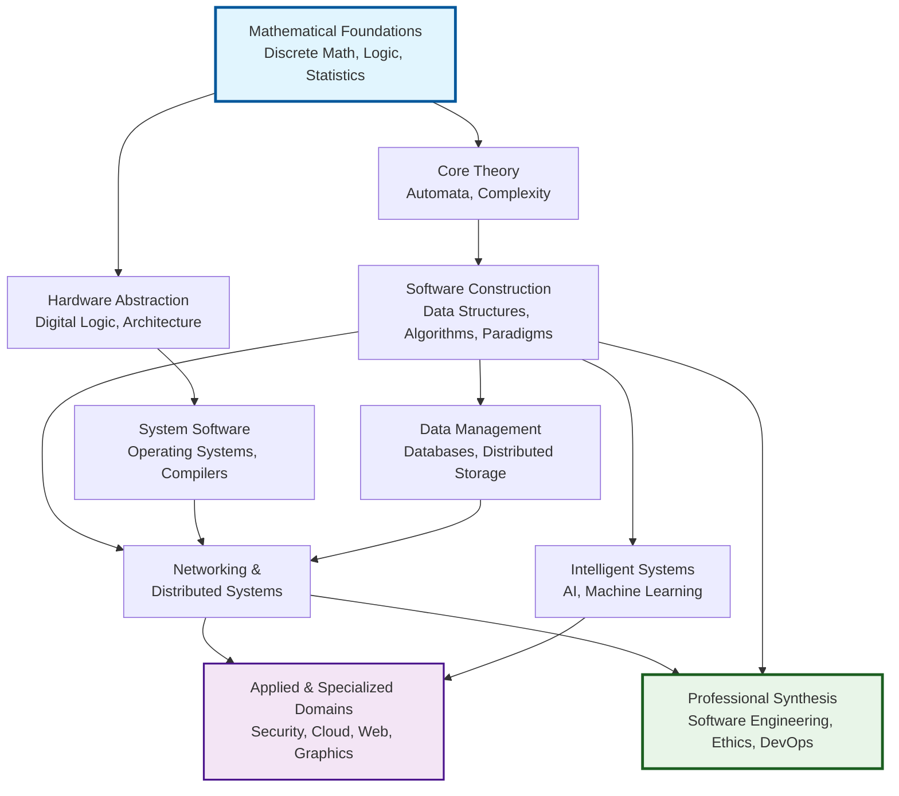
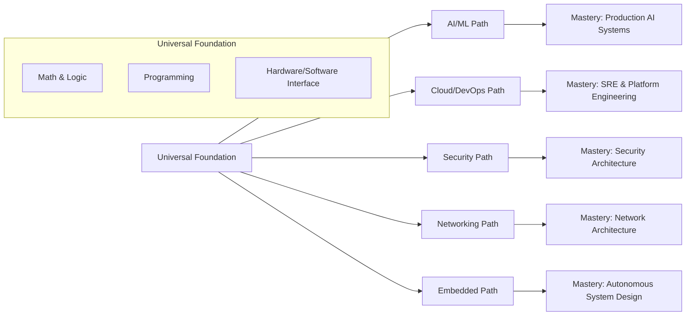

    

<h3 align="center">WELCOME TO</h3>
<h1 align="center">BLACXQUAD FREEMIUM REPOSITORY!</h1>
<h3 align="center">A HUB FOR FREE TECH LEARNING & RESOURCES.</h3>

  

    

    

  

    
 

> [!IMPORTANT]

This work is licensed under the **Creative Commons Attribution-ShareAlike 4.0 International License** (CC BY-SA 4.0).

When using, redistributing, adapting, or building upon this material, you **must** provide proper attribution by:

- 1. **Clearly stating the original source** as the **BLACXQUAD GitHub repository**.
- 2. **Including the exact URL(s)** to the relevant repository or file(s).

**Example Attribution Format:**  
- This work is based on content from the BLACXQUAD GitHub repository, available at:  
- https://github.com/blacxquad/freemium

Under the CC BY-SA license, you **must also**:
- Indicate if changes were made.
- License any adapted material under **identical terms** (CC BY-SA 4.0).

Failure to provide accurate source attribution violates the license terms.

    

<h1 align="center">The Advanced Computer Science and Engineering Mastery Framework: A Unified Curriculum for the Modern Era.</h1>

  

## Executive Summary: The Imperative for an Interdisciplinary Approach

The 21st-century technological landscape is defined by rapid, convergent evolution. Innovation no longer occurs within isolated disciplines but emerges at their intersections. Computer Science and Engineering (CSE) has transcended its origins to become the fundamental substrate upon which all modern sectors—from biotechnology to finance—are built. This framework synthesizes decades of pedagogical research, industry evolution, and emergent paradigms into a single, coherent, and structured curriculum. It moves beyond outdated, linear educational models to present knowledge as a dynamic, interconnected system. Designed as a navigational map and strategic compass, this document serves aspiring engineers, transitioning professionals, and academic institutions navigating the complex terrain of modern computing.

*   The dramatic expansion of the discipline demands a curriculum that reflects its role as a horizontal enabler across countless vertical industries. Mastery now requires understanding how computational principles apply in diverse contexts, from analyzing genomic sequences to securing financial transactions.
*   Professional success mandates a hybrid mindset: the rigorous logic of a formal theorist, the holistic vision of a systems architect, the pragmatism of a build-and-deploy engineer, and the foresight of an ethical practitioner considering societal impact.
*   This framework is architected for longevity and adaptability. It focuses on enduring principles and conceptual understanding, ensuring its core remains relevant despite the constant churn of specific programming languages, tools, and transient technological trends.

 

## 1.0 Architectural Philosophy: A Knowledge Graph Approach

True CSE mastery cannot be achieved by studying topics in isolation. This curriculum is explicitly structured as a **Directed Acyclic Graph (DAG)**, where nodes represent core knowledge domains and edges represent prerequisite relationships and powerful conceptual dependencies.

*   This model accurately reflects that learning is non-linear and deeply contextual. Understanding in one area actively reinforces and deepens understanding in another. For example, mastering computational complexity theory depends on a firm grasp of discrete mathematics and directly informs the design of efficient algorithms and data structures.
*   The DAG structure enables multiple valid and personalized learning pathways. It accommodates different career specializations and individual entry points while ensuring every path is built upon a solid, verifiable, and axiom-based foundation.
*   This approach mirrors the architecture of modern technological systems—complex networks of interdependent components—and trains the mind to think in terms of systems, relationships, and emergent properties, rather than in isolated silos.

*Figure 1: The Knowledge Graph Visualization. This diagram illustrates the prerequisite flow from foundational cores (blue) through intermediary domains to advanced specializations (purple) and professional synthesis (green).*

 

## 2.0 Curriculum Core: The Six-Volume Structure

The framework is organized into six thematic volumes, each representing a major pillar of comprehensive CSE education. The progression from Volume I to Volume VI follows the DAG philosophy, moving systematically from abstract, immutable foundations to concrete, integrated practice.

### **Table 1: The Comprehensive Framework Overview**

| Volume | Title | Primary Focus | Key Outcome for the Learner |
| :--- | :--- | :--- | :--- |
| **I** | **The Immutable Foundations** | Mathematical & Theoretical Core | Ability to formalize real-world problems abstractly and reason rigorously about computational possibilities and limits. |
| **II** | **Systems Architecture** | Hardware & System Software | Understanding of the complete computing stack, from transistors and logic gates to operating systems and virtual machines. |
| **III** | **Programming & Data Management** | Software Craft & Information Theory | Proficiency in constructing efficient, robust software and in designing systems to manage persistent, scalable data. |
| **IV** | **The Networked & Intelligent Era** | Connectivity & Data-Driven Systems | Skills to architect connected, scalable applications and to imbue systems with adaptive, intelligent behavior. |
| **V** | **Specialized Domains** | Applied & Emerging Technologies | Ability to adapt and apply core principles to solve cutting-edge challenges in specific technological frontiers. |
| **VI** | **Professional Practice** | Engineering Methodologies & Integration | Competence in the full software lifecycle, professional collaboration, ethical reasoning, and synthesizing knowledge. |

### **Volume I: The Immutable Mathematical and Theoretical Foundations**
This volume establishes the formal language and defines the fundamental limits of computation, providing the indispensable tools for rigorous analysis and proof.
*   **Part A: Mathematical Foundations** covers Discrete Mathematics, Linear Algebra, Probability, and Statistics. This is not abstract math but the essential syntax for practical work: graph theory models networks, probability underpins machine learning and randomized algorithms, and statistical methods are crucial for data analysis and performance measurement.
*   **Part B: Computational Theory** explores Formal Languages, Automata Theory, Computability, and Computational Complexity. This knowledge directly translates to practical skills in compiler construction, protocol verification, and the critical understanding of whether a problem is solvable, and if so, whether a solution is efficient enough to be practical.

### **Volume II: Systems Architecture: From Transistors to Cloud**
This volume details the hardware and system software layers that abstract raw silicon into a stable, usable computational platform for applications.
*   **Part A: Hardware Fundamentals** connects Boolean algebra to physical transistor logic, explores computer organization (CPU, memory, I/O), and introduces advanced concepts like instruction-level parallelism, memory hierarchy optimization, and heterogeneous computing, which are crucial for writing high-performance code.
*   **Part B: System Software** demystifies the Operating System as a sophisticated resource manager and virtualizer, and the Compiler as a transformational bridge between high-level languages and executable machine code, highlighting their collective role in enabling modern cloud computing and polyglot programming environments.

### **Volume III: Programming and Data Management**
This volume focuses on the dual arts of constructing reliable software and organizing information for efficient access and manipulation.
*   **Part A: Programming Methodologies** progresses from core paradigms (imperative, object-oriented, functional) to advanced concepts like concurrency, parallelism, and reactive programming. Mastery here is mandatory for leveraging modern multi-core and distributed hardware to build responsive, scalable systems.
*   **Part B: Data Management** treats Data Structures & Algorithms as the essential toolkit for computational efficiency, and Database Systems as specialized, powerful runtimes for persistent data. It covers the full spectrum from relational (ACID) to non-relational (BASE) systems, reflecting the needs of distributed applications.

### **Volume IV: The Networked and Intelligent Era**
This volume addresses the two dominant, converging paradigms of contemporary computing: universal interconnectivity and data-driven intelligence.
*   **Part A: Networking & Distributed Systems** builds from the layered abstractions of network protocols (TCP/IP) to the core challenges of distributed systems—consensus, consistency, and fault tolerance—as framed by the CAP theorem. It covers practical patterns for building scalable, resilient services.
*   **Part B: Intelligent Systems** provides a continuum from classical Symbolic AI (search, planning) to modern statistical Machine Learning and Deep Learning. It emphasizes not only model architecture and training but also the critical responsibilities surrounding data bias, model fairness, explainability, and ethical deployment.

### **Volume V: Specialized Domains**
This volume demonstrates the direct application of core principles to specific technological frontiers and industry verticals.
*   **Part A: Foundational Applications** covers modern Full-Stack Web Engineering, including client-server architecture, API design, and critical security practices (OWASP). It also explores the principles of Computer Graphics & Multimedia, from rendering pipelines to compression algorithms.
*   **Part B: Frontier Electives** delves into emerging frontiers such as Quantum Computing (qubits, algorithms), Computational Biology (genomics, protein folding), and Decentralized Systems (blockchain, cryptocurrencies), illustrating the expansive reach of computational thinking.

### **Volume VI: Professional Practice**
This volume translates technical skill into professional efficacy, focusing on process, collaboration, and the broader context of engineering work.
*   **Part A: Software Engineering Practice** covers iterative development methodologies (Agile, Scrum), operational excellence (DevOps, CI/CD pipelines), and the essential non-technical context, including intellectual property law, data privacy regulations (GDPR, CCPA), and professional codes of ethics.
*   **Part B: Integration Laboratory** outlines a series of hands-on labs and a culminating capstone project. These are designed to force the integration of knowledge across all volumes, simulating real-world development cycles where theory must meet the constraints of practice.

 

## 3.0 Specialization Roadmaps: From Foundation to Mastery

The knowledge graph structure allows for targeted traversal along defined career and interest paths. Each specialization follows a phased mastery model, ensuring depth is built upon a broad, stable foundation.

### **Table 2: Specialization Phase Progression**

| Specialization | Phase 1: Foundation | Phase 2: Core Competence | Phase 3: Advanced Topics | Phase 4: Systems Integration | Phase 5: Mastery & Leadership |
| :--- | :--- | :--- | :--- | :--- | :--- |
| **AI/ML Engineer** | Calculus, Linear Algebra, Python | Classical ML Models, Data Wrangling | Deep Learning, NLP, Computer Vision | ML Pipeline Design, MLOps | Responsible AI, Scalable Training Systems |
| **Security Engineer** | Networking, OS Fundamentals, Crypto | Defensive Controls, Vulnerability Analysis | Penetration Testing, Threat Hunting | Zero-Trust Architecture, DevSecOps | Security Governance, Risk Management, Forensics |
| **Cloud/DevOps Engineer** | Linux, Scripting, Virtualization | Core Cloud Services (IaaS, PaaS), Containers | CI/CD Design, IaC (Terraform) | Distributed Systems Patterns, Observability | Site Reliability Engineering, Chaos Engineering |
| **Network Engineer** | TCP/IP, Routing & Switching | Network Security, Wireless Protocols | Automation (Python, Ansible), Network Design | Software-Defined Networking (SDN) | Intent-Based Networking, Performance Architecture |
| **Embedded Systems Engineer** | C/C++, Digital Electronics, µC | Real-Time Operating Systems, Sensors | Control Theory, Signal Processing | Robotic Systems, Communication Buses | Autonomous Systems, SLAM, Firmware Security |

*Figure 2: Specialization Roadmaps. All paths originate from a common, robust foundational core before diverging into deep technical specializations, culminating in architectural and leadership roles.*

*   **Artificial Intelligence & Machine Learning Specialization** begins with the mathematical lingua franca and programming proficiency, advances through the theory and application of statistical learning and neural networks, and culminates in the operational, infrastructural, and ethical challenges of deploying, monitoring, and maintaining reliable AI systems at scale.
*   **Cybersecurity Specialization** evolves from understanding core principles and attack surfaces, through hands-on defensive and offensive security techniques, to advanced organizational strategies like designing resilient architectures, integrating security into development lifecycles, and aligning technical controls with business objectives and compliance.
*   **Cloud Computing & DevOps Specialization** starts with infrastructure and automation fundamentals, builds proficiency in cloud primitives and orchestration, automates the entire software delivery pipeline, implements patterns for resilient distributed systems, and graduates to the holistic practice of Site Reliability Engineering, which treats operations as a software problem.
*   **Network Engineering Specialization** progresses from fundamental protocol operation and infrastructure, through security and automation, into the modern paradigm of programmable and software-defined networks, finally reaching the level of intent-based architectures that translate business policy into network configuration.
*   **Mechatronics & Embedded Systems Specialization** integrates knowledge from multiple engineering disciplines, starting with low-level programming and hardware interfaces, moving into real-time control systems and robotics, and advancing to the challenges of designing autonomous systems that perceive, plan, and act in the physical world.

 

## 4.0 The Practitioner's Toolkit: Development Ecosystems

### **4.1 Development Environment Mastery**
A professional's effectiveness is intrinsically tied to their mastery of the tools and environments that define modern software creation and deployment.
*   **Linux/Unix Systems Proficiency** is a non-negotiable foundational skill, providing deep control over the dominant server-side environment. This extends beyond basic navigation to include shell scripting for automation, process and service management, performance diagnostics, and system hardening, forming the basis for all subsequent infrastructure work.
*   **Containerization & Orchestration**, primarily through Docker and Kubernetes, represents the standard unit of modern software deployment. Mastery here enables environment consistency across development and production, scalable orchestration of microservices, and a clean, declarative separation between application logic and underlying infrastructure dependencies.
*   **Infrastructure as Code (IaC)** using tools like Terraform, Ansible, and Pulumi represents a paradigm shift. It treats server, network, and cloud configuration as version-controlled, reviewable, and testable software, ensuring reproducible, auditable, and scalable infrastructure management that prevents configuration drift and manual errors.

### **4.2 Programming Language Ecosystems**
Strategic language selection is a critical decision based on the problem domain, performance requirements, team dynamics, and ecosystem support.
*   **Systems Programming Languages (C, C++, Rust)** offer maximal control over hardware resources and predictable high performance. C provides minimal abstraction for OS kernels and embedded systems. C++ adds high-level abstractions like OOP and generics while maintaining low-overhead. Rust delivers similar performance with compile-time guarantees for memory and thread safety, preventing whole classes of bugs.
*   **Managed Runtime Languages (Java, C#, Go)** prioritize developer productivity, platform robustness, and strong ecosystem support. Java and C# dominate large-scale enterprise backends with vast frameworks for every need. Go excels in networked services, cloud-native tooling, and CLI applications due to its simplicity, fast compilation, and built-in concurrency primitives.
*   **Dynamic & Scripting Languages (Python, JavaScript)** enable rapid prototyping, development, and automation. Python is the undisputed leader in data science, scripting, machine learning, and backend APIs (with Django/Flask). JavaScript is indispensable for web frontends, with Node.js enabling full-stack JavaScript applications and a massive repository of packages via npm.

### **4.3 Hardware Considerations**
Optimal hardware is a force multiplier that accelerates development and iteration cycles, particularly for specialized workloads like ML training, simulation, or large-scale compilation.
*   **Performance-Optimized Workstations** require a balanced configuration: high core-count CPUs (e.g., AMD Ryzen/Threadripper, Intel Core i9) for parallel compilation and multitasking, powerful GPUs (NVIDIA RTX/GeForce, AMD Radeon) for ML, rendering, and GPU-accelerated tasks, ample RAM (32GB minimum, 64GB+ recommended), and high-speed NVMe SSD storage for active projects and build caches.
*   **Development Environment Consistency** is ultimately more critical than individual raw power. Using containerization (Docker) and Infrastructure as Code to ensure identical toolchains, libraries, and dependencies across every developer's machine and all staging/production environments completely eliminates the pervasive and costly "works on my machine" problem.

 

## 5.0 Professional Development and Continuous Learning

Sustained career success requires coupling deep technical mastery with robust professional and meta-cognitive skills.
*   **Technical Communication and Collaboration** are the force multipliers of individual talent. This encompasses writing clear, maintainable code and documentation, crafting meaningful commit messages and pull request descriptions, and engaging in constructive code reviews that focus on improving design, catching edge cases, and spreading knowledge across the team.
*   **Strategic Career Development** is an active process. It involves building a tangible, public portfolio through meaningful open-source contributions or documented personal projects that solve real problems. It requires systematic preparation for technical interviews, focusing on problem-solving patterns and system design principles. Most critically, it depends on institutionalizing a **habit of continuous learning**—through curated courses, research papers, conference attendance, and experimentation—to keep pace with the field's relentless evolution.

 

## 6.0 Conclusion: The Integrative Practitioner

The modern computer scientist or engineer is, above all, an **integrative practitioner**. This framework provides the structured pathways to build profound depth within specialized domains while consistently emphasizing the interconnectedness of all components in the computational ecosystem. Ultimate success demands more than technical proficiency; it requires the intellectual agility to learn and adapt continuously, the humility to collaborate effectively across disciplines, and the wisdom to anticipate and address the broader ethical, social, and economic implications of the technologies we build. This document is your map to that journey.

    

<h2 align="center">STAY TUNED FOR THE LATEST UPDATES!</h2>

  

    

