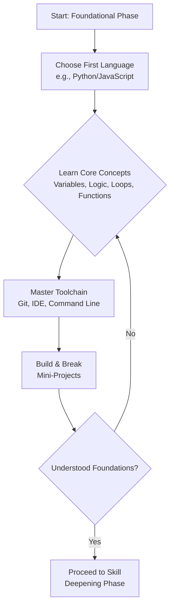

    

<h3 align="center">WELCOME TO</h3>
<h1 align="center">BLACXQUAD FREEMIUM REPOSITORY!</h1>
<h3 align="center">A HUB FOR FREE TECH LEARNING & RESOURCES.</h3>

  

    

    

  

    
 

> [!IMPORTANT]

This work is licensed under the **Creative Commons Attribution-ShareAlike 4.0 International License** (CC BY-SA 4.0).

When using, redistributing, adapting, or building upon this material, you **must** provide proper attribution by:

- 1. **Clearly stating the original source** as the **BLACXQUAD GitHub repository**.
- 2. **Including the exact URL(s)** to the relevant repository or file(s).

**Example Attribution Format:**  
- This work is based on content from the BLACXQUAD GitHub repository, available at:  
- https://github.com/blacxquad/freemium

Under the CC BY-SA license, you **must also**:
- Indicate if changes were made.
- License any adapted material under **identical terms** (CC BY-SA 4.0).

Failure to provide accurate source attribution violates the license terms.

    

<h1 align="center">Empowering Independence: The Journey of a Self-Taught Software Engineer.</h1>

  

## Executive Summary

In the dynamic realm of technology, the archetype of the software engineer has evolved. No longer confined to traditional computer science degrees, the industry now celebrates a diverse cohort of self-taught professionals who have forged their path through determination, resourcefulness, and continuous learning. This document outlines the strategic journey of the self-taught software engineer, detailing the phases of development, essential skills, and career-building tactics that transform independent learning into professional excellence. It serves as both a roadmap and a testament to the viability and power of self-directed education in building a resilient and impactful career in software.

 

## 1. The New Paradigm: Self-Directed Learning in Tech

The digital age has democratized access to knowledge. High-quality tutorials, open-source codebases, interactive platforms, and global developer communities have dismantled traditional barriers to entry. This shift has given rise to the self-taught engineer—a practitioner defined not by their credentials, but by their demonstrable skills, problem-solving ability, and relentless curiosity.

*   **The traditional university path, while valuable, is no longer the sole gateway to a software career.** The rapid pace of technological change often outpaces formal curricula, placing a premium on the ability to learn and adapt independently. Self-taught individuals cultivate this adaptability from day one, making them inherently suited to the industry's evolution.
*   **This journey is fundamentally about empowering independence.** It transfers the responsibility of education from an institution to the individual, fostering unparalleled resilience, research skills, and a deep-seated ownership over one's professional growth. This intrinsic motivation becomes a lasting career asset.
*   **The economic and logistical advantages are significant.** Learners can design personalized, focused curricula around in-demand skills without the substantial financial investment of a degree. This allows talent from non-traditional backgrounds to flourish, enriching the tech ecosystem with diverse perspectives and experiences.

### **The Self-Taught Advantage: A Comparative View**

| Aspect | Traditional Academic Path | Self-Taught Path |
| :--- | :--- | :--- |
| **Pace & Curriculum** | Structured, fixed timeline and syllabus. | Flexible, self-paced, and tailored to market needs. |
| **Primary Cost** | High tuition and associated fees. | Low to moderate (platform subscriptions, books). |
| **Learning Driver** | External deadlines and grades. | Intrinsic motivation and project goals. |
| **Skill Validation** | Diplomas and degrees. | Portfolios, contributions, and practical interviews. |
| **Problem-Solving Focus** | Often theoretical and exam-oriented. | Immediately applied to concrete, real-world projects. |

 

## 2. The Foundational Phase: Building Your Base

The initial stage is about constructing a robust and versatile foundation. The goal is not to memorize every syntax but to understand universal principles that will apply across languages and technologies.

*   **Selecting your first programming language is a pivotal decision, but not an irrevocable one.** Languages like Python are praised for their readable syntax and versatility in web development, data analysis, and automation. JavaScript is essential for understanding web interactivity and has expanded into full-stack development. The key is to pick one and commit to understanding its core paradigms deeply, as the concepts will transfer to other languages later.
*   **Computer Science fundamentals are the bedrock of great engineering.** Self-taught developers must proactively study data structures (arrays, linked lists, hash maps), algorithms (sorting, searching), and basic complexity analysis (Big O notation). This knowledge is critical for writing efficient code and is a focal point in technical interviews. Resources like free university courses (MIT OpenCourseWare) and targeted books are invaluable here.
*   **Your development environment is your workshop.** Early investment in learning essential tools pays lifelong dividends. Gain proficiency with Git for version control, a powerful code editor (like VS Code), and the command line interface of your operating system. Understanding how to effectively debug and test your code is more important than initially writing it flawlessly.

 

## 3. Escaping Tutorial Hell: The Project-Driven Mindset

A common trap for self-learners is "tutorial hell"—passively consuming content without applying it. The escape route is a deliberate shift to active, project-based learning.

*   **The transition from tutorial consumer to project creator is the single most important leap.** Start by building small, complete applications that interest you, such as a personal budget tracker, a simple blog, or a weather app. The process of designing, coding, debugging, and completing a project consolidates fragmented knowledge into practical skill.
*   **Embrace the struggle of being "stuck."** This is where genuine problem-solving skills are forged. Learning to systematically debug errors, read official documentation, and search effectively on platforms like Stack Overflow is a core competency. Each problem solved independently builds confidence and deepens understanding.
*   **Your personal projects form the cornerstone of your professional portfolio.** They are tangible proof of your skills, initiative, and passion. A portfolio showcasing 3-5 well-documented projects, with code hosted on GitHub, is far more compelling to potential employers than a generic resume listing course names. It demonstrates your ability to ship software.

 

## 4. From Coder to Engineer: Deepening Mastery

As foundational skills solidify, the focus must expand from writing code to engineering systems. This involves adopting professional practices and understanding the broader context of software development.

*   **Software engineering principles elevate code to a maintainable, scalable asset.** Study design patterns that provide proven solutions to common problems. Learn the principles of clean code—writing readable, modular, and well-documented software. Understanding the Software Development Life Cycle (SDLC) and Agile methodologies (like Scrum) is essential for working effectively in a team.
*   **Open-source contribution is a career accelerator.** It provides experience with collaborative workflows on real-world codebases, exposes you to professional code review processes, and builds your public reputation. Start by fixing simple bugs or improving documentation in projects you use.
*   **Strategic networking is about community, not just contacts.** Engage authentically in tech communities—online (Discord servers, GitHub Discussions) and offline (meetups, hackathons). Share your learning, ask thoughtful questions, and help others. This builds a support system, provides learning opportunities, and can open doors to unadvertised job roles.

 

## 5. Launching and Sustaining a Career

With a solid portfolio and network, the journey shifts to professional integration and long-term growth. This phase is about effectively marketing your skills and building sustainable career habits.

*   **Craft your narrative.** Your resume and LinkedIn profile must clearly articulate your self-taught journey as a strength, highlighting projects, contributions, and specific outcomes. Prepare for behavioral interviews by reflecting on the challenges you overcame and the systems you built.
*   **Technical interview proficiency requires dedicated practice.** Consistently solve problems on platforms like LeetCode or HackerRank, but always focus on understanding the "why" behind the optimal solution. Practice explaining your thought process aloud, as communication is a key part of the evaluation.
*   **Prioritize holistic sustainability from the outset.** The tech industry can demand intense focus. Actively cultivate work-life boundaries, manage stress through routines and hobbies, and avoid burnout by recognizing it as a threat to long-term success. Your health is your most important asset.
*   **Commit to ethical practice and lifelong learning.** Understand the societal impact of the systems you build. Prioritize security, privacy, and accessibility. Dedicate regular time to exploring emerging trends (e.g., AI/ML, cloud-native architectures) to ensure your skills remain relevant and valuable.

## Conclusion: The Independent Professional

The journey of the self-taught software engineer is a powerful narrative of modern career building. It proves that with strategic discipline, a project-focused mindset, and active community engagement, individuals can construct not just applications, but thriving, future-proof careers. This path instills a unique combination of technical depth, resourceful problem-solving, and resilient adaptability—qualities that define the most impactful engineers. Independence, therefore, is not just the starting point; it is the enduring professional advantage.

**Your journey is a continuous iteration. Learn, build, share, and repeat.** The landscape will change, but the core skills of learning how to learn and solving problems with code will remain your constant foundation. Embrace the challenge, contribute to the community that supports you, and shape the future of technology through the unique perspective you bring.  
  
  
  
  
  
    

<h2 align="center">STAY TUNED FOR THE LATEST UPDATES!</h2>

  

    

