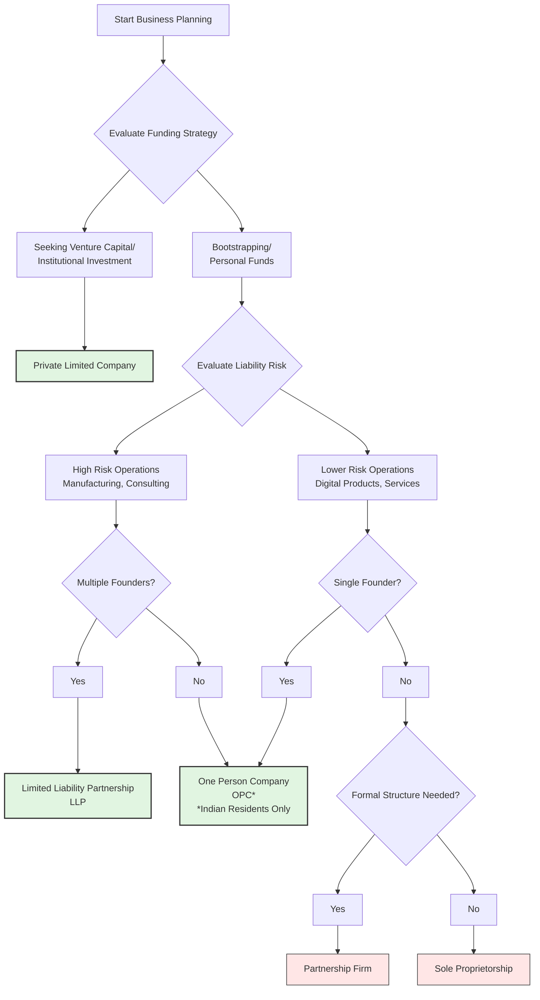

    

<h3 align="center">WELCOME TO</h3>
<h1 align="center">BLACXQUAD FREEMIUM REPOSITORY!</h1>
<h3 align="center">A HUB FOR FREE TECH LEARNING & RESOURCES.</h3>

  

    

    

  

    
 

> [!IMPORTANT]

This work is licensed under the **Creative Commons Attribution-ShareAlike 4.0 International License** (CC BY-SA 4.0).

When using, redistributing, adapting, or building upon this material, you **must** provide proper attribution by:

- 1. **Clearly stating the original source** as the **BLACXQUAD GitHub repository**.
- 2. **Including the exact URL(s)** to the relevant repository or file(s).

**Example Attribution Format:**  
- This work is based on content from the BLACXQUAD GitHub repository, available at:  
- https://github.com/blacxquad/freemium

Under the CC BY-SA license, you **must also**:
- Indicate if changes were made.
- License any adapted material under **identical terms** (CC BY-SA 4.0).

Failure to provide accurate source attribution violates the license terms.

    

 
# Comprehensive Guide to Business Entities in India for Next-Generation Entrepreneurs.

  

## Executive Summary

India's economic landscape offers unprecedented opportunities for visionary entrepreneurs. With one of the world's fastest-growing major economies and supportive government initiatives like *Make in India* and *Startup India*, the environment has never been more conducive to launching transformative ventures. This guide provides a detailed analysis of available business structures under India's regulatory framework, specifically designed for founders preparing to build scalable, world-changing businesses.

Selecting the appropriate business entity represents one of the most critical foundational decisions, impacting liability exposure, tax obligations, fundraising capabilities, governance requirements, and long-term strategic positioning. This documentation examines seven primary entity types—from sole proprietorships to public limited companies—with precise requirements, cost structures, and strategic implications. Beyond legal definitions, we explore how entity selection intersects with funding strategies, growth trajectories, and compliance obligations in the Indian context.

Approximately 99.9% of Indian businesses are classified as small and medium enterprises, making understanding these structural fundamentals essential for entrepreneurs seeking to balance operational flexibility with strategic scalability. This guide serves as a singular resource for making informed decisions that align business structure with ambitious vision.

 

## 1. Introduction: India's Business Ecosystem and Strategic Entity Selection

### 1.1 The Indian Economic Context and Entrepreneurial Opportunity

India represents one of the world's most dynamic economic environments, characterized by a unique convergence of traditional industries and modern innovation sectors. The country's ongoing economic liberalization has created fertile ground for entrepreneurship, with digital transformation accelerating across all sectors. Government initiatives have significantly simplified business registration processes, reduced bureaucratic hurdles, and created numerous incentives for new ventures.

The selection of an appropriate business entity represents a foundational strategic decision with far-reaching implications. This choice affects everything from day-to-day operations to long-term positioning, influencing liability exposure, tax optimization, fundraising capabilities, and governance complexity. For next-generation entrepreneurs aiming to build scalable, globally competitive businesses from India, entity selection must balance protective measures with operational flexibility while facilitating anticipated growth trajectories.

### 1.2 The Entity Selection Framework

Choosing the right business structure requires evaluating multiple dimensions simultaneously:
- **Risk Management**: Assessing potential liability exposure based on industry and operations
- **Funding Strategy**: Aligning structure with anticipated capital sources (bootstrapping, angel investment, venture capital, public markets)
- **Tax Efficiency**: Understanding immediate and long-term tax implications
- **Governance Complexity**: Balancing formal requirements with operational agility
- **Growth Trajectory**: Ensuring the structure supports scaling without requiring disruptive transitions
- **Exit Planning**: Considering future acquisition, merger, or public offering pathways

 

## 2. Comprehensive Analysis of Business Entities in India

### 2.1 Sole Proprietorship

**Definition**: The simplest business structure where no legal distinction exists between the owner and the business entity.

**Key Characteristics**:
- Single ownership with complete managerial control
- No separate legal identity from the proprietor
- Business income taxed as personal income under the Income Tax Act, 1961
- Minimal regulatory paperwork and compliance requirements
- Suitable for small-scale operations and initial venture testing phases

**Advantages**:
- **Simplified Formation**: Easiest and least expensive establishment process with minimal documentation
- **Direct Control**: Complete decision-making authority rests with the proprietor without requiring consensus
- **Tax Simplicity**: Business profits taxed as personal income, avoiding corporate taxation complexity
- **Operational Flexibility**: Quick adaptation to market changes without formal governance procedures
- **Direct Benefit**: Proprietor receives all profits generated by the business operations

**Disadvantages**:
- **Unlimited Liability**: Personal assets (home, savings, investments) exposed to business debts and legal claims
- **Funding Constraints**: Difficulty attracting external investment due to inability to issue equity shares
- **Perpetuation Risk**: Business ceases upon owner's death or incapacity without automatic succession
- **Growth Limitations**: Perceived lack of credibility with larger clients, suppliers, and institutional partners
- **Scalability Challenges**: Structure becomes increasingly inefficient as operations expand beyond small-scale

**Ideal For**: Freelancers, local retail businesses, service professionals, and entrepreneurs testing concepts with minimal risk exposure.

### 2.2 Partnership Firm

**Definition**: A business structure involving two or more individuals (up to 10 partners for banking, 20 for other businesses) operating together under the Indian Partnership Act, 1932.

**Key Characteristics**:
- Governed by partnership deed outlining capital contributions, profit-sharing ratios, and roles
- Optional registration with Registrar of Firms (though registered partnerships receive legal benefits)
- Partners share profits and losses according to predetermined ratios
- Relatively straightforward compliance compared to corporate entities

**Advantages**:
- **Resource Pooling**: Combines capital, skills, and networks of multiple individuals
- **Ease of Formation**: Simple establishment process with minimal regulatory formalities
- **Operational Flexibility**: Adaptable management structure without rigid governance requirements
- **Tax Treatment**: Partnership taxed as separate entity, avoiding dividend distribution tax
- **Shared Responsibility**: Division of operational workload and decision-making among partners

**Disadvantages**:
- **Unlimited Liability**: All partners personally liable for firm's debts regardless of individual involvement
- **Decision Conflicts**: Potential disputes without clear governance mechanisms in partnership deed
- **Continuity Challenges**: Dissolution required for partner changes unless specifically addressed
- **Funding Limitations**: Difficulty attracting equity investment compared to corporate structures
- **Interdependence Risk**: Actions of one partner legally binding on all partners

**Ideal For**: Professional services firms, family businesses, and ventures where partners bring complementary skills and resources.

### 2.3 Limited Liability Partnership (LLP)

**Definition**: A hybrid structure combining partnership flexibility with limited liability benefits, established under the Limited Liability Partnership Act, 2008.

**Key Characteristics**:
- Separate legal identity distinct from partners
- Partners' liability limited to their agreed contribution
- Requires minimum two designated partners
- Perpetual succession unaffected by partner changes
- Fewer compliance requirements than private limited companies

**Advantages**:
- **Limited Liability Protection**: Personal assets shielded from business debts and obligations
- **Operational Flexibility**: Adaptable management structure without board meeting requirements
- **Tax Efficiency**: Taxed as partnership firm, avoiding dividend distribution tax
- **Separate Legal Identity**: Can own property, enter contracts, and sue/be sued in own name
- **Professional Credibility**: Enhanced perception compared to traditional partnerships

**Disadvantages**:
- **Funding Constraints**: Less attractive to venture capital investors preferring equity structures
- **Public Perception**: May be viewed as less established than private limited companies
- **Conversion Requirements**: Must convert to private limited if exceeding certain partner thresholds
- **Compliance Obligations**: Annual filing requirements though simpler than corporate entities
- **Regulatory Limitations**: Certain business activities prohibited under LLP structure

**Ideal For**: Professional services firms, consulting businesses, and ventures with multiple founders seeking liability protection without corporate complexity.

*Table: Partnership Structure Comparison*
| **Aspect** | **General Partnership** | **Limited Liability Partnership (LLP)** |
|------------|------------------------|----------------------------------------|
| **Legal Status** | No separate legal identity | Separate legal entity |
| **Liability** | Unlimited personal liability | Limited to capital contribution |
| **Governance** | Governed by partnership deed | Governed by LLP agreement |
| **Compliance** | Minimal statutory filings | Annual filings (Form 8 & Form 11) |
| **Continuity** | Dissolves with partner changes | Perpetual succession |
| **Taxation** | Firm taxed, partners pay on shares | Same as partnership |
| **Investor Appeal** | Low | Moderate |

### 2.4 Private Limited Company

**Definition**: A corporate structure with separate legal identity, governed by the Companies Act, 2013, featuring limited liability for shareholders.

**Key Characteristics**:
- Separate legal entity distinct from shareholders
- Minimum 2 shareholders, maximum 200
- Minimum 2 directors, maximum 15
- Requires incorporation with Registrar of Companies
- Prohibits public subscription to shares

**Advantages**:
- **Limited Liability**: Shareholder responsibility restricted to unpaid share capital
- **Funding Accessibility**: Preferred structure for venture capital and institutional investment
- **Perpetual Existence**: Continuity unaffected by shareholder changes or transfers
- **Enhanced Credibility**: Professional perception with clients, suppliers, and partners
- **Equity Incentives**: Ability to create employee stock option plans (ESOPs)

**Disadvantages**:
- **Compliance Burden**: Mandatory annual filings, statutory audits, and board meetings
- **Establishment Complexity**: More documentation and higher initial costs
- **Regulatory Scrutiny**: Greater oversight from Ministry of Corporate Affairs
- **Tax Implications**: Corporate taxation plus potential dividend distribution tax
- **Decision Formality**: Required board resolutions for significant actions

**Ideal For**: Growth-oriented startups, technology ventures, and businesses planning external funding rounds.

*Table: Private Limited Company Requirements*
| **Requirement** | **Specification** | **Additional Considerations** |
|-----------------|-------------------|-------------------------------|
| **Shareholders** | Minimum 2, Maximum 200 | Can be individuals or corporate entities |
| **Directors** | Minimum 2, Maximum 15 | At least one must be Indian resident |
| **Capital** | No minimum requirement | Authorized capital determines stamp duty |
| **Name** | Must end with "Private Limited" | Unique and not resembling existing entities |
| **Compliance** | Annual returns, financial statements, audit | Monthly/quarterly GST filings if applicable |
| **Meetings** | Minimum 4 board meetings annually | Minutes must be properly maintained |

### 2.5 Public Limited Company

**Definition**: A corporate structure authorized to offer shares to the general public through stock exchanges, governed by the Companies Act, 2013.

**Key Characteristics**:
- Minimum 7 shareholders with no maximum limit
- Minimum 3 directors
- Can list shares on recognized stock exchanges
- Requires prospectus for public share offerings
- Subject to Securities and Exchange Board of India (SEBI) regulations when listed

**Advantages**:
- **Capital Access**: Ability to raise substantial funds from public markets
- **Maximum Liability Protection**: Shareholder responsibility limited to share capital
- **Market Visibility**: Enhanced public profile and brand recognition
- **Liquidity Opportunity**: Shareholders can trade shares on stock exchanges
- **Acquisition Currency**: Publicly traded shares facilitate strategic acquisitions

**Disadvantages**:
- **Stringent Compliance**: Extensive disclosure and governance requirements
- **Public Scrutiny**: Operational and financial transparency mandatory
- **High Costs**: Significant establishment and ongoing compliance expenses
- **Regulatory Complexity**: Subject to multiple regulatory bodies including SEBI
- **Reduced Control**: Potential dilution of founder control through public offering

**Ideal For**: Large-scale businesses, enterprises requiring substantial capital, and companies planning initial public offerings.

### 2.6 One Person Company (OPC)

**Definition**: A corporate structure allowing single entrepreneurs to operate with limited liability, introduced through the Companies Act, 2013.

**Key Characteristics**:
- Single individual as both shareholder and director
- Requires nomination of successor director
- Available only to Indian residents
- Must convert to private limited upon crossing thresholds
- Name must end with "(OPC) Private Limited"

**Advantages**:
- **Sole Control**: Complete decision-making authority with corporate benefits
- **Limited Liability**: Personal assets protected from business obligations
- **Simplified Compliance**: Exemptions from certain corporate requirements
- **Corporate Identity**: Enhanced credibility compared to sole proprietorship
- **Continuity Planning**: Successor nomination provides business continuity

**Disadvantages**:
- **Conversion Requirement**: Must convert to private limited if turnover exceeds ₹2 crore or paid-up capital exceeds ₹50 lakh
- **Residency Restriction**: Only available to Indian resident individuals
- **Funding Limitations**: Cannot issue equity to multiple investors in OPC form
- **Successor Mandate**: Required nomination reduces complete autonomy
- **Perception Constraints**: May be viewed as less scalable by some partners

**Ideal For**: Solo entrepreneurs, individual consultants, and single founders seeking liability protection without partner complexity.

### 2.7 Section 8 Company (Non-Profit Organization)

**Definition**: A company established for promoting charitable objectives rather than profit distribution, governed by Section 8 of the Companies Act, 2013.

**Key Characteristics**:
- Formed for education, art, science, sports, religion, social welfare, or environmental protection
- Profits reinvested into promoting stated objectives
- Exempt from adding "Limited" or "Private Limited" to name
- Requires central government license for incorporation
- Eligible for tax benefits under Income Tax Act provisions

**Advantages**:
- **Mission Alignment**: Legal structure dedicated to social rather than profit objectives
- **Tax Benefits**: Potential exemptions under Sections 12A and 80G of Income Tax Act
- **Credibility Enhancement**: Formal structure increases donor and stakeholder confidence
- **Perpetual Existence**: Continuity beyond founding members
- **Governance Framework**: Structured oversight through governing board

**Disadvantages**:
- **Profit Distribution Prohibition**: Cannot distribute dividends to members
- **Licensing Requirements**: Additional central government approval needed
- **Operational Restrictions**: Activities limited to licensed charitable objectives
- **Compliance Obligations**: Regular reporting on fund utilization
- **Funding Constraints**: Limited to donations, grants, and program revenue

**Ideal For**: Social enterprises, non-governmental organizations, charitable trusts, and impact-focused ventures.

 

## 3. Documentation Framework for Business Registration

### 3.1 Foundational Entity Documents

**Partnership Firms**:
- **Partnership Deed**: Details capital contributions, profit-sharing ratios, roles, responsibilities, and dispute resolution mechanisms
- **Registration Application** (optional): Form 1 with Registrar of Firms for registered partnerships

**Limited Liability Partnerships**:
- **LLP Agreement**: Governs mutual rights, duties, and profit-sharing among partners
- **Form FiLLiP**: Integrated incorporation form including name reservation
- **Form 3**: Filing of LLP agreement within 30 days of incorporation

**Private/Public Limited Companies & OPCs**:
- **Memorandum of Association (MoA)**: Defines company objectives and shareholder relationship
- **Articles of Association (AoA)**: Outlines internal governance rules and procedures
- **SPICe+ Form**: Integrated incorporation application including name reservation, DIN, PAN, TAN
- **Director Identification**: DIN application for all directors

**Section 8 Companies**:
- **License Application**: Section 8 license from Central Government
- **Memorandum & Articles**: Special provisions prohibiting profit distribution
- **Declaration**: Affidavit confirming charitable nature of objectives

### 3.2 Mandatory Registrations and Licenses

*Table: Essential Business Registrations*
| **Registration** | **Purpose** | **Issuing Authority** | **Timeline** |
|------------------|-------------|----------------------|--------------|
| **Certificate of Incorporation** | Legal proof of company formation | Registrar of Companies | 7-10 days after SPICe+ approval |
| **Permanent Account Number (PAN)** | Tax identification for company | Income Tax Department | Issued with incorporation |
| **Tax Deduction Account Number (TAN)** | For tax deduction at source compliance | Income Tax Department | Issued with incorporation |
| **GST Registration** | Indirect tax compliance for goods/services | GST Network | Within 30 days of liability arising |
| **Professional Tax** | State-level employment tax | State Commercial Tax Department | Varies by state requirement |
| **Shop & Establishment License** | Commercial operation permission | State Labor Department | Before commencing operations |
| **Udyam Registration** | MSME benefits and recognition | Ministry of MSME | Anytime after incorporation |
| **Import Export Code (IEC)** | International trade authorization | Directorate General of Foreign Trade | Before import/export activities |

### 3.3 Intellectual Property Protection Documents

**Protection Mechanisms**:
- **Trademark Applications**: For brand names, logos, taglines under relevant classes (9, 35, 41, 42 for IT businesses)
- **Patent Filings**: For inventions, proprietary technologies, and unique processes
- **Copyright Registrations**: For software code, creative content, instructional materials, and website content
- **Design Registrations**: For unique visual designs of products or interfaces

**Contractual Safeguards**:
- **Non-Disclosure Agreements (NDAs)**: Protect confidential information during business discussions
- **IP Assignment Agreements**: Ensure all intellectual property created by founders, employees, and contractors belongs to the company
- **Employment Contracts**: Include clear IP ownership clauses for work created during employment
- **Consultant Agreements**: Specify IP ownership for work delivered by external consultants

**Implementation Strategy**:
- Conduct regular IP audits to identify protectable assets
- Implement document retention policies for IP creation records
- Establish clear internal protocols for IP protection and disclosure
- Consider international protection for businesses with global ambitions

 

## 4. Financial Considerations and Cost Structures

### 4.1 Incorporation Costs by Entity Type

*Table: Comparative Incorporation Costs (Indicative Figures)*
| **Entity Type** | **Government Fees (₹)** | **Professional Fees (₹)** | **Additional Costs (₹)** | **Total Estimated Cost (₹)** |
|-----------------|-------------------------|---------------------------|--------------------------|-----------------------------|
| **Sole Proprietorship** | 500 - 2,000 | 2,000 - 5,000 | Trade licenses | 3,000 - 8,000 |
| **Partnership Firm** | 1,000 - 2,000 | 5,000 - 10,000 | Stamp duty on deed | 7,000 - 15,000 |
| **Limited Liability Partnership** | 1,500 - 5,000 | 8,000 - 15,000 | Stamp duty on agreement | 10,000 - 25,000 |
| **One Person Company** | 2,000 - 6,000 | 8,000 - 15,000 | Stamp duty on MoA/AoA | 12,000 - 25,000 |
| **Private Limited Company** | 5,000 - 15,000 | 10,000 - 25,000 | Stamp duty on capital | 18,000 - 45,000 |
| **Public Limited Company** | 20,000 - 50,000 | 30,000 - 50,000 | Prospectus costs | 55,000 - 1,00,000+ |
| **Section 8 Company** | 3,000 - 8,000 | 15,000 - 30,000 | Licensing fees | 20,000 - 40,000 |

**Notes**:
- Government fees vary based on authorized capital (for companies) or state stamp duties
- Professional fees depend on complexity and service provider
- Additional costs may include notarization, printing, and incidental expenses
- All figures indicative and subject to change based on regulatory updates

### 4.2 Ongoing Compliance Costs

**Annual Compliance Expenses**:
- **Private Limited Companies**: ₹15,000 - ₹50,000+ (audit, annual returns, board meetings, event-based filings)
- **LLPs**: ₹8,000 - ₹25,000 (annual returns, statement of accounts, tax filings)
- **OPCs**: ₹10,000 - ₹30,000 (simplified annual returns, audit, tax compliance)
- **Partnership Firms**: ₹3,000 - ₹10,000 (tax returns, renewal filings)
- **Sole Proprietorships**: ₹2,000 - ₹5,000 (tax returns, license renewals)

**Variable Cost Factors**:
- **Business Scale**: Larger operations typically incur higher compliance costs
- **Transaction Volume**: Complex transactions require more professional oversight
- **Sector Regulations**: Heavily regulated industries (finance, healthcare) have additional compliance
- **Geographic Spread**: Multi-state operations increase compliance complexity
- **Foreign Components**: Foreign investment or directors add regulatory requirements

### 4.3 State-Specific Considerations

**Karnataka (Bengaluru) Specifics**:
- **Stamp Duty**: Varies based on authorized capital and document type
- **Professional Tax**: ₹2,500 per month per employee above threshold
- **Workspace Costs**: 
  - Virtual offices: ₹1,500 - ₹4,000 monthly
  - Coworking hot desks: ₹5,000 - ₹8,000 monthly
  - Private cabins: ₹15,000 - ₹35,000+ monthly
  - Traditional offices: ₹30,000+ plus security deposit (6-10 months rent)

**Inter-State Considerations**:
- **Branch Establishments**: Additional registrations for operations in multiple states
- **State-Specific Licenses**: Certain industries require state-level approvals
- **Tax Registrations**: Separate GST registration for each state with business presence
- **Labor Compliance**: Adherence to state-specific labor regulations and welfare requirements

 

## 5. Strategic Implementation Framework

### 5.1 Entity Selection Methodology

**Systematic Evaluation Process**:

1. **Risk Assessment**
   - Evaluate potential liability exposure in your industry
   - Consider contractual obligations and client agreements
   - Assess regulatory compliance risks specific to your operations
   - Balance protection needs with structural complexity

2. **Funding Strategy Alignment**
   - Determine capital requirements for first 18-24 months
   - Identify likely funding sources (bootstrapping, angels, VC, debt)
   - Understand investor preferences for different structures
   - Plan for future funding rounds and dilution implications

3. **Tax Optimization Analysis**
   - Compare effective tax rates across different structures
   - Consider dividend distribution implications
   - Evaluate eligibility for startup tax benefits
   - Plan for long-term tax efficiency as business scales

4. **Operational Requirements**
   - Assess administrative capacity for compliance management
   - Consider decision-making speed and governance needs
   - Evaluate reporting and transparency requirements
   - Balance formality with operational agility

5. **Growth and Exit Planning**
   - Align structure with anticipated growth trajectory
   - Consider conversion requirements and timing
   - Plan for potential merger or acquisition scenarios
   - Evaluate public offering feasibility if relevant

### 5.2 Registration Process Overview

**Critical Success Factors**:
- **Name Selection**: Choose distinctive, relevant names with alternative options
- **Document Accuracy**: Ensure precision in MoA object clauses and governance provisions
- **Professional Guidance**: Engage qualified professionals for complex structures
- **Timeline Management**: Account for potential delays in approval processes
- **Resource Allocation**: Budget adequately for both establishment and initial operations

### 5.3 Post-Registration Operations Framework

**Immediate Actions (First 30 Days)**:
1. **Bank Account Establishment**
   - Open current account using incorporation certificate
   - Deposit initial share capital as specified in MoA
   - Set up online banking and payment systems
   - Implement separation from personal finances immediately

2. **Statutory Registrations**
   - Apply for GST registration if turnover threshold applicable
   - Register for professional tax with state authorities
   - Obtain shop and establishment license if required
   - Complete any industry-specific licensing

3. **Governance Implementation**
   - Conduct first board meeting and document minutes
   - Appoint statutory auditor within 30 days
   - Establish statutory registers and record-keeping systems
   - Implement basic corporate governance procedures

4. **Operational Setup**
   - Establish accounting and bookkeeping systems
   - Implement contract templates and documentation procedures
   - Set up compliance calendar with filing deadlines
   - Create document retention and management protocols

**Ongoing Compliance Management**:
- **Regular Filings**: Monthly/quarterly GST returns, TDS payments, professional tax
- **Annual Requirements**: Financial statements, annual returns, audit reports
- **Event-Based Filings**: Director changes, capital alterations, registered office shifts
- **Record Maintenance**: Statutory registers, minute books, financial records

 

## 6. Special Considerations for Next-Generation Entrepreneurs

### 6.1 Technology and Digital Businesses

**Entity Selection Factors for IT/Technology Ventures**:
- **Intellectual Property Emphasis**: Structures that facilitate IP protection and licensing
- **Funding Readiness**: Alignment with venture capital expectations and due diligence requirements
- **Employee Incentives**: Ability to implement ESOPs and equity compensation
- **Scalability Design**: Support for rapid scaling without structural limitations
- **Exit Preparation**: Compatibility with acquisition or IPO pathways

**Recommended Structures**:
- **Early Stage**: OPC or LLP for solo founders, Private Limited for teams
- **Growth Stage**: Private Limited Company (essential for institutional funding)
- **Scale Stage**: Private Limited preparing for eventual public offering
- **Social Impact**: Section 8 Company for mission-driven technology ventures

### 6.2 Women-Led Enterprises

**Strategic Advantages**:
- **Government Incentives**: Priority sector lending, subsidy programs, and recognition schemes
- **Support Networks**: Access to women entrepreneurship platforms and mentorship programs
- **Procurement Benefits**: Preferences in certain government and corporate procurement
- **Investor Focus**: Growing interest in diverse founding teams from impact investors

**Entity Recommendations**:
- **Solo Founders**: OPC providing liability protection with control retention
- **Partner Ventures**: LLP or Private Limited based on funding requirements
- **Social Ventures**: Section 8 Company for impact-focused initiatives
- **High-Growth Startups**: Private Limited Company for investor readiness

### 6.3 Funding Strategy Alignment

**Entity Structures by Funding Source**:

*Table: Funding Source and Entity Compatibility*
| **Funding Source** | **Recommended Entity** | **Key Considerations** |
|--------------------|------------------------|------------------------|
| **Bootstrapping** | OPC, LLP, Sole Proprietorship | Minimize compliance costs initially |
| **Friends & Family** | Private Limited, LLP | Formal structure for investor protection |
| **Angel Investors** | Private Limited Company | Standard for equity investment |
| **Venture Capital** | Private Limited Company | Mandatory for institutional investment |
| **Crowdfunding** | Private Limited Company | Regulatory compliance for fund raising |
| **Bank Loans** | Any registered entity | Collateral and credit history dependent |
| **Government Grants** | Registered entity (Company/LLP) | Specific program requirements vary |

### 6.4 Conversion Pathways

**Common Transition Scenarios**:
1. **Sole Proprietorship → OPC/Private Limited**
   - Trigger: Increased liability exposure or funding requirements
   - Process: Incorporate new entity, transfer assets, cancel old registrations
   - Considerations: Tax implications of asset transfer, contract reassignments

2. **Partnership → LLP/Private Limited**
   - Trigger: Liability concerns or expansion plans
   - Process: Incorporate new entity with partners as shareholders/directors
   - Considerations: Valuation of partnership assets, profit-sharing conversion

3. **OPC → Private Limited**
   - Trigger: Crossing turnover/capital thresholds or adding investors
   - Process: File conversion forms, alter MoA/AoA, update registrations
   - Considerations: Timeline (6 months mandatory), compliance changes

4. **Private Limited → Public Limited**
   - Trigger: Planning public offering or regulatory requirements
   - Process: Alter MoA/AoA, increase shareholders, regulatory approvals
   - Considerations: Significant compliance increase, governance changes

 

## 7. Future-Oriented Strategic Planning

### 7.1 Emerging Trends and Considerations

**Regulatory Developments**:
- **Digital Compliance**: Increasing online filing requirements and real-time reporting
- **Simplification Initiatives**: Continued government efforts to ease business registration
- **Global Integration**: Alignment with international standards for cross-border operations
- **Startup Specific Policies**: Evolving frameworks for innovation economy businesses

**Structural Innovations**:
- **Benefit Corporations**: Emerging structures blending profit with social purpose
- **Flexible Purpose Companies**: Potential new categories for social enterprises
- **Digital Native Entities**: Structures optimized for fully digital operations
- **Cross-Border Simplification**: Easier structures for global teams and operations

### 7.2 Long-Term Strategic Positioning

**Foundational Principles**:
- **Scalability Design**: Choose structures that support rather than constrain growth
- **Regulatory Resilience**: Build compliance capacity from inception
- **Investor Readiness**: Maintain structures attractive to future funding sources
- **Operational Efficiency**: Balance protection with administrative burden
- **Strategic Flexibility**: Retain options for structural evolution as business develops

**Implementation Guidelines**:
1. **Start with Clarity**: Define long-term vision before selecting initial structure
2. **Build in Flexibility**: Choose pathways allowing conversion without disruption
3. **Plan for Transitions**: Anticipate structural changes at funding or scale milestones
4. **Maintain Compliance Hygiene**: Establish robust systems from day one
5. **Engage Continuous Advisory**: Regular reviews with legal and financial professionals

### 7.3 Final Recommendations for Next-Generation Entrepreneurs

**Immediate Action Items**:
1. **Comprehensive Assessment**: Evaluate all factors before entity selection
2. **Professional Engagement**: Consult qualified CA/CS before registration
3. **Documentation Precision**: Invest in well-drafted foundational documents
4. **Compliance Foundation**: Establish systems for ongoing regulatory adherence
5. **Strategic Alignment**: Ensure entity supports both immediate needs and long-term vision

**Ongoing Best Practices**:
- **Regular Reviews**: Annual assessment of entity alignment with business evolution
- **Compliance Calendar**: Maintain organized tracking of all filing requirements
- **Document Management**: Systematic organization of all statutory records
- **Professional Relationships**: Maintain ongoing engagement with legal and financial advisors
- **Regulatory Monitoring**: Stay informed about relevant regulatory changes

**Visionary Perspective**:
The business entity represents more than a legal requirement—it constitutes the constitutional foundation of your venture. For next-generation entrepreneurs building transformative businesses from India, thoughtful entity selection establishes the framework for operational excellence, strategic growth, and meaningful impact. By aligning structure with vision from inception, entrepreneurs create resilient foundations capable of supporting world-changing ventures through every stage of their evolution.

 

## Appendix: Quick Reference Guides

### Entity Selection Decision Matrix

*Table: Entity Selection Based on Key Criteria*
| **Criteria** | **Sole Proprietorship** | **Partnership** | **LLP** | **OPC** | **Private Limited** | **Public Limited** | **Section 8** |
|--------------|-------------------------|-----------------|---------|---------|---------------------|-------------------|--------------|
| **Liability Protection** | None | Unlimited | Limited | Limited | Limited | Limited | Limited |
| **Funding Potential** | Very Low | Low | Moderate | Low | High | Very High | Grants/Donations |
| **Compliance Complexity** | Very Low | Low | Medium | Medium | High | Very High | High |
| **Establishment Cost** | Very Low | Low | Medium | Medium | High | Very High | Medium |
| **Control Structure** | Absolute | Shared | Flexible | Absolute | Board Governance | Shareholder Governance | Board Governance |
| **Tax Efficiency** | Personal Rates | Firm + Personal | Firm + Personal | Corporate Rates | Corporate Rates | Corporate Rates | Tax Exemptions |
| **Credibility Perception** | Low | Moderate | Good | Good | Very Good | Excellent | Specialized |
| **Best For Stage** | Idea Validation | Early Collaboration | Professional Services | Solo Founder | Growth Startup | Large Enterprise | Social Impact |

### Registration Document Checklist

**Common Requirements**:
- Identity Proof (PAN, Aadhaar/Passport for all directors/partners)
- Address Proof (Utility bill, bank statement for all directors/partners)
- Registered Office Proof (Ownership proof or rental agreement with NOC)
- Passport-sized photographs

**Entity-Specific Documents**:
- **Sole Proprietorship**: Trade license application, GST registration (if applicable)
- **Partnership**: Partnership deed, registration form (optional)
- **LLP**: LLP agreement, Form FiLLiP, Form 3
- **OPC/Private Limited**: MoA, AoA, SPICe+ forms, director declarations
- **Public Limited**: Prospectus, SEBI filings (if listing), additional disclosures
- **Section 8**: License application, charitable objective declarations

### Compliance Calendar Template

**Monthly**:
- GST returns (if registered)
- TDS payments (if applicable)
- Professional tax (state-specific)

**Quarterly**:
- GST returns (if quarterly filer)
- TDS returns
- Advance tax payments (if applicable)

**Annually**:
- Financial statements preparation
- Annual returns filing (entity-specific forms)
- Income tax returns
- Audit completion and reporting
- Renewal of trade licenses
- Compliance certificates as required

 

*Disclaimer: This guide provides general information based on prevailing regulations and market practices as of January 2026. Business regulations evolve continuously, and specific circumstances may require tailored advice. Entrepreneurs should consult qualified professionals—Chartered Accountants, Company Secretaries, or legal advisors—before making entity selection or registration decisions. The authors and publishers assume no liability for decisions made based on this documentation.*
 
 
    

<h2 align="center">STAY TUNED FOR THE LATEST UPDATES!</h2>

  

    

