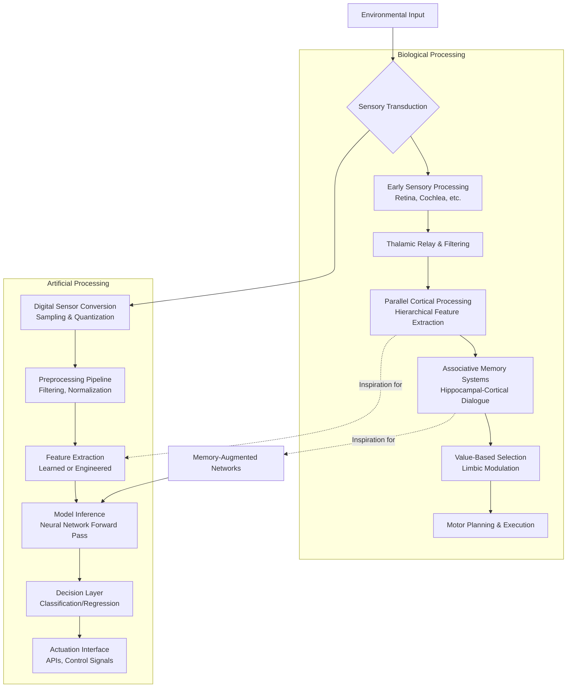

    

<h3 align="center">WELCOME TO</h3>
<h1 align="center">BLACXQUAD FREEMIUM REPOSITORY!</h1>
<h3 align="center">A HUB FOR FREE TECH LEARNING & RESOURCES.</h3>

  

    

    

  

    
 

> [!IMPORTANT]

This work is licensed under the **Creative Commons Attribution-ShareAlike 4.0 International License** (CC BY-SA 4.0).

When using, redistributing, adapting, or building upon this material, you **must** provide proper attribution by:

- 1. **Clearly stating the original source** as the **BLACXQUAD GitHub repository**.
- 2. **Including the exact URL(s)** to the relevant repository or file(s).

**Example Attribution Format:**  
- This work is based on content from the BLACXQUAD GitHub repository, available at:  
- https://github.com/blacxquad/freemium

Under the CC BY-SA license, you **must also**:
- Indicate if changes were made.
- License any adapted material under **identical terms** (CC BY-SA 4.0).

Failure to provide accurate source attribution violates the license terms.

    

# The Neuro-Silicon Interface: A Technical Comparison of Biological and Artificial Intelligence Architectures.

  

## Executive Summary

This document presents a systematic analysis comparing the architectural principles, operational mechanisms, and functional capabilities of the human brain and contemporary artificial intelligence systems. It establishes that while surface-level analogies exist between neural networks and artificial neural networks, the underlying substrates—biological tissue versus silicon hardware—create fundamental divergences in efficiency, learning, and generalization. The brain operates as a massively parallel, energy-efficient, and adaptive system honed by evolution, while AI hardware excels at precise, high-speed computation on well-defined tasks. This comparison illuminates pathways for neuromorphic engineering and hybrid human-AI collaboration, clarifying both the potential for inspiration and the importance of respecting ontological differences between biological and machine intelligence.

 

## 1. Introduction: Framing the Comparison

The parallel advancements in neuroscience and artificial intelligence have created a unique opportunity for comparative study. This document examines both systems through the lenses of structure, function, and emergent capabilities. The goal is not to declare one system superior but to map their complementary strengths and limitations. Understanding these differences is crucial for developing better AI, fostering effective human-AI collaboration, and avoiding the common pitfall of anthropomorphizing machine intelligence. We analyze computational paradigms, energy profiles, learning algorithms, and memory architectures to build a foundational framework for engineers, researchers, and the informed public.

**Key Objectives of This Analysis:**
*   To delineate functional correspondences between neural components (e.g., neurons, synapses) and hardware elements (e.g., transistors, cores).
*   To clarify the architectural and physical constraints that dictate each system's unique profile of capabilities.
*   To provide actionable insights for designing next-generation, bio-inspired computing systems.
*   To establish clear boundaries between current AI competencies and the full spectrum of human cognition.

 

## 2. Architectural Comparison Matrix

The following table summarizes the core distinctions between biological and artificial intelligence architectures.

| Dimension | Human Brain (Biological System) | AI Machine (Hardware System) | Practical Implications |
| :--- | :--- | :--- | :--- |
| **Fundamental Unit** | Neuron: Analog, electrochemical cell (~86 billion) with plastic synapses (~100 trillion). | Transistor: Digital, binary switch (billions to trillions per chip). | Different computational primitives lead to different strengths: the brain is superior at pattern completion and noisy signal processing, while silicon excels at exact arithmetic. |
| **Processing Paradigm** | Massively parallel, asynchronous, and event-driven (spiking). | Architecturally parallel but centrally clock-synchronized; operates on continuous values. | The brain is optimized for real-time sensorimotor integration; AI hardware is optimized for batched, high-throughput linear algebra. |
| **Signal Speed** | Slow (millisecond-range spikes, 1-100 Hz operating frequency). | Extremely fast (nanosecond to picosecond switching, GHz clock speeds). | AI wins on raw sequential calculation speed; the brain leverages massive parallelism to achieve rapid perception and reaction. |
| **Energy Profile** | Extraordinarily efficient (~20 Watts), using sparse, event-driven computation. | High consumption (Watts to Megawatts), with continuous power draw even at idle. | The brain's efficiency enables mobile intelligence; AI's power demands limit deployment and raise sustainability concerns. |
| **Learning Mechanism** | Synaptic plasticity (e.g., LTP/LTD), lifelong online learning from continuous experience. | Gradient-based optimization (e.g., backpropagation) on discrete, static datasets. | The brain learns sample-efficiently and adapts on the fly; AI requires vast data and separate, compute-intensive training phases. |
| **Memory Architecture** | Distributed, associative, and content-addressable. Memory and processing are colocated. | Hierarchical, address-based, and physically separate from processing units (von Neumann bottleneck). | Brain memory is robust, context-sensitive, and degrades gracefully. AI memory is precise, vast, and fails catastrophically. |
| **Fault Tolerance** | High resilience through redundancy, repair mechanisms, and adaptive rewiring. | Low inherent tolerance; requires explicit engineering of redundancy (e.g., ECC memory, replicated hardware). | Biological systems degrade gracefully with damage or aging; hardware systems typically experience complete functional failure. |
| **Development Path** | Shaped by biological evolution (millions of years) and individual maturation (decades). | Driven by human engineering and manufacturing, following rapid innovation cycles (Moore's Law). | Brain architecture is a product of multi-objective survival optimization; AI architecture is goal-specifically designed. |

 

## 3. Information Processing Pathways: A Comparative Flowchart

The flowchart below visualizes the divergent processing pipelines from sensory input to action in biological versus artificial systems.

 

## 4. Detailed Technical Analysis

### 4.1 Computational Substrates and Their Implications

*   **The biological brain is an analog, electrochemical computer.** Neurons communicate via graded potentials and all-or-nothing action potentials (spikes) across synapses. This substrate is inherently noisy, massively parallel, and consumes minimal energy by operating sparsely (only when necessary). Computation and memory are fused at the synapse, enabling exquisite pattern recognition, associative recall, and graceful performance degradation. However, this architecture is slow at precise arithmetic and lacks the exact reproducibility of digital systems, a trade-off evolution favored for survival in unpredictable environments.

*   **Silicon-based AI hardware is a digital, synchronous computer.** It relies on transistors acting as precise binary switches, orchestrated by a central clock. This enables deterministic, high-speed execution of complex mathematical operations, perfect memory recall, and global reproducibility. Modern AI accelerators (GPUs, TPUs) exploit parallel pipelines for dense matrix multiplications, the core operation of deep learning. The fundamental von Neumann architecture—separating memory and processing units—creates a data transfer bottleneck ("the memory wall") that consumes most of the system's energy, a problem biology avoids.

### 4.2 Learning and Adaptation Mechanisms Compared

*   **Biological learning is a continuous, multi-mechanism process.** It is driven by synaptic plasticity rules like Spike-Timing-Dependent Plasticity (STDP), which strengthens or weakens connections based on the precise timing of neuronal spikes. This is modulated by neurochemicals (dopamine, serotonin) that broadcast reward, attention, and context signals. Learning is embodied, situated in an environment, and occurs online without catastrophic forgetting. This allows for rapid few-shot learning, effortless transfer of skills, and the development of abstract concepts grounded in sensory-motor experience.

*   **Artificial learning is typically a discrete, optimized procedure.** The dominant algorithm, backpropagation, efficiently calculates gradients to adjust connection weights in artificial neural networks by minimizing a loss function on a static, often massive, dataset. While powerful for finding patterns in high-dimensional data, this method is data-hungry, computationally intensive, and generally suffers from catastrophic forgetting when learning new tasks sequentially. It operates in distinct "training" and "inference" phases, unlike the brain's integrated, lifelong learning cycle.

### 4.3 Memory and Information Storage Architectures

*   **Biological memory is reconstructive and associative.** Memories are stored as distributed changes in synaptic strength across vast networks. Recall is content-addressable: a partial or related cue can trigger the reconstruction of a full memory. This system, involving dialogue between the hippocampus (for recent memories) and the neocortex (for long-term storage), is robust to noise and damage but is prone to distortions and forgetting. Different types of memory (procedural, episodic, semantic) are supported by specialized, interacting brain systems.

*   **Artificial memory is location-based and hierarchical.** Data is stored at specific memory addresses in a tiered system (registers, cache, RAM, disk). This allows for perfect, high-speed storage and retrieval of vast amounts of data but requires exact addressing. It lacks inherent association between conceptually related items. Research into memory-augmented neural networks (like differentiable neural computers) and attention mechanisms seeks to add soft, content-addressable memory to AI systems, but these remain simplifications of their biological counterparts.

### 4.4 Energy Efficiency and Thermodynamic Limits

*   **The brain is a marvel of energy efficiency.** Operating on roughly 20 watts—the power of a dim lightbulb—it achieves its capabilities through sparse coding (few neurons spike at once), event-driven computation (silence is the default state), and analog in-memory computation. Energy is primarily used for restoring ion gradients after signaling, not for the signaling itself. This efficiency is the product of extreme evolutionary pressure for survival under resource constraints.

*   **Digital AI faces significant energy hurdles.** The energy cost is dominated by moving data between separate memory and processing units, not by the computation. While transistor scaling has historically improved efficiency, these gains are slowing. The pursuit of larger models has led to soaring training costs. Neuromorphic engineering, which builds event-driven, spiking chips with colocated memory and processing, is a promising approach to bridge this efficiency gap by mimicking biological principles.

 

## 5. Functional Capabilities: Current Boundaries and Future Frontiers

### 5.1 Perception and Sensory Integration

*   **The brain performs seamless, multimodal sensory binding.** It effortlessly integrates sight, sound, touch, and other senses into a unified, stable perception of the world, even when processing latencies differ. This is achieved through hierarchical processing and predictive coding, where the brain constantly generates models of the world and updates them with sensory input. Its perception is active and embodied: we move our eyes, head, and body to gather information, creating a tight sensorimotor loop that is fundamental to understanding.

*   **AI perception operates in separated, specialized streams.** While deep learning models can achieve superhuman accuracy on specific visual or auditory classification tasks, they process each modality independently. Combining them requires explicit architectural design (multimodal fusion). These systems are often brittle, failing on adversarial examples or data that differs slightly from their training set. They lack the embodied, active perception of biological agents and struggle with the contextual understanding that comes from being situated in a physical world.

### 5.2 Reasoning, Abstraction, and Generalization

*   **Human reasoning is flexible and model-based.** We build internal models of how the world works—its physical and social rules—which allow for causal reasoning, counterfactual thinking ("what if?"), and planning. We generalize from very few examples by extracting abstract principles and applying them analogically to new domains. This capability is supported by a dual-process system: fast, intuitive pattern-matching (System 1) and slower, deliberate logical analysis (System 2).

*   **AI reasoning is largely interpolative and correlation-based.** Current systems, including large language models, excel at finding statistical patterns and associations within their training data. They can generate convincing text and solve problems seen during training but struggle with true compositional reasoning, understanding causality, or handling novel situations that require reasoning "outside the box." They lack robust, manipulable world models, making tasks requiring common sense or planning in dynamic environments particularly challenging.

### 5.3 Creativity and Problem-Solving

*   **Human creativity is a systemic, emergent property.** It involves divergent thinking (generating novel ideas), conceptual blending (combining disparate concepts), and convergent thinking (evaluating and refining ideas). It is influenced by emotion, subconscious processing (e.g., during sleep or incubation periods), and deep social and cultural context. Human creativity is often motivated by intrinsic curiosity, emotion, and the desire for expression or problem-solving.

*   **AI can generate novel outputs within constrained domains.** Generative models (for images, text, music) can produce impressive and novel combinations by sampling from and interpolating within the space of their training data. However, this is typically a form of advanced pattern recombination rather than creativity driven by understanding, intent, or emotional experience. AI lacks intrinsic motivation, a sense of purpose, and the deep cross-domain knowledge that often sparks human breakthrough innovations. It serves best as a powerful tool to augment human creativity.

 

## 6. Ethical and Philosophical Implications

### 6.1 Consciousness and Machine Intelligence

*   **The existence of consciousness in AI remains a philosophical question, not an engineering one.** Current AI systems, no matter how sophisticated their output, are complex function approximators running on silicon. They exhibit no evidence of subjective experience, qualia, or self-awareness. The "hard problem" of consciousness—explaining why and how physical processes give rise to felt experience—is unsolved in neuroscience. Attributing consciousness to AI based on conversational ability commits a logical error, confusing simulation with duplication. This distinction is crucial for responsible discourse and policy.

### 6.2 Autonomy, Agency, and Responsibility

*   **True autonomy and agency are rooted in intrinsic goals.** Biological agents have goals derived from evolution (survival, reproduction) and homeostasis (hunger, thirst). An AI system's goals are always extrinsic, defined by its human designers, programmers, or the data it was trained on. Therefore, responsibility for an AI's actions ultimately rests with the humans and organizations that create, deploy, and use it. As systems become more capable, designing frameworks for meaningful human oversight, auditability, and accountability becomes a critical engineering and governance challenge.

### 6.3 Bias, Fairness, and Representational Limitations

*   **Both systems exhibit bias, but of different origins.** Human cognitive biases (e.g., confirmation bias) stem from heuristic neural shortcuts evolved for speed. AI biases reflect patterns—including historical and social prejudices—present in its training data and the choices made in its objective functions. Mitigating AI bias requires technical diligence in dataset curation, algorithm design, and evaluation, coupled with diverse interdisciplinary teams. The "black box" nature of many AI models complicates the identification and correction of unfair outcomes.

 

## 7. Practical Implications for AI System Design

### 7.1 Neuromorphic Engineering Principles

*   **Adopting event-based sensing and processing can revolutionize efficiency for edge AI.** Inspired by the retina and cochlea, event-based cameras and microphones only transmit data when a pixel or channel changes, drastically reducing data volume and power consumption. When paired with spiking neural networks (SNNs) that also communicate with sparse, asynchronous events, this paradigm enables always-on, low-latency perception for applications like robotics and mobile devices, closely mimicking biological efficiency.

*   **In-memory computing aims to dismantle the von Neumann bottleneck.** By performing computations directly within memory arrays (using technologies like ReRAM or PCM), these architectures mimic the brain's colocation of memory and processing. This can reduce the energy cost of the core matrix operations in AI by orders of magnitude, moving from "fetch-compute-store" cycles to near-instantaneous analog computation at the location of the data.

### 7.2 Human-AI Collaboration Frameworks

*   **Effective collaboration leverages complementary strengths.** The optimal model is not full human replacement but partnership. AI should handle high-volume data analysis, repetitive pattern recognition, and rapid simulation. Humans should provide strategic oversight, ethical judgment, contextual nuance, and handle novel edge cases. Designing intuitive interfaces for this partnership—where AI can explain its uncertainty and humans can provide guided feedback—is key to building robust, trustworthy hybrid systems.

*   **Progressive automation ensures safety and maintains human agency.** Instead of aiming for immediate full autonomy in complex domains (like healthcare or transportation), systems should be designed with graduated levels of automation. Humans can be kept "on the loop" for monitoring and override, or "in the loop" for critical decision points. This approach builds trust, allows for handling of unforeseen scenarios, and ensures that accountability remains clear.

 

## 8. Future Trajectories and Research Directions

### 8.1 Toward More General Artificial Intelligence

*   **Achieving broader capabilities may require hybrid architectures.** Integrating the pattern recognition strength of deep learning with the compositional generalization of symbolic AI, the exploration mechanics of reinforcement learning, and the continuous learning of self-supervised models is a promising path. The goal is systems that can learn continually from few examples, build and reason with causal world models, and transfer knowledge across tasks—moving closer to the fluid generality of biological intelligence.

*   **Embodiment and environmental interaction are likely crucial.** Intelligence in nature is not disembodied. Future AI research will increasingly focus on "situated" agents that learn through interaction with physical or highly realistic simulated environments. This embodied cognition approach may be necessary for AI to develop common sense, intuitive physics, and the robust, generalizable representations that emerge from sensorimotor experience.

### 8.2 Ethical AI Development and Governance

*   **Value alignment is a paramount technical and ethical challenge.** As AI systems grow more capable, ensuring their goals and actions remain aligned with complex human values is critical. Research in areas like inverse reinforcement learning (inferring values from behavior), debate systems, and constitutional AI (training models against a set of principles) seeks to address this. This work must be deeply interdisciplinary, involving ethicists, social scientists, and diverse communities.

*   **Building robust governance requires proactive, international effort.** Technical mechanisms for transparency (explainable AI), audit trails, and safety testing need to be developed in parallel with AI capabilities. Societal frameworks for liability, regulation, and control of powerful AI systems must be established through cooperation among researchers, industry, and governments to ensure these technologies are developed and deployed for the benefit of all humanity.

 

## 9. Conclusion

This analysis reveals that biological and artificial intelligence are not direct analogs but complementary paradigms, each extraordinary within its own domain. The human brain, a product of millennia of evolution, is an energy-efficient, adaptive, and general-purpose master of real-world perception, social cognition, and creative problem-solving. Artificial intelligence, a product of decades of engineering, is a powerful, precise, and scalable tool for data analysis, optimization, and pattern recognition within defined domains.

The most fruitful path forward lies in synergistic inspiration rather than simplistic imitation. Neuromorphic engineering draws from biology to create more efficient and adaptive hardware. Conversely, AI models provide powerful new lenses for testing hypotheses about brain function. The future will likely be defined not by competition, but by collaborative systems that thoughtfully integrate human intuition, ethics, and creativity with machine-scale data processing, precision, and speed. By understanding and respecting the profound differences at the neuro-silicon interface, we can guide this integration responsibly to address humanity's greatest challenges.

    

<h2 align="center">STAY TUNED FOR THE LATEST UPDATES!</h2>

  

    

