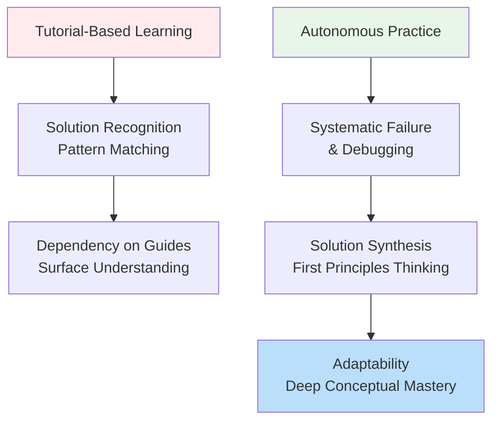
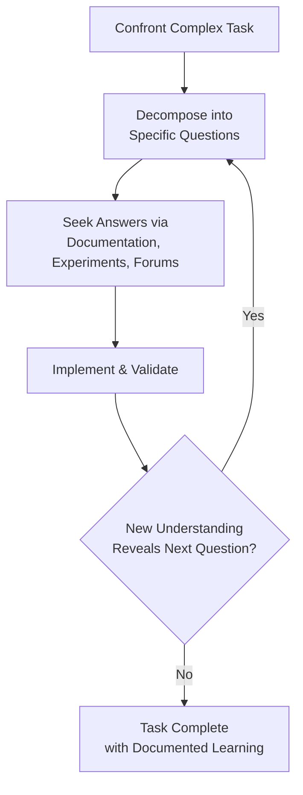
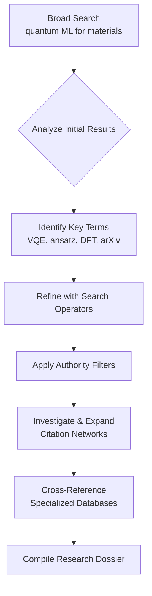

    

<h3 align="center">WELCOME TO</h3>
<h1 align="center">BLACXQUAD FREEMIUM REPOSITORY!</h1>
<h3 align="center">A HUB FOR FREE TECH LEARNING & RESOURCES.</h3>

  

    

    

  

    
 

> [!IMPORTANT]

This work is licensed under the **Creative Commons Attribution-ShareAlike 4.0 International License** (CC BY-SA 4.0).

When using, redistributing, adapting, or building upon this material, you **must** provide proper attribution by:

- 1. **Clearly stating the original source** as the **BLACXQUAD GitHub repository**.
- 2. **Including the exact URL(s)** to the relevant repository or file(s).

**Example Attribution Format:**  
- This work is based on content from the BLACXQUAD GitHub repository, available at:  
- https://github.com/blacxquad/freemium

Under the CC BY-SA license, you **must also**:
- Indicate if changes were made.
- License any adapted material under **identical terms** (CC BY-SA 4.0).

Failure to provide accurate source attribution violates the license terms.

    

<h1 align="center">Executive Summary: The Three Pillars of Modern Technical Excellence.</h1>

  
 

## Executive Summary: The Three Pillars of Modern Technical Excellence

True mastery in technology extends beyond writing code—it encompasses **how you learn, how you think, and how you find information**. This comprehensive framework synthesizes two decades of software engineering and research experience into a unified roadmap for developers. We address three critical dimensions: **Programming Mastery** (transitioning from tutorial dependency to autonomous problem-solving), **Learning Science** (evidence-based strategies for deep understanding), and **Information Retrieval** (engineering precision search skills). Together, these form the foundation for sustainable growth, professional excellence, and the development of what the industry terms "10X impact."

 

## Part 1: Programming Mastery Philosophy

### The Fundamental Mindset Shift

Programming is not about memorizing syntax; it's about developing **structured problem-solving cognition**. The expert developer thinks in systems, patterns, and abstractions, not merely commands and functions.

* **Syntax is transient; problem-solving is permanent:** Languages and frameworks evolve rapidly, but the core ability to decompose complex problems, design logical solutions, and debug systems remains your most valuable asset. Focus first on understanding *why* code works, not just *how* to write it.
* **From consumer to creator:** The journey from beginner to expert is marked by decreasing dependence on external solutions and increasing ability to synthesize original approaches. This requires embracing uncertainty and developing comfort with the "blank page" problem.
* **Programming as applied logic:** Every program is a formal argument. Your code should be the logical conclusion drawn from requirements, constraints, and first principles. This perspective transforms coding from a mechanical task to an intellectual discipline.

### The Perils of Polished Tutorials

While tutorials provide valuable entry points, over-reliance creates significant learning debt. They present a sanitized version of development that masks the iterative, error-filled reality of creating original solutions.

* **Tutorials obscure the learning value of failure:** When you follow a pre-baked solution, you bypass the critical cognitive struggle—experimenting with approaches, hitting dead ends, and having breakthrough moments. The tutorial creator underwent this process invisibly, depriving you of the problem-solving resilience it builds.
* **They promote solution recognition over solution synthesis:** Tutorials train you to implement known patterns to familiar problems. Real-world development demands creating novel solutions to unprecedented challenges by creatively adapting principles and patterns.
* **The illusion of seamless progress:** Tutorials present linear progression from problem to solution. Actual development is non-linear, involving research spikes, experimentation, refactoring, and revisiting assumptions. This messy process is where true understanding crystallizes.

### Question Driven Development: The Framework for Autonomy

**Question Driven Development** formalizes the problem-solving process into a manageable, iterative methodology. It transforms overwhelming objectives into answerable questions.

| Principle | Mechanism | Outcome |
|-----------|-----------|---------|
| **Decomposing Complexity** | Breaks monolithic tasks into linear investigable steps | Reduces cognitive load, creates clear momentum |
| **Identifying Knowledge Gaps** | Forces explicit acknowledgment of unknowns | Creates focused research agenda, prevents assumption errors |
| **Maintaining Context** | Questions and answers serve as project log | Enables efficient resumption after interruptions |
| **Progress Amid Uncertainty** | Allows forward movement on solvable sub-problems | Prevents paralysis from incomplete information |

**The QDD Workflow Cycle:**

 

## Part 2: The Science of Effective Learning

### Core Cognitive Principles

Effective learning aligns with how the human brain naturally processes, stores, and retrieves information. These evidence-based techniques outperform passive study methods.

#### Active Retrieval & Spaced Repetition

* **The Testing Effect:** Actively recalling information (without looking at source material) strengthens memory pathways more effectively than passive review. This explains why flashcards work—the effort of retrieval itself enhances long-term retention.
* **Combatting the Forgetting Curve:** We naturally forget information rapidly after learning. Spaced repetition schedules reviews just as you're about to forget, powerfully reinforcing memory. Tools like Anki automate this scheduling based on your performance.
* **Implementation Strategy:** After learning new material, close all resources and write or verbalize everything you remember. Transfer key concepts to a spaced repetition system. Review not when it's easy, but when it's starting to become difficult.

#### The Feynman Technique & Elaboration

* **Teaching for Understanding:** Explaining concepts in simple language forces you to identify core principles, strip away jargon, and confront gaps in your understanding. If you cannot explain it simply, you don't truly understand it.
* **Elaborative Interrogation:** Continuously ask "why" and "how" questions about the material. Connect new information to what you already know, creating rich associative networks that make recall more reliable.
* **Implementation Strategy:** Choose a concept, explain it aloud as if teaching a beginner, identify where your explanation falters, return to source material to fill gaps, then simplify your explanation further.

### Optimized Learning Workflows

| Learning Goal | Primary Techniques | Supporting Practices |
|---------------|-------------------|----------------------|
| **Memorizing Facts & Terminology** | Spaced Repetition, Mnemonics, Chunking | Active Recall, Memory Palaces |
| **Understanding Complex Concepts** | Feynman Technique, Self-Explanation, Concept Mapping | Dual Coding (text + visuals), Analogies |
| **Developing Problem-Solving Skills** | Interleaved Practice, Worked Examples, Deliberate Practice | Solve Before Seeing Solution, Teach Others |
| **Mastering Technical Systems** | Progressive Projects, Debugging Exercises, Documentation Reading | Build-Test-Refactor Cycles, System Diagramming |

### Environmental & Physiological Optimization

* **The Sleep Sandwich:** Review challenging material 1-2 hours before sleep, get quality sleep (when memory consolidation occurs), then review again the next morning. This leverages natural neurochemical processes.
* **Focused Attention Management:** Use the Pomodoro Technique (25-minute focused blocks with 5-minute breaks) to align with natural attention cycles. Work in dedicated environments to create strong focus cues.
* **Physiological Support:** Maintain hydration (even mild dehydration impairs cognition), consume brain-supporting nutrients (omega-3s, antioxidants), and incorporate brief movement breaks to increase cerebral blood flow.

 

## Part 3: Precision Information Retrieval

### From Searching to Research Engineering

The modern developer's capability is multiplied by effective information retrieval skills. Transforming from a casual searcher to a "search engineer" dramatically accelerates problem-solving.

#### Foundational Search Techniques

* **Instant Computational Tools:** Use search engines as calculators (`(15*22)/7`), unit converters (`km to miles`), or real-time data sources (`AAPL stock`, `time in Tokyo`).
* **Intent-Based Queries:** Structure searches around actions: `flights NYC to London March 15`, `Python read CSV tutorial`, `compare React vs Vue 2024`.
* **File-Type Targeting:** Use `filetype:pdf`, `filetype:pptx`, or `filetype:csv` to find specific document formats directly.

#### Advanced Search Operators

| Operator | Example | Use Case |
|----------|---------|----------|
| **`site:`** | `site:github.com docker compose` | Confine results to specific domains |
| **`intitle:`** | `intitle:"machine learning" tutorial` | Find pages with terms in title |
| **`inurl:`** | `inurl:docs/api/` | Locate API documentation sections |
| **`"exact phrase"`** | `"neural network architecture"` | Literal phrase matching |
| **`-exclusion`** | `python -snake` | Exclude irrelevant results |
| **`OR` / `AND`** | `(React OR Vue) tutorial` | Boolean logic for broader/narrower results |
| **`..` range** | `laptop $800..$1200` `Python 3.8..3.11` | Numeric or version ranges |
| **`before:` / `after:`** | `AI advancements after:2022` | Temporal filtering |

#### Strategic Search Methodology

1. **Broad-to-Narrow Progression:** Start with general terms to survey the landscape, identify common terminology, then iteratively refine with specific operators.
2. **Authority Prioritization:** For critical research, begin with `site:.edu`, `site:.gov`, or `site:*.org` to filter for credible sources.
3. **Cross-Engine Validation:** Different search engines have different indexes and ranking algorithms. Verify important findings across Google, Bing, DuckDuckGo, and specialized engines.
4. **Academic Citation Chaining:** In Google Scholar, use "Cited by" to find newer works building on a paper (forward chaining) and reference lists to find foundational sources (backward chaining).

### Integrated Research Workflow

**Scenario:** Researching recent advancements in quantum machine learning for material science.

 

 

 

## Part 4: The Developer's Growth Framework

### Developmental Stages & Focus Areas

| Stage | Primary Challenge | Key Strategies | Success Metrics |
|-------|-------------------|----------------|-----------------|
| **Beginner** | Overcoming tutorial dependency | QDD on small projects, consistent practice, embrace failure | Builds first complete applications |
| **Intermediate** | Developing architectural thinking | Pattern mastery, code review participation, mentorship | Designs scalable systems, contributes to open source |
| **Advanced** | Creating leverage & innovation | System design, mentoring others, strategic learning | Solves novel problems, influences technical direction |
| **Expert** | Sustaining impact & wisdom | Thought leadership, ecosystem contributions, teaching | Shapes industry practices, multiplies team capability |

### Sustainable Performance Practices

* **Consistency Over Intensity:** Daily focused practice outperforms sporadic marathons. Establish sustainable rhythms using habit stacking (attach coding to existing routines).
* **Health as Infrastructure:** Sleep, nutrition, and exercise directly correlate with cognitive performance, debugging ability, and learning efficiency. Treat physical health as professional infrastructure.
* **Avoiding Burnout:** Recognize burnout as a workflow failure, not a badge of honor. Implement regular breaks, varied work types, and maintain non-technical interests.
* **Mindset Management:** Adopt growth mindset principles—view challenges as opportunities, frame failures as data, and compare yourself only to your past self.

### The 10X Developer: Beyond the Myth

The "10X engineer" concept is often misunderstood. True high-impact developers create leverage through:

1. **Strategic Problem Selection:** Solving the right problems, not just any problems
2. **Systemic Thinking:** Anticipating second-order effects and designing for scale
3. **Knowledge Multiplication:** Teaching, mentoring, and creating resources that elevate others
4. **Tool Building:** Creating systems and automation that amplify team output
5. **Quality Advocacy:** Insisting on standards that reduce long-term maintenance costs

These capabilities emerge from the integrated mastery of programming, learning, and research skills—not from innate talent or excessive working hours.

 

## Part 5: Integrated Practice System

### Weekly Development Rhythm Template

| Day | Focus Area | Learning Practice | Project Work | Research Skill |
|-----|------------|-------------------|--------------|----------------|
| **Monday** | Core Concepts | Spaced repetition review, 30 min reading | Refactor existing code | Deep dive on one concept |
| **Tuesday** | Problem-Solving | Code challenge (LeetCode/HackerRank) | Implement new feature | Advanced search practice |
| **Wednesday** | Systems Thinking | Architecture review (open source project) | Design/document system | Cross-referencing sources |
| **Thursday** | Skill Expansion | Tutorial with modification (don't just follow) | Experiment with new technology | Finding authoritative sources |
| **Friday** | Integration | Teach a concept (write/blog/explain) | Integrate components, test | Compile weekly learnings |
| **Weekend** | Exploration | Project-based learning | Build portfolio project | Explore adjacent domains |

### Project Progression Pathway

1. **Foundational (Weeks 1-4):** Console applications, basic CRUD apps, static websites
2. **Integration (Weeks 5-8):** APIs, database integration, authentication, third-party services
3. **Systems (Weeks 9-12):** Distributed components, message queues, caching, containerization
4. **Specialization (Months 4-6):** Domain-focused complex application in target stack
5. **Contribution (Ongoing):** Open source contributions, tool creation, community teaching

### Learning Portfolio Development

Create tangible artifacts that demonstrate growth:

* **Technical Blog:** Document problem-solving processes, not just solutions
* **Code Repository:** Curated projects with quality READMEs and clear progression
* **Knowledge Base:** Personal wiki of concepts, patterns, and solutions
* **Teaching Materials:** Tutorials, presentations, or workshops you've created
* **Problem Journal:** Record of challenging bugs and how you solved them

 

## Conclusion: The Mastery Mindset

Technical mastery is not a destination but a continuous journey of transformation. It requires systematically developing three interdependent capabilities:

1. **Autonomous Problem-Solving:** Moving from tutorial dependency to creating original solutions through frameworks like QDD
2. **Scientific Learning:** Applying evidence-based cognitive strategies to acquire and retain knowledge efficiently
3. **Precision Research:** Engineering information retrieval to accelerate discovery and validation

The unifying thread across all dimensions is **mindset**—viewing challenges as solvable, embracing the learning value in failure, and maintaining curiosity in the face of complexity. Your most powerful tool is not any particular language or framework, but a resilient, adaptable intellect capable of continuous growth.

Begin your mastery journey today by selecting one element from each dimension:
- From **Programming**: Implement QDD on your next small task
- From **Learning**: Apply the Feynman Technique to a concept you "sort of" understand
- From **Research**: Use three advanced search operators in your next investigation

Consistent practice compounds. Each small step builds the cognitive infrastructure for extraordinary capability. The path to mastery is walked not in giant leaps, but in daily, deliberate steps forward.

 

## Quick Reference: When You're Stuck...

| Situation | Immediate Action | Follow-up Strategy |
|-----------|-----------------|-------------------|
| **Don't know where to start** | Write 5 specific questions about the task | Apply QDD workflow; answer easiest question first |
| **Tutorial dependency loop** | Build something without a tutorial, expecting to fail | Document what you learn from each failure |
| **Learning doesn't stick** | Switch from passive reading to active recall | Implement spaced repetition for key concepts |
| **Can't find needed information** | Use advanced search operators (`site:`, `filetype:`, `" "`) | Try alternative search engines; check academic databases |
| **Imposter syndrome** | List 3 things you've learned this month | Teach a concept to someone else (Feynman Technique) |
| **Burnout feeling** | Take a complete break (no screens) | Re-evaluate workload and incorporate health practices |
| **Career stagnation** | Build and publish a substantial project | Network through contributions, not just social media |

**Final Principle:** Expertise emerges at the intersection of consistent practice, strategic learning, and resilient mindset. Start where you are, use what you have, do what you can—and let the compounding begin.
 
 
    

<h2 align="center">STAY TUNED FOR THE LATEST UPDATES!</h2>

  

    

