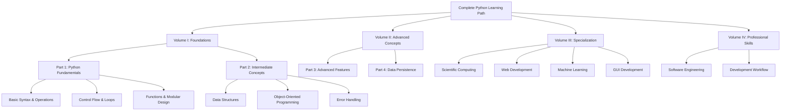

    

<h3 align="center">WELCOME TO</h3>
<h1 align="center">BLACXQUAD FREEMIUM REPOSITORY!</h1>
<h3 align="center">A HUB FOR FREE TECH LEARNING & RESOURCES.</h3>

  

    

    

  

    
 

> [!IMPORTANT]

This work is licensed under the **Creative Commons Attribution-ShareAlike 4.0 International License** (CC BY-SA 4.0).

When using, redistributing, adapting, or building upon this material, you **must** provide proper attribution by:

- 1. **Clearly stating the original source** as the **BLACXQUAD GitHub repository**.
- 2. **Including the exact URL(s)** to the relevant repository or file(s).

**Example Attribution Format:**  
- This work is based on content from the BLACXQUAD GitHub repository, available at:  
- https://github.com/blacxquad/freemium

Under the CC BY-SA license, you **must also**:
- Indicate if changes were made.
- License any adapted material under **identical terms** (CC BY-SA 4.0).

Failure to provide accurate source attribution violates the license terms.

    

<h1 align="center">The Complete Python Mastery Guide: From Novice to Professional Developer.</h1>

  

## Introduction: Why Python Dominates Modern Programming

Python stands as the premier gateway language into software development, consistently ranked among the world's most popular programming languages since its creation by Guido van Rossum in 1991. Its elegant syntax, extensive ecosystem, and remarkable versatility have made it the default choice for beginners while remaining indispensable for seasoned professionals across diverse domains.

This comprehensive guide provides a structured learning path designed to transform absolute beginners into proficient Python developers capable of tackling real-world challenges in web development, data science, artificial intelligence, automation, and beyond. We've organized this knowledge into a logical progression based on two decades of industry experience and educational best practices.

 

## Volume I: Python Fundamentals and Core Programming

### Part 1: Introduction to Python Programming

#### Chapter 1: Getting Started with Python
*   **Installation and Environment Setup**: Begin by downloading the latest Python version from python.org, ensuring compatibility with your operating system. We recommend using package managers like Homebrew for macOS or checking Windows installation options. Always verify installation success by running `python --version` in your terminal or command prompt. Consider using virtual environments from day one to isolate project dependencies and prevent version conflicts between different projects.
*   **Choosing Development Tools**: Select an appropriate code editor or Integrated Development Environment (IDE) based on your needs and experience level. Beginners often start with IDLE (included with Python) or lightweight editors like VS Code with Python extensions. More advanced users might prefer PyCharm for its comprehensive debugging tools and project management features. The choice significantly impacts productivity but doesn't affect your ability to learn core concepts.
*   **Writing and Executing Your First Program**: Create a simple "Hello, World!" script to understand the basic workflow of writing, saving, and executing Python code. Learn to navigate your file system from the command line and execute scripts using both interactive mode (`python -i script.py`) and standard execution (`python script.py`). This foundational step introduces you to Python's immediate feedback loop and sets the stage for more complex programming tasks.
*   **Understanding Python's Interactive Shell**: Explore the Python REPL (Read-Eval-Print Loop) for testing small code snippets and experimenting with language features without writing full scripts. The interactive shell serves as an excellent learning tool for immediate feedback and debugging small logical components before integrating them into larger programs. Learn to use underscore (`_`) to reference the last computed value and leverage built-in help with `help()`.

#### Chapter 2: Basic Syntax and Operations
*   **Variables and Data Assignment**: Python uses dynamic typing, allowing variables to hold values of any type without explicit declaration. Variable names must follow specific rules: start with a letter or underscore, contain only alphanumeric characters and underscores, and avoid reserved keywords. Understand the difference between mutable and immutable types early, as this affects how data behaves when assigned to new variables or passed to functions.
*   **Fundamental Data Types**: Python provides several built-in types including integers (`int`), floating-point numbers (`float`), complex numbers (`complex`), strings (`str`), and booleans (`bool`). Each type supports specific operations and has particular memory characteristics. Strings deserve special attention as they're immutable sequences with extensive methods for manipulation, formatting, and pattern matching.
*   **Basic Operators and Expressions**: Master arithmetic operators (`+`, `-`, `*`, `/`, `//`, `%`, `**`), comparison operators (`==`, `!=`, `<`, `>`, `<=`, `>=`), and logical operators (`and`, `or`, `not`). Pay particular attention to integer division (`//`) versus true division (`/`) and the exponentiation operator (`**`). Operator precedence follows standard mathematical rules but use parentheses for clarity when expressions become complex.
*   **Input and Output Operations**: Use `input()` to collect user data (always returning a string) and `print()` to display output with various formatting options. Learn about f-strings (formatted string literals) introduced in Python 3.6 for cleaner string interpolation. Understand how to handle different data encodings when reading from or writing to external sources, especially when working with non-ASCII characters.

#### Chapter 3: Control Flow and Loops
*   **Conditional Statements with if/elif/else**: Implement decision-making logic using conditional blocks that execute code based on boolean expressions. Python uses indentation to define code blocks, requiring consistent spacing (typically 4 spaces per level). Master comparison operators and understand truthy/falsy evaluation where non-boolean values are interpreted in boolean contexts (empty sequences are `False`, non-empty are `True`).
*   **Iteration with for and while Loops**: Use `for` loops to iterate over sequences (lists, strings, ranges) and `while` loops for iteration based on conditions. The `for` loop is generally preferred when the number of iterations is known beforehand, while `while` loops excel when termination depends on dynamic conditions. Both support `break` (exit loop entirely), `continue` (skip to next iteration), and `else` clauses (execute after normal loop completion).
*   **Range Objects and Iteration Control**: The `range()` function generates arithmetic progressions efficiently without storing entire sequences in memory. Understand its three forms: `range(stop)`, `range(start, stop)`, and `range(start, stop, step)`. In Python 3, `range()` returns a special range object rather than a list, conserving memory for large sequences. Combine with `enumerate()` when you need both index and value during iteration.
*   **Pattern-Based Problem Solving**: Develop algorithmic thinking by solving pattern problems (pyramids, number sequences, etc.) that reinforce nested loop concepts and conditional logic. These exercises build spatial reasoning and prepare you for more complex algorithmic challenges. Start with simple right-aligned triangles and progress to hollow diamond patterns, observing how loop variables relate to output patterns.

#### Chapter 4: Functions and Modular Programming
*   **Function Definition and Invocation**: Create reusable code blocks using the `def` keyword followed by a function name, parameters in parentheses, and a colon. Functions can accept positional arguments, keyword arguments with default values, and variable-length argument lists (`*args` for positional, `**kwargs` for keyword arguments). Understand the difference between parameters (variables in function definition) and arguments (actual values passed during invocation).
*   **Return Values and Multiple Returns**: Functions use the `return` statement to send results back to the caller. Python functions can return multiple values as tuples, which can be unpacked directly into separate variables. When no return statement is present or reached, functions implicitly return `None`. Design functions to have clear, singular purposes and meaningful return values that facilitate chaining and composition.
*   **Variable Scope and Namespaces**: Python employs LEGB (Local, Enclosing, Global, Built-in) scope resolution. Variables defined inside functions have local scope unless declared `global` or `nonlocal`. Understand how modifying mutable objects passed as arguments differs from reassigning parameter variables. Use descriptive names and avoid excessive global variables to maintain clean, predictable code.
*   **Modular Design and Code Organization**: Structure programs by separating concerns into logical functions and modules. Create your own modules by saving code in `.py` files and importing them using `import` statements. Understand the `__name__` variable and `if __name__ == "__main__":` idiom for creating modules that can both run as scripts and be imported. This practice establishes foundational software architecture principles early in your learning journey.

### Part 2: Intermediate Python Concepts

#### Chapter 5: Data Structures in Python
*   **Lists: Mutable Ordered Collections**: Lists store ordered sequences of heterogeneous elements with integer-based indexing starting at 0. They support negative indexing (counting from the end), slicing (`list[start:stop:step]`), and comprehensive modification methods (`append()`, `extend()`, `insert()`, `remove()`, `pop()`). List comprehensions provide a concise, readable syntax for transforming sequences while often outperforming equivalent loop constructs.
*   **Tuples: Immutable Ordered Sequences**: Tuples share most list characteristics but are immutable after creation, making them suitable for fixed data collections, dictionary keys, and multiple return values. The syntax distinction (parentheses vs. square brackets) is subtle but significant. Single-element tuples require a trailing comma (`(x,)`) to distinguish them from parenthesized expressions.
*   **Dictionaries: Key-Value Mapping Structures**: Dictionaries provide unordered mappings from unique, hashable keys to values with constant-time lookup. They excel at representing relationships and aggregating data by categories. Master dictionary methods like `get()` (with default values), `setdefault()`, `update()`, and dictionary comprehensions. Understand hashability requirements: keys must be immutable types (strings, numbers, tuples).
*   **Sets: Unordered Unique Collections**: Sets store unordered collections of unique, hashable elements with mathematical set operations (`union()`, `intersection()`, `difference()`, `symmetric_difference()`). They provide highly optimized membership testing and duplicate elimination. Frozensets offer immutable set alternatives for use as dictionary keys or elements within other sets. Set comprehensions follow similar syntax to list comprehensions but use curly braces.

#### Chapter 6: Object-Oriented Programming
*   **Classes and Objects Fundamentals**: Python implements OOP with classes serving as blueprints for objects. Define classes using the `class` keyword, with `__init__()` as the constructor method that initializes instance attributes. Understand the distinction between class attributes (shared across instances) and instance attributes (unique to each object). Methods receive `self` as their first parameter, referring to the specific instance.
*   **Encapsulation and Property Decorators**: Control attribute access using naming conventions (single underscore `_var` for "protected," double underscore `__var` for name mangling) and the `@property` decorator for computed attributes. Properties allow you to define getter, setter, and deleter methods that maintain backward compatibility while adding validation or computation logic. This approach follows the "uniform access principle."
*   **Inheritance and Polymorphism**: Create class hierarchies using inheritance, where child classes inherit attributes and methods from parent classes. Method overriding allows child classes to provide specialized implementations while maintaining interface compatibility. Python supports multiple inheritance with Method Resolution Order (MRO) determining attribute lookup sequence. Abstract Base Classes (ABCs) define interfaces that concrete classes must implement.
*   **Special Methods and Operator Overloading**: Python's "magic methods" (names surrounded by double underscores) enable customizing object behavior for built-in operations. Implement `__str__()` for user-friendly string representation, `__repr__()` for developer representation, `__len__()` for length, and numerous operators (`__add__`, `__eq__`, etc.). These methods make your classes behave like built-in types, enabling more intuitive and expressive code.

#### Chapter 7: Error and Exception Handling
*   **Exception Hierarchy and Built-in Exceptions**: Python exceptions form a hierarchy with `BaseException` at the root. Common built-in exceptions include `TypeError`, `ValueError`, `IndexError`, `KeyError`, `FileNotFoundError`, and `ZeroDivisionError`. Each exception type communicates specific error conditions, allowing targeted handling. Familiarize yourself with the complete hierarchy to choose appropriate exception types for custom errors.
*   **try/except/else/finally Blocks**: Structure error handling with `try` blocks containing code that might raise exceptions, `except` blocks catching specific exceptions, `else` blocks executing only when no exceptions occur, and `finally` blocks always executing for cleanup. Catch specific exceptions rather than using bare `except:` clauses to avoid masking unexpected errors. Order exception handlers from most to least specific.
*   **Custom Exception Classes**: Define domain-specific exceptions by subclassing built-in exception types (typically `Exception`). Custom exceptions improve code clarity by distinguishing different error conditions and can carry additional context via instance attributes. Follow naming conventions (ending with "Error") and provide meaningful error messages. Consider creating exception hierarchies for complex applications.
*   **Context Managers and Resource Management**: Use `with` statements and context managers for reliable resource cleanup (files, locks, database connections). Implement your own context managers using classes with `__enter__()` and `__exit__()` methods or the `contextlib` module's `@contextmanager` decorator. Context managers ensure proper resource release even when exceptions occur, preventing resource leaks and maintaining system stability.

 

## Volume II: Advanced Python Development

### Part 3: Advanced Language Features

#### Chapter 8: Functional Programming in Python
*   **First-Class and Higher-Order Functions**: Python treats functions as first-class objects, meaning they can be assigned to variables, stored in data structures, passed as arguments, and returned from other functions. Higher-order functions accept or return other functions, enabling powerful abstraction patterns. This capability forms the foundation for decorators, callbacks, and functional programming techniques.
*   **Lambda Functions and Anonymous Operations**: Create small, anonymous functions using the `lambda` keyword for simple operations that don't require full function definitions. Lambda functions are limited to single expressions but can capture variables from enclosing scopes. They're particularly useful with higher-order functions like `map()`, `filter()`, and `sorted()` where defining separate named functions would be cumbersome.
*   **map(), filter(), and reduce() Operations**: Apply functions to sequences using `map()` (transformation), `filter()` (selection), and `functools.reduce()` (cumulative computation). While list comprehensions often provide more readable alternatives for `map()` and `filter()`, these functions remain valuable in functional programming contexts. Understand generator versions (`map` and `filter` return iterators in Python 3).
*   **Function Composition and Partial Application**: Build complex operations by combining simpler functions using composition patterns. The `functools` module provides `partial()` for fixing certain arguments of a function, creating new functions with reduced arity. This technique enables specialization and configuration of general-purpose functions, promoting code reuse and reducing duplication.

#### Chapter 9: Iterators, Generators, and Coroutines
*   **Iterator Protocol and Custom Iterators**: Iterators implement the `__iter__()` and `__next__()` methods, providing sequential access to elements without storing the entire sequence in memory. The `__iter__()` method returns the iterator object itself, while `__next__()` returns successive items or raises `StopIteration` when exhausted. Many built-in types are iterable, and the `iter()` function obtains iterators from iterables.
*   **Generator Functions and Yield Statements**: Generators provide a simpler way to create iterators using functions with `yield` statements. When called, generator functions return generator objects that execute up to the first `yield`, pause while preserving state, and resume on subsequent `next()` calls. This lazy evaluation enables processing large or infinite sequences while conserving memory.
*   **Generator Expressions and Memory Efficiency**: Generator expressions use syntax similar to list comprehensions but with parentheses instead of brackets, creating generator objects that produce values on demand. They're particularly valuable for large datasets where materializing the entire collection would be memory-intensive. Understand when to use generator expressions versus list comprehensions based on data size and access patterns.
*   **Coroutines and Asynchronous Patterns**: Extend generators into coroutines that can both produce and consume values using `yield` as an expression. While largely superseded by `async`/`await` syntax for asynchronous programming, understanding coroutines provides insight into Python's concurrency evolution. Modern asynchronous programming uses `async def` and `await` for cooperative multitasking with event loops.

#### Chapter 10: Metaprogramming and Reflection
*   **Introspection and Dynamic Attribute Access**: Python's reflection capabilities allow programs to examine and modify their own structure at runtime. Use built-in functions like `type()`, `isinstance()`, `issubclass()`, `callable()`, `getattr()`, `setattr()`, and `hasattr()` to inspect and manipulate objects dynamically. The `dir()` function returns an object's attribute names, while `vars()` returns its `__dict__` attribute.
*   **Decorators with Parameters and Classes**: Enhance decorator functionality by accepting parameters through nested function definitions or using classes as decorators. Parameterized decorators wrap additional layers to capture arguments, while class-based decorators implement `__init__()` to receive the decorated function and `__call__()` to replace it. These techniques enable reusable, configurable behavior injection.
*   **Metaclasses and Class Creation Control**: Metaclasses are classes of classes that control class creation. Define custom metaclasses by inheriting from `type` and overriding `__new__()` or `__init__()` to modify class creation. While powerful for frameworks implementing ORMs, validation systems, or APIs, metaclasses add complexity and should be used judiciously when class decorators won't suffice.
*   **Dynamic Code Execution with eval() and exec()**: The `eval()` function evaluates expressions, while `exec()` executes statements and code blocks. Both accept optional namespace dictionaries for controlling variable access. Due to security implications, use these functions cautiously with untrusted input. Prefer `ast.literal_eval()` for safely evaluating literals. These capabilities enable domain-specific languages and runtime code generation in controlled environments.

### Part 4: File Handling and Data Persistence

#### Chapter 11: File Input and Output
*   **File Opening Modes and Context Managers**: Open files using `open()` with mode strings specifying read (`'r'`), write (`'w'`), append (`'a'`), and binary/text distinctions (`'b'`, `'t'`). Always use files within `with` statements to ensure proper closure even during exceptions. Context managers handle resource cleanup automatically, preventing file descriptor leaks that could cause system resource exhaustion.
*   **Reading and Writing Text Data**: Process text files using methods like `read()` (entire file), `readline()` (single line), `readlines()` (all lines as list), and iteration (memory-efficient line-by-line processing). Write data with `write()` and `writelines()`, remembering that Python buffers output by default (`flush()` forces writing). Consider encoding issues, specifying `encoding='utf-8'` for cross-platform compatibility.
*   **Binary File Operations and Serialization**: Handle binary files (images, audio, proprietary formats) using `'rb'` and `'wb'` modes. The `struct` module packs and unpacks binary data according to format strings, interfacing with C structures and network protocols. Understand endianness (byte order) when working with multi-byte values across different architectures.
*   **File System Navigation with os and pathlib**: The `os` and `os.path` modules provide file system operations, while `pathlib` (Python 3.4+) offers object-oriented path manipulation. Use `pathlib.Path` for most modern file operations, as it provides methods like `read_text()`, `write_text()`, `glob()`, and `rglob()` with cleaner syntax. These modules enable directory creation, file existence checks, path joining, and recursive traversal.

#### Chapter 12: Data Serialization and Storage
*   **JSON Serialization with json Module**: Convert between Python objects and JSON strings using `json.dumps()` (serialization) and `json.loads()` (deserialization). Handle files directly with `json.dump()` and `json.load()`. Customize serialization with default functions for unsupported types and object hooks for reconstruction. JSON provides human-readable, language-independent data exchange suitable for web APIs and configuration files.
*   **Pickle for Python Object Persistence**: The `pickle` module serializes arbitrary Python objects to byte streams, preserving object graphs and complex relationships. While powerful for Python-specific persistence, pickle has security implications (never unpickle untrusted data) and version compatibility concerns. Use for temporary storage or between trusted Python processes, preferring JSON or databases for long-term, cross-language storage.
*   **Configuration Files with configparser**: Manage application settings using INI-style configuration files with the `configparser` module. Create sections with key-value pairs, supporting interpolation and type conversion. Configuration files separate settings from code, enabling environment-specific configurations without modification. Consider alternatives like YAML (`PyYAML`) or TOML (`toml`) for more complex hierarchical configurations.
*   **SQLite Database Integration**: Embed lightweight SQLite databases using the `sqlite3` module included in Python's standard library. Create connections, execute SQL statements with parameter substitution to prevent injection attacks, and fetch results using cursors. SQLite provides transactional, file-based storage without separate server processes, ideal for local applications, caching, and development prototyping.

 

## Volume III: Specialization Domains

### Part 5: Scientific Computing and Data Analysis

#### Chapter 13: Numerical Computing with NumPy
*   **NumPy Arrays vs Python Lists**: NumPy's `ndarray` provides efficient storage and operations for homogeneous numerical data. Unlike Python lists, NumPy arrays have fixed types, contiguous memory layout, and vectorized operations implemented in C. This enables performance gains of 10-100x for numerical computations. Understand broadcasting rules for operations between arrays of different shapes.
*   **Array Creation and Manipulation**: Create arrays using `np.array()`, `np.zeros()`, `np.ones()`, `np.full()`, `np.arange()`, `np.linspace()`, and `np.random` functions. Manipulate array shape with `reshape()`, `resize()`, `flatten()`, and `transpose()`. Master slicing with boolean and integer array indexing for sophisticated data selection. Copy versus view distinctions are crucial for avoiding unintended modifications.
*   **Universal Functions (ufuncs) and Vectorization**: NumPy's ufuncs perform element-wise operations efficiently across entire arrays without Python loops. These include mathematical (`np.sin()`, `np.exp()`), trigonometric, rounding, and arithmetic functions. Vectorization—expressing operations as array computations rather than loops—is the key to NumPy performance. Learn to recognize loop patterns convertible to vectorized operations.
*   **Linear Algebra and Statistical Operations**: Perform matrix multiplication (`@` operator or `np.dot()`), decomposition (`np.linalg.svd()`, `np.linalg.eig()`), and solving linear systems (`np.linalg.solve()`). Calculate statistics like mean, median, standard deviation, variance, correlation, and histograms across array dimensions. Use axis parameters to compute along specific dimensions of multi-dimensional arrays.

| Operation Type | NumPy Function | Description | Use Case |
|---------------|----------------|-------------|----------|
| **Array Creation** | `np.zeros((3,4))` | Create 3x4 array filled with zeros | Initialize weight matrices |
| **Indexing** | `arr[arr > 5]` | Boolean indexing | Filtering values above threshold |
| **Mathematics** | `np.linalg.norm(x)` | Vector/matrix norm | Distance calculations |
| **Statistics** | `np.percentile(data, 90)` | 90th percentile | Outlier detection |
| **Reshaping** | `arr.reshape(2, -1)` | Reshape with inferred dimension | Preparing data for models |

#### Chapter 14: Data Analysis with Pandas
*   **Series and DataFrame Fundamentals**: Pandas provides two primary structures: Series (1D labeled array) and DataFrame (2D labeled tabular structure). DataFrames consist of columns (Series) sharing a common index. Import data from CSV, Excel, SQL, and JSON using `pd.read_*()` functions. Understand data types (`dtype`) and convert appropriately using `astype()` for memory efficiency and correct operations.
*   **Data Cleaning and Preparation**: Handle missing data with `isna()`, `fillna()`, `dropna()`, and interpolation methods. Remove duplicates with `drop_duplicates()`. Convert data types, rename columns, and reset indices. String columns benefit from `.str` accessor methods (`contains()`, `replace()`, `extract()`, etc.). DateTime conversion enables time-based operations and resampling.
*   **Data Selection and Filtering**: Select data using column names (`df['col']`), attribute access (`df.col`), `.loc[]` (label-based), and `.iloc[]` (integer position-based). Filter with boolean indexing (`df[df.col > value]`), query expressions (`df.query('col > value')`), and `isin()` for membership testing. Chain operations carefully considering the copy/view behavior.
*   **Grouping, Aggregation, and Pivot Tables**: Split data into groups with `groupby()`, apply aggregation functions (`sum()`, `mean()`, `count()`, custom functions), and combine results. Create multi-level indices for hierarchical data representation. Build pivot tables with `pivot_table()` for cross-tabulation and multi-dimensional analysis. Merge and concatenate DataFrames with different join types (inner, outer, left, right).

#### Chapter 15: Data Visualization
*   **Matplotlib Fundamentals and Customization**: Create static visualizations with Matplotlib's pyplot interface (`plt.plot()`, `plt.scatter()`, `plt.bar()`, `plt.hist()`). Understand the object-oriented API using `Figure` and `Axes` objects for finer control. Customize plots with labels, titles, legends, color maps, markers, line styles, and annotations. Save figures in various formats with appropriate DPI settings for publication quality.
*   **Statistical Visualization with Seaborn**: Build on Matplotlib with Seaborn's high-level interface for statistical graphics. Create distribution plots (`distplot()`, `kdeplot()`), categorical plots (`boxplot()`, `violinplot()`, `barplot()`), relational plots (`scatterplot()`, `lineplot()`), and matrix plots (`heatmap()`, `clustermap()`). Utilize built-in themes and color palettes for aesthetically pleasing, publication-ready visualizations with minimal code.
*   **Interactive Visualization with Plotly/Bokeh**: Create interactive web-based visualizations with Plotly (including `plotly.express` for concise syntax) or Bokeh. Generate zoomable, pannable plots with tooltips, linked brushing between views, and dashboard layouts. Export to standalone HTML or integrate with web applications. These libraries support streaming data updates and real-time visualization for monitoring applications.
*   **Visualization Best Practices and Storytelling**: Design visualizations that accurately represent data without distortion. Choose appropriate chart types for different data relationships (time series, distributions, correlations, parts-to-whole). Apply color theory for effective categorical and sequential data representation. Ensure accessibility through colorblind-friendly palettes and sufficient contrast. Annotate insights to guide interpretation and tell compelling data stories.

### Part 6: Web Development with Python

#### Chapter 16: Web Development Fundamentals
*   **HTTP Protocol and Request-Response Cycle**: Understand how web browsers communicate with servers via HTTP methods (GET, POST, PUT, DELETE). Learn about status codes (200 OK, 404 Not Found, 500 Server Error), headers (Content-Type, Cookies, Authentication), and message bodies. This foundation is essential regardless of framework choice, enabling debugging and integration with web services.
*   **WSGI Specification and Server Interfaces**: The Web Server Gateway Interface defines a standard between Python web applications and servers. While frameworks abstract WSGI, understanding it helps with deployment and middleware configuration. WSGI applications are callables receiving environment dictionaries and start_response callables, returning iterable response bodies.
*   **Flask Microframework Basics**: Build lightweight web applications with Flask's minimalist approach. Define routes with decorators (`@app.route()`), access request data (`request.args`, `request.form`, `request.json`), and return responses (`render_template()`, `redirect()`, `jsonify()`). Use Jinja2 templating for dynamic HTML generation with inheritance, includes, and control structures. Flask's extensibility supports adding only needed components.
*   **Database Integration with ORMs**: Connect web applications to databases using Object-Relational Mappers like SQLAlchemy (for Flask via Flask-SQLAlchemy) or Django's built-in ORM. Define models as Python classes mapping to database tables. Use sessions for transaction management and queries with Pythonic syntax rather than raw SQL. Migrations handle schema evolution across application versions.

#### Chapter 17: Advanced Web Development
*   **Django Full-Stack Framework**: Develop comprehensive web applications with Django's "batteries-included" philosophy. Follow the Model-View-Template (MVT) architecture with automatic admin interfaces, authentication systems, and ORM. Define URL patterns, views (function-based or class-based), templates with Django Template Language, and models with fields, relationships, and meta options. Utilize Django's security features (CSRF protection, XSS prevention, SQL injection defense).
*   **REST API Development**: Create web APIs using Django REST Framework (DRF) or Flask with extensions like Flask-RESTful. Design resource endpoints following REST principles with appropriate HTTP methods. Implement serializers for converting complex data types to/from JSON. Add authentication (Token, JWT, OAuth), permissions, throttling, versioning, and documentation (Swagger/OpenAPI). Test APIs with tools like Postman or `requests`.
*   **Authentication and Authorization Systems**: Implement user registration, login, logout, and password management. Use sessions, tokens, or OAuth for authentication. Define permission classes for authorization (object-level and view-level). Secure against common vulnerabilities: hash passwords with appropriate algorithms (bcrypt, Argon2), use HTTPS in production, validate and sanitize all inputs, and implement proper session management.
*   **Deployment and Production Considerations**: Prepare applications for production with environment-specific configurations, static file serving (via Nginx or CDN), database optimization, and caching (Redis, Memcached). Use Gunicorn or uWSGI as application servers behind reverse proxies. Implement monitoring, logging, and error tracking. Containerize with Docker for consistent environments across development, staging, and production.

### Part 7: Machine Learning and Artificial Intelligence

#### Chapter 18: Machine Learning Fundamentals
*   **Machine Learning Taxonomy and Workflow**: Categorize ML approaches as supervised (labeled data), unsupervised (unlabeled data), or reinforcement learning (reward-based). Follow the standard workflow: problem definition, data collection, preprocessing, feature engineering, model selection, training, evaluation, and deployment. Understand the bias-variance tradeoff and the importance of train-validation-test splits.
*   **Scikit-learn API and Model Selection**: Use scikit-learn's consistent estimator API with `fit()`, `predict()`, and `transform()` methods. Preprocess data with transformers (`StandardScaler`, `OneHotEncoder`, `PolynomialFeatures`). Build pipelines (`Pipeline`, `ColumnTransformer`) for reproducible workflows. Perform model selection via cross-validation (`cross_val_score`, `GridSearchCV`, `RandomizedSearchCV`) and evaluate with appropriate metrics (accuracy, precision, recall, F1, ROC-AUC).
*   **Regression and Classification Algorithms**: Implement linear regression, logistic regression, decision trees, random forests, gradient boosting (XGBoost, LightGBM), support vector machines, and k-nearest neighbors. Understand each algorithm's assumptions, strengths, and hyperparameters. For imbalanced classification, apply techniques like SMOTE, class weighting, or anomaly detection approaches.
*   **Clustering and Dimensionality Reduction**: Group unlabeled data with k-means, DBSCAN, hierarchical clustering, and Gaussian mixture models. Determine optimal cluster count using silhouette scores, elbow method, or gap statistics. Reduce dimensionality with PCA (linear), t-SNE (non-linear visualization), or UMAP (preserving local/global structure) for visualization, noise reduction, and feature extraction.

#### Chapter 19: Deep Learning and Neural Networks
*   **Neural Network Fundamentals and Training**: Understand neurons, layers, activation functions (ReLU, sigmoid, tanh, softmax), loss functions (cross-entropy, MSE), and optimization algorithms (SGD, Adam, RMSProp). Implement forward and backward propagation manually to internalize concepts. Use automatic differentiation via frameworks to compute gradients efficiently. Monitor training with validation loss and accuracy to detect overfitting.
*   **TensorFlow/Keras for Model Building**: Create neural networks with Keras' Sequential or Functional APIs. Design architectures with Dense, Conv2D, LSTM, Dropout, BatchNormalization layers. Compile models with optimizer, loss function, and metrics. Train with `fit()`, using callbacks for checkpointing, early stopping, learning rate scheduling, and TensorBoard logging. Transfer learning leverages pretrained models (VGG, ResNet, BERT) for new tasks with limited data.
*   **Computer Vision with Convolutional Neural Networks**: Process image data using CNNs with convolutional layers (feature extraction), pooling layers (dimensionality reduction), and fully connected layers (classification). Handle image augmentation (rotation, flipping, zooming) to increase dataset diversity. Implement architectures for classification, object detection (YOLO, Faster R-CNN), and segmentation (U-Net, Mask R-CNN). Use pretrained models from TensorFlow Hub or PyTorch Torchvision.
*   **Natural Language Processing with Transformers**: Process text data with tokenization, stemming, lemmatization, and vectorization (TF-IDF, word embeddings). Build models for sentiment analysis, named entity recognition, and text classification. Implement sequence models with RNNs, LSTMs, and GRUs for temporal dependencies. Use transformer architectures (BERT, GPT, T5) via Hugging Face Transformers library for state-of-the-art NLP tasks with transfer learning.

### Part 8: GUI Application Development

#### Chapter 20: Desktop GUI Development
*   **Tkinter for Cross-Platform GUIs**: Build desktop applications with Tkinter, Python's standard GUI toolkit. Create windows (`Tk()`), widgets (buttons, labels, entries, text boxes, listboxes), and geometry managers (pack, grid, place). Handle events with command callbacks or event binding. Use ttk themed widgets for native look across platforms. Structure applications with separation between GUI code and business logic using MVC patterns.
*   **PyQt/PySide for Feature-Rich Applications**: Develop sophisticated applications with Qt framework bindings. Design interfaces with Qt Designer (.ui files) or programmatically. Utilize Qt's extensive widget set, model-view architecture, signals/slots mechanism, and multimedia capabilities. Package applications with PyInstaller or similar tools for distribution. While PyQt requires licensing consideration for commercial use, PySide offers LGPL licensing.
*   **Application Architecture and Best Practices**: Separate interface, logic, and data layers for maintainable applications. Implement undo/redo functionality with command patterns. Support internationalization with gettext or Qt's translation system. Maintain responsiveness with threading or asynchronous operations for long-running tasks. Follow platform-specific design guidelines (Human Interface Guidelines for macOS, Fluent Design for Windows).
*   **Packaging and Distribution**: Convert Python applications to standalone executables with PyInstaller (cross-platform), cx_Freeze, or py2app/py2exe (platform-specific). Create installers with Inno Setup (Windows), Packages (macOS), or Debian packages (Linux). Distribute via pip installable packages with entry points for GUI applications. Code sign applications for macOS and Windows to avoid security warnings.

 

## Volume IV: Professional Development and Best Practices

### Part 9: Software Engineering Practices

#### Chapter 21: Testing and Quality Assurance
*   **Unit Testing with unittest and pytest**: Write automated tests using `unittest` framework (built-in) or `pytest` (more Pythonic syntax). Structure tests with setup/teardown methods (`setUp()`, `tearDown()` or fixtures). Test individual units (functions, methods) in isolation using mocks (`unittest.mock`) for dependencies. Follow Arrange-Act-Assert pattern for clear test structure. Aim for high code coverage but prioritize meaningful tests over coverage percentage.
*   **Test Doubles and Mocking Strategies**: Isolate units under test using dummies, fakes, stubs, spies, and mocks. Use `unittest.mock` to replace objects with mock versions, assert calls, and control return values. Patch objects temporarily in specific scopes using decorators or context managers. Avoid over-mocking which makes tests brittle; instead, design testable code with dependency injection and clear interfaces.
*   **Integration and End-to-End Testing**: Test component interactions with integration tests and full system behavior with end-to-end tests. For web applications, use Selenium or Playwright for browser automation. For APIs, test with requests and validate responses. Implement continuous testing in CI/CD pipelines. Balance test pyramid: many unit tests, fewer integration tests, minimal end-to-end tests due to maintenance cost.
*   **Test-Driven Development (TDD) Workflow**: Practice TDD by writing failing tests before implementation (Red), implementing minimal code to pass tests (Green), then refactoring while maintaining passing tests (Refactor). This cycle ensures test coverage, clarifies requirements, and produces modular, testable designs. While not always appropriate, TDD excels for well-understood problems with clear specifications.

#### Chapter 22: Package Management and Distribution
*   **Package Structure and Metadata**: Organize packages with `setup.py`, `setup.cfg`, or `pyproject.toml` (modern). Include essential metadata: name, version, author, description, classifiers, dependencies. Structure source code in `src/` directory to avoid import confusion. Include non-code files via `MANIFEST.in` or `setuptools` configuration. Follow Semantic Versioning (MAJOR.MINOR.PATCH) for version numbers.
*   **Dependency Management with pip and virtualenv**: Isolate project dependencies using virtual environments (`venv`, `virtualenv`, `pipenv`, `poetry`). Create `requirements.txt` with pinned versions for reproducibility or `requirements.in` with unpinned for flexibility with Pip-tools. For complex applications, consider `Pipfile`/`Pipfile.lock` (Pipenv) or `pyproject.toml` (Poetry) with dependency resolution.
*   **Building and Publishing to PyPI**: Build distribution packages with `python -m build`. Create source distributions (sdist) and wheels (bdist_wheel). Test locally with `pip install .` or `pip install -e .` (editable mode). Upload to TestPyPI for verification, then to PyPI using `twine upload`. For private packages, use private package indexes or install directly from version control URLs.
*   **Continuous Integration and Deployment**: Automate testing and deployment with CI/CD platforms (GitHub Actions, GitLab CI, Jenkins). Configure workflows to run tests on multiple Python versions and operating systems. Automate PyPI publication on version tags. Implement pre-commit hooks for code quality checks before commits. Monitor dependencies for security vulnerabilities with tools like Safety or Dependabot.

#### Chapter 23: Performance Optimization
*   **Profiling and Benchmarking Tools**: Identify bottlenecks using profilers: `cProfile` for deterministic profiling, `line_profiler` for line-by-line analysis, `memory_profiler` for memory usage. Use `timeit` for microbenchmarks and contextual benchmarks for realistic scenarios. Profile before optimizing, focusing on actual bottlenecks rather than assumptions. Apply Pareto principle: 80% of time spent in 20% of code.
*   **Algorithmic Optimization Strategies**: Improve asymptotic complexity (Big O notation) before micro-optimizations. Choose appropriate data structures: sets/dicts for O(1) lookups, lists for sequential access, arrays for numerical computations. Cache expensive computations with `functools.lru_cache` or custom caching. Use generators for memory-efficient streaming of large datasets. Employ divide-and-conquer, dynamic programming, or heuristic algorithms where applicable.
*   **Memory Management and Efficiency**: Understand Python's memory model: reference counting with cycle detection. Reduce memory usage with `__slots__` for many instances, `array` module for homogeneous numeric data, and memory views for buffer protocol. Avoid unnecessary copies with slicing views. Use iterators/generators instead of materialized lists. Profile memory with `tracemalloc` or `objgraph`.
*   **Parallel and Concurrent Execution**: Overcome GIL limitations with multiprocessing (`multiprocessing`, `concurrent.futures.ProcessPoolExecutor`) for CPU-bound tasks. Use threading for I/O-bound tasks despite GIL, as threads release GIL during I/O operations. Implement asynchronous programming with `asyncio` for high-concurrency I/O operations. Consider `joblib` or `dask` for parallel computing across clusters.

### Part 10: Development Workflow and Tools

#### Chapter 24: Version Control and Collaboration
*   **Git Fundamentals and Branching Strategies**: Track changes with Git commits, branches, merges, and rebases. Follow branching strategies like Git Flow or GitHub Flow for collaboration. Write meaningful commit messages following Conventional Commits specification. Use `.gitignore` for excluding temporary files, dependencies, and sensitive data. Resolve merge conflicts systematically by understanding changes.
*   **Code Review and Pull Request Workflow**: Submit changes via pull requests (GitHub) or merge requests (GitLab) for peer review. Review others' code constructively, checking for correctness, readability, performance, and security. Address review feedback with follow-up commits. Use pre-merge checks (CI, required reviews) to maintain quality. Document decisions and context in PR descriptions.
*   **Documentation with Sphinx and ReadTheDocs**: Write docstrings following Google, NumPy, or reStructuredText styles. Generate API documentation with Sphinx, including tutorials, examples, and API references. Host documentation on ReadTheDocs with versioning for multiple releases. Include code examples that can be tested with doctest. Maintain README with installation, usage, and contribution guidelines.
*   **Collaboration Platforms and Issue Tracking**: Manage projects with issue trackers (GitHub Issues, Jira) for bugs, features, and tasks. Use project boards (GitHub Projects, Trello) for workflow visualization. Communicate effectively through comments, discussions, and changelogs. Follow security practices: never commit secrets, use environment variables or secret management tools.

#### Chapter 25: Production Deployment
*   **Containerization with Docker**: Package applications with Docker for consistent environments. Write `Dockerfile` with multi-stage builds to minimize image size. Use `.dockerignore` to exclude unnecessary files. Orchestrate multi-container applications with Docker Compose for development and testing. For production, consider Kubernetes or managed container services (AWS ECS, Google Cloud Run).
*   **Platform as a Service (PaaS) Deployment**: Deploy to Heroku, PythonAnywhere, or similar PaaS with minimal configuration. Configure environment variables for secrets and environment-specific settings. Use buildpacks or `Procfile` to define processes. Implement health checks and logging. Scale horizontally based on load. PaaS abstracts infrastructure management but may limit customization.
*   **Infrastructure as Code and Cloud Deployment**: Provision cloud resources (AWS, GCP, Azure) with Terraform or CloudFormation. Deploy applications to virtual machines, managed services, or serverless functions. Configure load balancers, auto-scaling groups, databases, and CDNs. Implement blue-green or canary deployments for zero-downtime updates. Monitor with cloud-native tools.
*   **Monitoring, Logging, and Maintenance**: Implement structured logging with `logging` module or frameworks like Structlog. Centralize logs with ELK Stack or cloud logging services. Monitor application metrics (response times, error rates, resource usage) with Prometheus, Datadog, or New Relic. Set up alerts for anomalies. Perform regular maintenance: dependency updates, security patches, database optimization, and backup verification.

 

## Conclusion: Your Python Journey Ahead

Python's journey from a hobby project to a cornerstone of modern technology demonstrates its enduring value and adaptability. As you progress through this curriculum, remember that programming mastery develops through consistent practice, curiosity, and perseverance more than innate talent. Each concept builds upon previous foundations, creating a comprehensive understanding that enables you to solve increasingly complex problems.

The true power of Python lies not merely in its syntax or standard library, but in the vibrant community and diverse ecosystem that surrounds it. As you grow from beginner to practitioner to expert, contribute back to this community through open source contributions, mentorship, and knowledge sharing. The questions that challenge you today will become the insights you share with tomorrow's learners.

Technology evolves continuously, and Python continues to adapt with new features, libraries, and paradigms. Cultivate a mindset of continuous learning where today's expertise becomes tomorrow's foundation. The projects you build, the problems you solve, and the systems you create will define your Python journey more than any certificate or credential.

Begin with the fundamentals, practice deliberately, specialize based on passion, and never stop exploring. Your Python journey starts with a single line of code but leads to endless possibilities in shaping the technological landscape of tomorrow.

    

<h2 align="center">STAY TUNED FOR THE LATEST UPDATES!</h2>

  

    

