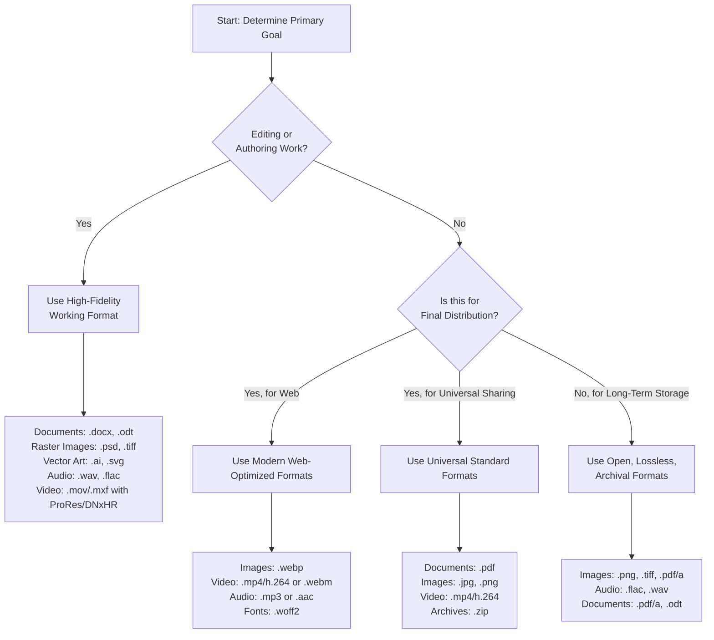

    

<h3 align="center">WELCOME TO</h3>
<h1 align="center">BLACXQUAD FREEMIUM REPOSITORY!</h1>
<h3 align="center">A HUB FOR FREE TECH LEARNING & RESOURCES.</h3>

  

    

    

  

    
 

> [!IMPORTANT]

This work is licensed under the **Creative Commons Attribution-ShareAlike 4.0 International License** (CC BY-SA 4.0).

When using, redistributing, adapting, or building upon this material, you **must** provide proper attribution by:

- 1. **Clearly stating the original source** as the **BLACXQUAD GitHub repository**.
- 2. **Including the exact URL(s)** to the relevant repository or file(s).

**Example Attribution Format:**  
- This work is based on content from the BLACXQUAD GitHub repository, available at:  
- https://github.com/blacxquad/freemium

Under the CC BY-SA license, you **must also**:
- Indicate if changes were made.
- License any adapted material under **identical terms** (CC BY-SA 4.0).

Failure to provide accurate source attribution violates the license terms.

    

<h1 align="center">The Definitive Guide to Digital File Formats: Structure, Function, and Selection.</h1>

  
 
## Executive Summary

In the digital world, every document, image, song, and video relies on a specific file format—a set of rules that dictates how information is encoded, stored, and read by software. Choosing the correct format is a foundational engineering decision, balancing critical factors like quality, file size, editability, and compatibility. This guide provides a comprehensive, clear, and practical analysis of modern digital file formats. It serves as an essential reference for developers, IT professionals, content creators, and anyone seeking to make informed decisions about their digital assets.

 

## 1. Foundational Concepts: Understanding the Core Principles

Before exploring specific formats, one must understand the key technical concepts that define them.

### 1.1 Core Technical Distinctions

*   **Raster vs. Vector Graphics**
    *   **Raster (or Bitmap) images** are composed of a fixed grid of tiny colored squares called pixels. Think of them as a digital photograph. Formats like JPEG and PNG are raster. Their primary limitation is resolution dependence; enlarging a raster image stretches the existing pixels, resulting in a blurry or blocky appearance known as pixelation. The quality is intrinsically tied to its pixel dimensions.
    *   **Vector graphics** are defined by mathematical equations—lines, curves, points, and shapes. Formats like SVG and AI are vector-based. This mathematical foundation makes them resolution-independent; they can be scaled to any size, from a postage stamp to a billboard, without any loss of clarity or sharpness. This makes vectors ideal for logos, illustrations, and typography where precise scalability is required.

*   **Lossless vs. Lossy Compression**
    *   **Lossless compression** algorithms reduce file size by finding efficient ways to represent data without discarding any original information. It is like perfectly folding a map to fit in a smaller pouch; it can be unfolded to its original state. Formats like PNG, FLAC, and ZIP use lossless compression, ensuring perfect data reconstruction, which is critical for archival, technical drawings, or multi-step editing.
    *   **Lossy compression** achieves significantly smaller file sizes by permanently removing data deemed less important to human perception. For images, this might be subtle color variations; for audio, it could be frequencies outside typical hearing ranges. Formats like JPEG and MP3 use lossy compression. This process is irreversible, and repeated saving can lead to cumulative quality degradation, known as generational loss.

*   **Codecs vs. Containers (For Audio/Video)**
    *   A **Codec** (Coder/Decoder) is the algorithm responsible for the actual compression and decompression of raw audio or video data. It is the "engine" that makes files smaller. Examples include H.264 for video, AAC for audio, and FLAC for lossless audio.
    *   A **Container** is the "wrapper" or "file envelope" that bundles together the compressed video stream, audio stream(s), subtitles, and metadata (like title and chapter information) into a single file you interact with. Common containers are MP4, MKV, and MOV. A single container type (e.g., MP4) can often house media compressed with different codecs.

### 1.2 Key Quality Parameters

Different media types are measured by specific technical parameters that directly impact fidelity and file size.

*   **Image Quality:** Defined by **Color Space** (RGB for screens, CMYK for print), **Bit Depth** (the number of colors possible, e.g., 8-bit = 16.7 million colors), **Alpha Channel** (transparency data), and **Resolution** (pixel density, often measured in PPI - Pixels Per Inch).
*   **Audio Quality:** Determined by **Sample Rate** (how many audio "snapshots" are taken per second, measured in kHz), **Bit Depth** (dynamic range and noise floor), and **Bitrate** (the amount of data processed per second, measured in kbps). Higher values generally mean higher quality but larger files.
*   **Video Quality:** Encompasses all audio parameters for its soundtracks, plus **Resolution** (pixel dimensions like 1920x1080), **Frame Rate** (frames displayed per second, or fps), and **Video Bitrate**. High-resolution video at a high bitrate delivers the best quality but demands substantial storage and bandwidth.

 

## 2. Comprehensive File Format Catalog

A detailed breakdown of formats by category, including their structure and optimal use cases.

### 2.1 Document & Text Formats

These formats store textual information, ranging from plain, unformatted text to complex documents with rich styling and embedded elements.

| Extension | Full Name | Description & Key Characteristics |
| :--- | :--- | :--- |
| **.txt** | Plain Text | Contains raw, unformatted character data. Universal compatibility and minimal file size. The standard for source code, system logs, and configuration files. |
| **.pdf** | Portable Document Format | Preserves fonts, images, and layout exactly as intended, across any device or operating system. A non-editable, final-form format ideal for distribution, forms, and professional printing. |
| **.docx** | Microsoft Word Document | The modern, XML-based standard for word processing. Offers rich formatting, embedded objects, and strong error recovery while maintaining manageable file sizes. The current default for editable documents. |
| **.odt** | OpenDocument Text | An open, XML-based alternative to DOCX. Developed as a vendor-neutral standard to ensure long-term accessibility and interoperability, used by LibreOffice and OpenOffice. |
| **.md** | Markdown | A lightweight plain-text syntax that uses simple symbols (like `#` for headings) to indicate formatting. Easily converted to HTML and ubiquitous for software documentation (README files) and web content. |
| **.epub** | Electronic Publication | The open standard for reflowable e-books. Allows text to dynamically adapt to different screen sizes and reader preferences, making it the universal choice for digital publishing. |
| **.tex** | LaTeX Source | A powerful typesetting system and file format for producing high-quality technical, scientific, and mathematical documents with precise control over layout and references. |

### 2.2 Image Formats

| Extension | Type | Compression | Key Characteristics & Best Use |
| :--- | :--- | :--- | :--- |
| **.jpg/.jpeg** | Raster | Lossy | The dominant format for photographs and web images. Excellently balances visual quality with small file size through adjustable compression. Avoid for images requiring multiple edit-save cycles or transparency. |
| **.png** | Raster | Lossless | Supports full alpha-channel transparency (soft edges) and is lossless, making it perfect for logos, web graphics, and images that will undergo multiple editing sessions. File sizes are larger than equivalent JPEGs. |
| **.webp** | Raster | Lossy & Lossless | A modern format developed by Google that provides superior compression efficiency compared to both JPEG and PNG. Supports animation and transparency. The optimal choice for web performance. |
| **.svg** | Vector | N/A | An XML-based vector format that is infinitely scalable without quality loss. Can be styled with CSS and animated with JavaScript, making it essential for responsive web design, icons, and modern user interfaces. |
| **.gif** | Raster | Lossless (LZW) | Supports simple animations and a single-color (binary) transparency. Limited to a 256-color palette, making it suitable only for basic graphics, icons, and short, low-color animations. |
| **.tiff/.tif** | Raster | Lossless (typically) | A flexible, high-quality container used in professional photography, publishing, and scanning. Supports layers, multi-page documents, and CMYK color. Results in very large file sizes. |
| **.raw** | Raster | Minimal/None | A family of proprietary formats (e.g., .NEF, .CR2) containing unprocessed sensor data from a digital camera. Offers maximum quality and editing latitude but requires specialized software for processing and conversion. |

### 2.3 Audio Formats

| Extension | Compression | Key Characteristics & Best Use |
| :--- | :--- | :--- |
| **.mp3** | Lossy | The ubiquitous audio format. Uses perceptual coding to remove sounds less audible to humans, achieving small file sizes. Quality is directly tied to bitrate (128 kbps is standard, 320 kbps is high quality). Ideal for music distribution and streaming. |
| **.aac** | Lossy | Technically more advanced than MP3, delivering better sound quality at similar or lower bitrates. The default or preferred format for iTunes, YouTube, iOS, Android, and most modern streaming services. |
| **.flac** | Lossless | Compresses audio without any loss in quality, typically reducing file size by 30-50% compared to an uncompressed original. The preferred choice for audiophile music collections, archival, and high-fidelity playback. |
| **.wav** | Uncompressed (Lossless) | A container format for storing raw, typically uncompressed Pulse-Code Modulation (PCM) audio data. Provides perfect CD-quality sound but results in very large files (~10 MB per minute). Standard in professional audio editing and recording. |
| **.alac** | Lossless | Apple Lossless Audio Codec. Functionally equivalent to FLAC but designed for seamless integration within the Apple ecosystem (iTunes, iOS). Typically stored in an `.m4a` container. |
| **.ogg** | Container (Often Lossy) | An open container format most commonly used with the **Vorbis** audio codec. Vorbis offers quality superior to MP3 at equivalent bitrates and is royalty-free. Common in gaming and open-source software. |

### 2.4 Video Formats

*Video files are defined by their **Container** (the wrapper) and the **Codecs** used inside for video and audio compression.*

| Extension | Primary Container | Common Codecs (Video / Audio) | Key Characteristics |
| :--- | :--- | :--- | :--- |
| **.mp4** | MPEG-4 Part 14 | H.264 (AVC), H.265 (HEVC) / AAC | The universal standard for video. Offers an excellent balance of high quality, efficient compression, and near-universal compatibility. The default for web streaming, social media, and mobile devices. |
| **.mkv** | Matroska | Virtually any (H.264, AV1, VP9 / AAC, Opus, FLAC) | An extremely flexible, open-source container. Can hold an unlimited number of video, audio, and subtitle tracks in almost any codec. The preferred format for storing high-quality movie releases and archival. |
| **.webm** | Web Media | VP9, AV1 / Opus, Vorbis | An open, royalty-free format designed specifically for the modern web. Provides efficient compression and is natively supported by HTML5 video. The standard for YouTube and other web-first platforms. |
| **.mov** | QuickTime File Format | ProRes, H.264, HEVC / AAC, PCM | Apple's proprietary container, deeply integrated into the macOS and iOS ecosystems. Often uses high-quality intermediate codecs like ProRes, making it a standard in professional video editing workflows. |
| **.avi** | Audio Video Interleave | Older codecs (DivX, XviD) / MP3 | A legacy Microsoft container from the early days of digital video. Lacks support for modern compression standards and features, leading to inefficiently large files. Largely obsolete. |

### 2.5 Archive & Compression Formats

| Extension | Description & Characteristics |
| :--- | :--- |
| **.zip** | The universal standard for lossless data compression and archiving. Uses the DEFLATE algorithm. It is natively supported by virtually every operating system, making it the default choice for bundling files for distribution. |
| **.7z** | An open-source format that uses the advanced LZMA/LZMA2 compression algorithms, often achieving the highest compression ratios among common formats. Supports strong AES-256 encryption and large file sizes. |
| **.tar.gz / .tgz** | The standard archive method on Unix/Linux systems. The `.tar` (Tape Archive) command first bundles files into a single container without compression. The `.gz` (Gzip) compression is then applied. This two-step process is highly efficient for collections of files. |
| **.rar** | A proprietary format that often achieves slightly better compression than ZIP and supports advanced features like error recovery, archive splitting into multi-part volumes, and stronger encryption. |
| **.iso** | A complete sector-by-sector image of an optical disc (CD, DVD, Blu-ray). It contains the entire filesystem and is used primarily for distributing operating systems (like Linux ISOs) and large software packages. |

### 2.6 Data & Development Files

| Category | Extension | Purpose & Description |
| :--- | :--- | :--- |
| **Web Development** | **.html/.htm** | Defines the structure and semantic content of a web page using markup tags. |
| | **.css** | Controls the visual presentation, layout, and styling of HTML documents. |
| | **.js** | Implements client-side logic, interactivity, and dynamic behavior within a web browser. |
| **Data Interchange** | **.json** | A lightweight, text-based format using human-readable name/value pairs. The universal standard for data exchange between web servers and applications (APIs). |
| | **.xml** | A flexible markup language for structuring and transporting data. More verbose than JSON but highly structured, used in document formats (e.g., DOCX) and enterprise systems. |
| | **.csv** | Stores tabular data (numbers and text) as plain text, with values separated by commas. The simplest way to exchange data between spreadsheets and databases. |
| **Configuration** | **.yml/.yaml** | A human-friendly data serialization language focused on readability. Commonly used for configuration files in modern software (Docker, Kubernetes, Ansible). |
| | **.sqlite/.db** | A lightweight, serverless, self-contained SQL database engine stored in a single cross-platform file. Widely used in applications for local data storage. |

### 2.7 Specialized & System Formats

| Extension | Domain | Description |
| :--- | :--- | :--- |
| **.psd** | Graphics | Adobe Photoshop's native layered image file, preserving all editing capabilities for raster graphics. |
| **.ai** | Graphics | Adobe Illustrator's native vector graphics format, retaining full editability of paths, shapes, and text. |
| **.exe** | Windows Executable | The standard file format for executable programs and software installers on the Microsoft Windows platform. |
| **.dmg** | macOS Disk Image | A container used for software distribution in macOS. Acts as a mountable virtual drive from which applications are installed. |
| **.ttf/.otf** | Typography | TrueType and OpenType font files. Scalable outline font formats. `.otf` offers more advanced typographic features like ligatures and alternate characters. |
| **.stl** | 3D Printing | Represents the surface geometry of a 3D object using a mesh of triangles. The de facto standard file format for 3D printing and computer-aided manufacturing. |

 

## 3. How to Choose: A Strategic Selection Framework

Selecting the correct format is a strategic decision with practical implications for storage, performance, and usability.

### 3.1 The Format Selection Logic

The following flowchart provides a logical, step-by-step decision-making process:

### 3.2 Core Selection Principles

*   **Understand the Trade-off Triangle:** You are constantly balancing **Quality**, **File Size**, and **Compatibility**. You can rarely maximize all three. High-quality, lossless files are large. Highly compatible files (like JPEG) use lossy compression. Your task is to find the optimal point on this triangle for your specific need.
*   **Prioritize Your Workflow Phase:**
    *   **Capture & Authoring:** Always start with the highest quality, most editable format available (e.g., RAW for photos, WAV/FLAC for audio, layered PSD/AI for graphics). This preserves maximum data for the editing process.
    *   **Editing & Production:** Use professional intermediate formats that maintain quality through multiple processing steps (e.g., TIFF for images, ProRes for video).
    *   **Final Output & Distribution:** Convert to a format optimized for your delivery channel—JPEG for web photos, MP4 for social video, PDF for printable documents.
*   **Consider Long-Term Accessibility:** For archival purposes, prefer open, well-documented, lossless standards over proprietary ones. A format like PNG or PDF/A is more likely to be readable in 20 years than a proprietary editor's native format.

 

## 4. Conclusion

Digital file formats are the fundamental building blocks of our information age. Their structure dictates efficiency, their function enables creativity, and their selection impacts everything from user experience to long-term data preservation. Mastery of these formats is not about memorizing extensions, but about understanding the underlying engineering principles—compression, encoding, and containerization—that empower you to make intelligent choices.

By applying the framework and knowledge in this guide, you can ensure your digital assets are stored efficiently, delivered effectively, and remain accessible for the future. Choose deliberately, for the right format is the most critical tool for any digital task.
 
 
 
    

<h2 align="center">STAY TUNED FOR THE LATEST UPDATES!</h2>

  

    

