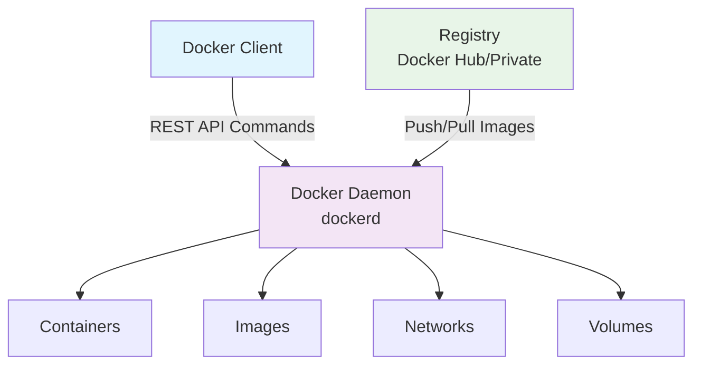
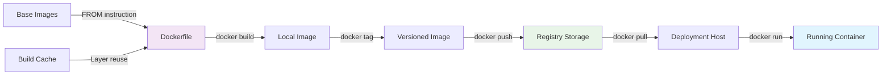
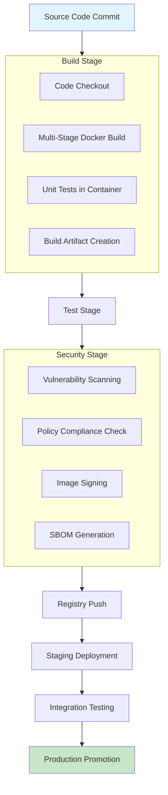

<br><br><br><br>

<h3 align="center">WELCOME TO</h3>
<h1 align="center">BLACXQUAD FREEMIUM REPOSITORY!</h1>
<h3 align="center">A HUB FOR FREE TECH LEARNING & RESOURCES.</h3>

<br><br>

<p align="center">
    <a href="https://github.com/blacxquad">
        
    </a>
</p>

<br><br><br><br>

<p align="center">
  <a href="https://creativecommons.org/licenses/by-sa/4.0/">
    
  </a>
</p>

<br><br><br><br>
 

> [!IMPORTANT]

This work is licensed under the **Creative Commons Attribution-ShareAlike 4.0 International License** (CC BY-SA 4.0).

When using, redistributing, adapting, or building upon this material, you **must** provide proper attribution by:

- 1. **Clearly stating the original source** as the **BLACXQUAD GitHub repository**.
- 2. **Including the exact URL(s)** to the relevant repository or file(s).

**Example Attribution Format:**  
- This work is based on content from the BLACXQUAD GitHub repository, available at:  
- https://github.com/blacxquad/freemium

Under the CC BY-SA license, you **must also**:
- Indicate if changes were made.
- License any adapted material under **identical terms** (CC BY-SA 4.0).

Failure to provide accurate source attribution violates the license terms.

<br><br><br><br>

<h1 align="center">Comprehensive Guide to Docker Containerization: From Development to Deployment.</h1>

<br><br>


## Introduction

### The Challenge of Environment Inconsistency
- Traditional software development frequently encounters the "it works on my machine" problem, where applications behave differently across various environments due to inconsistencies in operating systems, libraries, dependencies, and configurations. This discrepancy between development, testing, and production environments leads to deployment failures, extended troubleshooting cycles, and reduced team productivity. Containerization addresses this fundamental challenge by packaging applications with their complete runtime environment into standardized units that behave consistently regardless of the underlying infrastructure. By encapsulating everything an application needs to run, containers eliminate environment-specific variables that cause unpredictable behavior. This approach transforms how software is developed, shipped, and deployed across diverse computing environments.

### Understanding Containerization Technology
- Containerization is a lightweight form of virtualization that packages applications along with their dependencies, libraries, configuration files, and runtime into self-contained, executable units called containers. Unlike traditional virtualization that emulates entire hardware systems, containers operate at the operating system level, sharing the host system's kernel while maintaining process isolation through Linux namespaces and control groups (cgroups). This architecture provides the benefits of virtualization—isolation, portability, and consistency—without the overhead of running multiple complete operating systems. Each container runs as an isolated process on the host machine, with its own filesystem, networking, and process space, creating a predictable environment that can be easily moved between systems.

### Docker's Revolutionary Impact
- Docker, initially released in 2013, transformed container technology from a specialized Linux feature into a mainstream development platform by providing intuitive tooling, a robust ecosystem, and standardized workflows. While container concepts existed previously through technologies like LXC (Linux Containers), Docker simplified the process with developer-friendly commands, a centralized image registry (Docker Hub), and comprehensive documentation that lowered the barrier to adoption. The platform's rapid growth catalyzed the microservices architectural pattern, accelerated DevOps adoption, and became foundational to cloud-native application development. Today, Docker serves as the de facto industry standard for containerization, supported by all major cloud providers and integrated into modern software delivery pipelines across organizations of every size.

<br>

## Docker Architecture and Core Components

### Docker Engine: The Foundation


- The Docker Engine serves as the core runtime system that creates and manages containers on a host machine, operating as a client-server application with three interconnected components. The Docker Daemon (dockerd) runs as a persistent background process that manages Docker objects including containers, images, networks, and volumes, listening for API requests and executing container operations. The REST API exposes endpoints that allow programs to interact with the daemon, enabling automation and integration with other tools. The Docker Client provides the command-line interface that developers use to issue commands, which are converted into API calls to the daemon. This architecture supports both local development environments and remote management of production infrastructure through secure API connections.

### Essential Docker Objects
- Docker utilizes several fundamental objects that work together to create portable, scalable application environments. Images are read-only templates containing application code, dependencies, and configuration instructions, built using layered filesystems that enable efficient storage and distribution. Containers are runnable instances of images that provide isolated execution environments with writable layers for runtime changes while preserving the underlying image immutability. Networks enable communication between containers and external systems through configurable drivers that support various connectivity patterns. Volumes provide persistent data storage mechanisms that exist independently of container lifecycles, ensuring data preservation across container restarts and updates. These objects can be managed programmatically through Docker's API, enabling infrastructure automation.

### Registry Ecosystem and Image Distribution
- Docker registries serve as centralized repositories for storing and distributing Docker images, with Docker Hub functioning as the default public registry containing millions of official and community-maintained images. Organizations implement private registries (Azure Container Registry, Amazon ECR, Google Container Registry, or self-hosted solutions) to maintain control over proprietary images, enhance security, and reduce external dependencies. Registries support image versioning through tags (like "v1.2.3" or "latest") and digests (cryptographic hashes), enabling precise deployment of specific application versions. The layered architecture of Docker images allows registries to store and transfer only unique layers, optimizing bandwidth utilization and storage efficiency across development teams and deployment environments.

<br>

## Docker vs. Virtual Machines: Key Differences

### Architectural Comparison

| **Aspect** | **Docker Containers** | **Virtual Machines** |
|------------|----------------------|---------------------|
| **Virtualization Approach** | Operating system level | Hardware level |
| **Isolation Method** | Process-level (namespaces/cgroups) | Complete OS separation |
| **Startup Time** | Milliseconds to seconds | Seconds to minutes |
| **Performance Overhead** | Minimal (1-2%) | Significant (5-15%) |
| **Resource Consumption** | Lightweight (megabytes) | Heavy (gigabytes) |
| **Portability** | High (consistent environment) | Moderate (hardware dependencies) |
| **Security Model** | Process isolation with shared kernel | Strong (full OS separation) |
| **Image Size** | Typically tens to hundreds of MB | Typically multiple GB |
| **Scalability** | Rapid horizontal scaling | Slower provisioning |
| **Use Case** | Microservices, cloud-native apps | Legacy apps, full OS needs |

### Appropriate Use Cases
- Virtual Machines excel in scenarios requiring complete operating system isolation, running multiple different operating systems on the same hardware, supporting legacy applications with specific OS dependencies, and environments where strong security boundaries between workloads are mandatory. They remain ideal for monolithic applications, compliance requirements demanding full separation, and situations where kernel customization or specific OS features are necessary. Docker containers thrive in microservices architectures, continuous integration and delivery pipelines, cloud-native applications, and development environments where rapid iteration, efficient resource utilization, and consistent deployment are prioritized. Many organizations implement hybrid approaches, running containers within virtual machines to balance the isolation benefits of VMs with the efficiency advantages of containers.

### Resource Efficiency Analysis
- Docker containers demonstrate superior resource efficiency by sharing the host operating system kernel and eliminating redundant OS instances, significantly reducing memory footprint and accelerating startup times from minutes to seconds. This architecture minimizes storage requirements through layered images and copy-on-write mechanisms, where multiple containers can share common base layers while maintaining isolated writable layers for runtime changes. Performance overhead is typically 1-2% compared to native execution, whereas virtual machines incur 5-15% overhead due to hardware emulation and multiple simultaneous kernel instances. However, containers' shared kernel approach introduces potential security considerations and compatibility constraints when applications require specific kernel versions or modifications not available on the host system.

<br>

## Core Docker Concepts and Building Blocks

### Dockerfile: Infrastructure as Code Blueprint
- Dockerfiles serve as declarative blueprints for building Docker images, implementing infrastructure-as-code principles that enable version-controlled, reproducible environment definitions. These plain text files contain sequential instructions that Docker executes to assemble an image, with each instruction creating a new layer in the filesystem. Key instructions include FROM (specifies the base image), RUN (executes commands during build), COPY/ADD (adds files from build context), ENV (sets environment variables), EXPOSE (documents network ports), and CMD/ENTRYPOINT (defines container execution commands). Dockerfiles eliminate manual configuration drift by encoding all environment dependencies, ensuring consistent deployments from development through production. Advanced patterns like multi-stage builds allow separation of build-time dependencies from runtime requirements, producing minimal final images.

### Images: Immutable Application Packages
- Docker images represent immutable, read-only templates containing application code, dependencies, libraries, and configuration files required to run an application, utilizing a union filesystem that stacks multiple read-only layers. Each layer represents filesystem changes from specific Dockerfile instructions, with the layered approach enabling efficient storage, distribution, and caching—identical layers are shared across images, reducing storage requirements and download times. Images are identified by both cryptographic content hashes (SHA256 digests ensuring integrity) and human-readable tags (version labels like "app:v1.2.3"), providing both security verification and semantic versioning. Image immutability ensures that once built, the application package remains unchanged throughout its lifecycle, enabling reliable rollbacks and predictable deployments.

### Containers: Isolated Application Instances
- Containers constitute runnable instances created from Docker images, providing isolated, writable environments for application execution through kernel-level isolation mechanisms. When a container launches, Docker adds a thin writable layer (container layer) atop the underlying image layers, employing copy-on-write semantics that preserve image immutability while allowing runtime modifications. This architecture enables multiple containers to share the same base image while maintaining independent runtime states, optimizing resource utilization. Containers leverage Linux namespaces for isolation (PID, network, mount, IPC, UTS, and user namespaces) and control groups (cgroups) for resource limitation (CPU, memory, disk I/O, network bandwidth), ensuring predictable performance and security boundaries between co-located applications.

<br>

## Docker Installation and Configuration

### Platform-Specific Installation Procedures

**Linux Installation Commands:**
```bash
# Ubuntu/Debian distributions
sudo apt-get update
sudo apt-get install -y docker-ce docker-ce-cli containerd.io docker-buildx-plugin
sudo systemctl start docker
sudo systemctl enable docker

# RHEL/CentOS/Rocky Linux distributions
sudo yum install -y yum-utils
sudo yum-config-manager --add-repo https://download.docker.com/linux/centos/docker-ce.repo
sudo yum install -y docker-ce docker-ce-cli containerd.io
sudo systemctl start docker
sudo systemctl enable docker

# Verification for all distributions
sudo docker run hello-world
```

- Docker Engine installation varies by operating system, with Linux distributions using native package managers while Windows and macOS utilize Docker Desktop. Linux installations involve adding Docker's official repository, installing the docker-ce package, and starting the systemd service, with specific instructions differing between distributions like Ubuntu/Debian (apt-based) and RHEL/CentOS (yum-based). Docker Desktop for Windows and macOS provides an integrated solution bundling Docker Engine, Docker CLI, Docker Compose, Kubernetes, and a graphical interface, utilizing lightweight virtual machines (Hyper-V on Windows, HyperKit on macOS) to run Linux containers on non-Linux systems. All installations should conclude with verification using `docker run hello-world` to confirm proper functionality before proceeding to production configuration.

### Post-Installation Security Configuration
- After successful installation, configure Docker for production readiness by creating a dedicated docker user group to enable non-root access (`sudo usermod -aG docker $USER`), adjusting daemon configuration (`/etc/docker/daemon.json`) for logging drivers, storage drivers, and network settings, and implementing resource limits to prevent container resource exhaustion. Security hardening includes configuring TLS certificates for remote API access, enabling user namespace remapping for additional isolation, setting up audit logging for compliance requirements, and disabling legacy registry protocols. Regular updates of Docker Engine and base images should be incorporated into maintenance procedures, with automated vulnerability scanning integrated into the update process to identify security patches.

### Environment Validation and Testing
- Validate Docker installation by executing `docker version` to verify client and server component compatibility, `docker info` to examine system configuration and resource utilization, and `docker run hello-world` to test basic container execution capabilities. For comprehensive validation, deploy a sample multi-container application using Docker Compose to verify networking functionality, volume mounting behavior, and inter-container communication. Performance testing should confirm that container startup times meet expectations (typically under 5 seconds for most applications) and that resource isolation functions correctly under load conditions. Network connectivity tests should validate both inbound and outbound communication, while storage tests should confirm volume persistence across container restarts.

<br>

## Working with Docker Images

### Image Lifecycle Management Process



- Docker image management follows a systematic lifecycle from creation through distribution to eventual deprecation, beginning with Dockerfile authoring that defines build instructions in a version-controlled file. The build process (`docker build`) executes these instructions sequentially, creating layered images where each instruction generates a new filesystem layer that can be cached for subsequent builds. Tagging (`docker tag`) applies human-readable identifiers to images for version tracking before pushing (`docker push`) to registries for centralized storage and distribution. Deployment hosts pull (`docker pull`) images from registries, verifying cryptographic hashes to ensure integrity before creating containers (`docker run`). Regular maintenance includes vulnerability scanning, base image updates, and archival of deprecated versions for emergency rollback capabilities.

### Building Optimized Docker Images
- Optimize Docker image construction by implementing multi-stage builds that separate build-time dependencies from runtime requirements, significantly reducing final image size and attack surface. Leverage `.dockerignore` files to exclude unnecessary files (development artifacts, version control directories, temporary files) from the build context, accelerating build processes and minimizing security exposure. Order Dockerfile instructions strategically by placing frequently changing instructions (like `COPY` for source code) after stable dependencies (like `RUN` for package installation) to maximize layer caching benefits. Select minimal base images (Alpine Linux, distroless images) that provide essential functionality without unnecessary packages, reducing both image size and potential vulnerability points. Combine related commands into single `RUN` instructions with proper cleanup to minimize layer count while maintaining readability.

### Security Scanning and Vulnerability Management
- Integrate security scanning into the image build pipeline using Docker Scout, Trivy, Clair, or similar tools to identify vulnerabilities in base images and application dependencies before deployment. Scanning tools analyze image layers against comprehensive vulnerability databases (NVD, vendor advisories), categorizing issues by severity (CRITICAL, HIGH, MEDIUM, LOW) and providing remediation guidance including available patches. Implement automated scanning policies that block deployment of images with critical vulnerabilities while allowing exceptions with documented business justification and risk acceptance. Regularly update base images and dependencies to incorporate security patches, and maintain a software bill of materials (SBOM) for audit compliance, license management, and vulnerability impact assessment across the application portfolio.

<br>

## Container Management and Operations

### Container Lifecycle Operations

| **Operation** | **Command** | **Description** | **Common Flags** |
|--------------|-------------|-----------------|------------------|
| **Create** | `docker create` | Creates container without starting | `--name`, `-e`, `-v` |
| **Start** | `docker start` | Starts existing container | `-a` (attach) |
| **Run** | `docker run` | Creates and starts container | `-d` (detached), `-p`, `-it` |
| **Stop** | `docker stop` | Graceful shutdown (SIGTERM) | `-t` (timeout) |
| **Kill** | `docker kill` | Forceful termination (SIGKILL) | `-s` (signal) |
| **Pause** | `docker pause` | Suspends container processes | None |
| **Unpause** | `docker unpause` | Resumes suspended container | None |
| **Restart** | `docker restart` | Stops then starts container | `-t` (timeout) |
| **Remove** | `docker rm` | Deletes stopped container | `-f` (force), `-v` (volumes) |
| **Inspect** | `docker inspect` | Detailed container information | `--format` |

- Container lifecycle management encompasses creation, execution, monitoring, and termination of container instances using Docker's comprehensive command suite. The `docker run` command combines creation and startup, accepting numerous flags for resource limits (`--memory`, `--cpus`), network configuration (`--network`, `-p`), volume mounting (`-v`, `--mount`), environment variables (`-e`), and execution mode (`-d` for detached, `-it` for interactive). Graceful shutdown via `docker stop` sends SIGTERM allowing applications to complete transactions and clean up resources, with SIGKILL following after a timeout period if necessary. Container removal (`docker rm`) eliminates stopped containers, with the `-v` flag removing associated anonymous volumes to prevent storage leakage, while `docker prune` commands clean up unused system resources.

### Resource Management and Limits Configuration
- Docker provides granular control over container resource allocation through cgroups, preventing noisy neighbor issues and ensuring predictable application performance in shared environments. CPU limits can be specified as shares (relative weighting with `--cpu-shares`), periods and quotas (absolute limits with `--cpu-period` and `--cpu-quota`), or CPU set restrictions (specific cores with `--cpuset-cpus`). Memory limits enforce hard boundaries (`--memory`) with optional swap allocations (`--memory-swap`), while memory reservation (`--memory-reservation`) guarantees minimum availability. I/O throttling restricts disk (`--device-read-bps`, `--device-write-bps`) and network bandwidth usage. These limits should be configured based on application profiling during development, with monitoring in production to adjust allocations as workload patterns evolve.

### Monitoring, Logging, and Debugging Techniques
- Effective container monitoring employs multiple complementary approaches: `docker stats` provides real-time resource utilization metrics for running containers, `docker logs` retrieves stdout/stderr output with timestamp and stream following options, `docker events` streams system events for audit trails and automation triggers, and `docker top` displays running processes within containers. For production environments, integrate with centralized logging solutions (ELK stack, Loki, Fluentd) that aggregate logs across containers and hosts with structured metadata. Monitoring systems (Prometheus, Datadog, New Relic) should collect container metrics, application performance data, and business indicators. Debugging techniques include interactive shell access (`docker exec -it container sh`), container inspection (`docker inspect`), filesystem exploration (`docker diff`), and network troubleshooting (`docker network inspect`, `nsenter`).

<br>

## Docker Networking and Storage Systems

### Network Models and Configuration Options

**Docker Network Drivers Comparison:**
- **Bridge**: Default driver providing NAT isolation, suitable for single-host container communication with internal DNS
- **Host**: Removes network isolation, containers share host's network namespace directly for maximum performance
- **Overlay**: Enables multi-host networking for Swarm clusters, using VXLAN encapsulation for secure cross-host communication
- **Macvlan**: Assigns MAC addresses to containers, making them appear as physical devices on the network with direct connectivity
- **IPvlan**: Similar to Macvlan but shares MAC address, providing alternative network segmentation approaches
- **None**: Disables all networking, useful for specialized security requirements or custom network implementations

- Docker's networking subsystem provides flexible connectivity models for various deployment scenarios, with bridge networks offering simplicity and isolation for development environments through automatic NAT and port mapping. Overlay networks enable seamless communication across distributed container clusters using encrypted VXLAN tunnels, essential for Docker Swarm and some Kubernetes implementations. Network creation includes subnet specification, gateway configuration, internal/external accessibility options, and custom MTU settings. Docker's embedded DNS server facilitates service discovery within user-defined networks, automatically resolving container names to IP addresses and supporting custom network aliases. For production deployments, implement network policies to restrict inter-container communication according to the principle of least privilege, segmenting applications based on trust boundaries.

### Persistent Storage Strategies and Volume Management

**Volume Management Commands:**
```bash
# Create and manage persistent volumes
docker volume create app-data
docker volume ls
docker volume inspect app-data
docker volume rm app-data
docker volume prune  # Remove unused volumes

# Mount volumes in containers with different syntax options
docker run -v app-data:/var/lib/data app-image  # Legacy syntax
docker run --mount source=app-data,target=/var/lib/data,type=volume app-image  # Preferred syntax

# Bind mounts for host directory access
docker run -v /host/path:/container/path app-image
```

- Docker volumes provide persistent, shareable data storage that exists independently of container lifecycles, essential for stateful applications like databases, file stores, and message queues. Named volumes offer managed storage with configurable drivers (local, NFS, cloud storage plugins), while bind mounts directly map host directories into containers for development scenarios or specialized access needs. Volume drivers enable integration with enterprise storage systems (NetApp, Pure Storage) and cloud providers (AWS EBS, Azure Disk, Google Persistent Disk), supporting features like encryption, snapshots, and replication. Implement volume backup strategies that account for application consistency requirements, using container-native backup tools (Velero, Kasten) or storage platform capabilities with appropriate application quiescence procedures. For sensitive data, encrypt volumes at rest using storage layer encryption or container-level solutions, and manage access through appropriate permission models.

### Filesystem and Storage Driver Selection
- Docker supports multiple storage drivers (Overlay2, aufs, devicemapper, btrfs, zfs) that implement the union filesystem for layering images and managing container writable layers, with selection impacting performance, stability, and compatibility. Overlay2 serves as the recommended default for modern Linux kernels, providing excellent performance with efficient inode utilization and direct memory page sharing between containers. Storage driver choice depends on the underlying filesystem, kernel version, and workload characteristics, with devicemapper suitable for certain enterprise distributions but generally deprecated in favor of Overlay2. Monitor storage driver metrics for excessive inode consumption, layer proliferation, and performance degradation, implementing cleanup procedures (`docker system prune`) as part of routine maintenance. For production systems, dedicate separate storage volumes for Docker data (`/var/lib/docker`) to prevent host filesystem exhaustion and optimize I/O performance.

<br>

## Docker Compose for Multi-Container Applications

### Compose File Structure and Syntax

**Example docker-compose.yml for Web Application:**
```yaml
version: '3.8'
services:
  webapp:
    build: 
      context: ./app
      dockerfile: Dockerfile.prod
    ports:
      - "8080:80"
      - "8443:443"
    environment:
      - DATABASE_URL=postgres://db:5432/appdb
      - REDIS_URL=redis://cache:6379
      - NODE_ENV=production
    depends_on:
      - database
      - redis
    networks:
      - backend
      - frontend
    volumes:
      - app-logs:/var/log/app
    deploy:
      resources:
        limits:
          memory: 512M
          cpus: '0.50'
        reservations:
          memory: 256M
          cpus: '0.25'
  
  database:
    image: postgres:14-alpine
    environment:
      POSTGRES_DB: appdb
      POSTGRES_USER: appuser
      POSTGRES_PASSWORD_FILE: /run/secrets/db_password
    volumes:
      - postgres-data:/var/lib/postgresql/data
    networks:
      - backend
    secrets:
      - db_password
  
  redis:
    image: redis:7-alpine
    command: redis-server --appendonly yes
    volumes:
      - redis-data:/data
    networks:
      - backend

volumes:
  postgres-data:
  redis-data:
  app-logs:

networks:
  backend:
    driver: bridge
  frontend:
    driver: bridge

secrets:
  db_password:
    file: ./secrets/db_password.txt
```

- Docker Compose employs YAML files to define multi-service applications, specifying service configurations, networks, volumes, and dependencies in a declarative format that can be version-controlled and shared across teams. The syntax supports environment variable substitution (`${VARIABLE}`), extension fields (`x-*` definitions for reuse), and conditional deployment profiles (`profiles:`). Services define container specifications including build context, image sources, port mappings, environment variables, volume mounts, and resource constraints. Networks and volumes are declared at the root level and referenced by services, enabling shared infrastructure across containers with consistent configuration. Compose files support multiple file merging for environment-specific configurations (like `docker-compose.override.yml` for development settings), allowing separation of concerns between different deployment targets.

### Development Workflow Integration and Productivity
- Docker Compose significantly enhances development workflows by enabling single-command environment provisioning (`docker-compose up`), dependency management through service definitions, and consistent environment replication across team members regardless of their local machine configurations. Developers can define development-specific configurations (bind mounts for live code synchronization, debugging ports, development tooling) in override files that don't affect production builds, using profiles to activate different service sets for different activities. Integration with modern IDEs (Visual Studio Code Docker extension, IntelliJ IDEA) provides graphical management, debugging capabilities, and direct container interaction. For testing, Compose creates isolated environments that can be provisioned and destroyed on demand (`docker-compose up --abort-on-container-exit`), ensuring test consistency and simplifying continuous integration pipelines with predictable service dependencies.

### Production Deployment Considerations
- While Docker Compose excels in development and testing environments, production deployments typically require orchestration platforms (Kubernetes, Docker Swarm) for high availability, automated scaling, rolling updates, and advanced lifecycle management. However, Compose files can serve as foundation specifications for production definitions, with tools like Kompose facilitating conversion to Kubernetes manifests, or Docker Compose being used directly in limited production scenarios. Production Compose deployments should implement health checks (`healthcheck:`), logging configurations with log drivers and rotation, resource limits (`deploy:` section), and restart policies (`restart: unless-stopped`). For Docker Swarm deployments, Compose files can be used with `docker stack deploy`, supporting secrets management, config objects, and deployment constraints, though Kubernetes offers more robust solutions for complex distributed applications at enterprise scale.

<br>

## Docker Security Best Practices

### Defense in Depth Security Strategy

**Multi-Layer Security Implementation:**
- **Host Security**: Harden host OS with minimal installs, mandatory access controls (SELinux/AppArmor), regular kernel updates, and dedicated Docker users
- **Image Security**: Use trusted base images from official sources, implement vulnerability scanning in CI/CD, sign images with Docker Content Trust
- **Runtime Security**: Apply least privilege principles, drop unnecessary capabilities, use read-only filesystems, implement seccomp profiles
- **Network Security**: Segment networks by application tier, encrypt overlay network traffic, implement network policies, limit exposed ports
- **Orchestration Security**: Enable RBAC with minimal permissions, audit all API access, implement pod security policies, regular credential rotation
- **Registry Security**: Use private registries with access controls, scan images on push, implement vulnerability gateways, enable registry auditing

- Docker security follows a defense-in-depth approach, addressing risks at multiple layers from host infrastructure to application code, beginning with host hardening through minimal OS installations, implemented mandatory access controls (SELinux or AppArmor profiles), and regular patching of both the kernel and Docker Engine. Image security requires using minimal base images from trusted sources (Docker Official Images), scanning for vulnerabilities during build and before deployment, and signing images with Docker Content Trust to verify publisher authenticity and integrity. Runtime security involves restricting container capabilities (`--cap-drop=ALL --cap-add=NET_BIND_SERVICE`), running as non-root users, implementing read-only root filesystems (`--read-only`), and removing unnecessary privileges. Network segmentation through user-defined networks limits lateral movement potential, while encrypted overlay networks protect inter-node communication in clustered environments.

### Configuration Hardening and Security Controls
- Secure Docker daemon configuration by disabling legacy registry protocols (`--disable-legacy-registry`), enabling user namespace support for additional isolation (`--userns-remap`), configuring TLS with client certificate authentication for remote API access, and setting appropriate log levels with log rotation. Implement resource limits (`--memory`, `--cpu-shares`) to prevent denial-of-service attacks through resource exhaustion and configure live restore (`--live-restore`) to maintain containers during daemon restarts without losing state. Utilize Docker's security options: `--security-opt` for AppArmor/SELinux profiles, `--read-only` for immutable containers, `--tmpfs` for ephemeral temporary storage, and `--pids-limit` to prevent fork bombs. Regular security audits should verify compliance with CIS Docker Benchmark recommendations, with automated tools checking configuration against security baselines.

### Secrets Management and Access Control Implementation
- Docker provides native secrets management through Docker Swarm secrets (encrypted at rest and transmitted securely to containers) or Docker Compose secrets (development convenience), storing sensitive data like passwords, API keys, and certificates outside of images and configuration files. For Kubernetes environments, utilize Secrets resources with appropriate encryption at rest (KMS, cloud provider keys) and restrict access through RBAC policies. Implement role-based access control (Docker Enterprise RBAC or Kubernetes RBAC) granting minimal necessary permissions to users and service accounts, following the principle of least privilege across all Docker objects. Audit logging should capture all Docker API calls, image pulls, container lifecycle events, and network operations for security monitoring, anomaly detection, and compliance reporting, with centralized collection and analysis. Regularly rotate credentials, certificates, and secrets, automating the process where possible with tools like HashiCorp Vault or cloud KMS services.

<br>

## Docker in CI/CD Pipelines

### Pipeline Integration Patterns and Workflows

**CI/CD Pipeline with Docker Integration:**


- Docker integrates seamlessly into modern CI/CD pipelines, enabling consistent environment provisioning at each stage from development through production with immutable artifacts that progress through promotion gates. Build stages utilize Docker for reproducible builds through multi-stage Dockerfiles that separate development dependencies from runtime images, ensuring build consistency across different runner environments. Testing stages leverage Docker Compose to create isolated test environments with all dependent services (databases, caches, message queues), ensuring consistent test execution with clean state for each test run. Security scanning stages automatically analyze images for vulnerabilities, license compliance, and configuration issues before promotion, with policy enforcement blocking problematic images. Deployment stages use infrastructure-as-code approaches, with Docker images serving as immutable deployment artifacts that progress through environment promotion (development → staging → production) without modification.

### Build Optimization and Performance Strategies
- Optimize Docker builds within CI/CD pipelines by implementing layer caching strategies across pipeline runs, using BuildKit for parallel layer building and advanced cache export/import, and leveraging Docker Build Cloud or similar solutions for distributed build execution. Employ `--cache-from` directives to reuse layers from previous builds and public base images, significantly reducing build times for incremental changes while maintaining security through hash verification. Implement build arguments (`ARG`) for environment-specific configurations while maintaining image consistency, using multi-stage builds to keep build-time tools out of final images. Use `.dockerignore` files to minimize build context size, accelerating context transfer in remote build environments and avoiding accidental inclusion of sensitive files. For large monorepos, consider selective context building with Docker's Build Context BETA features or separate image builds for independent components to optimize pipeline execution time.

### Deployment Automation and Verification
- Automate Docker deployment through infrastructure-as-code tools (Terraform, Pulumi, CloudFormation) that provision host infrastructure, container orchestration platforms, and supporting services, with Docker images referenced as versioned artifacts in deployment manifests. Implement blue-green or canary deployment strategies using orchestration platform features (Kubernetes deployments with multiple ReplicaSets, service meshes with traffic splitting) to minimize downtime and deployment risk through gradual exposure. Automate rollback procedures that revert to previous known-good images when health checks fail, with automatic rollback triggers based on metrics thresholds or error rates. Monitoring integration should provide deployment verification through synthetic transactions, real-user monitoring, and business metrics correlation, with automated post-deployment validation tests. Post-deployment, automated cleanup should remove unused images, stopped containers, and orphaned volumes to conserve resources and maintain system hygiene.

<br>

## Orchestration with Kubernetes

### Kubernetes Architecture and Components

**Kubernetes Core Architecture Components:**
- **Control Plane**: API Server (kube-apiserver), Scheduler (kube-scheduler), Controller Manager (kube-controller-manager), etcd (distributed key-value store)
- **Worker Nodes**: Kubelet (node agent), Container Runtime (Docker, containerd, CRI-O), Kube-Proxy (network proxy)
- **Workload Resources**: Pods (smallest deployable units), Deployments (declarative updates), StatefulSets (stateful applications), DaemonSets (node-level agents)
- **Network Resources**: Services (stable network endpoints), Ingress (external access management), Network Policies (communication rules)
- **Storage Resources**: PersistentVolumes, PersistentVolumeClaims, StorageClasses
- **Configuration Resources**: ConfigMaps (configuration data), Secrets (sensitive data)

- Kubernetes extends Docker's container capabilities to distributed environments, providing automated deployment, scaling, and management of containerized applications across clusters of hosts. The architecture comprises a control plane that makes global decisions about the cluster and nodes that run container workloads, with all components communicating through the API server. Pods represent the smallest deployable units, encapsulating one or more containers with shared storage and network namespace, acting as the basic building blocks for applications. Controllers (Deployments, StatefulSets, DaemonSets, Jobs) manage pod lifecycles according to declarative specifications, continuously reconciling actual state with desired state. Services provide stable network endpoints and load balancing for dynamic pod collections, while Ingress manages external HTTP/S access to services with routing rules.

### Resource Definitions and Declarative Management
- Kubernetes uses YAML or JSON manifests to define resources declaratively, specifying desired state rather than issuing imperative commands, with the control plane continuously working to maintain the declared state. Key resource types include Pods for container execution, Services for networking with selectors matching pod labels, Deployments for stateless applications with rolling update capabilities, StatefulSets for stateful applications requiring stable network identifiers and persistent storage, ConfigMaps for non-sensitive configuration data, and Secrets for sensitive information with optional encryption. Resource requests (`requests`) and limits (`limits`) ensure appropriate scheduling decisions and prevent resource exhaustion through Quality of Service classes (Guaranteed, Burstable, BestEffort). Horizontal Pod Autoscaling automatically adjusts replica counts based on CPU/memory metrics or custom metrics, while Vertical Pod Autoscaling modifies resource requests based on usage patterns.

### Production Kubernetes Deployment Considerations
- Production Kubernetes deployments require careful planning around high availability, disaster recovery, security, and operational management, beginning with multi-node control planes using etcd clustering for fault tolerance and data consistency. Configure pod anti-affinity rules to distribute workloads across failure domains (nodes, racks, zones), implement pod disruption budgets to control voluntary disruptions during maintenance, and set appropriate quality of service classes for critical workloads. Establish comprehensive backup procedures for etcd data (using etcdctl or Velero), persistent volumes (storage-native snapshots or Velero), and cluster configuration (GitOps repository). Security measures include network policies for pod communication restrictions, pod security standards/admission controllers, RBAC with minimal privileges, regular vulnerability scanning of container images and node OS, and encrypted secrets at rest. Monitoring should aggregate metrics (Prometheus), logs (Loki, EFK stack), and traces (Jaeger, Tempo) across the cluster with alerting for abnormal conditions and capacity planning.

<br>

## Production Deployment Considerations

### Infrastructure Requirements and Planning

**Production Docker/Kubernetes Infrastructure Requirements:**
| **Component** | **Minimum Requirements** | **Recommended Specifications** | **Considerations** |
|--------------|-------------------------|--------------------------------|-------------------|
| **Host Hardware** | 4 CPU cores, 8GB RAM, 50GB storage | 8+ CPU cores, 16GB+ RAM, 100GB+ SSD | Redundant power, ECC memory |
| **Operating System** | Linux kernel 4.15+, supported distribution | Minimal OS (CoreOS, Flatcar, Ubuntu Server) | Security-hardened, regular updates |
| **Networking** | 1 Gbps network interface | 10 Gbps, multiple interfaces | Low latency, network segmentation |
| **Storage** | Local storage with backup | SAN/NAS with replication, SSD preferred | Performance, snapshots, encryption |
| **Monitoring** | Basic metrics collection | Comprehensive APM with tracing | Alerting, capacity planning |
| **Security** | Regular updates, basic firewall | IDS/IPS, audit logging, runtime protection | Compliance requirements |

- Production Docker deployments require robust infrastructure designed for availability, performance, and security, with host systems employing enterprise-grade hardware featuring redundant power supplies, ECC memory, and high-performance storage. Operating systems should be minimal, security-hardened distributions (RHEL CoreOS, Flatcar Container Linux, Ubuntu Server) with automatic security updates and mandatory access controls. Network architecture must support container communication patterns with sufficient bandwidth, low latency, and proper segmentation through VLANs or software-defined networking. Storage systems should provide high performance for stateful workloads with snapshot, replication, and backup capabilities, preferably using storage classes that integrate with container orchestration. Implement comprehensive monitoring that captures host metrics, container performance, application health indicators, and business transactions with appropriate retention for troubleshooting and capacity planning.

### High Availability and Disaster Recovery Implementation
- Achieve high availability through container replication across multiple hosts and availability zones, with orchestration platforms automatically rescheduling containers during host failures and maintaining desired replica counts. Implement precise health checks (readiness and liveness probes) that accurately reflect application readiness for traffic and detect hung processes, enabling automatic recovery from transient failures without manual intervention. Load balancing distributes traffic across container instances using service meshes (Istio, Linkerd) or cloud load balancers, with gradual rollout capabilities (canary deployments) for risk-managed updates. Disaster recovery plans should include regular backups of persistent volumes (storage-native or Velero), configuration state (GitOps repositories), and etcd data (for Kubernetes), with documented recovery procedures tested quarterly through disaster recovery drills. Geographic distribution across regions protects against site failures but introduces complexity for data consistency and latency, requiring careful application architecture decisions.

### Performance Optimization and Tuning
- Performance optimization begins with appropriate resource allocation based on application profiling during load testing, avoiding both overallocation (wasted resources) and underallocation (performance degradation), using Quality of Service classes to prioritize critical workloads. Storage performance tuning includes selecting appropriate storage drivers and classes, optimizing mount options (noatime, nodiratime), implementing read/write caching where beneficial, and aligning I/O patterns with storage capabilities. Network performance optimization involves choosing appropriate CNI plugins (Calico, Cilium, Weave), tuning kernel parameters (net.core.somaxconn, net.ipv4.ip_local_port_range), and implementing service meshes for advanced traffic management with circuit breaking and retry policies. Regular performance testing under realistic load profiles identifies bottlenecks before they impact production users, enabling proactive optimization of database connections, garbage collection settings, and thread pools based on observed behavior.

<br>

## Command Reference and Cheat Sheet

### Essential Docker Commands Reference

| **Category** | **Command** | **Description** | **Common Options** |
|-------------|-------------|-----------------|-------------------|
| **System Info** | `docker version` | Show Docker version info | `--format` for formatting |
| **System Info** | `docker info` | Display system-wide information | None |
| **System Cleanup** | `docker system prune` | Remove unused data | `-a` (all), `--volumes` |
| **Image Management** | `docker images` | List images | `-a` (all including intermediate) |
| **Image Management** | `docker build -t name:tag .` | Build image from Dockerfile | `-f` (Dockerfile path), `--no-cache` |
| **Image Management** | `docker rmi image` | Remove image | `-f` (force) |
| **Container Lifecycle** | `docker ps` | List running containers | `-a` (all including stopped) |
| **Container Lifecycle** | `docker run -d image` | Run container in background | `-p` (publish port), `-v` (volume) |
| **Container Lifecycle** | `docker exec -it container sh` | Execute command in container | `-u` (user), `-e` (environment) |
| **Container Lifecycle** | `docker logs container` | View container logs | `-f` (follow), `--tail N` |
| **Network Management** | `docker network ls` | List networks | None |
| **Network Management** | `docker network inspect network` | Detailed network info | `--format` for formatting |
| **Volume Management** | `docker volume ls` | List volumes | None |
| **Volume Management** | `docker volume create name` | Create volume | `--driver`, `--opt` |
| **Registry Operations** | `docker pull image:tag` | Pull image from registry | `--platform` (multi-arch) |
| **Registry Operations** | `docker push image:tag` | Push image to registry | None |

### Docker Compose Essential Commands

| **Command** | **Description** | **Common Options** |
|------------|-----------------|-------------------|
| `docker compose up` | Create and start services | `-d` (detached), `--build` |
| `docker compose down` | Stop and remove resources | `-v` (volumes), `--rmi` (images) |
| `docker compose ps` | List service containers | `-a` (all including stopped) |
| `docker compose logs` | View service output | `-f` (follow), `--tail N` |
| `docker compose exec service cmd` | Execute command in service | `-it` (interactive) |
| `docker compose build` | Build service images | `--no-cache`, `--pull` |
| `docker compose config` | Validate and view config | `--services`, `--volumes` |
| `docker compose pull` | Pull service images | `--ignore-pull-failures` |
| `docker compose restart` | Restart services | None |
| `docker compose top` | Display running processes | None |

### Advanced Operations and Troubleshooting
- For production troubleshooting: `docker stats` provides real-time container metrics (CPU, memory, network, block I/O), `docker events` streams system events (create, start, stop, die), and `docker diff` shows filesystem changes in a container. Resource management includes `docker update` to modify container constraints (CPU, memory) without restart, useful for dynamic adjustments. Swarm mode commands (`docker swarm init`, `docker node ls`, `docker service create`) manage clustered deployments with service replication and rolling updates. Docker Buildx enables advanced build features including multi-architecture images (ARM, x86), build secrets, and cache exporters. Context management (`docker context create`, `docker context use`) facilitates switching between local and remote Docker environments (development, staging, production). Experimental features should be evaluated in non-production environments before deployment, with careful consideration of stability and support implications.

### Best Practices Summary and Recommendations
- Adopt infrastructure-as-code principles for reproducible environments using version-controlled Dockerfiles, Compose files, and Kubernetes manifests. Implement security scanning throughout the container lifecycle (build, registry, runtime) with policy enforcement gates. Use minimal base images (Alpine, distroless) to reduce attack surface and update dependencies regularly. Configure appropriate resource limits and requests to ensure predictable performance and prevent resource exhaustion. Implement comprehensive logging (structured JSON) and monitoring (metrics, traces) with centralized aggregation. Design for stateless applications when possible, with external persistence for stateful requirements. Test failure scenarios (chaos engineering) to ensure resilience and validate recovery procedures. Document deployment processes, rollback procedures, and operational runbooks. Continuously evaluate new Docker features, security recommendations, and community best practices through regular architecture reviews.

<br>

## Conclusion and Future Directions

Docker containerization represents a fundamental paradigm shift in how applications are developed, shipped, and deployed, providing unprecedented consistency across environments from developer laptops to production clusters. By mastering Docker fundamentals—images, containers, Dockerfiles, networking, and storage—development and operations teams can build robust, portable applications that deliver business value faster with reduced environmental friction. Advanced topics including security hardening, orchestration with Kubernetes, and production deployment considerations ensure containerized applications meet enterprise requirements for reliability, security, and performance at scale.

The Docker ecosystem continues to evolve with new tools and capabilities, but the core principles of containerization remain constant: encapsulation for consistency, isolation for security, portability for flexibility, and efficiency for optimization. Organizations adopting Docker should focus on establishing patterns and practices that leverage these principles while adapting to specific operational requirements, compliance mandates, and team workflows. As container technology matures and integrates with serverless platforms, service meshes, and edge computing frameworks, it forms the foundation for next-generation cloud-native architectures that enable rapid innovation and resilient systems.

For continued learning, explore Docker's official documentation, participate in community forums and meetups, contribute to open-source container projects, and experiment with sample applications to build practical experience. The journey from container novice to production expert requires both conceptual understanding and hands-on practice but delivers significant benefits in development velocity, deployment reliability, operational efficiency, and business agility that justify the investment in learning and adoption.


<br><br><br><br>

<h2 align="center">STAY TUNED FOR THE LATEST UPDATES!</h2>

<br><br>


<p align="center">
    <a href="https://github.com/blacxquad">
        
    </a>
</p>
