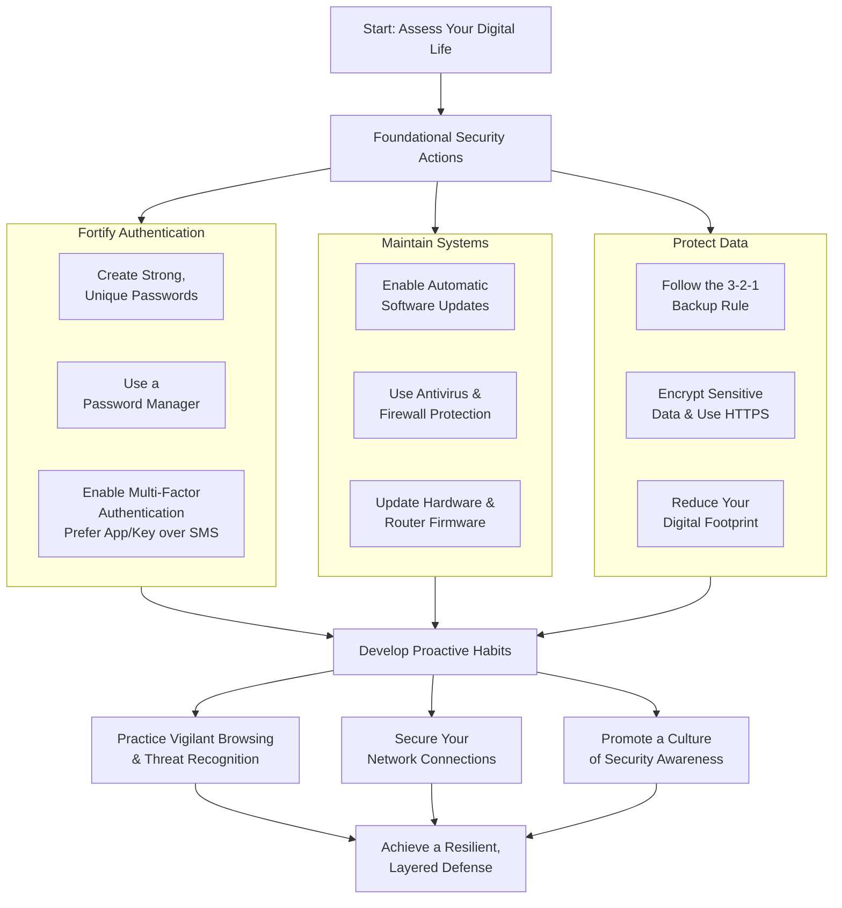

    

<h3 align="center">WELCOME TO</h3>
<h1 align="center">BLACXQUAD FREEMIUM REPOSITORY!</h1>
<h3 align="center">A HUB FOR FREE TECH LEARNING & RESOURCES.</h3>

  

    

    

  

    
 

> [!IMPORTANT]

This work is licensed under the **Creative Commons Attribution-ShareAlike 4.0 International License** (CC BY-SA 4.0).

When using, redistributing, adapting, or building upon this material, you **must** provide proper attribution by:

- 1. **Clearly stating the original source** as the **BLACXQUAD GitHub repository**.
- 2. **Including the exact URL(s)** to the relevant repository or file(s).

**Example Attribution Format:**  
- This work is based on content from the BLACXQUAD GitHub repository, available at:  
- https://github.com/blacxquad/freemium

Under the CC BY-SA license, you **must also**:
- Indicate if changes were made.
- License any adapted material under **identical terms** (CC BY-SA 4.0).

Failure to provide accurate source attribution violates the license terms.

    

<h1 align="center">Essential Cybersecurity Guide: Protecting Your Digital Life.</h1>

  

> **Disclaimer**
> *The information contained in this guide is for educational and informational purposes only and represents cybersecurity best practices as of its publication date. The field of cybersecurity is dynamic, and threats constantly evolve. The author and publisher assume no liability for any actions taken or not taken based on the content of this document. Readers are encouraged to consult with professional advisors for specific security concerns.*

 

## Introduction: Your Role in a Connected World

In our modern digital age, online threats pose a significant risk to personal privacy, financial security, and peace of mind. Cyberattacks are constantly evolving, targeting everyone from individuals to large organizations. While cybersecurity experts develop sophisticated defenses, every person who uses digital tools shares the responsibility for basic protection.

This guide provides clear, actionable steps to secure your digital life. By adopting these layered security habits, you dramatically reduce your risk of falling victim to cybercrime and protect your most valuable information.

 

## Part 1: The First Line of Defense – Secure Authentication

Strong authentication is the cornerstone of digital security, acting as the lock on your digital door. Compromised passwords are a leading cause of data breaches.

**Implement Strong, Unique Passwords**
*   Create passwords that are at least 12-16 characters long and use a unpredictable mix of uppercase letters, lowercase letters, numbers, and symbols. Avoid using common dictionary words, sequential patterns (like "12345"), or easily discoverable personal details such as birthdays or pet names. Most importantly, you must use a *different* password for every online account. This practice prevents a tactic called "credential stuffing," where hackers use a password leaked from one site to try and break into your other accounts.

**Adopt a Reputable Password Manager**
*   Remembering dozens of complex, unique passwords is impractical. A password manager solves this by generating, storing, and autofilling strong passwords for all your accounts. You only need to remember one master password to access your encrypted digital vault. These tools often include features to audit your existing passwords, identify weak or reused ones, and prompt you to update them, making ongoing maintenance simple and effective.

**Enable Multi-Factor Authentication (MFA)**
*   Whenever a website or app offers it, activate Multi-Factor Authentication. MFA adds a critical second step to the login process, requiring something you *know* (your password) plus something you *have* (like a code from an app on your phone) or something you *are* (like a fingerprint). This means that even if someone steals your password, they cannot access your account without that second factor. For the highest security, use an authenticator app (like Google Authenticator or Authy) or a physical security key instead of SMS text codes.

 

## Part 2: Maintaining Your Digital Foundation – Software & Hardware

Outdated software and unsupported hardware are full of known security holes that criminals actively exploit. Regular maintenance is a non-negotiable requirement for security.

**Enable Automatic Updates Everywhere**
*   Configure your device's operating system (Windows, macOS, iOS, Android), applications, web browsers, and browser extensions to update automatically. These updates frequently include "patches" for critical security vulnerabilities that have been discovered. Delaying these updates leaves your devices openly vulnerable to attacks that the software makers have already fixed, essentially leaving your digital doors unlocked.

**Deploy Comprehensive Endpoint Protection**
*   Install and maintain reputable antivirus and anti-malware software on every device—computers, smartphones, and tablets. These programs provide real-time scanning to detect and neutralize malicious software. Additionally, ensure your computer's built-in firewall is turned on. This firewall acts as a gatekeeper, monitoring incoming and outgoing network traffic and blocking unauthorized connections, forming a essential barrier between your device and the internet.

**Evaluate and Update Hardware**
*   Technology ages quickly. Older hardware may no longer receive vital security updates from its manufacturer, making it a permanent weak point. Periodically assess if your devices can run the latest, supported versions of their operating systems. Also, remember to update the firmware on your home router, as it is the primary gateway for all your connected devices and a common target for attackers seeking to infiltrate your home network.

 

## Part 3: Guarding Your Digital Assets – Data Protection

Your personal, financial, and private data is the ultimate target for most attacks. Protecting it requires a strategy focused on both preventing access and ensuring recovery.

**Implement the 3-2-1 Backup Rule**
*   Follow this industry-standard strategy to make your data resilient. Keep **3** total copies of your important data. Store these copies on **2** different types of media (for example, your computer's internal drive *and* an external hard drive). Ensure **1** of those copies is stored offsite, such as in a secure cloud backup service. Automate this process so backups happen regularly without you having to remember. This strategy protects you from all major causes of data loss, including ransomware, accidental deletion, and physical damage like fire or theft.

**Use Encryption for Sensitive Data**
*   Encryption scrambles your data so it can only be read by someone with the correct key. Always ensure you are on a website using HTTPS (look for the padlock icon in your browser's address bar) before entering any login or payment information. For sensitive files, use encrypted cloud storage or file-sharing services instead of standard email, which is like sending a postcard that anyone can read along the way.

**Minimize Your Digital Footprint**
*   Be mindful of the personal information you voluntarily share online. Regularly review and adjust the privacy settings on your social media and other online accounts to limit who can see your information. Proactively delete old accounts you no longer use and clean out old files. A smaller digital footprint means there is less information about you available to be exploited in a data breach or used for social engineering attacks.

 

## Part 4: Sharpening Your Awareness – Proactive Vigilance

Technology can only do so much; your own judgment is the final and most critical layer of defense. Cultivating a healthy sense of skepticism is key to avoiding manipulation.

**Identify and Avoid Phishing & Scams**
*   Be extremely cautious with any unsolicited message—email, text, or phone call—that asks for personal information, urges immediate action, or creates a sense of fear or urgency. Carefully examine sender email addresses for subtle misspellings (e.g., `service@paypai.com`). Hover your mouse over links to see the true destination URL before clicking. Never open unexpected attachments, even from known contacts, as their account may be compromised. If in doubt, contact the organization directly using a phone number or website you find independently.

**Practice Secure Browsing Habits**
*   Stick to reputable websites and avoid sites that offer illegal downloads or "too-good-to-be-true" deals, as they are common sources of malware. Pay attention to and do not ignore your browser's security warnings about sites with expired security certificates. Consider using browser extensions that block intrusive ads and trackers, which can sometimes be used to deliver "malvertising"—malicious code hidden in online advertisements.

**Secure Your Network Connections**
*   Never perform sensitive activities like online banking or shopping while connected to public Wi-Fi at airports, cafes, or hotels. These networks are often unencrypted, allowing others on the same network to potentially intercept your data. If you must use public Wi-Fi, first connect through a reliable Virtual Private Network (VPN), which creates an encrypted tunnel for all your internet traffic. Also, disable Bluetooth and file-sharing features when in public spaces to prevent unwanted connections to your device.

 

## Part 5: For Families, Teams, and Organizations

Those responsible for the security of others can build a powerful culture of cybersecurity with these advanced measures.

**Promote Continuous Security Education**
*   Move beyond one-time training. Conduct regular, engaging sessions to help family members or team members recognize modern phishing tactics and other social engineering tricks. Use simulated phishing tests in a safe environment to provide practical experience. Most importantly, foster an environment where asking questions and reporting suspicious activity (like a strange email) is encouraged and rewarded, not dismissed or penalized.

**Adopt a Defense-in-Depth Mindset**
*   Reject the idea that a single security tool makes you "safe." True security is built through multiple, overlapping layers of defense—strong authentication, updated systems, educated users, and robust data backups—so that if one layer fails, others remain. Proactively plan for security upgrades in your technology budget and ensure any website you manage enforces HTTPS to protect visitor data.

**Engage in Proactive Security Testing**
*   For critical systems or websites, consider hiring certified ethical hackers (penetration testers) to conduct authorized security assessments. These professionals use the same tools and techniques as malicious attackers to identify hidden vulnerabilities in your applications, networks, and processes from the outside, providing you with a realistic evaluation and a roadmap for strengthening your defenses before a real attacker finds the weakness.

 

## Quick Reference: Backup Strategy Comparison

| Strategy | Description | Best For | Key Consideration |
| :--- | :--- | :--- | :--- |
| **Local Backup** | Copying data to a physical device (external hard drive, NAS) kept at your home or office. | Fast recovery from a single device failure; backing up very large amounts of data. | Vulnerable to physical disasters (fire, flood, theft). Should be disconnected from the network/computer when not actively backing up to protect from ransomware. |
| **Cloud Backup** | Automatically copying data over the internet to a secure server run by a service provider (e.g., Backblaze, iDrive). | Providing automatic off-site protection; accessing files from anywhere; "set-and-forget" convenience. | Requires a recurring subscription fee. The initial full backup can take a long time. You must trust your provider's security and encryption standards. |
| **Hybrid (3-2-1)** | Combining both local and cloud backups to maintain multiple copies on different media, with one geographically separate. | Comprehensive protection for irreplaceable data like family photos, legal documents, and business records. | Involves managing two systems (local device and cloud service) but offers maximum resilience against virtually any threat scenario. |

 

## Conclusion: Building Your Digital Resilience

Cybersecurity is not a destination but an ongoing practice integral to daily digital life. By systematically implementing the layers outlined in this guide—starting with strong passwords and updates, protecting your data, staying vigilant, and fostering awareness—you build a powerful, resilient defense.

The threat landscape will never stop evolving, but the core principles of caution, maintenance, and education remain your constant allies. Begin by integrating one or two new practices this week, such as setting up a password manager or enabling MFA on your email account. Gradually build from there. Share this knowledge with your circle to help create a safer digital environment for everyone. Your proactive steps today are the most effective shield against tomorrow's cyber threats.

 
    

<h2 align="center">STAY TUNED FOR THE LATEST UPDATES!</h2>

  

    

