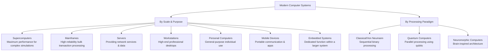
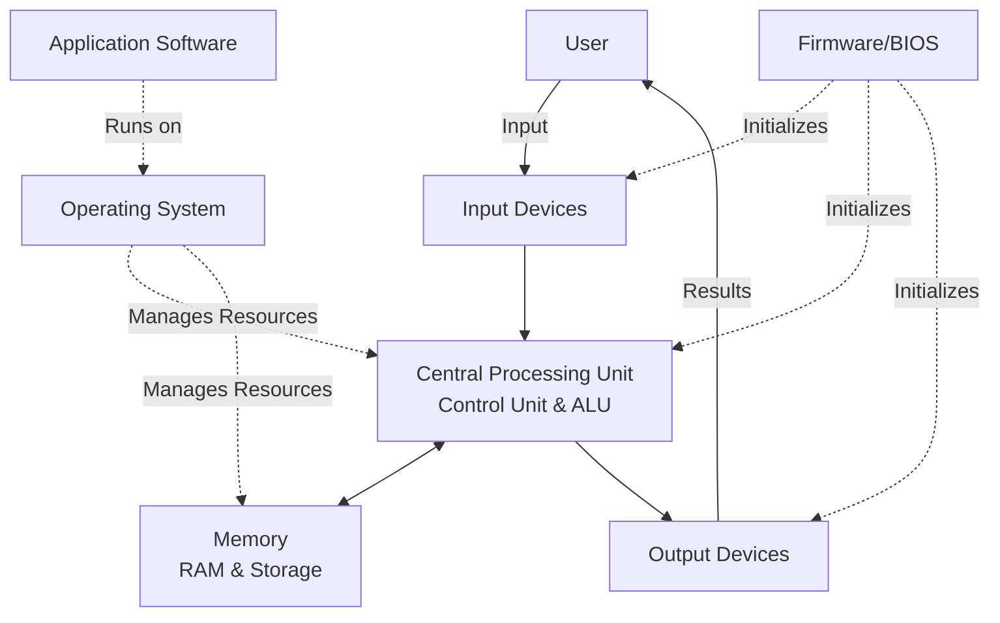
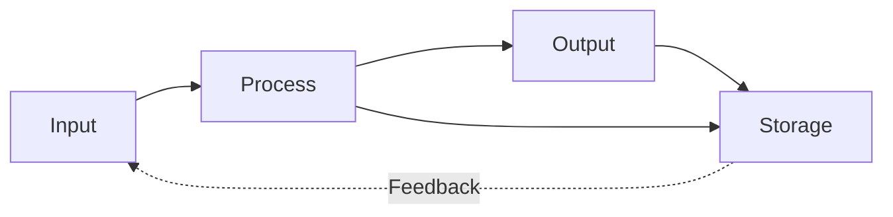

    

<h3 align="center">WELCOME TO</h3>
<h1 align="center">BLACXQUAD FREEMIUM REPOSITORY!</h1>
<h3 align="center">A HUB FOR FREE TECH LEARNING & RESOURCES.</h3>

  

    

    

  

    
 

> [!IMPORTANT]

This work is licensed under the **Creative Commons Attribution-ShareAlike 4.0 International License** (CC BY-SA 4.0).

When using, redistributing, adapting, or building upon this material, you **must** provide proper attribution by:

- 1. **Clearly stating the original source** as the **BLACXQUAD GitHub repository**.
- 2. **Including the exact URL(s)** to the relevant repository or file(s).

**Example Attribution Format:**  
- This work is based on content from the BLACXQUAD GitHub repository, available at:  
- https://github.com/blacxquad/freemium

Under the CC BY-SA license, you **must also**:
- Indicate if changes were made.
- License any adapted material under **identical terms** (CC BY-SA 4.0).

Failure to provide accurate source attribution violates the license terms.

    

<h1 align="center">The Evolution and Architecture of Modern Computing Systems.</h1>

  

 

## Executive Summary

Computing technology has undergone a revolutionary transformation, evolving from simple manual tools to sophisticated systems capable of artificial intelligence and quantum computation. This documentation provides a comprehensive overview of this journey, detailing the historical milestones, architectural principles, and core functionalities that define modern computers. By examining the synergy between hardware, software, and human interaction, we present an integrated view of computing systems, from their foundational concepts to their future potential. This analysis is structured to be accessible to a broad audience, from technology enthusiasts to professionals seeking a consolidated reference.

 

## 1. Historical Evolution of Computing Technology

The story of computing is one of incremental innovation and paradigm-shifting breakthroughs. Its evolution can be traced through distinct eras, each building upon the limitations of the last.

### 1.1 The Mechanical and Conceptual Foundations

Long before electronics, humanity developed tools to aid calculation, establishing principles that would guide future innovation.

- **Early Calculation Tools:** The journey began with devices like the abacus (c. 2000 BC), which introduced the concept of positional notation and manual arithmetic. Centuries later, inventions like John Napier's logarithms (1600s) and mechanical calculators such as Blaise Pascal's Pascaline (1642) demonstrated that machines could automate basic arithmetic, reducing human error and effort. These tools, though limited, planted the seed for automated computation by proving that physical mechanisms could reliably execute predefined mathematical operations.
- **The Vision of Programmable Machines:** The 19th century heralded the conceptual birth of the modern computer. Charles Babbage designed the Analytical Engine, a mechanical general-purpose computer featuring a processing unit ("the mill"), memory ("the store"), and programmability via punched cards. His collaborator, Ada Lovelace, recognized its potential beyond mere calculation, publishing the first algorithm intended for such a machine. Her insight that computers could manipulate any form of symbolic data established a visionary framework for general-purpose computing that would not be realized for over a century.

### 1.2 The Generational Leap of Electronic Computers

The advent of electronics catapulted computing from theory into reality, marked by distinct generations defined by core technological shifts.

#### Table 1: The Five Generations of Electronic Computers

| Generation | Timeline | Key Technology | Defining Characteristics | Example Systems |
| :--- | :--- | :--- | :--- | :--- |
| **First** | 1940-1956 | Vacuum Tubes | Massive size (room-sized), extreme heat, unreliable, programmed in machine language. | ENIAC, UNIVAC I |
| **Second** | 1956-1963 | Transistors | Smaller, more reliable, and efficient. Used assembly and early high-level languages (FORTRAN, COBOL). | IBM 7090, IBM 1401 |
| **Third** | 1964-1971 | Integrated Circuits (ICs) | Miniaturization via chips, emergence of operating systems, keyboards, and monitors. Enabled multitasking. | IBM System/360, PDP-8 |
| **Fourth** | 1972-2010 | Microprocessors | The CPU on a single chip. Dawn of personal computers, GUIs, and networks. Exponential growth in power (Moore's Law). | Apple II, IBM PC |
| **Fifth** | 2010-Present | AI & Quantum | Focus on artificial intelligence, parallel processing, and quantum computation. Systems learn and solve complex problems. | IBM Watson, Google TPU |

- **First Generation (Vacuum Tubes):** These pioneers, like ENIAC, were monumental in scale and power consumption, performing calculations thousands of times faster than humans but were prone to frequent failures. Programming involved physically rewiring circuits or using low-level machine code, limiting their use to critical military and scientific calculations. Their legacy is the proof that electronic, digital computation was viable for complex problem-solving.
- **Second Generation (Transistors):** The solid-state transistor replaced vacuum tubes, leading to computers that were smaller, faster, more reliable, and commercially viable. This era saw computers transition from unique scientific instruments to business tools. The development of high-level programming languages like COBOL and FORTRAN created an abstraction layer, making software development more accessible and fostering the growth of a professional programming community.
- **Third Generation (Integrated Circuits):** Jack Kilby's and Robert Noyce's invention of the IC, which packed multiple transistors onto a single silicon chip, was revolutionary. It enabled the continued miniaturization predicted by Moore's Law. Computers became powerful enough to be operated interactively by individuals via terminals, supported by sophisticated operating systems that managed resources and allowed multiple programs to run seemingly simultaneously (multitasking).
- **Fourth Generation (Microprocessors):** The integration of an entire CPU onto a single microprocessor chip (like the Intel 4004) democratized computing. It led directly to the personal computer revolution, putting computational power on desks and in homes. The combination of microprocessors, graphical user interfaces (GUIs), and the development of global networks (the internet) transformed computers from calculation devices into universal communication, creativity, and information platforms.
- **Fifth Generation (Intelligent Systems):** Current research focuses on moving beyond pre-programmed instructions. This generation emphasizes artificial intelligence, machine learning, and quantum computing. AI systems use neural networks to learn from data, enabling capabilities like natural language processing and computer vision. Quantum computing, though nascent, leverages quantum bits (qubits) to perform calculations intractable for classical computers, promising breakthroughs in materials science, cryptography, and complex system optimization.

### 1.3 Classification of Modern Computing Systems

Today's computers are categorized by their scale, purpose, and underlying computational paradigm.

- **Supercomputers:** These are the most powerful classical computers, built from thousands of interconnected processors (CPUs and GPUs) to solve enormous problems in science and engineering, such as climate modeling, molecular dynamics, and nuclear simulation. They operate at petascale and exascale speeds, requiring specialized facilities with immense power and cooling infrastructure.
- **Mainframes:** Engineered for unparalleled reliability, security, and input/output capacity, mainframes are the workhorses of critical enterprise operations. They process massive volumes of transactions for banks, insurance companies, and governments, supporting thousands of simultaneous users with near-perfect uptime. Their design prioritizes steady, reliable throughput over peak single-threaded performance.
- **Quantum Computers:** This emerging paradigm uses quantum mechanical properties like superposition and entanglement. A quantum bit (qubit) can represent 0 and 1 simultaneously, allowing a quantum computer to explore many possible solutions in parallel. While current "noisy intermediate-scale quantum" (NISQ) devices are prone to errors, they hold potential for specific tasks like drug discovery and optimization, posing a future challenge to current cryptographic methods.

 

## 2. Computer System Architecture and Components

A modern computer is a complex synergy of hardware and software, meticulously layered to translate user intent into physical action.

### 2.1 The Holistic System View

A computer system functions as an integrated whole. The user provides input, which is processed according to software instructions running on the physical hardware, culminating in output. An operating system manages all resources, while firmware initializes the hardware. This ecosystem is depicted below.

### 2.2 Hardware: The Physical Layer

Hardware comprises the tangible, electronic components that execute computations and store data.

#### 2.2.1 Central Processing Unit (CPU)

The CPU is the brain of the computer, executing instructions from programs.

- **Control Unit (CU):** This component directs the entire system. It fetches instructions from memory, decodes them to understand what operation is needed, and then coordinates the ALU, memory, and I/O devices to execute the instruction. It manages the flow of data across the system bus and ensures instructions are processed in the correct sequence.
- **Arithmetic Logic Unit (ALU):** This is the core computational engine. It performs all arithmetic calculations (addition, subtraction, etc.) and logical operations (comparisons like AND, OR, NOT). Modern CPUs contain multiple ALUs and specialized units for floating-point math and graphics-related calculations to increase throughput.
- **Registers and Cache:** These are the CPU's ultra-fast internal memory. Registers hold the data currently being processed by the ALU. Cache memory (L1, L2, L3) acts as a high-speed buffer between the CPU and slower main RAM, storing frequently used instructions and data to dramatically speed up processing.

#### 2.2.2 Memory and Storage Hierarchy

Computers use a tiered memory structure to balance speed, cost, and capacity.

- **Primary Memory (RAM):** Random Access Memory is volatile, meaning it loses data when powered off. It acts as the computer's working space, holding the operating system, applications, and data currently in use. More RAM allows a system to run more programs simultaneously and handle larger files efficiently.
- **Secondary Storage (SSD/HDD):** This is non-volatile memory for long-term data persistence. Solid-State Drives (SSDs) use flash memory with no moving parts, offering very fast read/write speeds. Hard Disk Drives (HDDs) use spinning magnetic platters and are slower but offer larger capacities at a lower cost per gigabyte. Storage holds the operating system, software, and all user files permanently.

#### 2.2.3 Motherboard and System Interconnection

The motherboard is the main circuit board that houses and connects all critical components.

- **The Foundation:** It contains the CPU socket, memory slots, expansion slots (like PCIe for graphics cards), and connectors for storage and power. The chipset on the motherboard is a critical set of chips that manages data flow between the CPU, memory, and peripherals.
- **System Bus:** This is a network of pathways that transports data and instructions between components. Modern systems use high-speed serial buses like PCI Express (PCIe) which provide dedicated lanes for high-bandwidth devices like GPUs and NVMe SSDs, preventing bottlenecks.

#### Table 2: Key Hardware Components and Specifications

| Component | Primary Function | Key Specifications | Modern Examples |
| :--- | :--- | :--- | :--- |
| **CPU** | Executes program instructions | Cores/Threads, Clock Speed (GHz), Cache Size, ISA (x86/ARM) | Intel Core i9, AMD Ryzen 9, Apple M2 |
| **GPU** | Processes graphics & parallel computations | CUDA Cores/Stream Processors, VRAM (GB), Memory Bandwidth | NVIDIA GeForce RTX 40 Series, AMD Radeon RX 7000 Series |
| **RAM** | Provides working memory for active tasks | Capacity (GB), Speed (MHz), Latency (CL), Type (DDR5) | 32GB DDR5-6000 |
| **SSD** | Provides fast persistent storage | Capacity (TB), Interface (NVMe PCIe 4.0), Read/Write Speed | 2TB NVMe SSD, 7000 MB/s read |
| **Motherboard** | Connects all components | Form Factor (ATX), Chipset, Socket, PCIe Slots | ATX with Z790 Chipset for Intel CPUs |
| **PSU** | Converts & supplies stable power | Wattage (W), Efficiency Rating (80+ Gold), Modularity | 850W 80+ Platinum Fully Modular |

### 2.3 Software: The Logical Layer

Software provides the instructions that tell the hardware what to do, creating usable abstractions.

#### 2.3.1 Operating System (OS)

The OS is the most critical software, acting as an intermediary between users/applications and the hardware.

- **Core Functions:** It manages the computer's memory, processing time (CPU scheduling), storage, and all connected devices (printers, disks, etc.). It provides a user interface (UI), either command-line or graphical, and offers common services to applications through APIs (Application Programming Interfaces), so programmers don't need to control the hardware directly.
- **Security and File Management:** The OS enforces security policies, controlling which users and programs can access specific resources. It also manages the file system—the method for storing, organizing, and retrieving files on a storage device—ensuring data integrity and efficient access.

#### 2.3.2 Application Software

These are programs designed to help users perform specific tasks.

- **Categories:** This includes productivity suites (word processors, spreadsheets), creative tools (photo/video editors, CAD software), development environments, web browsers, and enterprise applications (ERP, CRM systems). Each application relies on the services provided by the operating system to function.
- **Middleware:** This is a layer of software that sits between the OS and applications, facilitating communication and data management between different, often distributed, software applications. Examples include database middleware, message queues, and web servers.

 

## 3. Core Computational Functions

All computer operations, no matter how complex, can be distilled into a fundamental cycle.

### 3.1 The Information Processing Cycle

This is the continuous loop of input, processing, output, and storage that defines computation.

- **Input:** This is the stage of collecting data from the external world. Input devices like keyboards, mice, microphones, scanners, and sensors convert physical actions (keystrokes, sound, images) into digital signals the computer can understand. The quality and nature of input directly determine what can be processed.
- **Process:** This is the execution of instructions on the input data. The CPU performs calculations, makes logical decisions, and manipulates the data. This stage transforms raw input into meaningful information. Processing power determines how quickly and complexly this transformation can occur.
- **Output:** This stage presents the processed information back to the user or another system. Output devices like monitors, printers, and speakers convert digital data into human-perceivable forms (images, text, sound). Output can also be commands sent to control other machines, such as industrial robots.
- **Storage:** At any point in the cycle, data can be saved to a storage device. This allows for the permanent retention of input data, intermediate results, final output, and the software programs themselves. Storage enables persistence, recall, and sharing of information across time.

### 3.2 Defining Characteristics of a Modern Computer

Several key attributes distinguish modern general-purpose computers from simpler calculators or fixed-function devices.

- **Automation:** Once started, a computer can perform long, complex sequences of operations without human intervention. This is enabled by stored programs—the computer loads instructions from memory and executes them automatically. This capability is the foundation for everything from automated manufacturing to server-based web applications that run continuously.
- **Speed and Accuracy:** Computers execute operations at incredible speeds (billions per second) with flawless precision, limited only by their physical design and the logic of their programming. They do not suffer from fatigue or distraction, making them ideal for repetitive, tedious, or highly precise calculations that would be prone to human error.
- **Storage and Recall:** The ability to store vast amounts of data and programs and retrieve them instantly is fundamental. This separates computers from single-use calculators; the same hardware can be a word processor one minute and a media player the next simply by loading different software from storage. Hierarchical storage (cache, RAM, SSD/HDD) optimizes this for both speed and capacity.
- **Versatility (Programmability):** A computer is a general-purpose machine. Its function is determined by the software it runs, not its physical construction. This makes it a universal tool adaptable to an endless variety of tasks—communication, design, entertainment, research—by simply changing the program. This programmability is the single most powerful feature of the von Neumann architecture.

 

## 4. Future Directions and Emerging Paradigms

Computing continues to evolve, driven by new challenges and physical limits.

### 4.1 Converging and Emerging Architectures

Future systems will not rely on a single paradigm but will integrate multiple approaches.

- **Heterogeneous Computing:** Systems now combine different types of processors optimized for specific tasks: CPUs for general logic, GPUs for parallel graphics/AI, and specialized AI accelerators (TPUs, NPUs) for neural networks. Efficiently managing workloads across these different units is key to future performance gains.
- **Quantum Computing:** While not a replacement for classical computers, quantum processors offer a fundamentally different approach for specific problem classes like cryptography, material simulation, and complex optimization. The future likely involves hybrid systems where a classical computer offloads suitable sub-problems to a quantum co-processor.
- **Neuromorphic and Bio-inspired Computing:** Inspired by the human brain, neuromorphic chips use artificial neurons and synapses to process information in a massively parallel, event-driven manner. This architecture promises massive gains in energy efficiency for pattern recognition and sensory data processing tasks common in AI.

### 4.2 Societal and Ethical Considerations

As computing power grows, so does its impact on society and the planet.

- **Energy Efficiency and Sustainability:** The energy consumption of large data centers and the environmental cost of manufacturing and disposing of hardware (e-waste) are major concerns. Research into more efficient chips, advanced cooling, renewable energy power, and sustainable, circular design principles for electronics is critical.
- **Algorithmic Fairness and Transparency:** As AI systems make more decisions affecting lives (in hiring, lending, justice, etc.), ensuring they are fair, unbiased, and transparent is a paramount challenge. This requires interdisciplinary work in computer science, ethics, law, and social science to develop auditable and accountable AI.
- **Security and Privacy:** In an increasingly interconnected world, protecting data from theft and systems from sabotage is a continuous arms race. Future architectures must consider security at the hardware level (e.g., trusted execution environments), while software and policy must evolve to protect individual privacy against increasingly sophisticated threats.

 

## Conclusion

The evolution of computing systems is a testament to human ingenuity, marked by a relentless drive to augment our intellectual capabilities. From the mechanical dreams of Babbage to the silent, pervasive intelligence in our pockets today, each architectural breakthrough—the stored program, the transistor, the microprocessor—has unlocked new realms of possibility.

The modern computer, as a symphony of hardware and software, operates on the timeless principles of input, processing, and output. Yet, its true power lies in its versatility and programmability, making it the first truly universal machine. As we stand at the threshold of quantum, neuromorphic, and AI-driven eras, the core challenge expands beyond raw performance. It encompasses creating sustainable, equitable, and trustworthy systems that harness this incredible power to address humanity's grand challenges. The architecture of the future will be measured not just in flops or qubits, but in its positive impact on the world it helps to shape.
 
 
    

<h2 align="center">STAY TUNED FOR THE LATEST UPDATES!</h2>

  

    

