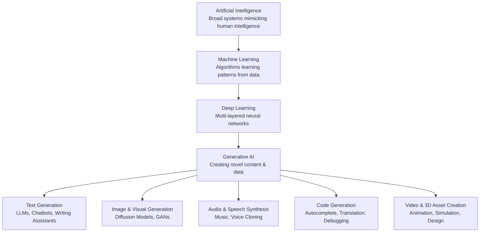

    

<h3 align="center">WELCOME TO</h3>
<h1 align="center">BLACXQUAD FREEMIUM REPOSITORY!</h1>
<h3 align="center">A HUB FOR FREE TECH LEARNING & RESOURCES.</h3>

  

    

    

  

    
 

> [!IMPORTANT]

This work is licensed under the **Creative Commons Attribution-ShareAlike 4.0 International License** (CC BY-SA 4.0).

When using, redistributing, adapting, or building upon this material, you **must** provide proper attribution by:

- 1. **Clearly stating the original source** as the **BLACXQUAD GitHub repository**.
- 2. **Including the exact URL(s)** to the relevant repository or file(s).

**Example Attribution Format:**  
- This work is based on content from the BLACXQUAD GitHub repository, available at:  
- https://github.com/blacxquad/freemium

Under the CC BY-SA license, you **must also**:
- Indicate if changes were made.
- License any adapted material under **identical terms** (CC BY-SA 4.0).

Failure to provide accurate source attribution violates the license terms.

    

# The Comprehensive Guide to Generative AI: Architectures, Applications, and Enterprise Implementation.

  

## Executive Summary

Generative Artificial Intelligence (Gen AI) marks a fundamental evolution in the field of artificial intelligence, transitioning systems from analyzing existing information to creating original, high-quality content across text, images, audio, code, and video. This paradigm shift is powered by foundation models—large neural networks trained on vast datasets—and sophisticated architectures like Transformers and Diffusion Models. Generative AI is transforming industries by automating complex creative and analytical tasks, augmenting human productivity, and enabling novel forms of human-machine collaboration. This guide provides a complete overview of the technology, from its technical foundations and core architectures to its practical enterprise applications and strategic implementation roadmap. It is designed to equip business leaders, developers, and enthusiasts with the knowledge to understand, evaluate, and responsibly deploy generative AI solutions.

 

## 1. The AI Landscape: From Analysis to Creation

### 1.1 The Hierarchy of Artificial Intelligence
Artificial Intelligence is a broad discipline focused on building systems capable of tasks requiring human-like intelligence. This field is best understood as a hierarchy of increasing specialization and capability.

**Artificial Intelligence (AI)**
*   This is the all-encompassing field. It includes any system designed to perform tasks that typically require human cognition, such as problem-solving, learning, reasoning, and perception. Early AI, from the 1980s and 1990s, relied on rule-based expert systems programmed with languages like Lisp, where human knowledge was manually encoded. These systems were logical but inflexible and couldn't learn from data autonomously.

**Machine Learning (ML)**
*   Machine Learning is a critical subset of AI where systems learn and improve from experience without being explicitly programmed for every scenario. Instead of following static rules, ML algorithms identify statistical patterns in data. They excel at predictive tasks—like forecasting customer churn, classifying emails as spam, or detecting fraudulent transactions—by building a model that maps inputs to outputs based on example data. The model's performance improves as it is exposed to more data, refining its internal parameters to minimize prediction errors.

**Deep Learning**
*   Deep Learning is a specialized branch of machine learning inspired by the structure of the human brain. It utilizes artificial neural networks with many layers—hence "deep"—between the input and output. Each layer processes the input and passes a more abstract representation to the next. This hierarchical feature learning allows deep learning models to automatically discover intricate patterns from raw, unstructured data like pixels or text characters. This architecture is the fundamental engine behind modern generative AI's most impressive capabilities.

**Generative AI**
*   Representing the current frontier, Generative AI moves beyond analysis and prediction to the creation of new, original content. While traditional discriminative models classify or predict an outcome (e.g., "Is this image a cat or a dog?"), generative models learn the underlying distribution of data to produce new, plausible instances (e.g., "Create a novel image of a cat"). This creative leap is powered by the convergence of deep learning architectures, unprecedented computational power, and massive datasets.

### 1.2 The Generative AI Revolution: Core Principles
Generative AI represents a distinct category within the AI spectrum, defined by its core objective: creation.
*   **Fundamental Shift**: Traditional AI is primarily discriminative, focused on drawing boundaries between existing data points (classification) or predicting a value (regression). Generative AI is constructive, focused on modeling how data is generated to produce new, previously non-existent data points that are coherent and contextually relevant.
*   **Mathematical Foundation**: This difference is rooted in probability. Discriminative models learn the conditional probability P(y|x)—the probability of a label 'y' given input features 'x'. Generative models learn the joint probability P(x, y)—the probability of both the features and the label occurring together. This allows them to understand and replicate the full structure of the data.
*   **The Power of Foundation Models**: The generative AI explosion is fueled by foundation models. These are large-scale models pre-trained on broad, internet-scale datasets (text, images, etc.) using self-supervised learning. Once trained, they can be adapted (or "fine-tuned") with relatively little effort to a wide variety of downstream tasks, from writing legal briefs to generating product designs.

 

## 2. Technical Architecture: How Generative AI Works

### 2.1 Core Generative Model Architectures
Different architectures are suited for different types of content generation. Here are the four primary paradigms.

#### Transformer-Based Models
*   Transformers are the architectural breakthrough that enabled the modern era of Large Language Models (LLMs). Their key innovation is the **self-attention mechanism**, which allows the model to weigh the importance of all words in a sentence when processing any single word, capturing long-range context and relationships far better than previous recurrent models. They use **positional encoding** to inject information about word order into the model. Unlike sequential processors, Transformers process entire text sequences in parallel, making training on massive datasets computationally efficient. Notable examples include OpenAI's GPT series (decoder-only for generation) and Google's BERT (encoder-only for understanding).

#### Diffusion Models
*   Currently dominant in high-quality image generation, diffusion models work through a gradual, iterative process. The **forward diffusion process** systematically adds random noise to a training image until it becomes pure noise. The model then learns the **reverse diffusion process**: how to denoise a random starting point step-by-step to reconstruct a coherent image. This progressive refinement, often involving dozens or hundreds of steps, allows for the generation of highly detailed and photorealistic outputs. Tools like DALL-E 3, Stable Diffusion, and Midjourney are built on this architecture.

#### Generative Adversarial Networks (GANs)
*   GANs introduced a novel, adversarial training framework involving two neural networks locked in competition. The **Generator** network creates synthetic data (e.g., a fake image), while the **Discriminator** network evaluates whether data is real (from the training set) or fake (from the generator). They are trained simultaneously: the generator aims to produce increasingly convincing fakes to fool the discriminator, and the discriminator aims to get better at telling them apart. This competition drives both to improve. GANs were historically pivotal for image generation but can be challenging to train stably.

#### Variational Autoencoders (VAEs)
*   VAEs provide a probabilistic approach to learning efficient data representations. They consist of an **encoder** that compresses input data into a latent space (a simplified representation defined by a mean and variance), and a **decoder** that reconstructs data from points in this latent space. By sampling from this learned latent distribution, VAEs can generate new data. They enable smooth interpolation between data points (e.g., morphing one face into another) and are useful for tasks like anomaly detection or controlled generation, though outputs can sometimes lack the fine detail of diffusion models.

### 2.2 Foundation Models and Large Language Models (LLMs)
These terms are central to understanding the current generative AI ecosystem.

**Foundation Models**
*   These are the versatile, general-purpose engines of generative AI. Trained on petabyte-scale datasets across multiple modalities (text, code, images), they develop a broad, foundational understanding of the world. Their key value is **transfer learning**: the knowledge gained during expensive, large-scale pre-training can be efficiently transferred to specific tasks (like summarizing medical records or writing marketing copy) with minimal additional task-specific data, dramatically reducing development time and cost for new applications.

**Large Language Models (LLMs)**
*   LLMs are a specific, text-focused class of foundation model, typically built on decoder-only Transformer architectures. They are trained via **self-supervised learning** on the simple task of predicting the next word in a sequence, which inadvertently teaches them grammar, reasoning, and world knowledge. As these models have scaled from millions to hundreds of billions of parameters, they have exhibited **emergent abilities**—capabilities like coding, logical reasoning, and instruction-following that were not explicitly programmed but arise from the model's scale and training data.

 

## 3. The Generative AI Development Lifecycle

### 3.1 Traditional ML vs. Generative AI Development
The approach to building and deploying AI solutions has fundamentally changed with generative AI.

| **Aspect** | **Traditional ML Development** | **Generative AI Development** |
| :--- | :--- | :--- |
| **Data Source** | Internal, structured, labeled organizational data. | Massive, external, unstructured datasets (often web-scale). |
| **Model Building** | Train a specialized model from scratch for each task. | **Adapt** a pre-trained foundation model via prompting or light tuning. |
| **Primary Expertise** | Data science, feature engineering, ML ops. | Prompt engineering, model evaluation, orchestration. |
| **Development Timeline** | Weeks to months for a single model. | Hours to days for adaptation and prototyping. |
| **Data Requirements** | Large, high-quality labeled datasets are critical. | Often uses **few-shot** or **zero-shot** learning with minimal examples. |
| **Infrastructure Focus** | Training infrastructure. | High-performance **inference** infrastructure for large models. |
| **Knowledge Integration** | Manual retraining cycles to update model knowledge. | Dynamic integration via **Retrieval-Augmented Generation (RAG)**. |

### 3.2 The Three-Phase Generative AI Pipeline
Enterprise implementation typically follows a structured pipeline.

**Phase 1: Foundation Model Pre-training**
*   This phase involves training a massive neural network from scratch on a vast corpus of data and is typically undertaken only by well-resourced organizations due to multimillion-dollar computational costs. It involves collecting terabytes to petabytes of text, code, and images, and training the model using self-supervised objectives (like next-word prediction) over weeks on thousands of specialized AI chips (GPUs/TPUs). The output is a general-purpose base model with broad but often shallow knowledge.

**Phase 2: Model Adaptation & Alignment**
*   This is where enterprises add the most value, customizing a base model for specific needs. **Prompt Engineering** is the art of crafting input instructions to steer the model's output without changing its weights. **Fine-Tuning** updates a subset of the model's internal parameters on a curated dataset for a specific task or domain. **Parameter-Efficient Fine-Tuning (PEFT)** methods like LoRA (Low-Rank Adaptation) are popular as they fine-tune only a tiny fraction of parameters, reducing cost and preventing catastrophic forgetting. **Reinforcement Learning from Human Feedback (RLHF)** aligns model outputs with human preferences by training a reward model based on human ratings and using it to fine-tune the generator. **Retrieval-Augmented Generation (RAG)** enhances a model's responses by fetching relevant, up-to-date information from an external knowledge base, grounding its answers in factual data.

**Phase 3: Deployment & Continuous Operations**
*   This phase focuses on integrating the adapted model into real-world applications and maintaining its performance. It involves building the application layer (chat interfaces, APIs, plugins), optimizing the model for **inference** (using techniques like quantization and pruning to reduce size and latency), and deploying it on scalable infrastructure. Crucially, it requires establishing **ModelOps** practices: continuous monitoring for accuracy, bias, and performance degradation, managing versioning, and setting up feedback loops for iterative improvement and retraining.

 

## 4. Enterprise Applications and Strategic Use Cases

### 4.1 Cross-Industry Functional Applications
Generative AI delivers value across core business functions.

**Customer Experience & Marketing**
*   AI can dynamically generate personalized marketing copy, email campaigns, and product descriptions tailored to individual customer segments, scaling content creation massively. Intelligent chatbots and virtual assistants handle complex customer service inquiries, providing 24/7 support with context-aware, human-like dialogue, significantly reducing wait times and operational costs. Sentiment analysis tools can automatically summarize customer feedback from reviews and social media, and even draft appropriate response templates for human agents to review and send.

**Software Development & IT Operations**
*   Developer productivity is boosted by AI pair programmers that suggest whole lines or blocks of code, autocomplete functions, and translate code between programming languages. They can also generate documentation, comments, and unit tests from existing codebases, keeping documentation current. For IT operations, AI can automatically generate infrastructure-as-code scripts, analyze log files to suggest root causes for incidents, and draft knowledge base articles from resolution notes.

**Content Creation & Creative Design**
*   Writers and creatives use generative AI as a collaborative tool to overcome blank-page syndrome, draft articles and reports in specific styles, brainstorm creative concepts, and rewrite passages for clarity or tone. In design, AI assists by generating initial visual concepts, editing images (extending backgrounds, removing objects), creating variations of logos, and even generating original music or sound effects for multimedia projects, acting as a force multiplier for creative teams.

**Business Operations & Knowledge Management**
*   Generative AI streamlines internal workflows by summarizing long documents, transcribing and extracting action items from meetings, and drafting internal communications or reports. It can analyze contracts to highlight non-standard clauses or potential risks and generate first drafts of routine legal or procurement documents. For analytics, it can explain the trends in a chart or dashboard in plain language, making data insights accessible to non-technical stakeholders.

### 4.2 Industry-Specific Implementations
| **Industry** | **Primary Use Cases** | **Key Value Proposition** |
| :--- | :--- | :--- |
| **Financial Services** | Fraud analysis reports, personalized financial advice, automated regulatory & earnings reporting, risk scenario simulation. | Enhanced risk management, operational efficiency, hyper-personalized customer service, and accelerated compliance. |
| **Healthcare & Life Sciences** | Clinical note summarization, patient communication drafting, medical literature review, synthetic data for research, novel molecule generation. | Reduced clinician administrative burden, accelerated drug discovery, improved patient engagement, and expanded research capabilities. |
| **Manufacturing & Engineering** | Design optimization (lightweighting, thermal management), technical manual generation, predictive maintenance alerts, supply chain disruption simulation. | Faster product innovation, reduced material and operational costs, increased equipment uptime, and more resilient supply chains. |
| **Retail & E-commerce** | Dynamic product descriptions, personalized shopping assistants, visual search, inventory demand forecasting narratives, automated customer review responses. | Increased conversion rates, enhanced customer loyalty, reduced content creation costs, and optimized inventory management. |
| **Education & Training** | Creation of personalized learning materials, adaptive tutoring systems, automated quiz generation, curriculum development assistance, content localization. | Scalable, individualized learning pathways, reduced instructor workload, and consistently high-quality educational content. |

 

## 5. Critical Challenges, Risks, and Responsible Mitigation

### 5.1 Technical and Operational Challenges

**Model Hallucinations and Factual Inconsistency**
*   Generative models, especially LLMs, can produce convincing but entirely incorrect or fabricated information, a phenomenon known as "hallucination." This poses a severe risk in domains where accuracy is critical, such as healthcare, law, and finance. **Mitigation** requires a multi-layered approach: implementing **Retrieval-Augmented Generation (RAG)** to ground answers in verified sources, designing user interfaces that encourage fact-checking (e.g., showing citations), and establishing clear **human-in-the-loop** review protocols for high-stakes outputs. Developing models that can express confidence levels or uncertainty in their responses is also an active area of research.

**High Computational Cost and Resource Intensity**
*   The energy consumption and financial cost of training and running large generative models are significant, creating barriers to entry and raising environmental concerns. **Mitigation** involves strategic model selection—opting for smaller, more efficient models where possible—and employing inference optimization techniques like **quantization** (reducing numerical precision of weights) and **pruning** (removing unnecessary neurons). Leveraging cloud-based inference services with auto-scaling can optimize cost, and enterprises should consider the carbon footprint of their compute providers.

**Data Bias, Fairness, and Toxic Outputs**
*   Models trained on vast, unfiltered internet data inevitably learn and can amplify societal biases, stereotypes, and toxic language present in that data. This can lead to unfair, discriminatory, or harmful outputs. **Mitigation** starts with curating and filtering training data, but must extend throughout the lifecycle. Implementing bias detection and fairness evaluation benchmarks, using techniques like **reinforcement learning from human feedback (RLHF)** with diverse annotators to align outputs with ethical guidelines, and maintaining transparent **model cards** that document known limitations are essential steps for responsible deployment.

**Lack of Explainability and Auditability**
*   The "black box" nature of large neural networks makes it difficult to understand *why* a model generated a specific output, complicating debugging, trust-building, and regulatory compliance in sectors requiring explainability. **Mitigation** includes developing secondary systems to explain model behavior, such as highlighting which parts of the input most influenced the output (attention visualization). For critical applications, maintaining detailed **audit logs** of all model inputs, parameters, and outputs is crucial for tracing issues and ensuring accountability.

### 5.2 Ethical and Societal Considerations

**Intellectual Property and Copyright Ambiguity**
*   Training models on copyrighted content (books, art, code) and generating outputs that may resemble that content creates complex legal questions regarding infringement, derivative works, and ownership of AI-generated material. A prudent **governance approach** involves establishing clear policies on data sourcing, implementing filters to avoid generating near-identical copies of protected works, and developing internal guidelines that clarify the ownership of AI-assisted outputs, potentially treating the AI as a tool where the human director retains copyright.

**Misinformation, Deepfakes, and Security Threats**
*   The ability to generate highly convincing synthetic text, audio, and video ("deepfakes") lowers the barrier for creating and spreading misinformation, enabling fraud, and damaging reputations. **Countermeasures** are both technical and societal. Technologically, developing robust detection tools and implementing **provenance standards** (like watermarking or cryptographic signing) for authentic media are vital. Societally, promoting media literacy and supporting industry coalitions to establish labeling standards for AI-generated content are necessary to maintain trust in digital information.

**Workforce Transformation and Economic Impact**
*   Automating tasks in creative, analytical, and clerical domains will inevitably transform job markets, displacing some roles while creating new ones. A responsible **adaptation strategy** focuses on augmentation over replacement. Organizations should invest in **reskilling programs** to help employees work effectively with AI tools, redesign workflows to emphasize uniquely human skills like strategic oversight, ethical judgment, and creative direction, and foster a culture of human-AI collaboration.

 

## 6. Enterprise Implementation Roadmap

### 6.1 Phase 1: Strategic Foundation & Use Case Identification
*   Begin with a thorough **organizational readiness assessment**, evaluating your data infrastructure, technical skills, and governance maturity. Concurrently, run a cross-functional workshop to **identify and prioritize use cases**. Focus on pilot projects with a clear business value, measurable ROI (e.g., time saved, increased conversion), contained risk, and available high-quality data. Establish a **cross-functional steering committee** including representatives from IT, legal, compliance, security, ethics, and business units to guide strategy and oversight from the outset.

### 6.2 Phase 2: Technology Selection & Pilot Execution
*   Choose your **technology approach**: Will you use third-party API-based models (fastest, least control), fine-tune open-source models (more control, more effort), or build proprietary models (maximum control, highest cost)? For most enterprises, a hybrid approach starting with APIs and selectively fine-tuning open models is effective. For your pilot, implement a **minimal viable product (MVP)** with strong guardrails. Integrate RAG for accuracy, establish a human review process, and define strict KPIs for success (accuracy, user satisfaction, efficiency gains). This phase is about learning and de-risking.

### 6.3 Phase 3: Scaling, Integration, & Building Capability
*   Based on pilot learnings, develop a **scaling plan** for infrastructure, security, and model management. Implement a robust **ModelOps** platform to handle versioning, monitoring, and continuous evaluation of models in production. In parallel, launch a **capability-building program** to upskill the workforce. Create training for "citizen developers" in prompt engineering, and develop specialized roles for AI governance, prompt library management, and ML engineering. Foster an internal community of practice to share best lessons and use cases.

### 6.4 Phase 4: Responsible Governance & Continuous Evolution
*   Institutionalize **responsible AI principles** into your operational fabric. Develop and publish clear policies on acceptable use, data privacy, and transparency (e.g., disclosing AI-generated content). Implement technical safeguards for security, bias detection, and output filtering. Create a formal feedback and audit loop to regularly assess model performance and societal impact. Stay agile, as the technology landscape evolves rapidly; be prepared to adopt new architectures, tools, and best practices to maintain a competitive and ethical edge.

 

## 7. The Future Horizon: Trends Shaping Tomorrow

### 7.1 Technological Advancements
*   **Multimodal Foundation Models** will become the norm, seamlessly understanding and generating combinations of text, images, video, and audio within a single, cohesive model, enabling much richer and more context-aware applications. **Agentic AI** represents a shift from tools that respond to prompts to autonomous systems that can perceive their environment, plan, and execute multi-step tasks to achieve a goal (e.g., "conduct full market research on this product"). **Efficiency breakthroughs** through novel architectures (like mixture-of-experts) and hardware will make powerful capabilities accessible on personal devices, reducing cost and latency. Finally, research in **AI reasoning** aims to move beyond pattern recognition to enable models to perform causal inference, logical deduction, and verifiable chain-of-thought processes.

### 7.2 Societal and Business Integration
*   The future workplace will be defined by **seamless human-AI collaboration**, with interfaces evolving from chatboxes to co-pilots integrated directly into creative suites, IDEs, and business software. **Regulatory frameworks** will crystallize around the world, establishing standards for safety testing, bias auditing, transparency reports, and liability, which enterprises will need to navigate. Economically, we will see the rise of **new business models and roles**, such as AI model trainers, output curators, and simulation specialists, while the value of uniquely human skills—critical thinking, empathy, and ethical leadership—will be amplified.

 

## Conclusion

Generative AI is not merely another incremental technological improvement; it is a foundational capability that redefines what is possible with software. Its power to create, synthesize, and reason unlocks unprecedented opportunities for innovation, efficiency, and personalization across every sector. However, this power comes with significant responsibilities—technical, ethical, and societal.

Successful enterprise adoption is therefore not just a technology deployment project; it is a strategic organizational initiative. It requires a clear vision, a phased and pragmatic implementation roadmap, a deep commitment to building internal capabilities, and, above all, a robust framework for responsible and ethical use. The organizations that will thrive in this new era are those that proactively engage with both the potential and the pitfalls of generative AI, fostering a culture of responsible experimentation, continuous learning, and human-centric augmentation. By doing so, they will not only harness a transformative technology but will also help shape its development towards a future that benefits both business and society.
    

<h2 align="center">STAY TUNED FOR THE LATEST UPDATES!</h2>

  

    

