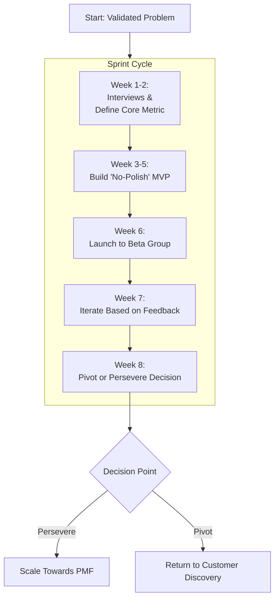
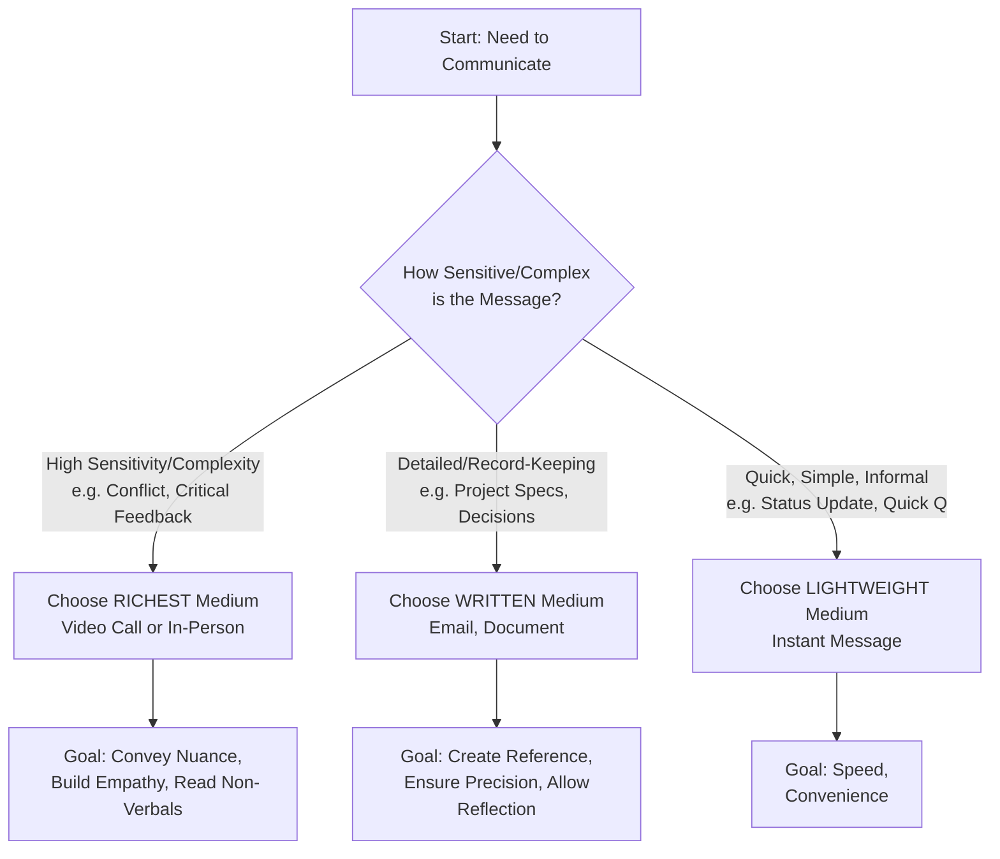

    

<h3 align="center">WELCOME TO</h3>
<h1 align="center">BLACXQUAD FREEMIUM REPOSITORY!</h1>
<h3 align="center">A HUB FOR FREE TECH LEARNING & RESOURCES.</h3>

  

    

    

  

    
 

> [!IMPORTANT]

This work is licensed under the **Creative Commons Attribution-ShareAlike 4.0 International License** (CC BY-SA 4.0).

When using, redistributing, adapting, or building upon this material, you **must** provide proper attribution by:

- 1. **Clearly stating the original source** as the **BLACXQUAD GitHub repository**.
- 2. **Including the exact URL(s)** to the relevant repository or file(s).

**Example Attribution Format:**  
- This work is based on content from the BLACXQUAD GitHub repository, available at:  
- https://github.com/blacxquad/freemium

Under the CC BY-SA license, you **must also**:
- Indicate if changes were made.
- License any adapted material under **identical terms** (CC BY-SA 4.0).

Failure to provide accurate source attribution violates the license terms.

    

# The Founder's Operating System: A Comprehensive Master Guide for World-Changing Entrepreneurs.

## Executive Summary: Building on Three Pillars

Entrepreneurship is a demanding journey requiring more than just a good idea. Success hinges on the seamless integration of vision, structure, and human connection. This master guide synthesizes three critical pillars into one holistic operating system:

1.  **The Founder's Mindset & Execution Framework:** The internal playbook and tactical process for validating, building, and scaling a venture.
2.  **The Strategic Entity Foundation:** The legal and structural blueprint that protects your assets, enables funding, and aligns with your mission.
3.  **The Communication & Leadership Core:** The human operating system that builds trust, drives alignment, and fosters a high-performance culture.

Together, these components form the essential toolkit for transforming an idea into a lasting, impactful enterprise. The following documentation provides a clear, actionable, and integrated guide for entrepreneurs at every stage.

 

## Part 1: The Founder's Operating System – Mindset, Process & Execution

### 1.1 The Founder's Mindset: Forging Your Inner Foundation
Your venture is a reflection of your thinking. Cultivating the right mental framework is the first and most critical step.

*   **Purpose-Driven Clarity:** Begin with a compelling mission that serves as your true north. This mission should resonate personally and act as a strategic filter for every decision—from product features to hiring. A clear purpose provides direction during uncertainty and aligns your team around a common goal. Remember the core principle: focus on making something people genuinely want, not on pursuing abstract business models.
*   **Relentless Learning & Iteration:** Adopt a "ship fast, learn faster" philosophy. Treat every product release as an experiment designed to gather maximum learning with minimal effort. Prioritize testing core hypotheses over achieving technical perfection. This iterative approach allows you to validate assumptions quickly and adapt before over-investing in a potentially flawed direction.
*   **First-Principles Thinking:** Break down complex problems to their fundamental truths and rebuild solutions from the ground up. Instead of relying on industry analogies, ask "why" repeatedly until you reach undeniable facts. This mindset, exemplified by innovators like Elon Musk, allows you to challenge legacy assumptions and discover novel, more efficient solutions that incumbents overlook.
*   **Inversion & Failure Anticipation:** Proactively identify risks by considering how your venture could fail. Conduct "premortem" exercises where you imagine the company has collapsed months from now and work backward to determine the causes. This practice, championed by thinkers like Charlie Munger, surfaces hidden vulnerabilities and enables you to build safeguards before problems arise.
*   **The Power of Marginal Gains:** Focus on achieving a 1% improvement in key areas every single day. This principle of compounding small gains, demonstrated by the British Cycling team's success, applies directly to startups. Consistent, tiny improvements in product quality, customer service, or personal productivity compound over time into an unassailable competitive advantage and market leadership.
*   **Bias for Action & Resilient Execution:** Discipline must transcend fluctuating motivation. Set clear, SMART goals and execute relentlessly. Treat every setback not as a defeat, but as critical feedback to be analyzed and learned from. The entrepreneurial path is demanding, requiring resilience to persevere through challenges, learn continuously, and maintain forward momentum where others might stop.

### 1.2 From Insight to Validated Opportunity
An idea is merely a hypothesis until rigorously validated. This phase prevents wasted resources by confirming a real problem and a viable solution.

*   **Precise Problem Framing:** Articulate the customer's pain point in a single, quantifiable sentence: "[Target Customer] struggles with [Specific Problem], costing them [Time/Money/Effort] per [Period]." This clarity is essential for later quantifying market size and willingness to pay. If you cannot quantify the pain, you have not yet defined a concrete business problem.
*   **Customer Discovery Interviews:** Conduct 15-50 conversations with potential users before building anything. Use open-ended questions to understand their current workflows, frustrations, and unmet needs. Listen for emotions and unarticulated desires. These interviews are a reality check that can invalidate assumptions and reveal hidden opportunities, such as undiscovered stakeholders or alternative solutions.
*   **Validate Willingness-to-Pay:** Never assume customers will pay for your solution. During interviews, explore pricing explicitly. A strong signal is a user's willingness to pay a small amount immediately. You can also test this with a "smoke test" landing page featuring a sign-up or pre-order button to gauge genuine interest before any development work begins.
*   **Market Sizing (TAM, SAM, SOM):** Assess the commercial potential of your opportunity to ensure it warrants your effort and can attract investors.
    *   **Total Addressable Market (TAM):** The total revenue potential if you captured 100% of the market.
    *   **Serviceable Addressable Market (SAM):** The segment of TAM you can realistically reach with your initial product and geographic focus.
    *   **Serviceable Obtainable Market (SOM):** The portion of SAM you can capture in the first 3-5 years, considering competition and execution limits.
*   **The Validation Decision Rule:** Synthesize your findings. If you have confirmed (a) a urgent customer problem, (b) a clear solution hypothesis, (c) validated interest or pre-commitments, and (d) an attractive market size, you may proceed. If any element is weak, return to customer discovery. This disciplined validation is your best defense against building something nobody wants.

### 1.3 The Build Phase: From MVP to Product-Market Fit
With a validated problem, shift to building the smallest possible product to test your core value proposition.

*   **MVP Archetypes:** Choose the fastest path to learning.
    *   **Concierge MVP:** Manually deliver the service to early users as if it were automated.
    *   **Wizard of Oz MVP:** Create a front-end that looks automated, but handle operations manually behind the scenes.
    *   **Single-Feature MVP:** Build only the one feature that delivers the core "job to be done."
    *   **Landing Page / Smoke Test:** Use a descriptive webpage to gauge interest and collect sign-ups before building.

*   **The 8-Week MVP Sprint:** A disciplined cycle to reach a go/no-go decision.
    1.  **Weeks 1-2:** Conduct interviews and define the one key metric that proves your hypothesis.
    2.  **Weeks 3-5:** Build the MVP with a "no polish" ethos. Speed is more important than perfection.
    3.  **Week 6:** Launch to a small beta group (10-50 users). Collect qualitative feedback and instrument basic analytics.
    4.  **Week 7:** Iterate rapidly based on user feedback, focusing on removing friction to the core value.
    5.  **Week 8:** Make the pivotal decision: persevere on the current path or pivot based on the data.
*   **Signals of Product-Market Fit (PMF):** Look for compelling evidence before scaling.
    *   **Quantitative:** A flattening retention curve, strong activation rates, and organic growth via word-of-mouth.
    *   **Qualitative:** A significant portion of users (≥40%) stating they would be "very disappointed" if they could no longer use your product (the Sean Ellis test).

### 1.4 Go-to-Market & Early Growth: Securing Traction
A great product needs a deliberate plan to reach its first users and beyond.

*   **Crystal-Clear Positioning:** Articulate your value using a simple template: "For [target customer] who struggles with [problem], our [product] provides [key benefit]. Unlike [alternative], we [unique differentiator]."
*   **Experiment with Acquisition Channels:** Test multiple channels with small budgets and double down on what works.
    *   **Paid Ads:** For rapid, measurable testing.
    *   **Content & SEO:** For building long-term, organic traffic and authority.
    *   **Partnerships:** To tap into existing, trusted audiences.
    *   **Product-Led Growth:** To build virality and referrals directly into the product experience.
    *   **Community Engagement:** To build genuine relationships in spaces where your customers already gather.
*   **Optimize Activation & Engagement:** Your primary goal is to guide new users to their "Aha!" moment as quickly as possible. Streamline onboarding, use feedback loops like in-app surveys, and continuously refine the user journey to reduce friction and increase delight.

### 1.5 Fundraising & Capital Strategy: Fuel for Growth
Raise capital strategically to accelerate a proven model, not to find one.

*   **Stages of Funding:** Align your ask with your stage of proof.
    *   **Pre-Seed ($50k-$500k):** For building MVP and initial validation.
    *   **Seed ($500k-$3M):** For achieving PMF and initial go-to-market.
    *   **Series A ($3M-$15M):** For scaling a proven model.
    *   **Series B+ (>$15M):** For aggressive growth and market expansion.
*   **The Pitch Deck Essentials:** A compelling story in ~10 slides.
    1.  Cover & Vision
    2.  The Problem (use a story)
    3.  The Solution
    4.  Market Size (TAM/SAM/SOM)
    5.  Product & Technology
    6.  Business Model
    7.  Traction & Metrics
    8.  Competition & Differentiation
    9.  The Team
    10. The Ask & Use of Funds
*   **Core Financial Principle:** Money is a multiplier, not a cure. It amplifies both success and failure. Only raise what you can deploy efficiently against a clear plan with measurable milestones. The cheapest capital is often early revenue.

### 1.6 Business Operations & Financial Mastery
Treat your startup as a business from day one with disciplined planning and measurement.

*   **The One-Page Business Plan:** A living document outlining Vision, Mission, Problem, Solution, Target Market, Business Model, Key Milestones, and Financial Summary. It ensures strategic alignment.
*   **Unit Economics - The Heart of the Business:** Understand and optimize the fundamental equation of value creation and capture.
    *   **Customer Lifetime Value (LTV):** `LTV = (ARPU × Gross Margin %) / Churn Rate`
    *   **Customer Acquisition Cost (CAC):** `CAC = Total Sales & Marketing Spend / New Customers Acquired`
    *   **The Golden Rule:** Aim for **LTV > 3x CAC** with a CAC payback period under 12 months for sustainable scaling.
*   **Runway & Burn Management:** Always know how many months of operation you have left at your current cash burn rate. Prioritize expenses that directly drive growth and extend your runway through revenue or efficient fundraising.

### 1.7 Building Your Tribe: Team, Culture & Leadership
Your team is your ultimate multiplier. Culture is the operating system they work within.

*   **Intentional Culture & Values:** Define 3-5 core, actionable values (e.g., "Customer Obsession," "Bias for Action"). Integrate them into hiring, reviews, and daily decisions. Values are lived, not just listed on a wall.
*   **Strategic Early Hiring:** Prioritize roles that multiply founder impact: technical builders, product/growth leads, and sales/marketing rainmakers. Use a hiring scorecard evaluating skills, problem-solving, and culture-add.
*   **Empowerment & Psychological Safety:** Foster a flat, trust-based culture. Give teams clear goals (OKRs) and autonomy in execution. Celebrate learned experiments, not just successes, to encourage intelligent risk-taking.
*   **Commit to Diversity & Inclusion:** Diverse teams outperform homogeneous ones in problem-solving and innovation. Implement inclusive hiring practices and create an environment where all voices are heard and valued.

### 1.8 The Scaling Journey: From Survival to Legacy
Growth requires evolving your approach from chaotic to systematic.

| **Phase** | **Focus** | **Key Challenge** |
| :--- | :--- | :--- |
| **Survival** | Find repeatable revenue. Preserve cash. | Achieving initial PMF; avoiding running out of money. |
| **Sustainable** | Optimize unit economics. Achieve profitability. | Systemizing processes while maintaining agility. |
| **Stable/Scalable** | Predictable growth. Diversified revenue. Building moats. | Managing complexity; innovating at scale; long-term governance. |

*   **Checklist for Scaling:** Document key processes (SOPs), invest in scalable systems (CRM, ERP, BI tools), build a leadership bench, and maintain a rigorous culture of data-driven review.

 

## Part 2: The Strategic Entity Foundation – Choosing Your Legal Blueprint

### 2.1 Core Business Structures: A Comparative Analysis
Your legal structure is a strategic decision affecting liability, taxes, funding, and operations.

| **Structure** | **Best For** | **Liability** | **Taxation** | **Key Advantage** | **Key Disadvantage** |
| :--- | :--- | :--- | :--- | :--- | :--- |
| **Sole Proprietorship** | Solo operators, very low-risk tests. | **Unlimited** personal liability. | Pass-through to owner. | Maximum simplicity, minimal cost. | No liability shield; hard to raise capital. |
| **Partnership (GP, LP, LLP)** | Professional services firms; co-founders with clear roles. | Varies: GP=Unlimited, LP=Limited for limited partners. | Pass-through to partners. | Flexible profit-sharing agreements. | Potential for partner conflict; complexity. |
| **Limited Liability Company (LLC)** | Most early-stage startups, small teams. | **Limited** personal liability. | Flexible (Pass-through or Corp). | Hybrid flexibility; strong liability shield. | Can be less familiar to some investors. |
| **C Corporation** | Startups seeking venture capital, planning to scale or go public. | **Limited** personal liability. | **Double taxation** (corporate & dividend). | Best for raising institutional capital; clear governance. | Administrative complexity; double taxation. |
| **S Corporation** | Profitable, smaller, US-only companies. | **Limited** personal liability. | Pass-through to shareholders. | Avoids double taxation. | Strict eligibility rules (≤100 US shareholders). |

### 2.2 Specialized & Global Structures
*   **Mission-Driven Models:**
    *   **Benefit Corporation:** A *legal status* requiring directors to consider stakeholder impact.
    *   **Certified B Corp:** A *third-party certification* for meeting high social/environmental standards.
*   **Global LLC Equivalents:** GmbH (Germany), Ltd. (UK), S.R.L. (Latin America), SARL (France).
*   **Strategic Decision Framework:** Choose your entity by weighing:
    1.  **Liability Protection** (How much personal risk can you absorb?)
    2.  **Tax Implications** (Pass-through vs. corporate taxation?)
    3.  **Funding Strategy** (Do you plan to raise VC/angel investment?)
    4.  **Operational Complexity** (What administrative burden can you handle?)
    5.  **Long-Term Vision** (Acquisition, IPO, or remaining private?)

**Founder's Imperative:** If you plan to raise venture capital, a Delaware C-Corporation is often the expected and most efficient path. Consult a qualified attorney to make this critical choice.

 

## Part 3: The Communication & Leadership Core – Your Human Operating System

### 3.1 The Non-Negotiable Skill: Why Communication is Foundational
Effective communication is the bedrock of productivity, innovation, and trust. It is the deliberate exchange of information, intention, and emotion to achieve a specific purpose. Poor communication leads directly to project failure, financial loss, and low morale, while mastery enhances collaboration, decision-making, and stakeholder satisfaction.

### 3.2 The 7 Cs of Effective Communication
Measure your messages against these hallmarks:
1.  **Clarity:** Is your message easily understood?
2.  **Conciseness:** Are you direct and to the point?
3.  **Correctness:** Are your facts and grammar accurate?
4.  **Coherence:** Is your message logically structured?
5.  **Completeness:** Does it include all necessary information?
6.  **Courtesy:** Is it respectful and considerate?
7.  **Concreteness:** Does it use specific examples and data?

### 3.3 Strategic Communication Framework
*   **Master Active Listening:** This is not passive hearing. Focus entirely on the speaker, paraphrase their points to confirm understanding ("What I hear you saying is..."), and ask catalytic questions that deepen the dialogue ("What led you to that conclusion?").
*   **Match Medium to Message:** Choose your channel strategically to minimize misunderstanding.

*   **Advanced Leadership Techniques:**
    *   **Embrace Strategic Silence:** Ask a powerful question and wait. Allow space for reflection.
    *   **Manage Emotion with "The Balcony":** In conflict, mentally step back to observe the situation dispassionately before reacting.
    *   **Lead with Stories:** Data persuades the mind, but stories connect to hearts and are remembered. Wrap key messages in a compelling narrative.
    *   **Edit Ruthlessly:** Review your own writing and speech to eliminate filler words, jargon, and unnecessary detail.

 

## Conclusion: Integrating Your Operating System

The entrepreneurial journey is a marathon of disciplined execution, strategic foresight, and human connection. This guide provides the integrated framework—the mindset, the structural blueprint, and the communication core. Revisit it at each stage of your venture's evolution. Use it to diagnose challenges, align your team, and make principled decisions. Remember, world-changing companies are not built by accident. They are built by founders who commit to mastering their craft, from the clarity of their vision to the quality of their conversations. Now, stop reading. Start doing. The future awaits your leadership.

    

<h2 align="center">STAY TUNED FOR THE LATEST UPDATES!</h2>

  

    

