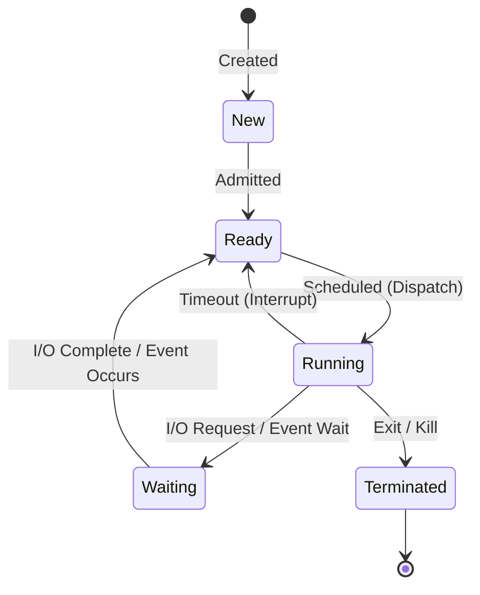
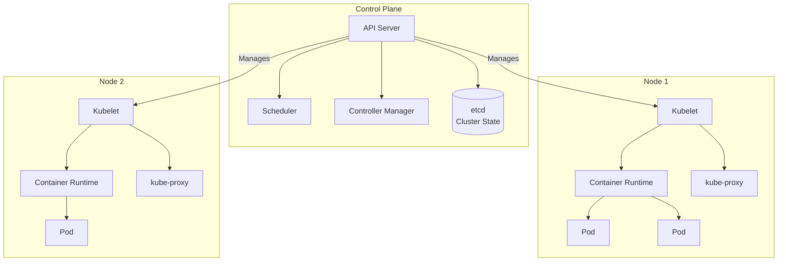

    

<h3 align="center">WELCOME TO</h3>
<h1 align="center">BLACXQUAD FREEMIUM REPOSITORY!</h1>
<h3 align="center">A HUB FOR FREE TECH LEARNING & RESOURCES.</h3>

  

    

    

  

    
 

> [!IMPORTANT]

This work is licensed under the **Creative Commons Attribution-ShareAlike 4.0 International License** (CC BY-SA 4.0).

When using, redistributing, adapting, or building upon this material, you **must** provide proper attribution by:

- 1. **Clearly stating the original source** as the **BLACXQUAD GitHub repository**.
- 2. **Including the exact URL(s)** to the relevant repository or file(s).

**Example Attribution Format:**  
- This work is based on content from the BLACXQUAD GitHub repository, available at:  
- https://github.com/blacxquad/freemium

Under the CC BY-SA license, you **must also**:
- Indicate if changes were made.
- License any adapted material under **identical terms** (CC BY-SA 4.0).

Failure to provide accurate source attribution violates the license terms.

    

<h1 align="center">The Comprehensive Guide to Modern Operating Systems: Architecture, Evolution, and Future Directions.</h1>

  
 
## Executive Summary: The Indispensable Foundation of Computing

An operating system (OS) is the foundational software layer that acts as a crucial intermediary between physical computer hardware and the applications we use daily. Its primary function is to abstract the immense complexity of the hardware—managing processors, memory, storage, and devices—while providing a stable, secure, and efficient environment for software execution. This guide offers a systematic exploration of OS principles, tracing their evolution from simple batch processors to the intelligent, distributed systems of today and tomorrow. Designed for engineers, researchers, and technology enthusiasts, this document consolidates core mechanisms, contemporary architectures, and emerging paradigms into a clear, unified reference, illuminating the OS's enduring role as the master orchestrator of all computing resources.

 

## 1.0 From Bare Metal to Cloud: The Historical Evolution of Operating Systems

The development of operating systems is a story of increasing abstraction and sophistication, driven by the need to improve hardware utilization, support interactive users, and manage ever-more-complex tasks.

### 1.1 Core Purpose and Definition
An operating system is a suite of software that manages computer hardware resources and provides common services for application programs. It serves four essential purposes:
*   **Hardware Abstraction:** The OS hides the intricate details of the CPU, memory, and devices behind standardized system calls and APIs. This allows software developers to write programs for a consistent interface rather than for specific, ever-changing hardware, enabling portability and simplifying development.
*   **Resource Management:** It acts as a traffic cop and allocator for finite system resources. The OS arbitrates access to the processor, memory space, storage I/O, and network bandwidth among competing applications and users, ensuring fair and optimal utilization to maximize overall system efficiency.
*   **Execution Environment:** The OS creates and manages the process, which is the fundamental unit of work. It handles the entire lifecycle: loading code into memory, scheduling it on the CPU, facilitating its communication with other processes, and finally cleaning up after it terminates.
*   **Security and Protection:** Through user authentication, access control lists, and isolation mechanisms, the OS enforces policies that protect the system's integrity and user data from unauthorized access, malicious software, and errant programs, forming the bedrock of computing security.

### 1.2 The Seven Levels of OS Evolution

| Evolutionary Level | Era | Key Innovation | Example Systems | Primary Driver |
| :--- | :--- | :--- | :--- | :--- |
| **1. Bare-Metal Systems** | 1950s | No OS; direct hardware programming | IBM 701 | Basic computation |
| **2. Batch Processing** | 1960s | Automated job sequencing; reduced operator intervention | IBM OS/360 | Improve CPU utilization |
| **3. Time-Sharing** | 1960s-70s | Interactive computing; multiple users share CPU via rapid switching | CTSS, UNIX | Enable interactive use |
| **4. Multi-User Multitasking** | 1970s-80s | Preemptive scheduling; robust process isolation & networking | UNIX System V, VMS | Support minicomputers & workstations |
| **5. Graphical Desktop** | 1980s-90s | WIMP interface (Windows, Icons, Menus, Pointer); desktop metaphor | Windows 95, Mac OS, X11 | Personal computing & usability |
| **6. Mobile & Embedded** | 2000s-Present | Touch-first UI; power-optimized scheduling; sensor integration | iOS, Android, FreeRTOS | Mobility & ubiquitous computing |
| **7. Cloud & Virtualized** | 2010s-Present | Hypervisors, containers, declarative orchestration of distributed resources | Kubernetes, VMware ESXi, Container OSes | Scalability & cloud-native architecture |

*   **Level 1: Bare-Metal Systems (1950s):** Programmers directly manipulated hardware via switches and plugboards, with no intervening software. Machines executed one job at a time from start to finish, leading to extremely poor CPU utilization due to extensive manual setup between jobs. This era had no concept of an operating system as we know it, with programming being a highly specialized, physical task.
*   **Level 2: Batch Processing Systems (1960s):** To reduce idle time, similar jobs were grouped into "batches" on punch cards and processed sequentially by a resident monitor program. Operators used a Job Control Language (JCL), and I/O spooling allowed the CPU to work on one job while another performed input/output, significantly improving throughput. However, these systems offered no interactivity, with users submitting jobs and receiving results much later.
*   **Level 3: Time-Sharing and Multiprogramming (1960s-1970s):** Multiprogramming kept several jobs in memory at once, switching the CPU to a new job when one waited for I/O. Time-sharing extended this to support multiple interactive users at terminals, with the CPU rapidly switching between them to create the illusion of exclusive access. This era birthed UNIX and concepts like virtual memory and hierarchical file systems, revolutionizing how humans interacted with computers.
*   **Level 4: Multi-User Multitasking Systems (1970s-1980s):** Systems on minicomputers and workstations matured to support robust, secure multi-user environments. Preemptive scheduling allowed the OS to forcibly interrupt processes, ensuring responsiveness. Features like strong process isolation, memory protection, and integrated networking (LANs) became standard, enabling true collaborative and networked computing in commercial and academic settings.
*   **Level 5: Graphical Desktop Systems (1980s-1990s):** The WIMP paradigm, popularized by the Apple Macintosh and Microsoft Windows, replaced command lines with intuitive graphical metaphors. The OS now managed new hardware like mice and bitmapped displays, introducing "plug-and-play." The focus shifted from raw resource optimization to user experience, application compatibility, and multimedia, driving the PC's rise as a mainstream appliance.
*   **Level 6: Mobile and Embedded Systems (2000s-Present):** OSes were redesigned for power-constrained, touch-centric, and sensor-rich devices. Energy efficiency became paramount, leading to techniques like tickless kernels. The application model shifted to sandboxed, store-distributed apps running in isolated containers. Deep integration of sensors (GPS, accelerometer) and always-connected capabilities defined this era, exemplified by iOS and Android.
*   **Level 7: Cloud and Virtualized Ecosystems (2010s-Present):** The OS's role expanded to manage virtualized, disaggregated resources across global data centers. The hypervisor became a new kernel-like layer, and containerization provided lightweight application packaging. Specialized, immutable OSes (like CoreOS) emerged solely to run container orchestrators like Kubernetes, enabling the microservices and serverless paradigms that power modern web-scale applications.

 

## 2.0 Core Architectural Components: How an Operating System Works

An OS is built from several interconnected subsystems, each responsible for managing a specific set of resources.

### 2.1 Process Management and Scheduling
The OS creates the abstraction of a process—an instance of a running program—and manages its entire lifecycle from creation to termination.

**Process State Lifecycle**
A process moves through a defined set of states during its lifetime. The OS scheduler manages the transitions between these states, determining which process gets to use the CPU and when.

**CPU Scheduling Algorithms**
The scheduler uses algorithms to decide which ready process runs next. Different algorithms optimize for different goals like fairness, throughput, or latency.

| Algorithm | Core Principle | Best For | Key Limitation |
| :--- | :--- | :--- | :--- |
| **First-Come-First-Served** | Executes processes in order of arrival. | Simplicity. | Poor for short jobs (convoy effect). |
| **Shortest Job First** | Selects process with smallest estimated CPU burst. | Minimizing average wait time. | Requires accurate burst estimation; unfair to long jobs. |
| **Round Robin** | Each process gets a fixed time slice (quantum) in cyclic order. | Fairness and good response time for time-sharing. | Performance depends heavily on quantum size. |
| **Priority Scheduling** | Process with highest priority runs first. | Differentiating importance (e.g., real-time vs. batch). | Starvation of low-priority processes. |
| **Multilevel Feedback Queue** | Multiple queues with different priorities; processes move between queues based on behavior. | General-purpose systems; adapts to process behavior. | Complex to implement and tune correctly. |

**Interprocess Communication (IPC)**
Processes often need to share data and coordinate actions.
*   **Shared Memory:** The fastest IPC method, where a region of memory is mapped into the address spaces of multiple processes. However, it requires programmers to implement explicit synchronization (using semaphores or mutexes) to prevent race conditions and data corruption, placing a significant burden on development.
*   **Message Passing:** The kernel provides communication channels like pipes, message queues, or sockets. Processes send and receive structured messages, with the OS handling buffering and synchronization. This method is safer and simpler for developers than shared memory but incurs higher overhead due to kernel involvement for every message.
*   **Synchronization Primitives:** The OS provides tools like locks, semaphores, and condition variables to control how processes or threads access shared resources. These primitives prevent problems like race conditions (where outcome depends on timing) and deadlocks (where processes wait indefinitely for each other), ensuring data integrity and predictable execution.

### 2.2 Memory Management Architecture
The OS is responsible for allocating physical memory to processes and providing each with the illusion of a large, private, and contiguous address space.

**Virtual Memory via Paging**
*   Physical memory is divided into fixed-size blocks called *frames*. A process's address space is divided into same-sized blocks called *pages*.
*   The OS maintains a *page table* for each process, which maps the process's virtual page numbers to physical frame numbers. This allows pages to be stored in non-contiguous physical frames, solving the problem of external fragmentation.
*   When a process accesses a memory address, the Memory Management Unit (MMU) hardware uses the page table to translate the virtual address to a physical address. If the required page is not in memory (a *page fault*), the OS loads it from disk.

**Page Replacement Algorithms**
When a page fault occurs and no free frame is available, the OS must select a "victim" page to evict from memory. The choice of algorithm significantly impacts performance.

| Algorithm | Selection Rule | Comment |
| :--- | :--- | :--- |
| **Optimal (MIN)** | Replace page used furthest in the future. | Theoretical benchmark; impossible to implement. |
| **Least Recently Used (LRU)** | Replace page that hasn't been used for the longest time. | Approximates OPT well but requires hardware support for efficient implementation. |
| **First-In-First-Out** | Replace the page that has been in memory the longest. | Simple but suffers from Belady's Anomaly (more frames can lead to more faults). |
| **Clock (Second Chance)** | Approximate LRU using a "use" bit; pages are inspected in a circular buffer. | Efficient software approximation; widely used in practice. |

**Performance Acceleration: The TLB**
The Translation Lookaside Buffer (TLB) is a hardware cache inside the CPU that stores recent virtual-to-physical address translations. A TLB "hit" allows translation in one clock cycle, while a "miss" requires a slow walk of the page table in memory. OS and hardware design strive to maximize TLB hit rates for optimal performance.

### 2.3 File System Implementation
The file system provides persistent, named data storage on devices like hard drives and SSDs, organizing data into files and directories.

**Core Structures and Allocation**
*   **Metadata Management (Inodes):** Systems like ext4 use *inodes* to store all metadata about a file (permissions, owner, timestamps, size) and pointers to the data blocks containing the file's content. This separates the file's name (stored in a directory) from its actual data and attributes.
*   **Block Allocation Strategies:** The file system must track which blocks belong to which file. Methods include linked lists (each block points to the next), file allocation tables (a centralized map), and indexed allocation (using inode pointers). Modern systems like ext4 use *extents*—contiguous block ranges—for efficiency with large files.
*   **Directory Implementation:** Directories are special files that map human-readable filenames to file identifiers (like inode numbers). They can be implemented as simple lists, hash tables, or B-trees for faster lookups in large directories.

**Reliability Features: Journaling and COW**
*   **Journaling:** To prevent corruption after a crash (e.g., power loss), metadata changes are first written sequentially to a journal (a write-ahead log). After a crash, the system can replay the journal to complete or undo interrupted operations, bringing the filesystem to a consistent state quickly without a lengthy full-disk check.
*   **Copy-on-Write (COW):** Used by Btrfs and ZFS. When data is modified, it is written to a new block, and pointers are updated atomically. The old data remains, providing instant, space-efficient snapshots. This also avoids the corruption risks of in-place updates.

**Modern Advanced Features**
*   **Snapshots and Cloning:** COW filesystems allow instantaneous, read-only snapshots of the entire filesystem or subvolumes, crucial for backups and virtual machine management. Cloning creates writable copies efficiently.
*   **Deduplication and Compression:** Identical data blocks are stored only once, and data is transparently compressed. These features dramatically optimize storage capacity, especially for virtual machine images and backup archives.
*   **Data Integrity:** Advanced filesystems like ZFS use checksums for all data and metadata. When reading data, the checksum is verified, enabling the detection and, if configured with redundancy, the correction of silent data corruption—a fault traditional filesystems cannot detect.

### 2.4 Device and I/O Management
The OS abstracts the vast diversity of hardware devices (disks, networks, keyboards) into a manageable set of uniform interfaces.

**The I/O Software Stack**
*   **Device Drivers:** Kernel modules that act as translators. They understand the specific commands and registers of a particular hardware device and present a standard interface to the upper layers of the OS.
*   **Device-Independent OS Layer:** Provides common services like naming, protection, buffering, and error handling for all I/O. It presents a uniform system call interface (e.g., `read()`, `write()`) to user applications.
*   **User-Level Libraries:** Provide convenient, higher-level APIs. For example, the C standard I/O library (`stdio`) offers functions like `printf()` and `fgets()`, which internally use the OS's low-level system calls.

**Performance Optimization Techniques**
*   **Buffering and Caching:** Data is held temporarily in RAM to smooth out speed mismatches between the fast CPU and slow devices. A *page cache* holds frequently accessed file data, dramatically speeding up repeated reads.
*   **Direct Memory Access (DMA):** A specialized controller transfers data directly between device and main memory without continuous CPU involvement. The CPU initiates the transfer and is free to do other work until the DMA controller signals completion with an interrupt, enabling high-speed I/O.
*   **Interrupt-Driven I/O:** The CPU initiates an I/O operation and then switches to other tasks. The device raises a hardware *interrupt* upon completion, allowing the CPU to handle the result efficiently. This is far superior to *polling*, where the CPU wastes cycles repeatedly checking device status.

### 2.5 Security and Protection Mechanisms
Security is a cross-cutting concern integrated into every OS component, designed to protect system integrity and user data from accidents and malice.

**Access Control Models**
*   **Discretionary Access Control (DAC):** The resource owner (e.g., a file's creator) controls access permissions. This is the model of standard UNIX file permissions (`rwx`) and Windows ACLs. It offers flexibility but relies on users making good security decisions.
*   **Mandatory Access Control (MAC):** A system-wide security policy, set by administrators, dictates all access decisions. Users cannot override it. SELinux and AppArmor on Linux are implementations of MAC, using labels to enforce complex policies (e.g., "this web server process can only read files labeled `httpd_content_t`").
*   **Role-Based Access Control (RBAC):** Access is granted based on the functional role a user holds (e.g., "developer," "accountant") rather than individual identity. This simplifies permission management in large organizations by assigning permissions to roles and users to roles.
*   **Capability-Based Security:** Access rights are embodied in unforgeable tokens or "capabilities" held by processes. To access a resource, a process must present the corresponding capability. This enables fine-grained, delegable control but requires significant architectural changes.

**Core Implementation Mechanisms**
*   **User/Kernel Mode (Dual-Mode Operation):** Modern CPUs provide privilege levels (rings). The OS kernel runs in privileged *kernel mode*, with direct access to hardware. User applications run in restricted *user mode* and must request kernel services via *system calls*, which trap into kernel mode. This hardware-enforced separation prevents buggy or malicious applications from crashing the entire system.
*   **Address Space Layout Randomization (ASLR):** Randomizes the memory addresses used for key data areas (stack, heap, libraries) each time a process starts. This makes it exponentially harder for attackers to predict target addresses for buffer overflow exploits, a common attack vector.
*   **Sandboxing:** Uses kernel features to create highly constrained execution environments. *Namespaces* isolate a process's view of the system (e.g., its own private filesystem, network). *Control groups (cgroups)* limit its resource usage (CPU, memory). This is fundamental to container security and application sandboxes on mobile OSes.

 

## 3.0 Landscape of Modern Operating System Families

Today's computing ecosystem features distinct OS families optimized for different domains.

### 3.1 Desktop and Server Systems

**Microsoft Windows**
*   **Hybrid Kernel Architecture:** The Windows NT kernel blends monolithic and microkernel ideas. Core services run in kernel mode for performance, but many subsystems (graphics, some drivers) run as separate user-mode servers for stability.
*   **Subsystem Model:** Supports multiple API families through environmental subsystems. The primary Win32 subsystem provides the core Windows API. The modern **Windows Subsystem for Linux (WSL 2)** uses a lightweight utility VM with a real Linux kernel for deep binary compatibility.
*   **Registry and Management:** Uses a centralized, hierarchical **Registry** for system/application configuration. In enterprise settings, **Active Directory** provides comprehensive identity, policy, and resource management across networks.

**macOS (and the Darwin Foundation)**
*   **XNU Kernel:** A hybrid kernel combining the Mach 3.0 microkernel (handling low-level tasks) with BSD components (providing POSIX APIs, networking) and an I/O Kit driver framework, all integrated into a single address space.
*   **Grand Central Dispatch (GCD):** A sophisticated concurrency framework that simplifies multicore programming by abstracting thread pool management into queues and blocks, allowing developers to leverage modern CPUs efficiently.
*   **Apple File System (APFS):** A modern, copy-on-write filesystem designed for flash storage, featuring strong encryption, space sharing, fast directory sizing, and efficient snapshots.
*   **Security Model:** Integrates **Gatekeeper** (code signing), **Notarization** (Apple malware scans), and **System Integrity Protection (SIP)** (locks down system files even from root) to create a robust defense-in-depth approach.

**The Linux Ecosystem**
*   **Monolithic Kernel with Modules:** The Linux kernel is monolithic for performance but gains flexibility via **Loadable Kernel Modules (LKMs)**, which allow drivers and features to be added at runtime without rebooting.
*   **Systemd Init System:** The standard init system for most distributions, providing aggressive parallel service startup, on-demand activation, snapshot/restore, and a centralized logging service (`journald`).
*   **Package Management:** A defining strength. Tools like APT (Debian/Ubuntu), YUM/DNF (RHEL/Fedora), and Pacman (Arch) handle software installation, dependency resolution, and updates from curated repositories, ensuring system consistency.
*   **Container Primitives:** Linux provides the foundational technologies for containers: **namespaces** for isolation and **cgroups** for resource limits. Combined with union filesystems (OverlayFS), this forms the core of Docker, Kubernetes, and other container platforms.

### 3.2 Mobile and Embedded Platforms

**Android**
*   **Linux Kernel Foundation:** Uses a modified Linux kernel with Android-specific additions for power management (wakelocks), IPC (Binder), and memory management (ashmem).
*   **Hardware Abstraction Layer (HAL):** Defines standard interfaces for hardware components (camera, sensors). Device vendors provide HAL implementations, allowing the Android framework to work without device-specific kernel drivers.
*   **Android Runtime (ART):** Replaced the Dalvik JIT compiler. ART performs **Ahead-of-Time (AOT)** compilation of app bytecode to native machine code upon installation, improving performance and battery life.
*   **Project Treble:** A major re-architecture that separates the vendor implementation (HAL, drivers) from the Android framework via a stable vendor interface, aiming to accelerate OS updates and reduce fragmentation.

**iOS**
*   **XNU Kernel Adaptation:** A variant of the macOS kernel heavily optimized for ARM architecture, power efficiency, and security, with features like fine-grained memory compression.
*   **Strict Sandboxing:** Every app runs in a secure "container" with a unique filesystem area. Access to sensitive resources (contacts, camera) is controlled via a declarative permission system requiring explicit user approval.
*   **Secure Enclave:** A dedicated, isolated coprocessor within Apple's SoC that handles cryptographic operations and stores biometric data (Touch ID/Face ID). It ensures sensitive data is never accessible to the main OS or applications.

**Real-Time Operating Systems (RTOS)**
*   **Deterministic Scheduling:** Algorithms like Rate-Monotonic Scheduling (RMS) or Earliest Deadline First (EDF) provide guaranteed, predictable worst-case response times, which is critical for control systems.
*   **Minimal Latency:** Designed for fast, predictable interrupt handling and context switching. Kernel operations often have bounded, known execution times.
*   **Memory Protection:** Higher-end RTOS (QNX, VxWorks) offer full MMU-based isolation. Lightweight RTOS (FreeRTOS, Zephyr) may use a Memory Protection Unit (MPU) or run all tasks in a single address space for minimal overhead.
*   **Representative Implementations:** **FreeRTOS** is a popular open-source choice for microcontrollers. **Zephyr** is a scalable, open-source RTOS project. **QNX** is a commercial, microkernel-based RTOS known for high reliability in automotive and medical systems.

### 3.3 Specialized and Legacy Systems

**UNIX Derivatives and BSD Variants**
*   **Solaris:** Known for advanced features like **DTrace** (dynamic tracing), **Zones** (containers), and its integration of the **ZFS** filesystem.
*   **FreeBSD:** Renowned for its high-performance, robust TCP/IP network stack, making it a preferred choice for networking appliances and high-load servers.
*   **OpenBSD:** Emphasizes proactive security, code correctness, and auditing. It is the origin of widely used security tools like **OpenSSH**, **pf** firewall, and **LibreSSL**.

**Container-Optimized Operating Systems**
*   **Immutable Infrastructure:** The core OS filesystem is read-only. Updates are applied by replacing the entire OS image atomically, ensuring consistency and simplifying rollbacks.
*   **Minimal Footprint:** Stripped of non-essential packages and daemons, these OSes have a small attack surface and fast boot times. They typically include only the kernel, container runtime (containerd), and orchestration agent (kubelet).
*   **Automated Management:** They often include robust, automated update mechanisms and integrate deeply with cluster orchestrators for health reporting and management.
*   **Examples:** **Flatcar Container Linux**, **RancherOS**, **Bottlerocket** (AWS), and **Google's Container-Optimized OS**.

 

## 4.0 Virtualization and Cloud Integration: The OS Expands Its Domain

Modern OS concepts now apply to managing entire clusters of machines, not just single computers.

### 4.1 Hypervisor Architectures

| Type | Description | Use Case | Examples |
| :--- | :--- | :--- | :--- |
| **Type 1: Bare-Metal** | Installs directly on hardware; acts as a specialized OS for running VMs. | Enterprise data centers, cloud infrastructure. | VMware ESXi, Microsoft Hyper-V, KVM, Xen. |
| **Type 2: Hosted** | Runs as an application on a conventional host OS (Windows, macOS, Linux). | Development, testing, desktop use. | VMware Workstation, Oracle VirtualBox, Parallels. |

*   **Hardware-Assisted Virtualization:** CPU extensions (Intel VT-x, AMD-V) allow unmodified guest OSes to run at near-native speed by introducing a new CPU privilege level (root mode) for the hypervisor. This made mainstream virtualization feasible.
*   **Paravirtualization:** An earlier approach requiring modifications to the guest OS kernel to replace non-virtualizable instructions with hypervisor calls ("hypercalls"). It offered good performance but required OS cooperation.
*   **I/O Virtualization (SR-IOV):** Allows a single physical PCIe device (like a network card) to present itself as multiple "virtual functions" that can be assigned directly to VMs. This provides near-native I/O performance by bypassing the hypervisor's software virtual switch for data traffic.

### 4.2 The Containerization Technology Stack
Containers package an application and its dependencies into a standardized, lightweight unit, sharing the host machine's OS kernel.

**Isolation: Linux Namespaces**
Namespaces partition global system resources, giving a process the illusion of having its own isolated instance.

| Namespace | Isolated Resource | Effect |
| :--- | :--- | :--- |
| **PID** | Process IDs | Container sees its own PID 1 init process. |
| **Network** | Interfaces, routing, ports | Container gets its own IP, routing table. |
| **Mount** | Filesystem mount points | Container has isolated view of filesystem hierarchy. |
| **UTS** | Hostname and domain name | Container can have its own hostname. |
| **User** | User and group IDs | Maps UIDs/GIDs inside container to different IDs on host. |

**Resource Management: Control Groups (cgroups)**
Cgroups limit, account for, and isolate the resource usage (CPU, memory, disk I/O, network) of a collection of processes. They prevent any single container from monopolizing system resources.

**Runtimes and Standards**
*   **Open Container Initiative (OCI):** Defines industry standards for container image formats and runtime execution, ensuring interoperability.
*   **Containerd:** A high-level, industry-standard container runtime that manages the complete container lifecycle. It is the default runtime for Docker and Kubernetes.
*   **CRI-O:** A lightweight, Kubernetes-native runtime that implements the Kubernetes CRI (Container Runtime Interface), optimized for running Kubernetes pods.
*   **Podman:** A daemonless container engine offering a Docker-compatible CLI. It runs containers directly under the user's control, improving security and enabling rootless containers.

### 4.3 Orchestration and Cluster Management (Kubernetes)
Kubernetes (K8s) is the dominant system for automating the deployment, scaling, and management of containerized applications across clusters of machines.

**Kubernetes Architecture**
Kubernetes follows a client-server architecture with a central control plane and numerous worker nodes.

*   **Control Plane Components:** The **API Server** is the front-end; the **Scheduler** assigns pods to nodes; the **Controller Manager** runs core control loops; **etcd** is the persistent, highly-available store for all cluster data.
*   **Node Components:** The **kubelet** is an agent that ensures containers are running in pods. The **container runtime** runs the containers. **kube-proxy** maintains network rules to allow communication to pods.
*   **Networking and Storage:** A **CNI (Container Network Interface)** plugin provides pod networking. A **CSI (Container Storage Interface)** plugin provides persistent storage to pods, abstracting underlying storage systems.

**Service Meshes (e.g., Istio, Linkerd)**
A service mesh is a dedicated infrastructure layer for managing service-to-service communication in a microservices architecture. It uses a **sidecar proxy** pattern (a proxy container injected next to each app container) to provide traffic management, security (mTLS), and observability transparently to the application code.

 

## 5.0 Emerging Paradigms and Research Directions

The frontier of OS research is driven by new hardware, novel workloads, and the relentless pursuit of better security and performance.

### 5.1 AI-Integrated Operating Systems
*   **Predictive Resource Management:** Kernels may incorporate lightweight ML models to forecast application demands (CPU, memory, I/O) based on historical patterns. This enables proactive resource allocation, memory pre-fetching, and anticipatory power management, smoothing performance and improving efficiency without user intervention.
*   **Intelligent Scheduling:** Reinforcement learning algorithms could create schedulers that dynamically adapt to complex, heterogeneous workloads mixing latency-sensitive services with batch jobs, optimizing for multiple objectives (throughput, latency, energy) across diverse hardware (CPUs, GPUs, TPUs).
*   **Automated System Administration:** OSes could evolve towards self-healing systems. By analyzing logs, metrics, and traces with AI, the OS could diagnose root causes (e.g., a memory leak) and apply safe remediations (restarting a service, rolling back an update), drastically reducing operational toil.

### 5.2 Quantum Computing Operating Systems
*   **Hybrid Classical-Quantum Management:** A future OS will need to manage a hybrid resource pool of classical processors and Quantum Processing Units (QPUs). It will handle scheduling quantum circuits onto QPUs, managing fragile quantum memory (qubits), and orchestrating the complex interplay between classical preprocessing and quantum execution.
*   **Error Correction and Calibration:** Quantum hardware is extremely error-prone. The OS will need to manage the application of quantum error correction codes (requiring many physical qubits per logical qubit) and schedule regular hardware calibration, abstracting this immense complexity from the programmer.
*   **Development Environment Support:** OS-level support will be crucial for providing standardized, hardware-agnostic quantum programming APIs and high-performance simulators that run on classical HPC clusters for algorithm development and testing.

### 5.3 Decentralized and Blockchain-Based Systems
*   **Trusted Execution Environments (TEEs):** OSes are evolving to leverage hardware TEEs like Intel SGX and AMD SEV. These create encrypted, isolated memory regions (enclaves) where code and data are protected even from the privileged OS kernel. The OS facilitates enclave creation, attestation (cryptographic proof of integrity), and secure communication.
*   **Decentralized Resource Markets:** Research explores OSes that can broker compute and storage in peer-to-peer networks, using blockchain-like consensus for local resource allocation. This could enable truly distributed compute grids where the OS kernel itself participates in a cryptographically-secured resource market.
*   **Cryptographic Identity as Primitive:** The traditional user/group model could be augmented with cryptographic identities. Access control could be based on possession of a private key or a zero-knowledge proof, with the OS managing these keys and enforcing corresponding policies.

### 5.4 Extended Reality (XR) Operating Systems
*   **Spatial Computing Frameworks:** XR OSes must manage applications and objects in 3D space around the user. This requires a spatial compositor that renders multiple layers into a coherent 3D scene, handles occlusion, and manages persistent, world-locked content.
*   **Multi-Modal Input Fusion:** The OS must process and fuse inputs from gaze, hand gestures, voice, and haptics with ultra-low latency to discern user intent (e.g., selecting an object by looking at it while pinching).
*   **Perception and Context Awareness:** Deep sensor integration (cameras, LiDAR, IMU) enables real-time environment understanding via SLAM. The OS provides APIs for apps to query this world model ("place a virtual screen on that wall") while strictly controlling access to sensitive perceptual data for privacy.

### 5.5 Security-First Architectural Innovations
*   **Microkernel and Unikernel Resurgence:** The pursuit of a minimal **Trusted Computing Base (TCB)** continues. **Microkernels** (like seL4) run most OS services as isolated user-mode servers, so a driver compromise doesn't breach the kernel. **Unikernels** compile an application with only the precise OS libraries it needs into a single, secure, specialized image, eliminating the general-purpose OS attack surface.
*   **Zero-Trust Operating Systems:** Moving beyond perimeter security, a zero-trust OS assumes all code is untrusted. It continuously validates process integrity, enforces dynamic access policies for every resource request, and maintains comprehensive audit logs. Hardware roots of trust (TPM) are essential for bootstrapping this model.
*   **Formal Verification:** Applying mathematical methods to prove the correctness of critical OS components (scheduler, memory manager) against a formal specification. This can guarantee the absence of whole classes of bugs (like certain security vulnerabilities) but is computationally expensive and currently applied to small, critical kernels or subsystems.

 

## 6.0 Performance Analysis and Optimization

Understanding and improving OS performance is critical for deploying efficient systems.

### 6.1 Benchmarking Methodologies
*   **Workload Characterization:** The first step is to profile the system to identify the bottleneck. Tools like `perf`, `vmstat`, `iostat`, and `pidstat` reveal whether the workload is CPU-bound (high `%user`), memory-bound (high page fault rate), I/O-bound (high `%iowait`), or suffering from lock contention.
*   **Micro vs. Macro Benchmarks:** **Microbenchmarks** (e.g., `lmbench`) measure specific, low-level operations like system call latency or context switch time, helping to isolate subsystem performance. **Macrobenchmarks** (e.g., a full web application stack test) measure overall system performance under a realistic, composite load.
*   **Key Performance Indicators (KPIs):** Choose metrics relevant to the use case: **Queries Per Second (QPS)** and **tail latency** (99th percentile) for web services, **Transactions Per Second (TPS)** for databases, **FLOPs** for scientific computing, or **job completion time** for batch processing.

### 6.2 Optimization Techniques

**Kernel-Level Tuning**
*   **Reducing Lock Contention:** In multi-core systems, spinlocks protecting shared kernel data become bottlenecks. Techniques include using finer-grained locks, reader-writer locks, or lock-free/wait-free algorithms for specific data structures to improve parallelism.
*   **Interrupt and Timer Coalescing:** High interrupt rates from network/storage devices cause CPU overhead. **Interrupt coalescing** batches multiple events into a single interrupt. **Timer coalescing** groups software timers, allowing the CPU to stay in low-power states longer.
*   **Memory Management Tuning:** Adjusting parameters like `vm.swappiness` (tendency to swap), enabling/disabling **Transparent Huge Pages (THP)**, and tuning the page reclaim aggressiveness can significantly impact memory-intensive workloads.

**Filesystem Performance**
*   **I/O Scheduler Selection:** Linux offers different schedulers: `none` (good for fast NVMe SSDs), `deadline` (good for latency), `bfq` (good for fairness on desktops). Choosing the right one matters.
*   **Mount Options:** Using `noatime` (don't update file access times) reduces write operations. Choosing the right journaling mode (`data=ordered` vs. `data=writeback` in ext4) trades off integrity for write performance.
*   **Caching Strategy:** Adjusting the size of the page cache and using `O_DIRECT` for applications that manage their own cache (like databases) can prevent wasteful double-buffering.

**Network Stack Optimization**
*   **TCP Buffer Auto-Tuning:** Modern kernels auto-tune TCP buffer sizes based on the bandwidth-delay product. Ensure `net.ipv4.tcp_moderate_rcvbuf=1` is enabled for optimal throughput on high-speed networks.
*   **Interrupt Moderation & Packet Batching:** Features like Generic Receive Offload (GRO) and Transmit Packet Steering (XPS) batch packets and steer processing to specific CPU cores, improving cache locality and reducing overhead.
*   **Zero-Copy Networking:** Using `sendfile()` system call or frameworks like `io_uring` allows data to be transferred directly from a file to a network socket (or between sockets) without copying to user-space, drastically reducing CPU and memory overhead for data-serving applications.

 

## 7.0 Deployment Considerations and Best Practices

Selecting, configuring, and maintaining an OS requires careful planning and ongoing discipline.

### 7.1 System Selection Criteria

**Technical Requirements**
*   **Application Compatibility:** The foremost consideration. Verify that all required software, libraries, and drivers are available and supported on the OS version you plan to use.
*   **Performance & Scalability:** Evaluate the OS's proven track record in similar use cases. Consider its ability to scale vertically (on larger hardware) and horizontally (in a cluster). Linux dominates HPC and web serving; Windows Server is strong in enterprise AD environments.
*   **Security & Compliance:** Does the OS meet industry or regulatory security requirements (e.g., DISA STIGs, Common Criteria)? Consider its built-in security features (SELinux, TPM support) and the vendor's patch frequency and support lifecycle.

**Operational Considerations**
*   **Administrative Expertise & Tooling:** Align the choice with in-house skills. Linux has vast open-source automation tooling (Ansible, Puppet). Windows integrates deeply with enterprise management suites (Microsoft Endpoint Manager). The wrong choice can increase TCO significantly.
*   **Total Cost of Ownership (TCO):** Factor in licensing fees, support contracts, management tool costs, and the labor required for administration and maintenance. Open source isn't "free" if it requires expensive specialized talent.
*   **Hardware & Vendor Support:** Ensure the OS is fully supported on your chosen hardware platform with certified drivers and vendor technical support. This is critical for stability and for getting help when needed.

### 7.2 Configuration and Hardening

**Establishing a Security Baseline**
*   **Principle of Least Privilege:** Run services under dedicated, non-root service accounts. In containers, run as a non-root user and drop unneeded kernel capabilities. Use filesystem capabilities (`setcap`) instead of full SUID where possible.
*   **Minimize Attack Surface:** Perform a minimal installation. Disable and remove unused services, daemons, and kernel modules. A web server does not need a mail server or Bluetooth stack.
*   **Network Hardening:** Configure a host-based firewall (iptables/nftables, firewalld, Windows Firewall) to allow only necessary traffic. Use SSH key authentication, disable root login via SSH, and consider changing the default SSH port.

**Performance Tuning Methodology**
*   **Measure, Change One Thing, Validate:** Never tune blindly. First, establish a performance baseline. Change one parameter (e.g., `vm.dirty_ratio`), then re-measure to see the impact. Document all changes.
*   **Leverage Tuning Profiles:** Use OS-provided tuning profiles as a starting point (e.g., RHEL's `tuned` profiles for `throughput-performance` or `virtual-host`).
*   **Monitor for Regression:** Tuning is not set-and-forget. Continuously monitor KPIs to ensure changes don't negatively impact other aspects of performance, especially after system updates.

### 7.3 Monitoring and Maintenance

**Building an Observability Stack**
*   **Metrics Collection:** Deploy agents (Prometheus `node_exporter`, Telegraf) to collect system and application metrics. Store them in a time-series database (Prometheus, InfluxDB) and visualize with Grafana.
*   **Centralized Logging:** Aggregate all system and application logs to a central platform (ELK Stack, Loki/Grafana). This enables log correlation, fast searching during incidents, and compliance auditing.
*   **Distributed Tracing:** For microservices, implement tracing (Jaeger, Zipkin) to track requests as they flow through services. This is essential for diagnosing latency issues in complex architectures.

**Update and Patch Management**
*   **Staged Deployment Pipeline:** Use a pipeline: Test updates in an isolated environment first, then deploy to a non-critical staging environment, and finally to production in a rolling or canary fashion.
*   **Automate with Rollback:** Use configuration management (Ansible) or OS tools (`unattended-upgrades`) to automate patches. Always have a tested rollback plan, which could involve snapshot restoration or package downgrade.
*   **Proactive Vulnerability Management:** Subscribe to security lists (e.g., vendor bulletins). Regularly scan systems for known vulnerabilities and prioritize patching based on severity and exploitability, not just patch age.

 

## 8.0 Conclusion and Future Outlook

The operating system remains the indispensable cornerstone of computing, continuously evolving to bridge the gap between advancing hardware and burgeoning software demands. Its journey from managing single processors to orchestrating global, distributed resource pools demonstrates its remarkable adaptability. Looking forward, several convergent trends will shape its next chapter:

1.  **Vertical Integration and Specialization:** The line between hardware and OS will blur with domain-specific architectures. We will see OSes deeply co-designed with specialized silicon for AI, quantum, and real-time edge computing, where the kernel has intimate knowledge of unique hardware features.
2.  **Horizontal Distribution and Unification:** The OS abstraction will expand to seamlessly span heterogeneous environments—from IoT sensors to the cloud. The concept of a single, distributed "cluster OS" will mature, providing a unified API for planetary-scale compute resources.
3.  **Intelligent Automation and Autonomy:** Machine learning will transition from a workload managed by the OS to an integral component of it. Self-tuning, self-healing, and self-securing systems will become standard, dramatically reducing operational complexity.
4.  **Security as a Foundational Primitive:** Future architectures will be designed from the ground up with a zero-trust model, leveraging hardware roots of trust, pervasive encryption, and formal verification to create inherently resilient systems.
5.  **Proliferation of Purpose-Built Kernels:** The general-purpose kernel will coexist with specialized kernels—unikernels, microkernels, exokernels—each finding its niche in serverless platforms, secure embedded systems, and high-assurance environments where minimalism and specific guarantees are paramount.

In conclusion, while the metaphors and implementations will transform, the essential purpose of the operating system endures. It is the master composer of the computing symphony, orchestrating the intricate interplay of physical resources to execute the software that defines our digital world. Its continued evolution will be central to unlocking the potential of every next-generation computing paradigm.
 
 
    

<h2 align="center">STAY TUNED FOR THE LATEST UPDATES!</h2>

  

    

