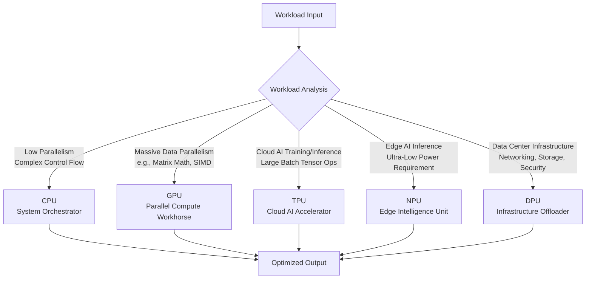

    

<h3 align="center">WELCOME TO</h3>
<h1 align="center">BLACXQUAD FREEMIUM REPOSITORY!</h1>
<h3 align="center">A HUB FOR FREE TECH LEARNING & RESOURCES.</h3>

  

    

    

  

    
 

> [!IMPORTANT]

This work is licensed under the **Creative Commons Attribution-ShareAlike 4.0 International License** (CC BY-SA 4.0).

When using, redistributing, adapting, or building upon this material, you **must** provide proper attribution by:

- 1. **Clearly stating the original source** as the **BLACXQUAD GitHub repository**.
- 2. **Including the exact URL(s)** to the relevant repository or file(s).

**Example Attribution Format:**  
- This work is based on content from the BLACXQUAD GitHub repository, available at:  
- https://github.com/blacxquad/freemium

Under the CC BY-SA license, you **must also**:
- Indicate if changes were made.
- License any adapted material under **identical terms** (CC BY-SA 4.0).

Failure to provide accurate source attribution violates the license terms.

    

<h1 align="center">The Heterogeneous Computing Ecosystem: A Comprehensive Guide to Modern Processing Architectures.</h1>

  
 

## Executive Summary

The fundamental engine of computational progress has shifted. For decades, advancement relied on the relentless miniaturization of transistors, a trend known as Moore's Law, which made general-purpose Central Processing Units (CPUs) faster with each generation. That era has transitioned. Today, continued performance and efficiency gains are driven by **heterogeneous computing**—a strategic shift from relying on a single type of processor to integrating multiple, specialized processing units within a single system. This guide explores the modern ecosystem of processors, from the versatile CPU to powerful accelerators like GPUs and TPUs, and infrastructure-focused units like DPUs. We will examine their unique architectures, ideal applications, and provide a framework for selecting the right hardware for your computational challenges.

 

## 1. Introduction: The Imperative for Specialized Hardware

The computing landscape is undergoing a foundational transformation. The slowdown of traditional transistor scaling and the physical limits of power efficiency have ended the era where a one-size-fits-all CPU could efficiently handle every task. Simultaneously, we face an explosion of data and new, demanding workloads in artificial intelligence (AI), scientific simulation, and real-time analytics.

*   Heterogeneous computing directly addresses this challenge. It refers to systems that utilize more than one kind of processor or core, integrating specialized co-processors—such as Graphics Processing Units (GPUs) or Tensor Processing Units (TPUs)—alongside traditional CPUs. The core principle is **task-specific optimization**: directing each computational workload to the processor architecture inherently best suited for its characteristics.
*   This paradigm yields monumental benefits in performance per watt, total throughput, and scalability. It enables breakthroughs in training massive AI models, simulating complex physical phenomena, and processing real-time data streams. Understanding this ecosystem is no longer niche knowledge; it is essential for architects, developers, and researchers building the next generation of efficient and powerful computing systems.
*   This guide provides a detailed examination of the key processing units defining this new era. We will dissect their architectural philosophies, primary roles, and the specific problems they are designed to solve, equipping you with the knowledge to navigate and leverage the heterogeneous computing landscape.

 

## 2. Central Processing Unit (CPU): The Essential Orchestrator

The CPU remains the indispensable brain and control center of any computing system. Its primary role is the execution of general-purpose software instructions, managing the operating system, application logic, and coordinating tasks across all other system components.

### 2.1 Architecture: Complexity and Control

A CPU core is designed for sequential task performance and complex decision-making. At its heart are the **Arithmetic Logic Unit (ALU)** for calculations and the **Control Unit (CU)** that directs operations. To mitigate the slow speed of accessing main memory (RAM), modern CPUs feature an extensive **multi-level cache hierarchy** (L1, L2, L3)—small, ultra-fast memory pools that store frequently used data and instructions.

*   CPU evolution has progressed from single-core designs to today's **multi-core** and **many-core** architectures. A significant recent advancement is the **heterogeneous CPU core topology**, seen in ARM's big.LITTLE and Intel's hybrid designs, which combine high-performance "P-cores" with energy-efficient "E-cores" on the same chip. The operating system dynamically assigns tasks to the appropriate core type to optimize for power or performance.
*   To maximize efficiency, CPUs employ sophisticated techniques like **superscalar execution** (executing multiple instructions per clock cycle), **speculative branch prediction**, and **simultaneous multithreading** (e.g., Intel Hyper-Threading). These methods allow a CPU to maintain high utilization even when dealing with the complex, branching logic of general-purpose software.

### 2.2 Applications and Inherent Limitations

CPUs excel at tasks requiring **sequential processing**, **complex control flow**, and **frequent decision-making** (branches). They are the default processor for running operating systems, databases, web servers, compilers, and the core logic of all applications.

*   The CPU's strength is its versatility and ability to deliver **low-latency results** for serial tasks. However, this generalist nature makes it relatively inefficient for **massively parallel** and **highly vectorized operations**. With a limited number of powerful cores (typically 8 to 64 in servers) and constrained memory bandwidth compared to accelerators, CPUs consume more power and deliver lower throughput for parallelizable workloads like the large matrix multiplications fundamental to AI and scientific computing. This limitation created the demand for specialized co-processors.

 

## 3. Graphics Processing Unit (GPU): The Parallel Processing Powerhouse

Originally designed for rendering complex 3D graphics in real-time, the GPU has evolved into the cornerstone of **General-Purpose computing on GPU (GPGPU)**. Its architecture is fundamentally opposite to a CPU's: it prioritizes high **throughput** and data parallelism over the low latency of individual tasks.

### 3.1 Architecture: A Throughput-Optimized Machine

A modern GPU comprises thousands of smaller, simpler cores (e.g., NVIDIA CUDA Cores, AMD Stream Processors) designed to execute many calculations **concurrently**. These cores are organized into groups called Streaming Multiprocessors (SMs) or Compute Units (CUs) that operate on a **Single Instruction, Multiple Threads (SIMT)** model. This allows a vast number of threads to execute the same instruction simultaneously on different pieces of data.

*   To feed this immense parallel compute capacity, GPUs are equipped with dedicated **High-Bandwidth Memory (HBM or GDDR)**. This memory subsystem offers bandwidth measured in terabytes per second—far exceeding that of typical CPU memory—which is critical for supplying data to the thousands of hungry cores.
*   The programming model for GPUs is stream-based. A computational kernel (a small program) is applied to every element in a large data stream, such as all pixels in an image or all elements in a matrix. This model perfectly fits data-parallel problems.

### 3.2 Dominant Applications

GPUs dominate any workload that can be broken down into many identical, independent operations. Their primary applications extend far beyond graphics:
*   **AI and Deep Learning:** GPUs are the workhorse for training and inference of neural networks. Frameworks like CUDA, cuDNN, and ROCm leverage GPU parallelism to accelerate the matrix and tensor operations at the heart of deep learning, reducing training times from weeks to days or hours.
*   **High-Performance Computing (HPC):** Scientific simulations for climate modeling, computational fluid dynamics, molecular dynamics, and astrophysics rely on GPUs to perform trillions of calculations per second.
*   **Data Analytics and Computational Finance:** Tasks like real-time data analytics, risk modeling, and Monte Carlo simulations for option pricing are massively accelerated by GPU parallelism.
*   In data centers, GPUs are deployed in dense servers and interconnected via high-speed links like NVLink and InfiniBand to form **GPU clusters or grids**, creating the computational foundation for training large language models like GPT-4 and other frontier AI systems.

 

## 4. Specialized AI Accelerators: TPU and NPU

As AI workloads became ubiquitous, the need for even more efficient, domain-specific hardware led to the creation of dedicated AI accelerators, primarily split between the cloud and the edge.

### 4.1 Tensor Processing Unit (TPU): Optimized for Cloud AI

The Tensor Processing Unit (TPU) is an **Application-Specific Integrated Circuit (ASIC)** custom-designed by Google to accelerate the core computations of neural networks: **tensor operations** (manipulations of n-dimensional arrays).

*   Its key architectural innovation is the **systolic array**. This is a two-dimensional grid of Multiply-Accumulate (MAC) units where data flows rhythmically between adjacent units, minimizing data movement and reuse. This design maximizes throughput and energy efficiency for large matrix multiplications.
*   TPUs aggressively leverage **reduced-precision arithmetic** (bfloat16, INT8), which provides sufficient numerical range and precision for neural network training and inference while dramatically improving performance and reducing power consumption compared to standard FP32 operations.
*   Deployed at scale within Google Cloud in pods of thousands of interconnected chips, TPUs deliver exaflop-scale performance for training Google's largest models, such as Gemini. Their usage is tightly optimized for Google's software ecosystem, primarily TensorFlow and JAX.

### 4.2 Neural Processing Unit (NPU): Enabling On-Device Intelligence

The Neural Processing Unit (NPU) is a dedicated accelerator integrated into mobile and edge **System-on-Chips (SoCs)** to efficiently execute neural network **inference** under strict power constraints.

*   Designed for extreme **energy efficiency**, NPUs feature many optimized MAC units, support for very low-precision computation (INT8, INT4), and significant on-chip memory to minimize costly data movement to external RAM.
*   NPUs enable **on-device AI**, powering features like real-time photo and video processing, facial recognition, voice assistants, and augmented reality in smartphones (e.g., Apple's Neural Engine), cameras, drones, and IoT devices. This provides critical benefits in latency, user privacy, and bandwidth conservation by processing data locally without needing a cloud connection.

 

## 5. Data Processing Unit (DPU): The Data Center Infrastructure Engine

The Data Processing Unit (DPU) is a specialized processor designed to offload, accelerate, and isolate **data center infrastructure tasks** from the main application servers, freeing CPUs and GPUs to focus on compute.

### 5.1 Architecture: A System-on-a-Chip for Data In Motion

A DPU is a highly integrated system that typically combines:
*   A **multi-core CPU** (often ARM-based) capable of running a full operating system.
*   **High-performance network interfaces** (200/400 Gigabit Ethernet, InfiniBand).
*   **Programmable hardware accelerators** for cryptography, compression, regular expression matching, and precise packet processing.

*   The DPU's primary role is to process **data in motion**. It handles virtualization, software-defined networking (e.g., Open vSwitch), storage protocols (NVMe-over-Fabrics), and inline security functions (encryption, firewalling, intrusion detection) at line rate. This offload provides **security isolation**—the DPU can inspect and filter all host traffic even if the host OS is compromised—and significantly improves overall system efficiency.

### 5.2 Role in Modern Cloud Architecture

DPUs are foundational to modern cloud and hyperscale data center architectures. Products like the NVIDIA BlueField DPU and the AWS Nitro System are prime examples. They distinguish themselves from simpler SmartNICs by not only accelerating the data plane in hardware but also running the **control plane software** (e.g., hypervisor, storage controller, network stack) on their embedded, programmable cores. This enables a **zero-trust security model** and truly composable, disaggregated infrastructure.

 

## 6. Other Notable Processing Architectures

*   **Vision Processing Unit (VPU):** Specialized for machine vision pipelines, directly processing input from image sensors. VPUs efficiently execute computer vision algorithms (object detection, SLAM) and are found in robotics, smart cameras, and drones (e.g., Intel Movidius).
*   **Field-Programmable Gate Array (FPGA):** Provides **reconfigurable hardware** that can be programmed post-manufacturing for specific algorithms. FPGAs offer a unique balance of flexibility, parallelism, and determinism (low latency), making them valuable for network acceleration, financial trading algorithms, and niche HPC workloads where algorithms are still evolving.
*   **Quantum Processing Unit (QPU):** Represents a radical paradigm shift, using quantum bits (qubits) that leverage **superposition and entanglement** to solve specific, complex problems in quantum chemistry, material science, and optimization that are intractable for classical computers. Currently accessible via cloud platforms (IBM Quantum, etc.), QPUs are in the early experimental stage and require specialized environments like cryogenic cooling.

 

## 7. Architectural Comparison and Selection Framework

Choosing the right processing unit requires analyzing the fundamental characteristics of your workload. The following tables provide a high-level comparison and a selection guide.

**Table 1: Processing Unit Architectural Comparison**

| Metric | CPU | GPU | TPU | NPU | DPU |
| :--- | :--- | :--- | :--- | :--- | :--- |
| **Primary Role** | System Orchestrator, Serial Logic | Massively Parallel Compute | AI Tensor Operations (Cloud) | AI Inference (Edge) | Infrastructure Offload & Security |
| **Core Architecture** | Few complex cores; Large cache hierarchy | 1000s of simple cores; SIMT execution | Systolic array of MAC units | Array of optimized MAC units | Multi-core CPU + HW accelerators + NIC |
| **Key Strength** | Low-latency, Complex Branching | Data-Parallel Throughput | Matrix Math Throughput & Efficiency | Extreme Energy Efficiency | I/O Processing & Isolation |
| **Typical Precision** | FP64, FP32 | FP32, FP16, INT8 | BF16, FP16, INT8 | INT8, INT4 | N/A (Task-specific) |
| **Power Envelope** | 5W - 300W+ | 10W - 700W+ | 75W - 300W+ | <1W - 30W | 25W - 100W+ |
| **Dominant Workloads** | OS, Databases, Application Logic | AI Training, HPC, Rendering | Large-scale AI Training/Inference | On-device AI (Vision, Speech) | Networking, Storage Virtualization, Security |

**Table 2: Workload-to-Processor Selection Guide**

| Workload Characteristic | Recommended Primary Processor | Rationale |
| :--- | :--- | :--- |
| Complex serial logic, frequent branching, I/O coordination | **CPU** | Optimized for low-latency sequential execution and system management. |
| Large-scale, homogeneous, data-parallel computations (e.g., matrix math, SIMD) | **GPU** | Massive parallelism delivers the highest throughput for aligned workloads. |
| Large-batch AI/ML training and inference in cloud environments | **TPU/GPU** | TPUs offer peak efficiency for tensor ops; GPUs offer greater framework flexibility. |
| Low-latency, low-power AI inference on edge devices | **NPU** | Designed for maximum performance-per-watt in power-constrained environments. |
| High-speed network, storage, or security processing in data centers | **DPU** | Offloads and accelerates infrastructure tasks, freeing host CPUs/GPUs for applications. |
| Evolving algorithms, niche protocols, or ultra-low-latency processing | **FPGA** | Post-deployment reconfigurability provides flexibility where fixed ASICs are impractical. |

 

## 8. Future Trajectory and Emerging Trends

The evolution of heterogeneous computing points toward greater integration, intelligence, and specialization:

*   **Advanced Packaging and Chiplets:** Technologies like 2.5D and 3D integration allow CPUs, GPUs, memory, and I/O chiplets from different process technologies to be integrated into a single package. This enables ultra-high-bandwidth, low-latency communication between components, improving performance and reducing power consumption.
*   **Software Abstraction and Unification:** Frameworks like **SYCL**, **oneAPI**, and **OpenMP** aim to reduce the programming complexity of heterogeneous systems by providing a single, portable programming model for CPUs, GPUs, and other accelerators, though ecosystem fragmentation remains a challenge.
*   **AI-Driven System Management:** Future data center systems may employ AI models to manage themselves, performing **dynamic resource allocation** in real-time. This AI scheduler would automatically assign tasks to the optimal processor (CPU, GPU, DPU) based on current load, power budget, and latency requirements.
*   **Quantum-Classical Hybrid Systems:** Early research and cloud offerings are exploring the integration of QPUs as specialized co-processors within classical data centers. These hybrid systems would offload specific, complex sub-problems to the quantum processor while the classical system handles the rest, marking the dawn of multi-paradigm computing.

 

## 9. Conclusion: The Era of Coordinated Ensembles

The age of homogeneous, general-purpose scaling has concluded. In its place, a diverse and specialized **heterogeneous processing ecosystem** has emerged as the primary engine of computational progress. No single processor type is optimal for all tasks. Instead, modern systems—from smartphones to supercomputers—are architected as **coordinated ensembles of silicon**.

*   The CPU remains the essential **orchestrator**, managing complex control flow and system operations. The GPU serves as the **parallel workhorse**, tackling massive data-parallel workloads. The TPU and NPU provide **domain-optimized acceleration** for AI in the cloud and at the edge, respectively. The DPU acts as the **infrastructure engine**, ensuring secure and efficient data movement.
*   This architectural shift from general-purpose to **domain-specific computing** is not merely an incremental improvement; it is a fundamental redesign of the computing stack. Success in this new paradigm demands a clear understanding of each processing unit's intrinsic strengths and a strategic approach to mapping software workloads to the most suitable silicon. This practice of intelligent hardware-software co-design will define performance, efficiency, and capability in computing for the foreseeable future.
 
 
    

<h2 align="center">STAY TUNED FOR THE LATEST UPDATES!</h2>

  

    

