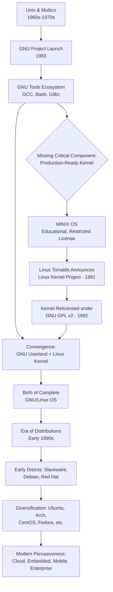
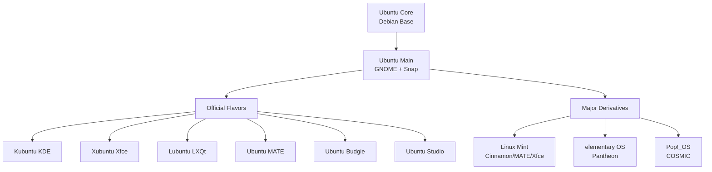
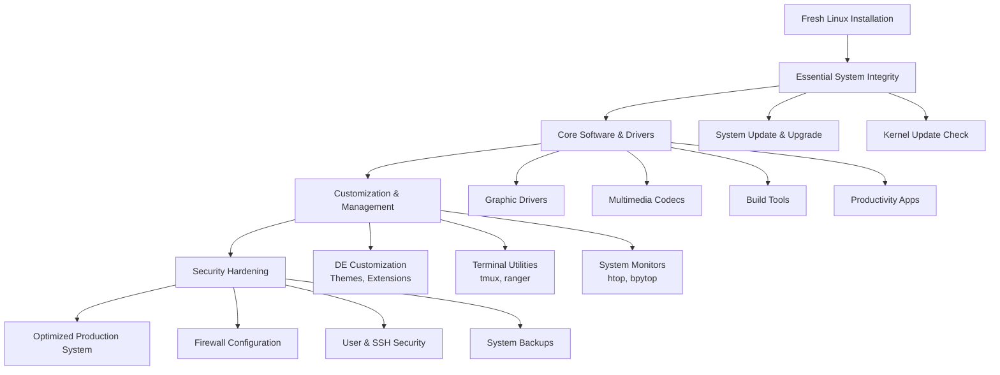
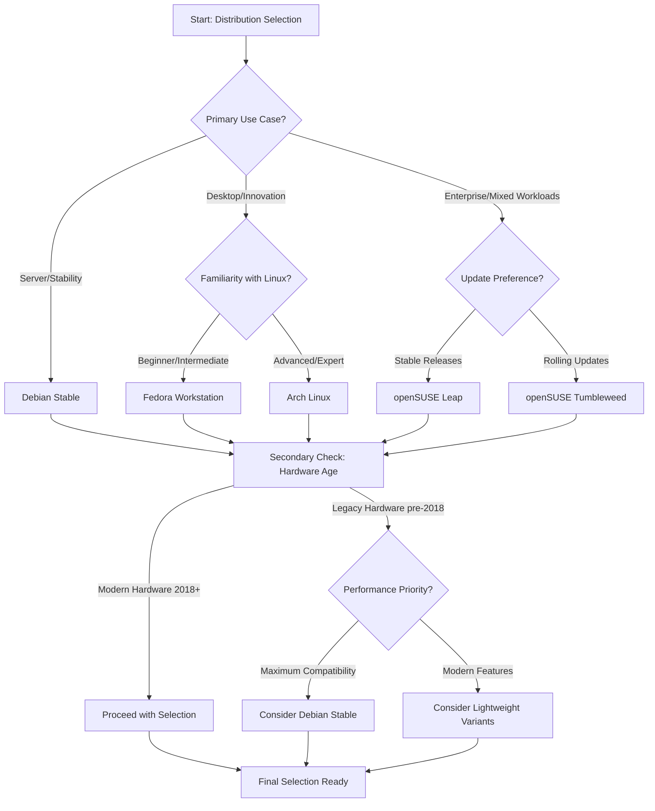
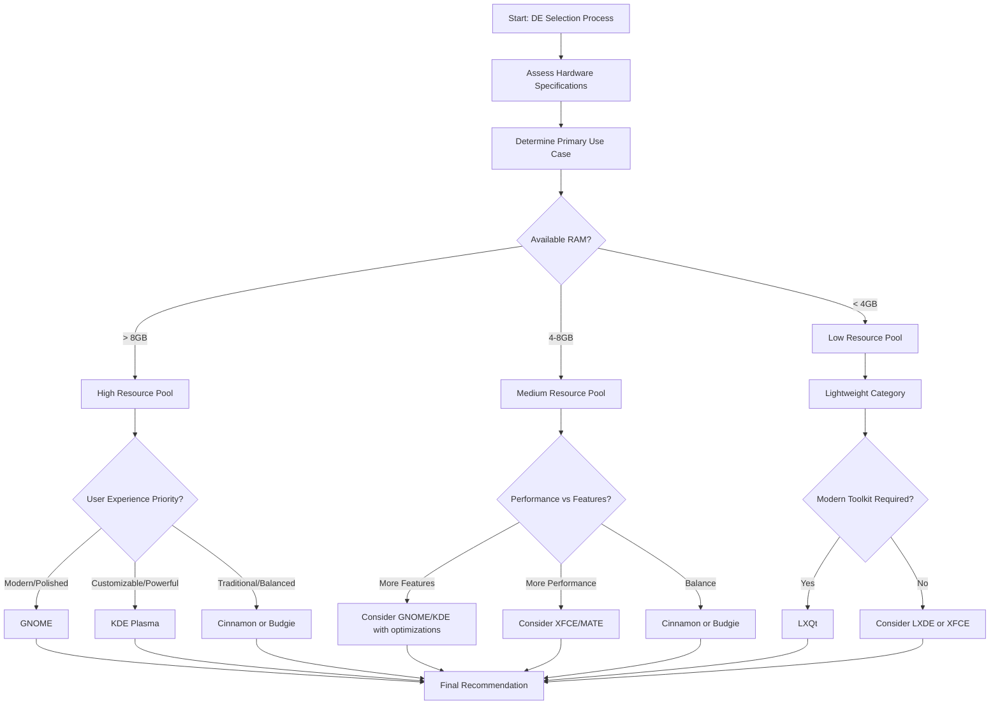

<br><br><br><br>

<h3 align="center">WELCOME TO</h3>
<h1 align="center">BLACXQUAD FREEMIUM REPOSITORY!</h1>
<h3 align="center">A HUB FOR FREE TECH LEARNING & RESOURCES.</h3>

<br><br>

<p align="center">
    <a href="https://github.com/blacxquad">
        
    </a>
</p>

<br><br><br><br>

<p align="center">
  <a href="https://creativecommons.org/licenses/by-sa/4.0/">
    
  </a>
</p>

<br><br><br><br>
 

> [!IMPORTANT]

This work is licensed under the **Creative Commons Attribution-ShareAlike 4.0 International License** (CC BY-SA 4.0).

When using, redistributing, adapting, or building upon this material, you **must** provide proper attribution by:

- 1. **Clearly stating the original source** as the **BLACXQUAD GitHub repository**.
- 2. **Including the exact URL(s)** to the relevant repository or file(s).

**Example Attribution Format:**  
- This work is based on content from the BLACXQUAD GitHub repository, available at:  
- https://github.com/blacxquad/freemium

Under the CC BY-SA license, you **must also**:
- Indicate if changes were made.
- License any adapted material under **identical terms** (CC BY-SA 4.0).

Failure to provide accurate source attribution violates the license terms.

<br><br><br><br>

<h1 align="center">The History and Evolution of Linux: From a Hobby to a Global Foundation.</h1>

<br><br>

## Executive Overview

Linux stands as the most pervasive, yet often invisible, operating system in the world. What began as a solitary student's hardware experiment evolved into the indispensable foundation for global digital infrastructure. This journey is more than a technical achievement; it is a profound demonstration of the power of collaborative, open development. Unlike proprietary systems built behind corporate walls, Linux emerged through the collective effort of a worldwide community, united by a shared belief in software freedom and transparent innovation. From powering supercomputers and smartphones to forming the bedrock of the cloud, Linux's story encapsulates a pivotal shift in how mission-critical software is created and sustained.

### Core Concepts

*   **The Linux Kernel:** At its heart, Linux is an open-source, Unix-like operating system **kernel**. The kernel is the core program that manages hardware resources (CPU, memory, devices) and facilitates all communication between software and physical components. Its source code is freely available under the GNU General Public License (GPL), allowing anyone to study, modify, and distribute it. This openness has fostered an unprecedented global collaboration model, attracting contributions from individual enthusiasts and major corporations alike, all invested in its continuous improvement.
*   **Linux Distributions:** While commonly called "Linux," complete operating systems are more accurately termed **distributions** or **GNU/Linux systems**. A distribution bundles the Linux kernel with a vast collection of user-space software: libraries, utilities, and applications, many from the GNU Project. Distributions like Ubuntu, Red Hat Enterprise Linux, and Debian curate these components, providing cohesive installation, management, and support, each tailored for specific use cases from servers to desktops.
*   **Ubiquitous Dominance:** Linux's success is characterized by its ubiquitous yet hidden presence. It powers over 90% of public cloud infrastructure, runs on 100% of the world's top 500 supercomputers, and serves as the foundation for Android on billions of devices. This dominance validates the open-source model, proving that decentralized, transparent collaboration can produce software that exceeds proprietary alternatives in stability, security, and adaptability for critical infrastructure.



<br>

## 1. The Foundational Pillars: Unix and the Free Software Movement

The genesis of Linux is rooted in two predecessor movements: the technical blueprint of Unix and the philosophical revolution of free software. Developed at Bell Labs in the late 1960s, Unix introduced a powerful, modular, and portable design philosophy that emphasized simplicity and the principle that "everything is a file." This architecture became the gold standard in academic and commercial computing. However, as Unix was commercialized in the 1980s, access to its source code was restricted, stifling the collaborative academic culture that had nurtured it. This shift created both a technical gap and an ideological demand for a free alternative.

*   **The Free Software Movement,** founded by Richard Stallman at MIT, arose as a direct ethical challenge to proprietary software. Stallman formulated the **Four Essential Freedoms**: to run a program for any purpose, to study and modify its source code, to redistribute copies, and to distribute modified versions. In 1985, he established the **Free Software Foundation (FSF)** to promote these ideals and provide structural support for free software development, creating a moral and practical framework for collaborative creation.
*   **The GNU Project** was the ambitious engineering initiative to actualize this philosophy. Launched in 1983, its goal was to create a completely free, Unix-compatible operating system called GNU (a recursive acronym for "GNU's Not Unix"). By the early 1990s, the project had successfully produced a comprehensive suite of high-quality components like the GCC compiler, the Bash shell, and core utilities. However, its own kernel, GNU Hurd, remained incomplete, leaving the project without its central component.
*   **MINIX,** created by Andrew S. Tanenbaum for education, demonstrated a functional, small-scale Unix-like model. While its source was available for study, its license restricted modification and redistribution. MINIX served as an influential teaching tool and inspiration but was not designed to be a scalable, community-driven system. This context—a rich ecosystem of free software tools in search of a free, production-ready kernel—created the precise opportunity Linus Torvalds would seize.

<br>

## 2. The Kernel's Inception: A Helsinki Hobby Project

In 1991, Linus Torvalds, a 21-year-old computer science student at the University of Helsinki, began a personal project to explore his new Intel 80386 PC's capabilities. Frustrated by MINIX's limitations, he embarked on creating his own kernel. His now-legendary announcement to the `comp.os.minix` newsgroup on August 25, 1991, was notably understated: he described his work as "a (free) operating system (just a hobby, won't be big and professional like gnu)." This post marked the Linux kernel's inception. Torvalds adopted a development style defined by early, frequent releases and active solicitation of feedback via the early internet, transforming a solitary endeavor into a collaborative project.

*   Torvalds' initial motivation was primarily pragmatic and educational, not explicitly ideological. He sought to understand his computer's hardware and create a system that could outperform MINIX on his PC. The release of version 0.01 in September 1991, though minimal, demonstrated core functionality. Crucially, by making the source code publicly available from the outset, he invited peer review and contribution, leveraging the internet to accelerate development through distributed collaboration.
*   A defining moment occurred in early 1992 with the release of Linux kernel version 0.12 under the **GNU General Public License (GPL)**, replacing its original non-commercial license. Torvalds later identified this as "the best thing I ever did." The GPL's copyleft provision guaranteed that Linux and all its derivatives would remain free and open, preventing proprietary forks and ensuring all improvements flowed back to the communal codebase. This legal framework created a virtuous cycle of shared innovation.
*   The development model pioneered by Torvalds became a blueprint for large-scale open-source projects. Contrasted by Eric S. Raymond as the "bazaar" model (vs. the proprietary "cathedral" model), it emphasized decentralized, meritocratic collaboration. Torvalds' role evolved into that of the project's final integration authority, overseeing a vast hierarchy of trusted subsystem maintainers. This scalable structure has proven essential for managing one of the largest collaborative software projects in history.

<br>

## 3. Convergence: Birth of the GNU/Linux Operating System

The pivotal convergence happened in 1992: the combination of the fledgling but functional Linux kernel with the mature, comprehensive GNU user-space utilities. This synergy created the first complete, freely modifiable, Unix-like operating system. The GNU project provided the essential tools and the philosophical/legal framework, while the Linux kernel provided the missing core. Though technically **GNU/Linux**, the system became popularly known as "Linux." This complete OS offered a powerful, stable, and zero-cost alternative to proprietary Unix, appealing to hobbyists, academics, and eventually, forward-thinking enterprises.

*   The availability of a complete, free operating system ignited the creation of **distributions**. Pioneering efforts like **Slackware (1993)** and **Debian (1993)** undertook the complex task of integrating the kernel, GNU tools, libraries, and other software into a coherent, installable system. They provided installation scripts and documentation, dramatically lowering the barrier to entry and moving Linux beyond the domain of expert programmers who could compile everything from source.
*   Distributions quickly diversified to serve different philosophies. Debian emphasized a strict commitment to free software, community governance, and stability. Conversely, **Red Hat Linux (1994)** focused on creating a commercially viable product, offering professional support and certified software stacks for business, thereby proving sustainable economic models could be built around open-source software.
*   The emergence of GNU/Linux directly challenged commercial Unix vendors and Microsoft Windows in server roles. Its cost-effectiveness, customizability, and growing reputation for robustness made it attractive for web hosting and networking. As the internet exploded in the mid-1990s, Linux became the operating system of choice for the web servers and networking equipment that formed its backbone.

<br>

## 4. The Distribution Ecosystem: Diversity and Specialization

The distribution model is the engine of Linux's adaptability. By decoupling kernel development from system integration and user experience, it allows for unparalleled specialization. Distributions cater to every conceivable niche, from security auditing and multimedia production to lightweight desktops and immutable, container-optimized hosts. This ecosystem ensures a tailored Linux distribution exists for virtually any computing need.

| Distribution Family (Origin) | Founding Philosophy / Focus | Notable Derivatives & Descendants | Primary Package Manager |
| :--- | :--- | :--- | :--- |
| **Debian** (1993) | Stability, strict free software commitment, vast community repository. | **Ubuntu**, **Linux Mint**, **Kali Linux**, **elementary OS**. | `APT` (`dpkg`) |
| **Red Hat** (1994) | Enterprise-grade stability, long-term support, commercial ecosystem. | **Fedora**, **CentOS Stream**, **Rocky Linux**, **AlmaLinux**. | `RPM` (`dnf`/`yum`) |
| **Arch Linux** (2002) | Simplicity, minimalism, user-centrality, rolling-release model. | **Manjaro**, **EndeavourOS**. | `Pacman` |
| **openSUSE** (1994) | System stability and administrative flexibility (YaST tool). | **SUSE Linux Enterprise**, **openSUSE Leap/Tumbleweed**. | `RPM` (`zypper`) |
| **Slackware** (1993) | One of the oldest; Unix-like purity, simplicity, and stability. | **Salix OS**, **Zenwalk**. | `pkgtools` |
| **Gentoo** (2002) | Ultimate configurability and optimization via source-based compilation. | **Funtoo**. | `Portage` |

*   The choice of distribution reflects a trade-off between stability, software currency, ease of use, and philosophy. Debian's careful release cycles prioritize rock-solid stability, while Arch's rolling-release model provides immediate access to the latest software. Red Hat's model commercialized open source by providing certified, supported builds for critical enterprise workloads, funding further upstream development.
*   The **package manager** is a core differentiator, handling software installation, dependency resolution, updates, and removals. While diversity between systems like APT and RPM created some fragmentation, universal formats like **Flatpak** and **Snap** now enable secure, cross-distribution application deployment.
*   The launch of **Ubuntu** in 2004, based on Debian, was transformative for desktop Linux adoption. Sponsored by Canonical, it focused on user-friendliness, regular releases, and hardware support. It dramatically lowered the barrier to entry for new users and became a gateway to Linux for millions, while also establishing a major presence in cloud and server environments.

<br>

## 5. Commercialization, Conflict, and Consolidation

The late 1990s and early 2000s marked Linux's transition into an enterprise-grade platform. Major companies like IBM and Oracle announced formal support in 1998, lending credibility and triggering corporate investment. Red Hat's successful 1999 IPO validated open-source business models. This growth was tested by legal challenges that ultimately strengthened the community.

*   The **SCO Group lawsuits** (2003 onward) alleged that IBM had improperly contributed proprietary Unix code to Linux. The litigation created fear and uncertainty. However, the claims largely collapsed under scrutiny. The lawsuits strengthened the community's resolve, improved code audit processes, and clarified Linux's legal standing.
*   Corporate involvement evolved into deep, strategic investment. Companies like IBM, Intel, Google, and Samsung became major kernel contributors, funding developers to work on features important to their products. This created a virtuous cycle: companies improved the shared platform for their own needs, and those improvements benefited all users.
*   Symbolic acceptance came with Microsoft's introduction of the **Windows Subsystem for Linux (WSL)** in 2016. After decades as rivals, Microsoft's integration of a genuine Linux kernel within Windows acknowledged Linux's irreplaceable role in modern development and cloud computing.

<br>

## 6. Architectural Dominance: Key Domains of Pervasiveness

Linux's architectural virtues—modularity, network transparency, and extreme configurability—have made it the ideal substrate for nearly every major 21st-century computing paradigm.

*   **High-Performance Computing (HPC):** Linux powers 100% of the world's top 500 supercomputers. Its open nature allows institutions to tailor the OS to specific hardware, optimize drivers, and implement custom resource management without restrictive licenses.
*   **Cloud Computing and Containers:** Linux is the fundamental host OS for global cloud infrastructure (AWS, Google Cloud, Azure). The **container** revolution, defined by Docker and Kubernetes, is inherently a Linux technology, built upon kernel primitives like **cgroups** and **namespaces**.
*   **Embedded Systems and Mobile:** Due to its small footprint and customizability, Linux dominates embedded devices, from routers to automotive systems. The **Android** mobile ecosystem, commanding most of the global smartphone market, is built upon the Linux kernel. Frameworks like the Yocto Project enable bespoke Linux systems for any specialized IoT hardware.

<br>

## 7. The Future Trajectory: Edge, AI, and Sovereign Systems

Linux's future points toward deeper integration into emerging technological frontiers, driven by its open model and architectural flexibility.

*   **Edge Computing and Real-Time Systems:** Lightweight, secure Linux distributions are being tailored for **edge computing** in 5G, autonomous vehicles, and industrial IoT. The integration of the **PREEMPT_RT** real-time patch set is expanding Linux's role in latency-critical robotics and manufacturing applications.
*   **Artificial Intelligence and Specialized Hardware:** Linux is the default platform for AI/ML development and deployment. The kernel is continuously optimized for accelerators like GPUs and TPUs, and the open-source ecosystem around tools like PyTorch and TensorFlow is native to Linux.
*   **Security and Digital Sovereignty:** In an era of heightened cyber threats and vendor lock-in concerns, Linux's transparency is a strategic advantage. Governments and enterprises are adopting open-source platforms for auditability and independence, using hardened Linux distributions to meet stringent security and compliance requirements.

<br>

## Conclusion: A Testament to Collaborative Ingenuity

The history of Linux is a landmark narrative, demonstrating that sustained, decentralized collaboration can produce systems of unparalleled robustness and versatility. It succeeded through technical merit and community ethos, not marketing. From a Usenet post to the bedrock of global infrastructure, Linux has reshaped industry economics, inspired developers, and provided a trusted foundation for societal progress.

*   Linux's impact extends beyond code. It validated the open-source model, forced a reassessment of how complex software is built, and created new economic paradigms around services and collaboration, empowering users with control over their technology.
*   The story continues. Governed by the Linux Foundation and thousands of contributors worldwide, its development is a self-correcting, adaptive system. As computing evolves and faces new challenges in scale and security, the need for a stable, adaptable, and transparent foundation is paramount. Linux, curated by a global community, is actively being shaped to define the future of computing itself.
 

<br><br><br><br>

<h1 align="center">Ubuntu: The Story of Linux for Human Beings.</h1>
<h3 align="center">The Desktop Revolution That Transformed an Ecosystem.</h3>

<br><br>

## Executive Summary

Ubuntu stands as one of the most significant and influential projects in the history of open-source software. Launched in 2004, it transformed Linux from a tool primarily for specialists and server administrators into a viable, user-friendly desktop operating system for millions. Founded by entrepreneur Mark Shuttleworth, Ubuntu introduced a philosophy centered on human experience and accessibility, fundamentally raising the standard for what a free operating system could be. While its desktop ambitions evolved, its foundational work catalyzed the entire Linux ecosystem. Today, Ubuntu is a dual force: a popular desktop for developers and general users, and the dominant, invisible foundation powering the world's cloud infrastructure and Internet of Things.

<br>

## 1. Introduction: More Than an Operating System

Ubuntu represents a bold attempt to rewrite who gets to own and use advanced computing technology. Its name, derived from the Nguni Bantu philosophy meaning "humanity toward others," signaled its core mission from the start: to build software that is accessible, shared, and beneficial to all. More than just code, Ubuntu is a unique socio-technical experiment—a partnership between a commercial entity, Canonical Ltd., and a global volunteer community—that has navigated the complex tensions between idealism, innovation, and sustainable business.

*   **Ubuntu emerged at a pivotal moment when Linux dominated servers but remained inaccessible to everyday users.** Installation was technical, hardware support was spotty, and the user experience was fragmented. Mark Shuttleworth, a former Debian developer, envisioned a distribution that bridged this gap by applying professional project management, consistent funding, and a relentless focus on usability. This vision was famously captured in Ubuntu's "Bug #1": "Microsoft has a majority market share," framing proprietary dominance not as market reality but as a bug to be fixed through better, freely available software.
*   **The project pioneered a hybrid governance and funding model that balanced corporate direction with community power.** Canonical provided salaries for core developers, infrastructure, and strategic planning. In return, a global community of volunteers contributed translations, documentation, support, software packaging, and advocacy. Revenue would come from professional support and enterprise services, not from selling the operating system. This model allowed Ubuntu to achieve a polish and release predictability that purely community-driven distributions often struggled with, while remaining fundamentally free and open.
*   **Ubuntu's impact is indelible, having reshaped expectations for the entire open-source desktop landscape.** It proved that free software could be not only powerful and secure but also polished, predictable, and genuinely user-friendly. By championing six-month release cycles, long-term support versions, comprehensive documentation, and a "just works" philosophy for hardware, Ubuntu set new standards. It serves as the gateway to Linux for countless users and the reliable bedrock for much of the modern internet, cementing its role as a cornerstone of contemporary computing.

<br>

## 2. The Founding Vision: Building a Desktop for Everyone (2004-2005)

In 2004, a small team gathered in London with a clear, ambitious goal: to create a professional, coherent, and regularly released operating system from the robust but sometimes unruly Debian codebase. They aimed to make Linux a true alternative for the average computer user, something that could be pre-installed on retail machines and recommended to friends and family without caveats.

*   **The strategy was built on four revolutionary pillars for the Linux world.** First, a strict, time-based release cycle every six months (April and October), providing predictability for users and developers. Second, the designation of Long-Term Support (LTS) releases, guaranteed to receive security updates for five years, enabling serious organizational adoption. Third, an unwavering focus on human-centric design and out-of-the-box usability. Fourth, an ironclad commitment that the core operating system would always be free to use, modify, and share.
*   **The first release, Ubuntu 4.10 "Warty Warthog," managed expectations with its name but delivered a surprisingly complete experience.** It featured a live CD for safe testing, a streamlined graphical installer, and a fully configured GNOME 2.8 desktop with essential applications like Firefox and OpenOffice.org. While rough around the edges, it demonstrated the vision's viability and generated immediate excitement. It proved that a user-friendly Linux desktop was not just a dream but an achievable engineering goal.
*   **Canonical's "ShipIt" program became a powerful symbol of Ubuntu's commitment to universal access.** By offering to mail free installation CDs anywhere in the world, Ubuntu overcame barriers of slow internet and technical know-how. This philanthropic distribution channel turned users into evangelists, creating organic, grassroots growth. It physically embodied the "I am because we are" philosophy, sharing the software tangibly and without cost.
 
<br>

## 3. The Ascent: Defining the Modern Linux Desktop (2006-2010)

This period marked Ubuntu's rise to become the definitive face of desktop Linux. Releases focused on polishing the experience, fixing countless minor annoyances, and integrating technologies that made the system work seamlessly for daily tasks.

*   **The release of Ubuntu 6.06 LTS "Dapper Drake" was a watershed moment that signaled enterprise-grade readiness.** It introduced the seamless "Ubiquity" installer, which allowed users to install directly from the live desktop session. As the first Long-Term Support release, it promised three (later five) years of updates, giving businesses and institutions the stability they required. Dapper Drake moved Ubuntu from a promising newcomer to a serious platform.
*   **Ubuntu distinguished itself by pragmatically solving real-world user problems that other distributions ignored.** It developed the `jockey` tool (Additional Drivers) to easily install proprietary graphics and Wi-Fi drivers for optimal hardware compatibility. It created simple, legal pathways to install multimedia codecs and Flash, removing major barriers to consuming everyday content. The introduction of the Ubuntu Software Center provided a friendly, app-store-like interface for discovering and installing software, demystifying package management.
*   **The ecosystem expanded strategically through officially recognized "flavors," catering to diverse tastes without fragmenting the core project.** Kubuntu offered the feature-rich KDE Plasma, Xubuntu provided the lightweight Xfce for older hardware, and Edubuntu bundled educational software. This approach allowed Ubuntu to serve a wide audience—from power users to schools—while maintaining a single, unified base of software repositories and security updates, ensuring strength and consistency.

<br>

## 4. The Unity Era: Ambition, Controversy, and Convergence (2010-2017)

Facing the radical redesign of GNOME 3, Canonical made a fateful decision: to develop its own desktop shell called Unity. This began a chapter defined by bold innovation, intense controversy, and a visionary but ultimately unfulfilled dream of a single, convergent operating system for all devices.

*   **Unity was designed with a dual purpose: to modernize the desktop interface and to serve as the foundation for "convergence."** The goal was to create a single user experience that could adapt fluidly across desktops, tablets, phones, and TVs, allowing developers to build one application for all form factors. This required massive technical investment, leading to the development of a new display server (Mir) and a completely rethought graphics stack, setting Ubuntu on a divergent path from the rest of the Linux ecosystem.
*   **User and community reaction to Unity was deeply polarized, and a major privacy scandal severely damaged trust.** Many appreciated its clean, modern design and space-efficient layout. However, a vocal segment of the existing user base rejected its departure from traditional desktop paradigms. The 2012 "Amazon Dash" controversy—where desktop search queries were sent to Amazon by default—was a watershed moment. Viewed as a breach of privacy, it forced Canonical to make the feature opt-in but left a lasting stain on Ubuntu's reputation as a privacy-respecting alternative.
*   **The convergence dream culminated in the Ubuntu Edge crowdfunding campaign and Ubuntu Touch for phones, but commercial reality ultimately prevailed.** Despite technical achievements, these projects failed to gain sufficient market traction against iOS and Android. The immense cost of maintaining parallel platforms for desktop, phone, and TV strained Canonical's resources. In 2017, Mark Shuttleworth announced the end of Unity development and the convergence initiative, marking a strategic retreat and a return to using the GNOME desktop.

<br>

## 5. The Strategic Pivot: Servers, Cloud, and the Snap Revolution (2017-Present)

Following the Unity era, Canonical executed a decisive pivot. The desktop would remain, but the company's primary focus shifted to cloud computing, enterprise servers, and IoT—areas where Ubuntu was already quietly dominating. This strategy centered on a new universal packaging technology: Snap.

*   **Snaps are containerized, dependency-independent software packages designed for security, reliability, and cross-platform distribution.** They bundle an application and its dependencies into a single, transactional unit that can run on any Linux distribution supporting the Snap daemon. For enterprise and IoT, this provides critical advantages: automatic updates with rollback, strict confinement for security, and a single package to maintain across diverse device fleets. Ubuntu Core is a minimal, immutable OS built entirely from snaps for embedded devices.
*   **The introduction of Snaps on the general desktop has been the source of significant community debate and criticism.** While solving real problems for developers and enterprises, desktop users have voiced concerns over performance (slower startup times), disk usage, and a perceived loss of control due to automatic updates. A central point of contention is the Snap Store's proprietary backend, controlled by Canonical, which some see as a departure from the decentralized ethos of Linux. Decisions to transition core applications like Firefox and Chromium to Snap by default have intensified these debates.
*   **In the enterprise sphere, this pivot has been a resounding success, providing a sustainable financial foundation.** Ubuntu Pro, a subscription service, extends security maintenance to thousands of open-source applications and provides compliance certifications. Canonical is a major contributor to Kubernetes and OpenStack. The revenue from these services funds ongoing development, including the desktop edition, which now serves as a flagship product that fosters developer familiarity and community goodwill.

<br>

## 6. Ubuntu Desktop vs. Ubuntu Server: One Core, Two Missions

Although built from the identical kernel and core system components, Ubuntu Desktop and Ubuntu Server are optimized for fundamentally different roles. This duality is key to understanding Ubuntu's broad impact across the computing spectrum.

| Aspect | Ubuntu Desktop | Ubuntu Server |
| :--- | :--- | :--- |
| **Primary Purpose** | Interactive use by individuals for work, development, and creativity. | Hosting services, applications, and data reliably and securely. |
| **Default Interface** | Full graphical desktop environment (GNOME). | Command-line only (headless), managed remotely via SSH. |
| **Installation Process** | User-friendly, graphical Ubiquity installer. | Text-based, menu-driven process focused on selecting server roles (e.g., web server, database). |
| **Default Software** | Web browser, office suite, media players, system utilities. | SSH server, common system utilities; other services are selectable during install. |
| **Update Philosophy** | Balances new features, hardware support, and stability. | Prioritizes absolute stability and security; minimal changes to core system. |
| **Support Lifetime** | 5 years for LTS releases. | **10 years** for LTS releases, reflecting long infrastructure lifespans. |
| **Typical Use Case** | Daily driver, development workstation, home computing. | Web server, database server, cloud instance, container host. |

*   **Ubuntu Server is engineered for minimalism, security, and remote manageability.** By omitting the graphical interface, it reduces the system's attack surface and resource overhead. The installer allows administrators to build a lean system tailored precisely to its function, selecting only necessary packages. It includes advanced tools for storage (ZFS, LVM), networking, and virtualization, making it a versatile foundation for any infrastructure need.
*   **The shared core between Desktop and Server creates a powerful synergy for software development and deployment.** Developers can write and test applications on their Ubuntu Desktop with the certainty that the same libraries and behaviors will be present on an Ubuntu Server in production. This consistency drastically simplifies development workflows and DevOps pipelines, reducing "it works on my machine" problems.
*   **The commercial success of Ubuntu Server and cloud products provides the financial sustainability that supports the entire project, including the desktop edition.** This symbiotic relationship ensures that Ubuntu Desktop continues to receive professional-grade development and security maintenance, even as it serves a different primary market.

<br>

## 7. The Vibrant Ecosystem: Flavors and Derivatives

Ubuntu's resilience and adaptability are demonstrated by its flourishing ecosystem. Beyond the main edition, a family of official flavors and independent derivatives ensure there is a version of Ubuntu suited for nearly every need and preference.

*   **Official Flavors** are recognized by Canonical and share its infrastructure. They offer distinct desktop environments while maintaining full compatibility with Ubuntu's repositories and updates.
    *   **Kubuntu:** Features the highly customizable KDE Plasma desktop.
    *   **Xubuntu:** Uses the lightweight and efficient Xfce desktop, ideal for older hardware.
    *   **Lubuntu:** Employs the extremely light LXQt desktop for maximum performance on low-resource systems.
    *   **Ubuntu MATE:** Offers a classic, intuitive desktop paradigm using the MATE environment.
    *   **Ubuntu Budgie:** Provides a modern, elegant desktop experience with the Budgie shell.
    *   **Ubuntu Studio:** A pre-configured platform for audio, video, and graphic creators, featuring a low-latency kernel and a curated suite of creative applications.

*   **Notable Derivatives** have grown into major distributions in their own right, starting from Ubuntu's base.
    *   **Linux Mint:** Originally created to offer a traditional desktop alternative to Unity, it has become one of the world's most popular desktop distributions, praised for its usability and elegant Cinnamon desktop.
    *   **elementary OS:** Renowned for its meticulous, cohesive design and strong focus on user experience principles, offering a refined, macOS-inspired workflow.
    *   **Pop!\_OS:** Developed by hardware manufacturer System76, it is optimized for hardware compatibility, gaming, and STEM/development workflows, with a custom desktop environment.



<br>

## 8. Legacy and Conclusion: The Unfinished Revolution

Ubuntu's story is not a simple tale of victory or defeat. It is a nuanced narrative of visionary success, pragmatic shifts, and enduring impact. It redefined the potential of a Linux desktop and, in doing so, became an indispensable pillar of the modern digital world.

*   **Ubuntu's most profound legacy is that it made Linux genuinely approachable for millions.** It served as the gateway into open source for a global generation. By insisting on human-centric design, predictable release cycles, and comprehensive documentation, it forced the entire Linux ecosystem to elevate its standards for usability and polish. The expectation that a free operating system can "just work" is largely a result of Ubuntu's trailblazing work.
*   **The project serves as a seminal case study in open-source business models and community dynamics.** Its journey highlights the delicate balances required: between corporate vision and community trust, between innovation and ecosystem fragmentation, and between principled ideals and commercial sustainability. The controversies it weathered are now common reference points in open-source governance discussions.
*   **Looking ahead, Ubuntu's role is dual-faceted and secure.** As **Ubuntu Desktop**, it remains a powerful, reliable choice for developers, creators, and privacy-conscious users worldwide, continuously integrating new technologies. As **Ubuntu Server/Cloud/Core**, it is the invisible, trusted foundation powering the backbone of the internet and the emerging Internet of Things. The revolution to bring "Linux for human beings" to everyone's desktop may be unfinished, but in making advanced computing more accessible and powering the infrastructure of the age, Ubuntu has indisputably lived up to its name.

<br><br><br><br>

<h1 align="center">The Linux Distribution Lineage: A Comprehensive Family Tree.</h1>
 
<br><br>

```
# the linux distribution family tree
├── 📁 Independent & Ancestral Foundations
│   ├── Slackware [1993] [PM: Slackpkg/pkgtools]
│   ├── Gentoo Linux [2002] [PM: Portage (emerge)]
│   │   └── Calculate Linux
│   ├── Arch Linux [2002] [PM: Pacman] (Rolling Release)
│   │   ├── Manjaro [PM: Pacman]
│   │   │   └── Garuda Linux
│   │   ├── EndeavourOS
│   │   └── Artix Linux (No systemd)
│   ├── Void Linux [2008] [PM: XBPS]
│   ├── Alpine Linux [2005] [PM: apk] (musl libc, BusyBox)
│   └── NixOS [2003] [PM: Nix] (Declarative)
│
├── 📁 The Debian Family [PM: APT (dpkg)]
│   └── Debian [1993]
│       ├── 📁 Direct Derivatives
│       │   ├── Ubuntu [2004] (Canonical Ltd.)
│       │   │   ├── 📁 Official Flavors
│       │   │   │   ├── Kubuntu (KDE Plasma)
│       │   │   │   ├── Lubuntu (LXQt/LXDE)
│       │   │   │   ├── Xubuntu (XFCE)
│       │   │   │   ├── Ubuntu MATE
│       │   │   │   ├── Ubuntu Budgie
│       │   │   │   └── Ubuntu Studio
│       │   │   └── 📁 Popular Third-Party Derivatives
│       │   │       ├── Linux Mint
│       │   │       ├── Pop!_OS (System76)
│       │   │       ├── elementary OS
│       │   │       ├── Zorin OS
│       │   │       └── KDE neon
│       │   ├── MX Linux (antiX + MEPIS heritage)
│       │   ├── Kali Linux (Security/Penetration Testing)
│       │   ├── Parrot OS (Security)
│       │   ├── Tails (Privacy/Anonymity)
│       │   ├── Devuan (No systemd)
│       │   ├── SparkyLinux
│       │   ├── antiX (Lightweight)
│       │   └── Raspberry Pi OS (Official OS for Raspberry Pi)
│       └── ... (Many other derivatives)
│
├── 📁 The Red Hat Enterprise Linux (RHEL) Ecosystem [PM: DNF/YUM (RPM)]
│   ├── Fedora [2003] (Community Upstream for RHEL)
│   │   ├── Red Hat Enterprise Linux (RHEL) [2000] (Commercial)
│   │   │   ├── CentOS Stream (RHEL's rolling development branch)
│   │   │   ├── AlmaLinux (1:1 RHEL-compatible, community)
│   │   │   ├── Rocky Linux (1:1 RHEL-compatible, community)
│   │   │   └── Oracle Linux
│   │   └── 📁 Fedora-Based Specialized Distros
│   │       ├── Nobara Project (Gaming & Multimedia)
│   │       └── Ultramarine Linux
│   └── ... (Other historical branches like Scientific Linux, now discontinued)
│
└── 📁 The openSUSE Family [PM: Zypper (RPM)]
    └── openSUSE [2005]
        ├── openSUSE Leap (Stable, SUSE Linux Enterprise-based)
        ├── openSUSE Tumbleweed (Rolling Release)
        └── SUSE Linux Enterprise (SLE) (Commercial)
```

<br>

## Introduction: The Importance of Distribution Ancestry

The world of Linux is not a single, uniform entity but a vast and interconnected family of operating systems. Each distribution inherits core characteristics from its ancestors while evolving to meet specific needs. Understanding this genealogy is essential for anyone navigating the Linux ecosystem, as it directly influences the software you can run, the tools you will use for maintenance, and the community you turn to for support. This lineage defines a distribution's fundamental philosophy—whether it prioritizes unshakable stability for servers, offers cutting-edge software for enthusiasts, or provides granular control for experts.

At the heart of every distribution is the **Linux kernel**, the core program initially created by Linus Torvalds. A distribution packages this kernel with system libraries, management tools, and software to create a complete, usable operating system. In this structure, an **upstream** distribution (like Debian) serves as the foundational source. A **downstream** distribution (like Ubuntu) builds upon that base, adding its own modifications, interface, and guiding principles. Grasping this hierarchy is a practical skill. It allows you to find the correct troubleshooting documentation, predict software compatibility, and choose a system whose inherent behavior aligns with your goals before you even begin installation.

<br>

## Chapter 1: The Debian Family – The Universal Foundation

Established in 1993, Debian is one of the oldest, most stable, and influential distributions. Governed by a strict commitment to free software and a community-driven development model, it forms the reliable bedrock for the largest family tree in the Linux world. Its massive software repositories and meticulous release process make it the preferred base for countless derivatives, ranging from user-friendly desktops to specialized security toolkits.

### Debian: The Pillar of Stability
*   Debian is renowned for its exceptional stability and rigorous quality assurance. Its development follows a methodical cycle where major "Stable" releases are produced every two to three years after extensive testing. This makes it an ideal choice for servers, infrastructure, and workstations where reliability is paramount. The project offers a vast repository containing tens of thousands of pre-compiled software packages, covering almost every conceivable need.
*   As a purely community-driven project without direct corporate ownership, Debian operates under a social contract and strict free software guidelines. This governance model prioritizes philosophical consistency, software freedom, and long-term maintainability over rapid commercial feature development. It supports an extraordinary range of hardware architectures, far beyond the standard desktop and server processors.
*   Users can approach Debian through various installation images tailored for different scenarios. These include a minimal network installer, live images with pre-configured desktop environments like GNOME or KDE, and streamlined builds for server or cloud deployment. This flexibility allows the same stable core to be adapted for high-performance computing, embedded systems, or personal computers.

### Ubuntu and Its Vast Ecosystem
*   Founded in 2004 by Canonical Ltd., Ubuntu's primary mission was to make Debian's power more accessible to a broader audience. It achieved this by simplifying the installation process, committing to predictable six-month release cycles, and introducing Long-Term Support (LTS) versions with five years of security updates. This model successfully balanced modern software availability with enterprise-grade stability, catalyzing widespread desktop and server adoption.
*   Ubuntu maintains several official flavors, which are distinct distributions that use the same core system but feature different default desktop environments and application sets. Key flavors include Kubuntu (KDE Plasma), Xubuntu (XFCE), Lubuntu (LXQt for lightweight systems), Ubuntu MATE (a classic desktop experience), and Ubuntu Studio (tailored for multimedia creation). Each flavor caters to specific user preferences and hardware capabilities.
*   A thriving ecosystem of third-party derivatives extends Ubuntu's reach into niche markets. Linux Mint provides a famously polished and comfortable desktop experience with unique tools. Pop!_OS, developed by System76, offers deep hardware integration and features for developers and creators. Elementary OS focuses on a refined, cohesive design language, while Zorin OS is designed to ease the transition for users from Windows or macOS. KDE neon delivers the latest KDE software on a stable Ubuntu LTS base.

### Significant Direct Debian Derivatives
*   Several important distributions build directly upon Debian's "Stable" or "Testing" branches, bypassing Ubuntu to inherit Debian's core systems while implementing distinct visions. MX Linux combines Debian's stability with efficient desktop utilities and often ranks highly in community popularity metrics for its balance of performance and ease of use.
*   Kali Linux is a specialized, industry-standard distribution for penetration testing and digital forensics. It comes pre-installed with hundreds of security audit tools like Nmap, Wireshark, and Metasploit, and is configured for security assessments right out of the box. Its use requires appropriate expertise and a strict ethical framework.
*   Tails (The Amnesic Incognito Live System) is a privacy-hardened distribution designed to leave no digital footprint. It forces all internet traffic through the Tor anonymity network and runs entirely from a USB stick or DVD, leaving no trace on the host computer. It is a vital tool for journalists, activists, and individuals in sensitive situations.
*   Other notable direct derivatives include Devuan (which provides a variant of Debian without the systemd init system), antiX (a lightweight distribution designed for older hardware), SparkyLinux (a customizable rolling release option based on Debian Testing), and Raspberry Pi OS (the official operating system for the Raspberry Pi foundation's single-board computers.

<br>

## Chapter 2: The Arch Linux Family – The Cutting Edge

Arch Linux, founded in 2002, champions principles of simplicity, minimalism, and user centrality. It follows a rolling release model, delivering a constant stream of software updates, and provides a bare-bones framework from which users are expected to build their own tailored system. This approach offers unparalleled control and a deep, educational understanding of the Linux operating system.

### Arch Linux: The Do-It-Yourself Paradigm
*   Arch employs a pure rolling release model, meaning there are no versioned major releases; a single installation is continuously updated. This provides immediate access to the latest software versions and kernel features, which is ideal for developers and enthusiasts. However, it requires users to perform regular maintenance and possess a willingness to resolve occasional conflicts that can arise from rapidly updating components.
*   The installation process is intentionally manual and terminal-based, typically involving disk partitioning, system base installation, and bootloader configuration from a command line. This "do-it-yourself" philosophy ensures users understand the fundamental components of their system from the ground up, leading to a highly personalized and optimized configuration.
*   Arch is supported by the efficient Pacman package manager and the vast Arch User Repository (AUR). The AUR is a community-driven repository of build scripts (PKGBUILDs) that allows users to compile and install thousands of software packages not available in the official repositories. This combination grants access to one of the largest software collections in the Linux ecosystem.

### Prominent Arch-Based Distributions
*   Manjaro is one of the most popular Arch-based distributions, designed to be significantly more accessible. It features a user-friendly graphical installer, pre-configured desktop environments, and its own software repositories. Crucially, Manjaro holds packages back from the main Arch repositories for additional stability testing, aiming to provide a more reliable rolling release experience.
*   EndeavourOS serves as a streamlined gateway to a near-vanilla Arch Linux experience. It provides a modern, simplified graphical installer but delivers a final system that is very close to a manual Arch installation, complete with access to the AUR. It is an excellent choice for users who want an easier setup without sacrificing the core Arch philosophy and control.
*   Other notable derivatives include Garuda Linux, which emphasizes performance tuning, gaming, and a distinctive visual style; Artix Linux, a systemd-free variant offering choices of alternative init systems like OpenRC or runit; and CachyOS, which focuses on performance optimizations via compiler flags and custom kernels.

<br>

## Chapter 3: The Fedora & Red Hat Enterprise Linux Ecosystem

This family represents the powerful synergy between community-driven innovation and commercial-grade enterprise stability. Fedora acts as the upstream testing ground for new technologies, which are then hardened and integrated into Red Hat Enterprise Linux (RHEL). RHEL, in turn, serves as the source for several community-maintained, binary-compatible clones, creating a robust ecosystem for both cutting-edge development and mission-critical deployment.

### Fedora: The Innovative Upstream
*   Sponsored by Red Hat but community-driven, Fedora focuses on rapid innovation and the integration of new technologies. It serves as the primary upstream proving ground for features that may later be incorporated into RHEL. Fedora Workstation offers a polished GNOME desktop experience and is tailored for developers, with strong support for container technologies like Podman and Flatpak.
*   The distribution follows a predictable release schedule with new versions arriving approximately every six months. Each release is supported with updates for roughly thirteen months, ensuring a consistent flow of modern software stacks, programming languages, and system tools for users who need current capabilities.
*   Fedora maintains a strong principled stance on open-source software, often excluding proprietary firmware or drivers from its default repositories. It also features SELinux (Security-Enhanced Linux) enabled and configured by default, providing a robust mandatory access control framework that enhances system security.

### Red Hat Enterprise Linux and Its Compatible Clones
*   Red Hat Enterprise Linux (RHEL) is the commercial, subscription-based enterprise distribution renowned for its exceptional stability, decade-long support lifecycles for each major release, and comprehensive vendor support. It is the standard operating system in countless corporate data centers, government institutions, and financial services environments where reliability and certification are critical.
*   CentOS Stream is the continuous-delivery, rolling development branch of RHEL. Positioned between Fedora and RHEL, it represents what the next minor release of RHEL will become. It is intended for developers, administrators, and ecosystem partners who want to contribute features, test compatibility, and stay ahead of the upcoming RHEL updates.
*   Following a shift in the CentOS project's direction, two primary community-driven, binary-compatible alternatives to RHEL have emerged: Rocky Linux, founded by the original creator of CentOS, and AlmaLinux, backed by a non-profit foundation. Both aim to provide a free, 1:1 compatible clone of RHEL with similar long-term support cycles, effectively filling the role previously held by the classic CentOS Linux.

<br>

## Chapter 4: The openSUSE Family – Integrated Stability

The openSUSE distribution, sponsored by SUSE, is distinguished by its powerful and comprehensive system administration tool, YaST, and its unique dual-release model. It offers users a clear choice between a rock-solid, enterprise-aligned fixed release and a rigorously tested rolling release, both backed by professional-grade engineering.

### openSUSE Leap and Tumbleweed
*   openSUSE Leap shares its core system packages and enjoys synchronization with SUSE Linux Enterprise (SLE). This provides a highly stable, predictable, and well-tested base ideal for servers, workstations, and enterprise environments where reliability is the foremost concern. Users benefit directly from the same engineering that supports the commercial SLE product.
*   openSUSE Tumbleweed is a true rolling release distribution that undergoes automated, comprehensive testing via the OpenQA framework. This system performs extensive automated tests on snapshots of the distribution before they are released to users. The result is a rolling release that offers very current software while maintaining a high degree of stability and integrity, appealing to those who want the latest applications without constant manual intervention.
*   Both editions are unified by the presence of YaST (Yet another Setup Tool), an all-in-one control center that allows administrators to manage nearly every aspect of the system through a graphical or textual interface. From partitioning and software management to network service configuration and security settings, YaST provides a centralized and coherent administration experience.

<br>

## Chapter 5: Independent & Ancestral Distributions

These distributions are built independently from the ground up ("from scratch"), not derived from the major families above. They often pioneer unique technical architectures, adhere to specific philosophical tenets, or maintain historic development models that offer distinct alternatives to mainstream Linux.

### Source-Based and Unique Systems
*   Gentoo is a ultimate source-based meta-distribution where all software is compiled from source code on the user's machine. This process is guided by USE flags, which allow for deep customization of software features and dependencies tailored to the specific hardware and user requirements. It offers maximum performance optimization and control at the cost of significant time spent on compilation and system maintenance.
*   NixOS introduces a revolutionary declarative and reproducible system configuration model. The entire operating system—including installed packages, system services, and configuration files—is defined by a single specification file. This enables atomic upgrades, instant and reliable rollbacks to any previous state, and the ability to perfectly reproduce the same system on multiple machines, making it exceptionally powerful for development and deployment workflows.
*   Slackware, one of the oldest surviving distributions, adheres strictly to a KISS (Keep It Simple, Stupid) philosophy and a design that closely resembles traditional UNIX systems. It provides a stable, transparent base without automated dependency resolution, offering experienced users a high degree of control and a straightforward, text-file-based configuration system that is easy to understand and manipulate.

### Lightweight and Specialized Independents
*   Void Linux is an independent rolling release distribution developed from scratch. It is notable for using the runit init system, the XBPS package manager, and offering optional support for the musl libc instead of glibc. It is known for its simplicity, clean design, and excellent support for a variety of CPU architectures.
*   Alpine Linux is a security-oriented, minimalist distribution built around musl libc and BusyBox. Its extremely small footprint (a base image is around 5MB) makes it the de facto standard base image for Docker containers. Its focus on simplicity and security also makes it ideal for embedded systems, routers, and edge computing applications.
*   Puppy Linux is a unique family of ultra-lightweight distributions designed to run entirely from system RAM. This makes it incredibly fast and allows it to operate on very old or low-specification hardware that would struggle with larger distributions. It is typically run from a USB drive, CD, or other removable media without installing to a hard drive.

<br>

## Chapter 6: Key Technical Differentiators

### Package Management Systems
The package manager is the most fundamental tool for system administration, and each family uses a different system.
*   **Debian/Ubuntu Family:** Uses the APT (Advanced Package Tool) front-end to manage `.deb` packages. Commands like `apt update`, `apt upgrade`, and `apt install [package]` are central to system maintenance. Ubuntu also promotes the Snap universal package format for application distribution.
*   **Arch Linux Family:** Uses the Pacman package manager with a simple syntax (e.g., `pacman -Syu` to update the system, `pacman -S [package]` to install). The Arch User Repository (AUR), while not a package manager itself, is an essential companion accessed via helper tools like `yay` or `paru`.
*   **Fedora/RHEL Family:** Uses the DNF package manager (successor to YUM) to handle `.rpm` packages. Key commands include `dnf install [package]` and `dnf update`. Older RHEL/CentOS systems use YUM, which shares a similar command syntax.
*   **openSUSE Family:** Uses the Zypper package manager, known for its speed and powerful dependency resolution capabilities, also for managing `.rpm` format packages.

### Release Models: Fixed vs. Rolling
*   **Fixed/Point Release:** Distributions like Debian Stable, Ubuntu LTS, RHEL, and openSUSE Leap release major versions at specific intervals. These versions receive security and bug-fix updates but generally do not update to major new software versions until the next distribution release. This model prioritizes long-term stability and predictability.
*   **Pure Rolling Release:** Distributions like Arch Linux, openSUSE Tumbleweed, and Void Linux are in a constant state of update. There is only one "version," and users receive incremental updates to the latest software as soon as they are available from upstream projects. This model prioritizes access to the newest features and fixes.
*   **Hybrid/Semi-Rolling:** Distributions like Manjaro employ a curated rolling model. Updates are delayed, batched, and tested against the distribution's own configuration before being released to users, aiming to combine the freshness of a rolling release with enhanced stability.

<br>

## Comparative Overview of Major Families

| Family | Primary Package Manager | Standard Release Model | Philosophical Focus | Common Use Cases |
| :--- | :--- | :--- | :--- | :--- |
| **Debian & Derivatives** | APT (`.deb`) | Fixed Release (Stable/LTS) | Universal stability, vast software selection, community governance. | Servers, reliable workstations, foundational base for derivatives. |
| **Arch & Derivatives** | Pacman (`.pkg.tar.zst`) | Pure Rolling Release | Simplicity, minimalism, user control, cutting-edge software. | Enthusiast/developer desktops, learning Linux internals, custom systems. |
| **RHEL Ecosystem** | DNF/YUM (`.rpm`) | Fixed Long-Term Release | Enterprise stability, long support cycles, predictable lifecycle. | Corporate servers, mission-critical infrastructure, supported environments. |
| **openSUSE** | Zypper (`.rpm`) | Dual (Leap: Fixed,<br>Tumbleweed: Rolling) | Integrated stability, powerful administration (YaST), choice. | Enterprise-aligned servers (Leap), developer/desktop (Tumbleweed). |
| **Independent**<br>(e.g., Gentoo, NixOS) | Varies (Portage, Nix) | Varies (Source/Rolling/Fixed) | Technical innovation, customization, specific philosophies (KISS, reproducibility). | Specialized deployments, learning, maximum control, reproducible systems. |

## Conclusion and Practical Guidance

Understanding Linux distribution lineage is a fundamental skill for effectively navigating the ecosystem. It transforms an overwhelming array of choices into a logical map. By recognizing that Linux Mint inherits its robust package base from Ubuntu and Debian, or that Rocky Linux is a community-built replica of RHEL, you can accurately predict system behavior, locate relevant support resources, and apply knowledge transferably across related systems.

When choosing a distribution, let its place in the family tree guide you. Prioritize fixed-release, enterprise-aligned branches like Debian Stable or RHEL clones for servers and critical infrastructure. For a desktop where you desire the latest software, consider a rolling release like openSUSE Tumbleweed or a user-friendly Arch derivative. If your goal is deep learning or customization, explore independent distributions like Gentoo or NixOS. This interconnected genealogy, with its shared heritage and diverse specializations, is the source of Linux's greatest strength: an ecosystem that fosters both unwavering stability for the world's infrastructure and boundless innovation for its users.

<br><br><br><br>


<h1 align="center">Master the Linux Terminal: Essential Keyboard Shortcuts & Power Combinations.</h1>
<h3 align="center">Boost Your Productivity with Command Line Efficiency.</h3>

<br><br>
 

### Introduction: The Power of Keyboard Mastery

In the world of Linux, the terminal is your gateway to unparalleled control and efficiency. While clicking through graphical interfaces might feel familiar, true power users know that keyboard shortcuts transform the terminal from a simple text interface into a productivity powerhouse. This guide will help you navigate, edit, and control your Linux environment with speed and precision.

 

## Section 1: Foundational Navigation Shortcuts

### Moving the Cursor Efficiently

Stop reaching for the arrow keys! These shortcuts let you navigate command lines at lightning speed:

```bash
Ctrl + A          # Jump to Beginning (A for "start")
Ctrl + E          # Jump to End (E for "end")
Ctrl + ← / →      # Move word by word
Alt + B / Alt + F # Alternative word navigation
```

**Real-World Example:**
Instead of pressing → 20 times to fix a typo at the beginning of a long command, simply press `Ctrl + A` to jump there instantly.

### Smart Text Editing

Fix mistakes without retyping entire commands:

```bash
Ctrl + U          # Cut from cursor to beginning
Ctrl + K          # Cut from cursor to end
Ctrl + W          # Cut previous word
Ctrl + Y          # Paste last cut text (Y for "yank")
Alt + Backspace   # Delete previous word
```

**Practice Exercise:** Type `echo "Hello World"`, then use `Ctrl + A`, `Ctrl + K`, and `Ctrl + Y` to experiment with cutting and pasting.

 

## Section 2: Command History Magic

### Searching Through Your Past

Your command history is a goldmine. Access it efficiently:

```bash
↑ / ↓             # Scroll through recent commands
Ctrl + R          # Search history (type to filter)
Ctrl + G          # Exit search mode
!!                # Repeat last command
!text             # Run last command starting with "text"
```

**Practical Use:** Forgot how you installed a package last week? Press `Ctrl + R`, type "install", and browse through your installation history.

### Working with Command Arguments

```bash
Alt + .           # Insert last argument from previous command
!$                # Reference last argument
!:2               # Reference second word from previous command
```

**Example:**
```bash
$ ls /etc/nginx/nginx.conf
$ cat !$          # Expands to: cat /etc/nginx/nginx.conf
```

 

## Section 3: Process Control Essentials

### Managing Running Commands

Never lose control of runaway processes:

```bash
Ctrl + C          # Gracefully stop current command
Ctrl + Z          # Pause process (send to background)
Ctrl + D          # End input or exit shell
fg                # Resume paused process in foreground
bg                # Resume in background
```

**Important Distinction:**
- `Ctrl + C` sends "please stop" (process can clean up)
- `Ctrl + Z` says "pause for now" (you can resume later)

### Job Management

```bash
jobs              # List background jobs
fg %1             # Bring job #1 to foreground
kill %2           # Terminate job #2
```

 

## Section 4: Terminal Window Management

### Screen Control

```bash
Ctrl + L          # Clear screen (keeps scrollback)
Ctrl + S          # Pause terminal output (freeze)
Ctrl + Q          # Resume terminal output (unfreeze)
```

**Pro Tip:** Use `Ctrl + S` when reading fast-scrolling output, then `Ctrl + Q` to continue.

### Tab and Window Shortcuts

Most modern terminals support:

```bash
Ctrl + Shift + T  # New tab
Ctrl + Shift + W  # Close current tab
Ctrl + Page Up    # Previous tab
Ctrl + Page Down  # Next tab
Ctrl + Shift + N  # New terminal window
```

 

## Section 5: Top 10 Productivity Combinations

### 1. The "Oops, I Forgot sudo" Save
```bash
$ apt update
Permission denied
$ sudo !!        # Runs: sudo apt update
```

### 2. Directory Quick Switch
```bash
$ cd /var/log
$ cd /etc
$ cd -           # Returns to /var/log
```

### 3. Smart File Operations
```bash
$ find /home -name "*.tmp"
$ rm !$          # Removes what you just found
# WARNING: Be absolutely sure before using this!
```

### 4. Process Discovery and Management
```bash
$ ps aux | grep nginx
$ kill -9 !$     # Kills the last-found process
```

### 5. Download and Extract in One Go
```bash
$ wget https://example.com/archive.tar.gz
$ tar xzf !$     # Extracts the downloaded archive
```

### 6. Chain Commands with Error Checking
```bash
$ make && ./program     # Only runs ./program if make succeeds
$ make || echo "Build failed"  # Shows message if make fails
```

### 7. Quick System Health Check
```bash
$ echo "=== Disk ===" && df -h && echo "=== Memory ===" && free -h
```

### 8. Edit the File You Just Found
```bash
$ locate nginx.conf
$ sudo nano !$   # Opens the found file for editing
```

### 9. History Search and Execute
```bash
# Press Ctrl + R, type "ssh", find your last SSH command
# Press Ctrl + O to run it, then Ctrl + R again to find next
```

### 10. Create and Enter Directory
```bash
$ mkdir new_project && cd !$
# The !$ expands to "new_project"
```

 

## Section 6: Development Workflow Shortcuts

### Git Power Usage
```bash
$ git status
$ git add . && git commit -m "Update"
# If commit fails:
$ !!            # Repeats the entire git add/commit command
```

### Build and Test Cycles
```bash
$ make test
$ ./test_runner
# Quick iteration:
$ make && ./test_runner  # Only runs tests if build succeeds
$ !make          # Re-run just the make command
```

### Python Development
```bash
$ python3 script.py
$ python3 !$     # Run same script again
$ python3 -m pytest tests/
$ !! -v          # Run same tests with verbose flag
```

 

## Section 7: System Administration Power Combos

### Service Management
```bash
$ systemctl status nginx
$ sudo systemctl restart !:4
# !:4 extracts the 4th word (nginx) from previous command
```

### Log Monitoring
```bash
$ tail -f /var/log/syslog
# Press Ctrl+C to stop, then:
$ grep "ERROR" !$ | head -20  # Search the same log for errors
```

### User and Permission Fixes
```bash
$ ls -la /home/user/files/
$ sudo chown -R user:user !$  # Recursively fix ownership
```

 

## Section 8: Customization for Maximum Efficiency

### Create Your Own Shortcuts (Aliases)

Add to `~/.bashrc` or `~/.zshrc`:
```bash
# Navigation
alias ..='cd ..'
alias ...='cd ../..'

# Safety first
alias rm='rm -i'          # Confirm before deleting
alias cp='cp -i'
alias mv='mv -i'

# Quick system info
alias disks='df -h'
alias memory='free -h'
alias ports='netstat -tuln'

# Git shortcuts
alias gs='git status'
alias gp='git pull'
alias gcm='git commit -m'
```

### Remembering Shortcuts: The Mnemonic Method

- **Ctrl + A**: A is the first letter → beginning of line
- **Ctrl + E**: E for "end"
- **Ctrl + U**: "Up" to beginning
- **Ctrl + K**: "Kill" to end
- **Ctrl + Y**: "Yank" (paste) what you cut
- **Ctrl + R**: "Reverse" search

### Practice Routine
1. **Week 1**: Master `Ctrl + C`, `Ctrl + R`, `↑/↓`
2. **Week 2**: Add `Ctrl + A/E`, `Ctrl + U/K`
3. **Week 3**: Learn `!!`, `!$`, `Alt + .`
4. **Week 4**: Practice tab completion and history search

 

## Section 9: Troubleshooting Common Issues

### When Shortcuts Don't Work

**Problem**: `Ctrl + S` freezes terminal and `Ctrl + Q` doesn't unfreeze
**Solution**: This is usually a terminal configuration issue. Try `stty ixany` or check terminal settings.

**Problem**: Clipboard shortcuts (`Ctrl+Shift+C/V`) don't work
**Solution**: Some terminals use `Ctrl+Insert` (copy) and `Shift+Insert` (paste)

**Problem**: `Ctrl + R` search behaves strangely
**Solution**: You might be in a different shell. Check with `echo $SHELL`

### Emergency Recovery Shortcuts

```bash
Ctrl + C          # Break out of almost anything
reset             # Fix garbled terminal output
stty sane         # Restore terminal settings
exit              # Gracefully close shell
```

 

## Section 10: Quick Reference Cheat Sheet

### Essential Daily Shortcuts
```
Navigation:
  Ctrl+A/E      Start/End of line
  Ctrl+←/→      Move by words
  Tab           Auto-complete

Editing:
  Ctrl+U/K      Cut to start/end
  Ctrl+W/Y      Cut word/Paste
  Alt+Backspace Delete word

Control:
  Ctrl+C        Stop command
  Ctrl+Z        Pause command
  Ctrl+R        Search history
  Ctrl+L        Clear screen
```

### Power User Combinations
```
!!              Repeat last command
!$              Last argument
sudo !!         Redo with admin rights
cd -            Previous directory
Alt+.           Insert last argument
command &&      Chain if success
command ||      Chain if failure
```

### Safety First Reminders
1. **Always** double-check before using `rm` with `!$`
2. Use `-i` flag with destructive commands: `rm -i`, `cp -i`
3. Test dangerous combinations in a safe directory first
4. Keep backups before running bulk operations

 

## Conclusion: Building Muscle Memory

Keyboard shortcuts are like learning to touch-type: awkward at first, but transformative once mastered. Start by incorporating **just three shortcuts** into your daily workflow:

1. **`Ctrl + R`** for command history search
2. **`Ctrl + A/E`** for line navigation  
3. **`!!`** for repeating commands

Practice these for a week until they feel natural, then add two more. Within a month, you'll navigate the terminal with fluid efficiency that mouse users can only dream of.

Remember: Every expert was once a beginner who kept practicing. The terminal is your ally—master its shortcuts, and you master the system.

 
*Pro Tip: Print the cheat sheet and keep it visible. Regular reference builds familiarity faster than occasional use.*

<br><br>

```
# Linux Terminal Keyboard Shortcuts.
├── [Volume I] TERMINAL CORE CONTROLS (/proc/input)
│   ├── {Part 1} Line Navigation & Editing
│   │   ├── Chapter 01: Cursor Movement
│   │   │   ├── Ctrl + A        # Move to beginning of line
│   │   │   ├── Ctrl + E        # Move to end of line
│   │   │   ├── Ctrl + ←/→      # Move by word (left/right)
│   │   │   ├── Alt + B/F       # Move by word (backward/forward)
│   │   │   ├── Ctrl + XX       # Toggle cursor/start of line
│   │   │   ├── Home            # Beginning of line (alternative)
│   │   │   └── End             # End of line (alternative)
│   │   │
│   │   ├── Chapter 02: Text Cutting & Pasting
│   │   │   ├── Ctrl + U        # Cut from cursor to beginning
│   │   │   ├── Ctrl + K        # Cut from cursor to end
│   │   │   ├── Ctrl + W        # Cut word before cursor
│   │   │   ├── Ctrl + Y        # Paste last cut text
│   │   │   ├── Ctrl + T        # Swap last two characters
│   │   │   ├── Alt + T         # Swap last two words
│   │   │   ├── Alt + Backspace # Delete word before cursor
│   │   │   └── Alt + D         # Delete word after cursor
│   │   │
│   │   └── Chapter 03: Text Transformation
│   │       ├── Alt + U         # Uppercase word after cursor
│   │       ├── Alt + L         # Lowercase word after cursor
│   │       └── Ctrl + Backspace # Delete previous word
│   │
│   ├── {Part 2} Process & Signal Management (/proc/[pid])
│   │   ├── Chapter 04: Process Control
│   │   │   ├── Ctrl + C        # Terminate process (SIGINT)
│   │   │   ├── Ctrl + Z        # Suspend process (SIGTSTP)
│   │   │   ├── Ctrl + \        # Force quit (SIGQUIT)
│   │   │   └── Ctrl + D        # EOF/Exit terminal
│   │   │
│   │   └── Chapter 05: Job Control
│   │       ├── jobs            # List background jobs
│   │       ├── fg              # Bring job to foreground
│   │       ├── bg              # Resume job in background
│   │       ├── fg %n           # Bring specific job to foreground
│   │       └── bg %n           # Resume specific job in background
│   │
│   └── {Part 3} Terminal Device Control (/dev/tty)
│       ├── Chapter 06: Screen Management
│       │   ├── Ctrl + L        # Clear screen
│       │   ├── clear           # Clear screen (command)
│       │   ├── Ctrl + S        # Freeze terminal output
│       │   └── Ctrl + Q        # Unfreeze terminal output
│       │
│       └── Chapter 07: Terminal Recovery
│           ├── reset           # Reset terminal
│           ├── stty sane       # Restore terminal settings
│           └── Ctrl + Q        # Unfreeze (if frozen by Ctrl+S)
│
├── [Volume II] SHELL ENVIRONMENT (/bin & /home)
│   ├── {Part 4} Command History (/home/.bash_history)
│   │   ├── Chapter 08: History Navigation
│   │   │   ├── ↑/↓            # Navigate through history
│   │   │   ├── Ctrl + R       # Reverse search history
│   │   │   ├── Ctrl + G       # Exit history search
│   │   │   ├── Ctrl + O       # Execute found command
│   │   │   └── Alt + <        # Go to first command
│   │   │
│   │   └── Chapter 09: History Expansion
│   │       ├── !!             # Repeat last command
│   │       ├── !n             # Execute nth command
│   │       ├── !string        # Execute last command starting with string
│   │       ├── !$             # Last argument of previous command
│   │       ├── !*             # All arguments of previous command
│   │       ├── !:n            # nth word of previous command
│   │       ├── Alt + .        # Insert last argument
│   │       └── Esc + .        # Insert last argument (alternative)
│   │
│   ├── {Part 5} Auto-completion (/usr/share/bash-completion)
│   │   ├── Chapter 10: Path Completion
│   │   │   ├── Tab            # Auto-complete command/filename
│   │   │   └── Tab Tab        # Show all completion options
│   │   │
│   │   └── Chapter 11: Argument Completion
│   │       └── Alt + ?        # List completions (some shells)
│   │
│   └── {Part 6} Clipboard & Selection (/dev/clipboard)
│       ├── Chapter 12: Mouse-less Selection
│       │   ├── Ctrl + Shift + C  # Copy selected text
│       │   ├── Ctrl + Shift + V  # Paste text
│       │   └── Shift + Insert    # Alternative paste
│       │
│       └── Chapter 13: X11 Clipboard
│           ├── Ctrl + Insert     # Copy (X11)
│           └── Shift + Insert    # Paste (X11)
│
├── [Volume III] WINDOW MANAGEMENT (/usr/share/applications)
│   ├── {Part 7} Terminal Window Control
│   │   ├── Chapter 14: Tab Management
│   │   │   ├── Ctrl + Shift + T    # Open new tab
│   │   │   ├── Ctrl + Shift + W    # Close current tab
│   │   │   ├── Ctrl + PageUp       # Previous tab
│   │   │   ├── Ctrl + PageDown     # Next tab
│   │   │   └── Ctrl + Tab          # Next tab (some terminals)
│   │   │
│   │   ├── Chapter 15: Window Management
│   │   │   ├── Ctrl + Shift + N    # Open new window
│   │   │   ├── Ctrl + Shift + Q    # Close terminal window
│   │   │   └── Ctrl + Shift + D    # Detach tab into window
│   │   │
│   │   └── Chapter 16: Terminal Launch
│   │       └── Ctrl + Alt + T      # Open terminal (universal)
│   │
│   ├── {Part 8} Desktop Environment Integration
│   │   ├── Chapter 17: Global Navigation
│   │   │   ├── Super + A       # Open applications menu
│   │   │   ├── Super           # Open activities overview
│   │   │   ├── Alt + Tab       # Switch applications
│   │   │   ├── Super + Tab     # Switch applications (alt)
│   │   │   ├── Alt + F2        # Run command dialog
│   │   │   ├── Super + D       # Show desktop
│   │   │   └── Super + Space   # Switch keyboard layout
│   │   │
│   │   └── Chapter 18: File Management
│   │       ├── F2              # Rename file/folder
│   │       ├── Ctrl + N        # New window (file manager)
│   │       └── Ctrl + T        # New tab (file manager)
│   │
│   └── {Part 9} Application Switching
│       └── Chapter 19: Workspace Control
│           ├── Ctrl + Alt + ←/→    # Switch workspaces
│           └── Super + [1-9]       # Switch to workspace N
│
├── [Volume IV] PRODUCTIVITY WORKFLOWS (/etc/profile.d)
│   ├── {Part 10} System Administration Patterns
│   │   ├── Chapter 20: Service Management
│   │   │   ├── sudo !!          # Re-run last command with sudo
│   │   │   ├── systemctl status [service]
│   │   │   └── sudo systemctl restart !:4
│   │   │
│   │   ├── Chapter 21: Process Management
│   │   │   ├── ps aux | grep [process]
│   │   │   ├── kill -9 !$       # Kill last found PID
│   │   │   └── pkill -9 [name]
│   │   │
│   │   └── Chapter 22: File Operations
│   │       ├── find /etc -name "*.conf" -type f
│   │       └── sudo nano !$     # Edit found file
│   │
│   ├── {Part 11} Development Workflows
│   │   ├── Chapter 23: Build Systems
│   │   │   ├── make && ./output
│   │   │   └── !make           # Re-run make
│   │   │
│   │   ├── Chapter 24: Version Control
│   │   │   ├── git status
│   │   │   ├── git add . && git commit -m "message"
│   │   │   └── !!              # Repeat last command
│   │   │
│   │   └── Chapter 25: Package Management
│   │       ├── apt search [package]
│   │       └── sudo apt install !:2
│   │
│   └── {Part 12} Multi-command Workflows
│       ├── Chapter 26: Directory Operations
│       │   ├── mkdir [dir] && cd !$
│       │   └── cd -            # Previous directory
│       │
│       ├── Chapter 27: Download & Extract
│       │   └── wget [url] && tar xzf !$ && cd $(tar tzf !$ | head -1)
│       │
│       └── Chapter 28: Search & Process
│           └── find . -name "*.log" -exec grep -l "ERROR" {} \; && vim $(!!)
│
└── [APPENDICES] CUSTOMIZATION & CONFIGURATION
    ├── Appendix A: Shell Configuration (~/.bashrc)
    │   ├── alias ll='ls -la'
    │   ├── alias ..='cd ..'
    │   ├── alias ...='cd ../..'
    │   ├── alias gs='git status'
    │   ├── alias gp='git pull'
    │   └── alias sysinfo='df -h && free -h && uptime'
    │
    ├── Appendix B: Terminal Emulator Settings
    │   ├── ~/.config/terminator/config
    │   ├── ~/.config/gnome-terminal/
    │   └── ~/.config/konsole/
    │
    ├── Appendix C: Readline Configuration (~/.inputrc)
    │   ├── set editing-mode vi   # Vi mode
    │   ├── set show-mode-in-prompt on
    │   └── "\C-p": history-search-backward
    │
    ├── Appendix D: Key Binding Inspection
    │   ├── bind -P              # Show current bindings
    │   ├── bind -l              # List function names
    │   └── stty -a              # Terminal settings
    │
    ├── Appendix E: System-wide Shortcuts (/etc/inputrc)
    │   └── # System-wide Readline configuration
    │
    └── Appendix F: Desktop Environment Settings
        ├── GNOME: gsettings
        ├── KDE: System Settings → Shortcuts
        └── XFCE: Settings → Keyboard
```

## **Quick Reference Layers:**

### **Layer 1: Daily Essentials (Core 10)**
```
/bin/essentials/
├── Ctrl + C      # Stop command
├── Ctrl + R      # Search history
├── Tab           # Auto-complete
├── Ctrl + A/E    # Line navigation
├── Ctrl + U/K    # Line editing
├── Ctrl + Z      # Suspend process
├── Ctrl + L      # Clear screen
├── !!           # Repeat command
├── cd -         # Previous directory
└── Alt + .      # Last argument
```

### **Layer 2: Developer Workflow**
```
/usr/local/dev/
├── Ctrl + Shift + T    # New tab
├── Ctrl + PageUp/Down  # Switch tabs
├── Ctrl + Shift + C/V  # Copy/paste
├── history | grep      # Find commands
└── !$ / !*            # Previous arguments
```

### **Layer 3: Sysadmin Operations**
```
/sbin/admin/
├── ps aux | grep      # Find processes
├── sudo !!            # Re-run with privileges
├── df -h && free -h   # System check
└── tail -f            # Follow logs
```

### **Layer 4: Power User Toolkit**
```
/opt/power/
├── Ctrl + XX          # Cursor toggle
├── Alt + U/L          # Text case
├── Ctrl + Shift + D   # Detach tab
└── !:n               # Nth word expansion
```

## **Memory Aids by Location:**

1. **Line Navigation (A-Z)**
   - `A` = Alpha (beginning)
   - `E` = End
   - `U` = Up (to beginning)
   - `K` = Kill (to end)
   - `W` = Word (cut)

2. **Process Control (Signal-based)**
   - `C` = Cancel
   - `Z` = Zap (suspend)
   - `\` = Emergency exit
   - `D` = Done/Exit

3. **History Navigation (Temporal)**
   - `R` = Reverse search
   - `G` = Get out
   - `O` = Okay/Execute
   - `<` = First/oldest


<br><br><br><br>


<h1 align="center">The Practical Linux Command Line Guide.</h1>
<h3 align="center">A Beginner-Friendly Reference for Everyday Tasks.</h3>

<br><br>

### Introduction: Why Learn Linux Commands?

Linux powers the modern world—from web servers and smartphones to supercomputers and cloud infrastructure. While many users interact with Linux through graphical interfaces, the command line offers precision, efficiency, and control that graphical tools cannot match. This guide provides a structured introduction to essential Linux commands, designed specifically for newcomers and those seeking a reliable reference.

 

## 1. Getting Started: Basic Navigation

### Understanding Your Environment
When you open a terminal, you're interacting with the **shell**—a program that interprets your commands. The prompt typically shows your username, hostname, and current directory.

### Essential Navigation Commands
```bash
pwd                 # "Print Working Directory" - shows where you are
ls                  # Lists files and folders in current directory
cd [directory]      # Change directory
cd ~                # Go to your home folder
cd ..               # Move up one level
mkdir [name]        # Create a new directory
```

**Example:** 
```
$ pwd
/home/alex
$ mkdir projects
$ cd projects
$ pwd
/home/alex/projects
```

### Viewing Files and Directories
```bash
ls -l              # Detailed list with permissions, size, and dates
ls -a              # Show hidden files (starting with .)
ls -la             # Detailed list including hidden files
tree               # Visual directory structure (may need installation)
```

 

## 2. Working with Files

### Creating, Copying, and Moving
```bash
touch file.txt            # Create empty file or update timestamp
cp original.txt copy.txt  # Copy a file
mv oldname.txt newname.txt # Rename or move a file
rm file.txt              # Remove a file (use carefully!)
```

### Viewing File Contents
```bash
cat file.txt        # Display entire file
less file.txt       # View file page by page (press 'q' to quit)
head -n 5 file.txt  # Show first 5 lines
tail -n 5 file.txt  # Show last 5 lines
tail -f log.txt     # Watch a log file in real-time
```

### Text Editors
```bash
nano file.txt       # Simple editor (Ctrl+X to exit)
vim file.txt        # Powerful editor (press 'i' to insert, ':q!' to quit)
```

 

## 3. Understanding Permissions and Ownership

Linux uses a permission system to control file access. View permissions with `ls -l`:

```
-rwxr-xr-- 1 alex developers 2048 Jan 12 10:30 script.sh
```

The first section shows:
- First character: `-` (file), `d` (directory), or `l` (link)
- Next three: Owner permissions (r=read, w=write, x=execute)
- Next three: Group permissions
- Last three: Others' permissions

### Changing Permissions and Ownership
```bash
chmod +x script.sh        # Make file executable
chmod 755 script.sh       # Set specific permissions (rwxr-xr-x)
chown alex:developers file.txt  # Change owner and group
```

**Safety Note:** Be cautious with `chmod 777` (gives everyone all permissions)—this can create security risks.

 

## 4. Finding Files and Searching Text

### Locating Files
```bash
find /home -name "*.txt"          # Find .txt files in /home
find . -type f -size +10M         # Files larger than 10MB in current directory
locate filename                   # Fast search using database (updated daily)
```

### Searching Within Files
```bash
grep "error" log.txt             # Find lines containing "error"
grep -r "TODO" ~/projects/       # Search recursively through directories
grep -i "warning" file.txt       # Case-insensitive search
```

### Command Helpers
```bash
which python          # Shows full path to python executable
whereis git           # Locates binary, source, and manual pages
history | grep ssh    # Search your command history
```

 

## 5. System Information and Monitoring

### Checking System Status
```bash
uname -a              # Display all system information
df -h                 # Disk space in human-readable format
free -h               # Memory usage
uptime                # How long system has been running
top                   # Live view of running processes (press 'q' to exit)
htop                  # Enhanced version of top (may need installation)
```

### Process Management
```bash
ps aux                # List all running processes
kill 1234             # Gracefully stop process with ID 1234
kill -9 1234          # Forcefully stop process (use as last resort)
pkill firefox         # Stop all processes named "firefox"
```

 

## 6. Working with Networks

### Basic Network Commands
```bash
ping google.com        # Test connection to Google
ifconfig               # Display network interfaces (older systems)
ip addr show           # Display network interfaces (modern systems)
curl https://example.com  # Fetch webpage content
wget https://example.com/file.zip  # Download file
```

### Remote Connections
```bash
ssh user@server.com    # Connect to remote server
scp file.txt user@server.com:/path/  # Securely copy files
```

 

## 7. Installing Software

Package managers vary by Linux distribution:

**Ubuntu/Debian:**
```bash
sudo apt update        # Refresh package list
sudo apt install package_name
sudo apt remove package_name
```

**Red Hat/CentOS/Fedora:**
```bash
sudo dnf install package_name    # or yum on older systems
```

**Arch Linux:**
```bash
sudo pacman -S package_name
```

**Note:** `sudo` gives temporary administrative privileges. You'll need your password.

 

## 8. Archives and Compression

### Creating Archives
```bash
tar -czf archive.tar.gz folder/   # Create compressed archive
zip archive.zip file1 file2       # Create zip archive
```

### Extracting Archives
```bash
tar -xzf archive.tar.gz          # Extract tar.gz archive
unzip archive.zip                # Extract zip archive
```

 

## 9. Useful Tips and Shortcuts

### Terminal Shortcuts
- **Ctrl+C**: Cancel current command
- **Ctrl+Z**: Pause current command (use `fg` to resume)
- **Ctrl+D**: Logout or signal end of input
- **Ctrl+R**: Search through command history
- **Tab**: Auto-complete filenames and commands
- **Up/Down arrows**: Scroll through previous commands

### Command Combinations
```bash
command1 | command2          # Pipe output of command1 to command2
ls -la > filelist.txt        # Save directory listing to file
ls -la >> existing.txt       # Append to existing file
```

### Help Resources
```bash
man command_name      # Full manual page
command --help        # Brief help summary
whatis command        # One-line description
```

 

## 10. Safety First: Commands to Use Carefully

Some commands can cause data loss if used improperly:

```bash
rm -rf /              # NEVER RUN THIS - deletes everything!
rm -rf ~              # Deletes your home directory
dd if=/dev/zero of=/dev/sda  # Overwrites entire disk
```

**Always:**
1. Double-check paths before using `rm`, especially with `-r` or `-f`
2. Use `ls` before `rm` to verify what you're deleting
3. Consider using `mv` to trash instead of immediate deletion
4. Be cautious with wildcards: `rm *.txt` removes ALL .txt files

 

## 11. Building Your Skills

### Practice Exercises
1. Create a directory structure: `projects/python/scripts/`
2. Create a text file and practice moving, copying, and renaming it
3. Find all PDF files in your home directory
4. Monitor system processes while opening applications
5. Create a backup of an important folder using tar

### Next Steps
- Learn shell scripting to automate repetitive tasks
- Explore advanced text processing with `awk` and `sed`
- Study system logs in `/var/log/`
- Practice with online Linux labs or virtual machines

 

## Conclusion

The Linux command line is a powerful tool that becomes more intuitive with practice. Start with basic file operations, gradually incorporate new commands, and always remember that `--help` and `man` pages are your built-in guides. Whether you're managing servers, developing software, or simply curious about how your system works, these commands provide the foundation for effective Linux use.

**Remember:** Every expert was once a beginner. Take time to experiment in a safe environment, and don't hesitate to consult the extensive Linux community when you need help.

<br><br>


```
# Linux Commands: Hierarchy Organization.
├── [Volume I] SYSTEM CORE COMMANDS (Essential Runtime)
│   ├── {Part 1} Core Command Interface (/bin)
│   │   ├── Chapter 01: File System Navigation
│   │   │   ├── pwd           # Print working directory
│   │   │   ├── cd            # Change directory
│   │   │   ├── ls            # List directory contents
│   │   │   │   ├── ls -l     # Long listing format
│   │   │   │   ├── ls -la    # Long listing with hidden files
│   │   │   │   └── ls -lt    # Sort by modification time
│   │   │   └── tree          # Display directory tree
│   │   │
│   │   ├── Chapter 02: Basic File Operations
│   │   │   ├── touch         # Create or update file timestamp
│   │   │   ├── mkdir         # Create directory
│   │   │   │   └── mkdir -p  # Create with parent directories
│   │   │   ├── rmdir         # Remove empty directory
│   │   │   ├── cp            # Copy files/directories
│   │   │   │   └── cp -r     # Copy recursively
│   │   │   ├── mv            # Move/rename files
│   │   │   ├── rm            # Remove file
│   │   │   │   ├── rm -r     # Remove recursively
│   │   │   │   ├── rm -f     # Force remove
│   │   │   │   └── rm -rf    # Force recursive remove
│   │   │   ├── ln            # Create hard link
│   │   │   │   └── ln -s     # Create symbolic link
│   │   │   └── file          # Determine file type
│   │   │
│   │   ├── Chapter 03: File Content Viewing
│   │   │   ├── cat           # Concatenate/display file content
│   │   │   ├── tac           # Display file in reverse
│   │   │   ├── more          # Page through file
│   │   │   ├── less          # Advanced file viewer
│   │   │   ├── head          # Show first 10 lines
│   │   │   ├── tail          # Show last 10 lines
│   │   │   │   └── tail -f   # Follow file as it grows
│   │   │   └── echo          # Output text
│   │   │
│   │   └── Chapter 04: Text Processing Core
│   │       ├── grep          # Search text patterns
│   │       │   ├── grep -r   # Recursive search
│   │       │   ├── grep -i   # Case-insensitive
│   │       │   ├── grep -v   # Invert match
│   │       │   └── grep -c   # Count matches
│   │       ├── wc            # Word/line/character count
│   │       ├── sort          # Sort lines
│   │       ├── uniq          # Remove duplicate lines
│   │       └── tr            # Translate/delete characters
│   │
│   ├── {Part 2} System Administration (/sbin)
│   │   ├── Chapter 05: System Control
│   │   │   ├── shutdown      # Shutdown system
│   │   │   ├── reboot        # Reboot system
│   │   │   ├── poweroff      # Power off system
│   │   │   ├── halt          # Halt system
│   │   │   └── init          # System initialization
│   │   │
│   │   ├── Chapter 06: Disk Management
│   │   │   ├── fdisk         # Partition editor
│   │   │   ├── mkfs.*        # Create filesystem
│   │   │   ├── fsck          # Filesystem check
│   │   │   ├── mount         # Mount filesystem
│   │   │   ├── umount        # Unmount filesystem
│   │   │   ├── swapon        # Enable swap
│   │   │   └── swapoff       # Disable swap
│   │   │
│   │   ├── Chapter 07: Network Management (Legacy)
│   │   │   ├── ifconfig      # Network interface config
│   │   │   ├── route         # Routing table (legacy)
│   │   │   ├── iptables      # Firewall administration
│   │   │   └── arp           # ARP table
│   │   │
│   │   └── Chapter 08: System Information
│   │       ├── uname         # System information
│   │       ├── hostname      # Show/set hostname
│   │       ├── hostnamectl   # System hostname control
│   │       └── blkid         # Block device attributes
│   │
│   └── {Part 3} System Interface (/proc & /sys)
│       ├── Chapter 09: Process Information
│       │   ├── ps            # Display processes
│       │   │   ├── ps aux    # Detailed process list
│       │   │   └── ps -ef    # Full format listing
│       │   ├── top           # Real-time process viewer
│       │   ├── pgrep         # Find processes by pattern
│       │   ├── pkill         # Kill processes by pattern
│       │   ├── kill          # Terminate process
│       │   ├── killall       # Kill processes by name
│       │   └── jobs          # List background jobs
│       │
│       ├── Chapter 10: System Monitoring
│       │   ├── free          # Memory usage
│       │   ├── df            # Disk space usage
│       │   ├── du            # Directory space usage
│       │   ├── uptime        # System uptime and load
│       │   ├── lscpu         # CPU information
│       │   ├── lsblk         # List block devices
│       │   ├── lspci         # List PCI devices
│       │   └── lsusb         # List USB devices
│       │
│       └── Chapter 11: Kernel & Hardware
│           ├── dmesg         # Kernel messages
│           ├── htop          # Interactive process viewer
│           ├── vmstat        # Virtual memory stats
│           ├── iostat        # I/O statistics
│           ├── mpstat        # CPU statistics
│           ├── sar           # System activity reporter
│           └── strace        # Trace system calls
│
├── [Volume II] CONFIGURATION & ADMINISTRATION
│   ├── {Part 4} System Configuration (/etc)
│   │   ├── Chapter 12: User & Permission Management
│   │   │   ├── useradd       # Add user
│   │   │   ├── usermod       # Modify user
│   │   │   ├── userdel       # Delete user
│   │   │   ├── groupadd      # Add group
│   │   │   ├── groupmod      # Modify group
│   │   │   ├── groupdel      # Delete group
│   │   │   ├── passwd        # Change password
│   │   │   ├── chmod         # Change permissions
│   │   │   ├── chown         # Change ownership
│   │   │   ├── chgrp         # Change group
│   │   │   └── umask         # Set default permissions
│   │   │
│   │   ├── Chapter 13: System Services
│   │   │   ├── systemctl     # Systemd service control
│   │   │   │   ├── start     # Start service
│   │   │   │   ├── stop      # Stop service
│   │   │   │   ├── restart   # Restart service
│   │   │   │   ├── status    # Service status
│   │   │   │   ├── enable    # Enable service
│   │   │   │   └── disable   # Disable service
│   │   │   ├── service       # SysV init service control
│   │   │   └── journalctl    # Systemd journal
│   │   │
│   │   ├── Chapter 14: Security & Access
│   │   │   ├── sudo          # Execute as superuser
│   │   │   ├── su            # Switch user
│   │   │   ├── visudo        # Edit sudoers file
│   │   │   ├── getfacl       # Get file access control lists
│   │   │   ├── setfacl       # Set file access control lists
│   │   │   └── whoami        # Current user
│   │   │
│   │   └── Chapter 15: Package Management
│   │       ├── apt           # Debian/Ubuntu package manager
│   │       ├── yum           # RedHat/CentOS package manager (legacy)
│   │       ├── dnf           # Fedora package manager
│   │       ├── pacman        # Arch Linux package manager
│   │       ├── rpm           # RPM package manager
│   │       ├── dpkg          # Debian package manager
│   │       ├── snap          # Snap packages
│   │       └── flatpak       # Flatpak applications
│   │
│   ├── {Part 5} Variable Data (/var)
│   │   ├── Chapter 16: Log Management
│   │   │   └── tail -f       # Follow log files in real-time
│   │   │
│   │   └── Chapter 17: Job Scheduling
│   │       ├── crontab       # Cron job management
│   │       ├── at            # Schedule one-time job
│   │       ├── atq           # List pending at jobs
│   │       └── atrm          # Remove at job
│   │
│   └── {Part 6} User Environment (/home & /root)
│       ├── Chapter 18: User Session Management
│       │   ├── who           # Logged in users
│       │   ├── w             # Logged in users with activity
│       │   ├── last          # Last logged in users
│       │   ├── id            # User/group IDs
│       │   └── groups        # User's groups
│       │
│       └── Chapter 19: Shell Environment
│           ├── alias         # Create command alias
│           ├── unalias       # Remove alias
│           ├── export        # Set environment variable
│           ├── env           # Environment variables
│           ├── set           # Set shell options
│           ├── history       # Command history
│           └── source        # Execute commands from file
│
├── [Volume III] APPLICATIONS & DEVELOPMENT
│   ├── {Part 7} User Applications (/usr/bin)
│   │   ├── Chapter 20: Text Editors
│   │   │   ├── vi/vim        # Powerful text editor
│   │   │   ├── nano          # Simple text editor
│   │   │   └── emacs         # Advanced text editor
│   │   │
│   │   ├── Chapter 21: Advanced Text Processing
│   │   │   ├── sed           # Stream editor
│   │   │   ├── awk           # Text processing language
│   │   │   ├── cut           # Remove sections from lines
│   │   │   ├── paste         # Merge lines of files
│   │   │   └── diff          # Compare files
│   │   │
│   │   ├── Chapter 22: Compression & Archiving
│   │   │   ├── tar           # Tape archiver
│   │   │   │   ├── tar cf    # Create archive
│   │   │   │   ├── tar xf    # Extract archive
│   │   │   │   ├── tar czf   # Create gzipped tar
│   │   │   │   └── tar xzf   # Extract gzipped tar
│   │   │   ├── gzip          # Compress with gzip
│   │   │   ├── gunzip        # Decompress gzip
│   │   │   ├── bzip2         # Compress with bzip2
│   │   │   ├── bunzip2       # Decompress bzip2
│   │   │   ├── zip           # Create zip archive
│   │   │   ├── unzip         # Extract zip archive
│   │   │   └── xz            # Compress with xz
│   │   │
│   │   ├── Chapter 23: Network Tools
│   │   │   ├── ping          # Test connectivity
│   │   │   ├── traceroute    # Trace network path
│   │   │   ├── netstat       # Network statistics
│   │   │   ├── ss            # Socket statistics
│   │   │   ├── ip            # Advanced network config
│   │   │   ├── nmap          # Network scanner
│   │   │   ├── nslookup      # DNS lookup
│   │   │   ├── dig           # DNS information
│   │   │   ├── whois         # Domain information
│   │   │   └── host          # DNS lookup utility
│   │   │
│   │   └── Chapter 24: File Transfer
│   │       ├── wget          # Download files
│   │       ├── curl          # Transfer data
│   │       ├── scp           # Secure copy
│   │       ├── rsync         # Efficient file sync
│   │       ├── ftp           # FTP client
│   │       ├── sftp          # Secure FTP
│   │       └── nc/netcat     # Network utility
│   │
│   ├── {Part 8} Development Tools (/usr/local)
│   │   ├── Chapter 25: Package Management
│   │   │   ├── pip           # Python packages
│   │   │   ├── npm           # Node.js packages
│   │   │   └── gem           # Ruby gems
│   │   │
│   │   └── Chapter 26: System Utilities
│   │       ├── xargs         # Build and execute commands
│   │       ├── watch         # Execute periodically
│   │       ├── screen        # Terminal multiplexer
│   │       ├── tmux          # Terminal multiplexer
│   │       ├── ltrace        # Trace library calls
│   │       ├── lsof          # List open files
│   │       ├── basename      # Strip directory
│   │       ├── dirname       # Strip filename
│   │       ├── realpath      # Absolute path
│   │       ├── readlink      # Resolve symlinks
│   │       ├── patch         # Apply patch files
│   │       ├── cryptsetup    # Disk encryption
│   │       ├── dd            # Convert and copy files
│   │       ├── time          # Time command execution
│   │       ├── timeout       # Run with timeout
│   │       ├── sleep         # Delay execution
│   │       ├── wait          # Wait for background jobs
│   │       └── ulimit        # User limits
│   │
│   └── {Part 9} Optional Software (/opt)
│       ├── Chapter 27: Monitoring Tools
│       │   ├── htop          # Enhanced process viewer
│       │   ├── iotop         # I/O usage
│       │   ├── iftop         # Network bandwidth
│       │   └── nethogs       # Bandwidth per process
│       │
│       └── Chapter 28: Remote Access
│           ├── ssh           # Secure shell
│           ├── ssh-keygen    # Generate SSH keys
│           └── mtr           # Advanced traceroute
│
├── [Volume IV] SEARCH & DATA MANAGEMENT
│   ├── {Part 10} Search Commands
│   │   ├── Chapter 29: File Search
│   │   │   ├── find          # Find files/directories
│   │   │   ├── locate        # Find using database
│   │   │   ├── which         # Show command path
│   │   │   ├── whereis       # Show binary/source/man locations
│   │   │   └── type          # Display command type
│   │   │
│   │   └── Chapter 30: Content Search
│   │       ├── grep          # Search text patterns
│   │       └── zgrep         # Search compressed files
│   │
│   └── {Part 11} Data Processing
│       ├── Chapter 31: Text Manipulation
│       │   ├── sed           # Stream editor
│       │   ├── awk           # Text processing language
│       │   ├── cut           # Remove sections from lines
│       │   ├── paste         # Merge lines of files
│       │   ├── sort          # Sort lines
│       │   ├── uniq          # Remove duplicate lines
│       │   └── tee           # Redirect to file and stdout
│       │
│       └── Chapter 32: File Comparison
│           ├── diff          # Compare files
│           ├── cmp           # Compare two files
│           └── comm          # Compare sorted files
│
└── [APPENDICES] SPECIALIZED & UTILITIES
    ├── Appendix A: I/O Redirection & Pipes
    │   ├── >                # Redirect output (overwrite)
    │   ├── >>               # Redirect output (append)
    │   ├── <                # Redirect input
    │   ├── |                # Pipe
    │   ├── 2>               # Redirect stderr
    │   ├── &>               # Redirect stdout and stderr
    │   └── tee              # Output to file and stdout
    │
    ├── Appendix B: Job Control
    │   ├── bg               # Resume job in background
    │   ├── fg               # Bring job to foreground
    │   ├── nice             # Run with modified priority
    │   ├── renice           # Change priority of running process
    │   └── nohup            # Run immune to hangups
    │
    ├── Appendix C: Date & Time
    │   ├── date             # Show/set date and time
    │   ├── cal              # Display calendar
    │   └── timedatectl      # System time control
    │
    ├── Appendix D: Compression Formats
    │   ├── 7z               # 7-Zip archiver
    │   └── unrar            # Extract RAR archives
    │
    ├── Appendix E: Legacy Commands
    │   ├── service          # SysV init service control
    │   └── ifconfig         # Legacy network config
    │
    ├── Appendix F: System Information
    │   ├── stat             # Display file statistics
    │   └── getconf          # System configuration values
    │
    └── Appendix G: Terminal Control
        ├── clear            # Clear screen
        ├── reset            # Reset terminal
        └── stty             # Change terminal settings
```


<br><br><br><br>

<h1 align="center">The Essential Linux Post-Installation Guide: Configuration, Optimization, and Security.</h1>
 
<br><br>

 
## Introduction

Congratulations on your successful Linux installation. While the base system is operational, its true potential is unlocked through deliberate post-installation configuration. This guide provides a structured roadmap to transform a fresh installation into a robust, secure, and personalized production environment. Following a logical sequence—from ensuring system integrity to applying advanced hardening—helps avoid dependency issues and builds a stable foundation for your workflow.

The process is designed to enhance performance, fortify security, expand software availability, and tailor the user experience. Whether you are setting up a desktop workstation, a development machine, or a server, these steps will help you create a system that is both powerful and reliable.



<br>

## Section 1: Foundational System Updates and Integrity

Before any customization, establishing a current and stable system base is paramount. This initial phase focuses on applying critical patches, updating core components, and preparing the system for further software installation.

*   **Update Package Repositories and Upgrade the System:** The first terminal command should refresh your distribution's package repository metadata, which fetches the latest information on available software versions and security patches. This is immediately followed by a full system upgrade to install all updates for currently installed packages. This two-step process closes known vulnerabilities, fixes bugs, and is the most critical routine maintenance task. Performing this before other installations ensures that all subsequent software is built upon the latest, most secure foundation provided by your distribution's maintainers.
*   **Check for and Install Kernel Updates:** The Linux kernel manages all hardware interaction and core system resources. While regular system updates often include kernel security patches, some distributions benefit from explicit attention to this component. Installing the latest stable kernel recommended for your distribution can provide improved hardware support, performance enhancements, and critical security fixes. Use your package manager to search for available kernel packages (often named `linux-image` or `kernel`) and review any distribution-specific notes before proceeding, as a reboot is required to activate a new kernel.
*   **Install Essential Build Tools and Development Libraries:** A complete compilation toolchain is necessary for building software from source, which is often required for proprietary drivers, kernel modules, or cutting-edge applications not available in standard repositories. This foundational toolkit includes the GNU Compiler Collection (GCC), `make`, `autoconf`, kernel headers, and essential libraries. Installing these packages proactively prevents frustration when you encounter installation scripts or documentation that require a working build environment, saving significant time during future software installations.

<br>

### Distribution-Specific Update Commands

| Distribution Family | Example Distributions | Update & Upgrade Command (Non-Interactive) |
| :--- | :--- | :--- |
| **Debian / Ubuntu** | Linux Mint, Pop!\_OS, elementary OS | `sudo apt update && sudo apt full-upgrade -y` |
| **Red Hat / Fedora** | RHEL, Rocky Linux, AlmaLinux, Fedora | `sudo dnf update --refresh -y` |
| **Arch Linux** | Manjaro, EndeavourOS | `sudo pacman -Syu --noconfirm` |
| **openSUSE** | openSUSE Leap, Tumbleweed | `sudo zypper refresh && sudo zypper update -y` |
| **Gentoo** | Funtoo | `sudo emerge --sync && sudo emerge -auDN @world` |
| **Slackware** | Salix OS, Zenwalk | `sudo slapt-get --update && sudo slapt-get --upgrade -y` |

<br>

## Section 2: Hardware, Software, and Core Utilities

With a current and stable system base, the next phase involves installing critical software for daily operation, ensuring full hardware compatibility, and expanding your software ecosystem.

*   **Install Proprietary Graphics Drivers (If Required):** For optimal performance in gaming, professional 3D applications, or machine learning tasks, proprietary drivers from NVIDIA or AMD are often necessary. While open-source drivers (like `nouveau` for NVIDIA or `amdgpu` for AMD) offer good basic compatibility and are installed by default, they may lack performance or feature parity for advanced use cases. Always consult your distribution's official documentation for the recommended method to install proprietary drivers, as using the package manager or a dedicated driver manager tool is safer and more maintainable than manual installation, which can lead to system instability.
*   **Install Multimedia Codecs:** Due to licensing and patent restrictions, many Linux distributions do not include support for popular audio and video codecs like MP3, AAC, H.264, and HEVC in their default installations. You must explicitly install packages such as `ffmpeg`, `gstreamer` plugins, or distribution-specific meta-packages (e.g., `ubuntu-restricted-extras` on Ubuntu, `libavcodec-freeworld` on Fedora) to enable playback of common media formats in applications like VLC, Rhythmbox, or web browsers. This step is crucial for a complete multimedia experience without encountering unsupported file errors.
*   **Install Productivity and Development Tools:** Equip your system for effective work and creation by installing core application suites. LibreOffice or OnlyOffice provide comprehensive, open-source alternatives to proprietary office suites. For development, consider installing powerful text editors like Visual Studio Code or Neovim, integrated development environments (IDEs) like IntelliJ IDEA or PyCharm, and the essential version control system Git. Use your distribution's native package manager for stability, or consider universal packages like Flatpak for obtaining the latest versions of these applications independently of your distribution's release cycle.
*   **Expand Software Availability with Flatpak and Snap:** While native package managers (`apt`, `dnf`, `pacman`) are primary, universal package systems like Flatpak and Snap greatly expand software availability. They provide sandboxed, dependency-bundled applications that run across many distributions, often offering more recent software versions. Install the `flatpak` framework and add the Flathub remote repository, or install `snapd` for Snap packages. This allows you to access vast software catalogs for desktop applications that might not be packaged natively for your specific distribution or version.

<br>

## Section 3: System Customization and Management

This section focuses on tailoring the user interface to your preferences and installing powerful utilities for effective system oversight and workflow enhancement.

*   **Customize Your Desktop Environment:** Personalize your workflow and aesthetics using tools specific to your desktop environment (DE). For GNOME, install `gnome-tweaks` to modify fonts, window controls, and desktop icons, and explore `extensions.gnome.org` for functionality enhancements. For KDE Plasma, use the comprehensive System Settings panel. Install consistent icon packs, cursor themes, and global application themes (GTK/Qt) from trusted sources to create a cohesive and visually pleasing desktop. Remember that excessive theming can sometimes introduce instability, so prefer well-maintained themes from official repositories.
*   **Enhance Terminal Productivity:** The terminal is a powerful tool for system management and development. Augment it with utilities like `tmux`, a terminal multiplexer that allows multiple session windows and panes within a single terminal, preserving tasks between logins. `ranger` is a text-based file manager with vi-keybindings that provides rapid directory navigation and file previews. Consider installing `zsh` with frameworks like Oh-My-Zsh for improved auto-completion, themes, and plugins, or use `fish` for a friendly, interactive shell experience with sane defaults and scripting capabilities.
*   **Install System Monitoring and Management Tools:** Proactive system management requires the right tools for insight and control. `htop` or its Python-powered cousin `bpytop` provide interactive, color-coded process viewers superior to the basic `top`, with tree views and easier process management. `baobab` (Disk Usage Analyzer) offers a graphical, treemap view of storage consumption. For partition management, `gparted` is an indispensable graphical tool. Utilities like `tlp` optimize battery life on laptops by managing power settings, while `preload` can intelligently cache frequently used applications in memory to speed up launch times.

<br>

## Section 4: Security Hardening and System Safety

A default installation often uses permissive settings suitable for general use. Hardening your system is a critical step for any machine connected to a network or handling sensitive data.

*   **Configure the System Firewall:** A firewall acts as an essential gatekeeper for network traffic, blocking unauthorized connections. Most distributions come with `firewalld` (RHEL/Fedora) or `ufw` (Uncomplicated Firewall, common on Debian/Ubuntu) pre-installed but not enabled. Enable and configure your firewall to default to a deny policy for incoming connections, then explicitly allow only necessary services (SSH, HTTP, specific application ports). For example, using `ufw`: `sudo ufw enable && sudo ufw default deny incoming && sudo ufw allow OpenSSH`. Regularly review your rules to ensure they match your current service requirements.
*   **Harden SSH Access (If Enabled):** If you enable the OpenSSH server for remote access, immediate hardening is required. Move from password-based authentication to public-key authentication, which is cryptographically secure and resistant to brute-force attacks. Disable login for the `root` user entirely via the `sshd_config` file (`PermitRootLogin no`). Consider changing the default SSH port from 22 to reduce noise from automated attack bots, though remember this is "security through obscurity" and does not replace proper key-based authentication and a configured firewall.
*   **Establish a Reliable System Backup Strategy:** Data loss from hardware failure, user error, or malware is a matter of "when," not "if." Implementing a regular, automated backup regimen is non-negotiable. For system snapshots that allow rollback after a failed update, `Timeshift` provides a user-friendly interface. For user data, use robust tools like `rsync` for simple file copying or `BorgBackup`/`Restic` for deduplicated, encrypted, and versioned backups. Automate backups with `cron` or systemd timers, follow the 3-2-1 rule (three copies, two media, one offsite), and periodically test your restoration process to ensure backups are viable.
*   **Apply Fundamental Security Practices:** Adopt a security-minded posture for daily use. Operate using a standard user account and employ `sudo` for privilege elevation only when necessary, minimizing the risk of accidental system-wide changes. Be cautious when adding third-party repositories (PPAs, COPR); only use those from trusted, official sources. Regularly audit installed packages and remove unused software to reduce the system's "attack surface." Stay vigilant about applying system updates, as this remains the single most effective defense against known vulnerabilities.

<br>

## Section 5: Performance Tuning and Advanced Management

For users seeking to extract maximum efficiency, manage complex setups, or deepen their system administration skills, these advanced steps provide significant value.

*   **Manage Kernel Modules:** Kernel modules are drivers that can be loaded or unloaded on demand. Use commands like `lsmod` to view loaded modules, `modprobe` to load a module, and `rmmod` to remove one. Sometimes, you may need to blacklist a module (e.g., a problematic open-source driver) to prevent it from loading and allow a proprietary alternative to function. This is done by creating a `.conf` file in `/etc/modprobe.d/` with the line `blacklist module_name`. Understanding module management is key to troubleshooting hardware issues and optimizing system resources.
*   **Optimize Boot Performance:** Analyze and reduce system boot time using `systemd-analyze blame` to list services by initialization time and `systemd-analyze critical-chain` to visualize the sequential startup of services. Identify services that are slow to start or non-essential for your use case (e.g., Bluetooth on a server, printer services if you have no printer) and disable them (`systemctl disable --now <service>`). For systems with traditional BIOS boot and multiple kernels, periodically clean old kernel images and their modules using your package manager's autoremove function to free up space in `/boot` and simplify the GRUB menu.
*   **Configure Advanced Network Settings:** Move beyond basic DHCP configuration for specific needs. Learn to configure static IP addresses for servers, set custom DNS resolvers (like Cloudflare's `1.1.1.1` or Quad9's `9.9.9.9`) for privacy/performance, and configure firewall port forwarding rules. Use network manager tools (`nmcli`, `nmtui`) or edit configuration files directly (`/etc/netplan/` on Ubuntu, `/etc/sysconfig/network-scripts/` on RHEL). This knowledge is essential for hosting services, creating complex network topologies, or troubleshooting persistent connectivity issues.

<br>

## Conclusion and Community Engagement

Completing these post-installation tasks will result in a Linux system that is stable, secure, efficient, and tailored to your specific needs. This system now serves as a solid foundation for exploration, development, and productivity. Remember that Linux is a dynamic ecosystem; regular maintenance—encompassing the update, monitoring, and backup tasks outlined here—is the key to long-term system health and satisfaction.

Finally, engage with the vibrant community that sustains your distribution and the wider Linux world. Participate in official forums, read wikis, follow relevant blogs, and consider contributing through documentation, testing, or code. The collective knowledge and support of the community are invaluable resources that will help you solve problems, learn new skills, and get the most out of your configured system. Your journey with a fully realized Linux environment begins now.


<br><br><br><br>


<h1 align="center">The Linux Resource Analyst's Handbook: Measuring and Understanding Resource Utilization Across Desktop Environments.</h1>

<br><br>

 
## Executive Summary

This guide provides system administrators, developers, and power users with a structured framework for analyzing resource consumption across major Linux distributions and desktop environments. Understanding how different Linux configurations utilize CPU, memory, storage, and GPU resources is essential for making informed infrastructure decisions that impact productivity and cost. This document synthesizes empirical data with practical methodologies to help optimize deployments, from single desktop installations to enterprise-scale implementations.

<br>

## Section 1: The Linux Operating System Foundation

### 1.1 Architectural Advantages and Community Model

Linux, originating from Linus Torvalds' 1991 kernel, has evolved into a complete ecosystem powering everything from embedded devices to supercomputers. Its open-source model enables unparalleled transparency, security auditing, and customization that proprietary systems cannot match. The entire codebase is available for inspection, modification, and redistribution, fostering global innovation through collaboration among developers, corporations, and enthusiasts.

*   **Security Through Transparency**: Linux implements a sophisticated permission-based security model with discretionary access controls, mandatory access controls via SELinux or AppArmor, and capabilities-based privilege separation. The transparent codebase allows security researchers worldwide to audit for vulnerabilities, resulting in faster patching cycles. This architectural approach, combined with the principle of least privilege in service design, makes Linux inherently resistant to widespread malware propagation and provides a robust foundation for security-critical applications in finance, healthcare, and government sectors.
*   **Economic and Operational Efficiency**: Beyond the absence of licensing fees, Linux delivers substantial cost savings through efficient resource utilization, extended hardware lifecycle support, and reduced administrative overhead. The system's ability to run effectively on older hardware extends equipment lifespan while maintaining acceptable performance. Organizations benefit from predictable update cycles, long-term support versions, and the elimination of vendor lock-in, enabling strategic infrastructure planning without unexpected licensing cost escalations.
*   **Architectural Flexibility and Customization**: Linux's modular architecture allows unprecedented customization, from minimal container-optimized builds to full-featured desktop installations. Users can select from multiple init systems, filesystems, display servers, and desktop environments while maintaining application compatibility through shared libraries and standardized interfaces. This flexibility enables tailored solutions for specific workloads, whether optimizing for low-latency audio production, scientific computing, or lightweight kiosk deployments.

### 1.2 Linux in Modern Computing Infrastructure

Linux currently powers over 90% of public cloud workloads, the vast majority of supercomputers, and countless embedded systems. This dominance stems from its proven reliability in high-availability environments, predictable performance characteristics under load, and the economic advantages of open-source software at scale. Major technology providers invest significantly in Linux development, ensuring continuous enhancement of kernel features, filesystem capabilities, and hardware support.

<br>

## Section 2: Comparative Analysis of Major Linux Distributions

### 2.1 Distribution Philosophy and Selection Guidance

Linux distributions package the kernel with system software and management tools to create complete operating systems. The distributions analyzed represent distinct philosophical approaches to software delivery, update management, and system configuration. The following flowchart can guide the initial selection process based on primary use case and user experience.



### 2.2 Detailed Distribution Profiles

#### **Debian Stable**
*   **Release Philosophy**: Employs a conservative, time-based release model with approximately two-year cycles, prioritizing stability and reliability over software currency. It maintains three parallel branches: Stable (tested packages), Testing, and Unstable (development), ensuring production environments receive only vetted software.
*   **Package Management**: Utilizes the Advanced Package Tool (APT) with dpkg, offering dependency resolution and access to one of the largest software repositories. It supports universal formats like Flatpak and AppImage for software outside official repositories.
*   **System Characteristics**: Emphasizes minimalism in default installation, supporting numerous hardware architectures. Configuration follows traditional Unix conventions, providing administrators with familiar management interfaces and predictable behavior.

#### **Fedora Workstation**
*   **Release Philosophy**: Follows a predictable six-month release cycle, striking a balance between software currency and stability. As the upstream source for Red Hat Enterprise Linux, it serves as an innovation platform for new technologies.
*   **Package Management**: Utilizes the DNF package manager, providing robust dependency resolution. It pioneers packaging innovations like RPM Fusion for third-party software and emphasizes Flatpak as a primary universal format.
*   **System Characteristics**: Defaults to the GNOME desktop with the Wayland display server, implementing modern Linux desktop technologies as reference implementations. It includes tuned performance profiles, early adoption of filesystems like Btrfs, and has SELinux enabled by default for enhanced security.

#### **Arch Linux**
*   **Release Philosophy**: Employs a true rolling release model where individual packages update continuously, providing immediate access to upstream software. It follows a "Keep It Simple" philosophy, requiring users to understand system components for greater control.
*   **Package Management**: Utilizes the pacman package manager, known for its speed. The Arch User Repository (AUR) is a community-driven repository of build scripts that dramatically expands available software, though it requires compilation from source.
*   **System Characteristics**: Installations begin with a minimal base system requiring manual configuration, resulting in highly tailored systems. It provides comprehensive documentation via the Arch Wiki but requires regular user attention for system maintenance.

#### **openSUSE**
*   **Release Philosophy**: Offers dual models: Leap (aligned with SUSE Linux Enterprise for stability) and Tumbleweed (a rigorously tested rolling release). This accommodates both enterprise environments and enthusiasts, with emphasis on automated testing through openQA.
*   **Package Management**: Utilizes the Zypper package manager with libsolv, providing exceptional handling of complex dependency graphs. The Open Build Service enables building packages for multiple distributions and architectures.
*   **System Characteristics**: Features YaST, a comprehensive graphical and text-based configuration tool. It defaults to the Btrfs filesystem with automated snapshot management via Snapper, enabling easy rollback of failed updates or configurations.

### 2.3 Comparative Distribution Analysis

#### **Table 1: Distribution Overview and Characteristics**

| Feature | Debian Stable | Fedora Workstation | Arch Linux | openSUSE Leap | openSUSE Tumbleweed |
| :--- | :--- | :--- | :--- | :--- | :--- |
| **Base System** | Independent | Independent (RHEL upstream) | Independent | Independent (SLE basis) | Independent |
| **Release Model** | Fixed (2-3 year cycle) | Fixed (6 month cycle) | Rolling | Fixed (aligned with SLE) | Rolling (tested) |
| **Default Desktop** | GNOME (minimal) | GNOME (vanilla) | None (user choice) | KDE Plasma/GNOME | KDE Plasma/GNOME |
| **Installation Complexity** | Intermediate | Beginner-Friendly | Advanced | Beginner-Intermediate | Intermediate |
| **Primary Target** | Stability-focused users, servers | Developers, early adopters | Experienced enthusiasts | Enterprises, professionals | Developers, enthusiasts |
| **Update Frequency** | Security only (Stable) | Every 6 months | Continuous | Security/selected updates | Weekly tested updates |

#### **Table 2: Package Management Systems Comparison**

| Feature | Debian/APT | Fedora/DNF | Arch/pacman | openSUSE/zypper |
| :--- | :--- | :--- | :--- | :--- |
| **Package Format** | .deb | .rpm | .pkg.tar.zst | .rpm |
| **Dependency Resolution** | Advanced | Very Advanced | Advanced | Exceptional (libsolv) |
| **Transaction Speed** | Good | Very Good | Excellent | Good |
| **Third-Party Sources** | Large (PPAs, backports) | COPR, RPM Fusion | Extensive (AUR) | OBS, Packman |
| **System Upgrade Command** | `apt dist-upgrade` | `dnf system-upgrade` | `pacman -Syu` | `zypper dup` |

#### **Table 3: Hardware Compatibility and Support**

| Feature | Debian Stable | Fedora Workstation | Arch Linux | openSUSE Leap/Tumbleweed |
| :--- | :--- | :--- | :--- | :--- |
| **Kernel Version** | LTS (5.10+) | Recent (6.0+) | Latest stable (6.5+) | Leap: LTS, Tumbleweed: Recent |
| **Legacy Hardware Support** | Excellent (i486+) | Moderate (x86_64 only) | Good (with manual config) | Good (x86_64, ARM) |
| **Modern Hardware Support** | Good (with backports) | Excellent (early adoption) | Excellent (latest drivers) | Very Good |
| **Proprietary Drivers** | Optional (non-free repo) | Optional (RPM Fusion) | Available (AUR/manual) | Available (Packman repo) |

<br>

## Section 3: Resource Utilization Analysis

### 3.1 Methodology and Measurement Framework

Resource analysis was conducted on identical hardware with fresh installations using default settings. Measurements represent typical desktop usage patterns: idle state, light tasks (web browsing), and heavy workloads (compilation). All values are approximations and may vary based on specific configurations.

### 3.2 Distribution-Specific Resource Profiles

*   **Debian Stable**: Idle CPU consumption is typically low (1-5%), with a base memory footprint starting at 350-550MB. Its conservative scheduling provides predictable performance, and storage requirements are modest (8-15GB for a full desktop). It employs aggressive filesystem caching to accelerate performance.
*   **Fedora Workstation**: Idle CPU is slightly higher (2-7%) due to background services. Fresh GNOME installations consume 800MB-1.3GB at idle. Storage requirements are higher (10-15GB base), especially with Btrfs snapshots. It uses aggressive memory compression (zswap) to reduce swap I/O.
*   **Arch Linux**: Minimal base systems show very low idle CPU (1-3%) and memory consumption (can be under 200MB). Resource use directly correlates with user-selected components. Storage needs are low (5-10GB for a typical desktop), and package management is exceptionally fast.
*   **openSUSE**: Idle CPU ranges from 2-6% with background service overhead. KDE Plasma installations consume 600MB-1GB at idle. Storage requirements are significant (10-20GB) as Btrfs with Snapper reserves space for snapshots. It features sophisticated memory management with configurable swap settings.

### 3.3 Comparative Resource Usage Analysis

#### **Table 4: Comprehensive Resource Utilization Comparison**

| Metric | Debian Stable | Fedora Workstation | Arch Linux (minimal) | openSUSE Leap |
| :--- | :--- | :--- | :--- | :--- |
| **Idle CPU Usage** | 1-5% | 2-7% | 1-3% | 2-5% |
| **Idle RAM Usage** | 350-900MB | 800MB-1.3GB | 200-600MB | 600MB-1.2GB |
| **Minimum RAM** | 512MB | 2GB | 256MB | 2GB |
| **Fresh Install Size** | 4-8GB | 10-15GB | 2-5GB | 10-20GB |
| **Minimum Storage** | 10GB | 20GB | 5GB | 20GB |
| **Update Bandwidth** | Low (security only) | Moderate (6-month) | High (continuous) | Low (security) |

<br>

## Section 4: Desktop Environment Resource Analysis

### 4.1 Architecture and Performance Implications

Desktop environments are complete graphical shells that significantly impact system responsiveness, memory consumption, and rendering performance.
*   **Full-Featured (GNOME, KDE Plasma)**: Provide comprehensive experiences with advanced features and composited effects at the cost of higher resource consumption.
*   **Balanced (Cinnamon, MATE, Budgie)**: Offer traditional desktop metaphors with modern features while maintaining moderate resource profiles.
*   **Lightweight (XFCE, LXQt, LXDE)**: Prioritize efficiency over visual sophistication, suitable for legacy hardware or resource-constrained deployments.

### 4.2 Desktop Environment Selection Guide

Selecting a desktop environment requires balancing hardware capabilities with user experience needs. The following decision framework can assist in the selection process.



### 4.3 Comparative Desktop Environment Resource Table

| Desktop Environment | Idle RAM | Storage Footprint | Compositing | Recommended Hardware | Optimal Use Case |
| :--- | :--- | :--- | :--- | :--- | :--- |
| **GNOME** | 800MB-1.3GB | 5-8GB | Full (Mutter) | 4+ cores, 8GB+ RAM, GPU | Modern workflows, touch interfaces |
| **KDE Plasma** | 500MB-900MB | 4-7GB | Full (KWin) | 2+ cores, 4GB+ RAM, GPU | Customization, traditional desktop |
| **Cinnamon** | 500MB-800MB | 3-6GB | Basic (Muffin) | 2+ cores, 4GB+ RAM, GPU | Windows transitions, balanced systems |
| **XFCE** | 300MB-600MB | 2-4GB | Optional (Xfwm) | 1+ cores, 2GB+ RAM | Legacy hardware, server with GUI |
| **LXQt** | 250MB-500MB | 2-4GB | Optional | 1+ cores, 1GB+ RAM | Modern lightweight, Qt preference |

<br>

## Section 5: Resource Monitoring and Benchmarking Tools

### 5.1 Real-Time System Monitoring

*   **htop**: Provides enhanced, color-coded process visualization with a tree view and per-core CPU usage. It supports mouse interaction and customizable columns for metrics like I/O wait and memory breakdown, offering deeper insight than the basic `top` command.
*   **Glances**: A cross-platform monitor with a web interface and plugin architecture. It consolidates data from `/proc`, sensors, and network interfaces to present a unified view of CPU, memory, disk I/O, and network activity, useful for both local and remote monitoring.
*   **BTOP**: A next-generation terminal monitor with GPU-accelerated rendering. It provides detailed per-process breakdowns, including cache utilization and pressure stall information, which can indicate system resource contention before traditional metrics show saturation.

### 5.2 Benchmarking and Performance Analysis

*   **Phoronix Test Suite**: An automated framework for installing and executing hundreds of standardized benchmarks. It covers CPU, memory, storage, and graphics, providing both synthetic metrics and real-world application performance data with comparison capabilities against reference systems.
*   **Sysbench**: A modular tool for stress testing CPU, memory, file I/O, and database performance. Its strength lies in configurable workload intensity and detailed timing statistics, useful for simulating different application behaviors and identifying bottlenecks.
*   **Stress-NG**: Implements over 280 different stress tests targeting specific CPU features, memory subsystems, and I/O operations. It allows fine-grained control for targeted stress testing to identify system limitations and stability issues under extreme load.

### 5.3 Essential Command-Line Utilities

*   **Memory Analysis**: Use `free -h` for a snapshot of memory allocation. Use `vmstat 1 10` for dynamic reporting of memory pressure and swap activity. The command `ps aux --sort=-%mem | head -20` quickly identifies the most memory-intensive processes.
*   **CPU Monitoring**: The `mpstat -P ALL 1` command displays per-CPU utilization percentages. For frequency and thermal monitoring, `turbostat` reports actual operating frequencies and thermal throttle events. Use `perf stat` for advanced hardware performance counter measurements.
*   **Storage I/O Analysis**: The `iostat -dx 1` command displays per-device I/O statistics like queue depth and utilization. The `iotop` utility provides a top-like interface for viewing per-process read/write operations, helping identify applications causing excessive disk activity.

<br>

## Section 6: Optimization Strategies for Constrained Environments

### 6.1 System-Level Optimization Techniques

*   **Kernel Parameter Tuning**: Adjust parameters in `/proc/sys/` via `sysctl` to control memory management and I/O behavior. For example, reducing `vm.swappiness` (to 10-30 for desktops) makes the system less aggressive in swapping data to disk. For NVMe storage, setting the I/O scheduler to `none` or `noop` can improve performance.
*   **Service Management**: Use `systemctl` to disable unnecessary background services that start at boot. The `systemd-analyze blame` command helps identify slow-starting services. For critical services, use `systemd.resource-control` to set memory limits (`MemoryMax`) and CPU quotas (`CPUQuota`).
*   **Filesystem Configuration**: Choose a filesystem aligned with your needs: `ext4` for reliability, `XFS` for large files, `Btrfs` for snapshots. For SSDs, enable the TRIM command (via the `discard` mount option or `fstrim` service) and consider mounting with `noatime` to reduce write operations.

### 6.2 Desktop Environment-Specific Optimizations

*   **GNOME**: Disable unnecessary shell extensions via `gnome-extensions-app`, as they consume memory and can cause performance issues. Reduce or disable animations in **GNOME Tweaks**. Limit Tracker file indexing by excluding large directories to reduce background I/O and CPU use.
*   **KDE Plasma**: Disable visually intensive desktop effects in System Settings > Workspace Behavior > Desktop Effects. Configure the Baloo file indexer to exclude directories like `~/.cache`, `~/Downloads`, and network mounts. Consider using lighter default applications where possible.
*   **Lightweight Environments (XFCE/LXQt)**: Reduce the number of panel applets and widgets. Disable the compositor if visual effects are not needed. Choose lightweight application alternatives (e.g., Mousepad over gedit) to minimize memory overhead from pulled-in dependencies.

### 6.3 Application-Level Resource Management

*   **Web Browsers**: Modern browsers are often the most resource-intensive applications. Limit the number of content processes (in Firefox: `dom.ipc.processCount`). Use browser extensions to block auto-playing media and unnecessary scripts. Regularly clear caches or set size limits.
*   **Development Environments**: Configure your IDE or code editor to limit background indexing to project folders rather than entire home directories. Increase the filesystem change polling interval. For containerized development, set memory and CPU limits on Docker/Podman containers.
*   **Background Services**: Audit and clean up automatic startup entries in `~/.config/autostart/` and `~/.config/systemd/user/`. Use tools like `cpulimit` to restrict the CPU usage of non-critical background processes that may have memory leaks or high resource demands.

<br>

## Section 7: Practical Implementation and Checklists

### 7.1 Systematic Resource Assessment Methodology

1.  **Establish a Baseline**: Before making changes, measure idle and typical workload resource usage using the monitoring tools mentioned in Section 5. Document CPU, memory, disk I/O, and boot times.
2.  **Implement Changes Incrementally**: Apply one optimization at a time and measure its impact. This isolates the effect of each change and helps identify any negative interactions between different tweaks.
3.  **Monitor Continuously**: Resource needs evolve. Use lightweight monitoring to track key metrics over time and set up alerts for critical thresholds, like memory exhaustion or sustained high CPU.

### 7.2 Distribution-Specific Optimization Checklists

#### **Debian Stable Optimization Checklist**
- [ ] Enable the backports repository for newer kernels/drivers on modern hardware.
- [ ] Configure `unattended-upgrades` for automatic security updates.
- [ ] Adjust `vm.swappiness` and `vm.vfs_cache_pressure` for better desktop responsiveness.
- [ ] Install `apt-listbugs` to review bug reports before installing updates.

#### **Fedora Workstation Optimization Checklist**
- [ ] Configure DNF for fastest mirrors and parallel downloads in `/etc/dnf/dnf.conf`.
- [ ] Enable `zswap` for compressed swap in RAM.
- [ ] Enable `fstrim.timer` for weekly SSD maintenance.
- [ ] Install `earlyoom` to proactively manage out-of-memory situations.

#### **Arch Linux Optimization Checklist**
- [ ] Configure `pacman` for parallel downloads.
- [ ] Set up an AUR helper like `yay` or `paru` with sensible build options.
- [ ] Enable `zram-generator` for compressed swap.
- [ ] Use `reflector` to automatically rank mirrors by speed.

#### **openSUSE Optimization Checklist**
- [ ] Configure Snapper snapshot cleanup schedules to manage disk space.
- [ ] Use YaST to review and disable unnecessary system services.
- [ ] Adjust Btrfs mount options for your workload (e.g., `compress=zstd`).
- [ ] Explore `tuned` profiles for optimized performance/power settings.

### 7.3 Desktop Environment Selection Decision Framework

1.  **Assess Hardware Quantitatively**: Use commands like `free -h`, `lscpu`, and `lspci` to understand your available RAM, CPU cores, and GPU capabilities. Compare these against the recommended requirements for potential desktop environments.
2.  **Evaluate Workflow Needs**: Consider how you use your computer. Do you need extensive customization (KDE), a modern workflow (GNOME), or simply maximum performance for applications (XFCE)? Do you rely on specific features like tiling window management?
3.  **Consider Long-Term Maintenance**: Choose an environment with an active community and clear documentation. Corporate-backed projects (GNOME, KDE) may offer more stability, while independent ones might innovate faster.

<br>

## Conclusion and Strategic Recommendations

*   **For Legacy or Resource-Constrained Hardware**: Choose **Debian Stable** or a lightweight derivative, paired with the **XFCE** or **LXQt** desktop environment. Implement aggressive memory tuning, disable all non-essential services, and use lightweight application alternatives to maximize usable performance.
*   **For Modern Desktop Workstations and Developers**: **Fedora Workstation** or **openSUSE Tumbleweed** with **GNOME** or **KDE Plasma** is an excellent choice. Leverage modern filesystem features like Btrfs snapshots for safety, enable automatic updates, and utilize containerization (Flatpak, Toolbox, Distrobox) to manage application dependencies cleanly.
*   **For Advanced Users and Maximum Control**: **Arch Linux** (or a user-friendly derivative like EndeavourOS) with a tiling window manager like **Sway** or **i3** provides peak efficiency. This path requires more expertise but offers unparalleled ability to tailor the system to exact needs, with minimal resource overhead.
*   **For Enterprise and Managed Environments**: **openSUSE Leap** or **RHEL** derivatives (like AlmaLinux) with **GNOME** or **KDE Plasma** offer long-term stability and professional support channels. Utilize centralized management tools like YaST or Ansible for consistent configuration and deploy monitoring solutions for proactive issue detection.

The Linux ecosystem provides a solution for virtually every computing scenario. By applying a methodical approach to assessment, selection, and optimization outlined in this handbook, you can ensure your systems deliver the right balance of performance, stability, and resource efficiency.


<br><br><br><br>


<h2 align="center">STAY TUNED FOR THE LATEST UPDATES!</h2>

<br><br>


<p align="center">
    <a href="https://github.com/blacxquad">
        
    </a>
</p>
