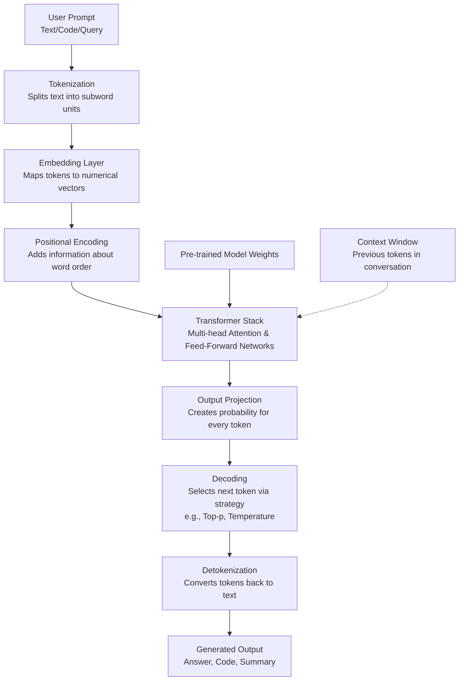

     

<h3 align="center">WELCOME TO</h3>
<h1 align="center">BLACXQUAD FREEMIUM REPOSITORY!</h1>
<h3 align="center">A HUB FOR FREE TECH LEARNING & RESOURCES.</h3>

  

    

    

  

    
 

> [!IMPORTANT]

This work is licensed under the **Creative Commons Attribution-ShareAlike 4.0 International License** (CC BY-SA 4.0).

When using, redistributing, adapting, or building upon this material, you **must** provide proper attribution by:

- 1. **Clearly stating the original source** as the **BLACXQUAD GitHub repository**.
- 2. **Including the exact URL(s)** to the relevant repository or file(s).

**Example Attribution Format:**  
- This work is based on content from the BLACXQUAD GitHub repository, available at:  
- https://github.com/blacxquad/freemium

Under the CC BY-SA license, you **must also**:
- Indicate if changes were made.
- License any adapted material under **identical terms** (CC BY-SA 4.0).

Failure to provide accurate source attribution violates the license terms.

    

# The Definitive Guide to Large Language Models (LLMs): Architecture, Applications & Future Landscape.

  

## Executive Summary

Large Language Models (LLMs) represent a foundational shift in artificial intelligence, empowering machines to comprehend, generate, and interact using human language with remarkable sophistication. Built upon the transformer architecture and trained on vast datasets encompassing trillions of words, these models have transitioned from academic research to powerful tools driving innovation across global industries. This guide provides a comprehensive examination of LLMs, detailing their technical underpinnings, operational mechanics, diverse practical applications, and the emerging trends shaping their future. Understanding these elements is essential for technologists, business leaders, and policymakers navigating the evolving AI landscape.

 

## 1. Historical Evolution: From Theoretical Concepts to Modern Giants

### 1.1 The Philosophical Foundation: Alan Turing's Vision
- In 1950, Alan Turing proposed the "Imitation Game," now known as the Turing Test, which reframed the question of machine intelligence from abstract philosophy to observable behavior. His test suggested that if a human judge could not reliably distinguish between the textual responses of a machine and a human through conversation, the machine could be considered intelligent. This established natural language understanding and generation as a primary benchmark for AI, setting a goal that would drive research for decades. While modern LLMs were not his direct prediction, their ability to engage in coherent, contextual dialogue is a direct pursuit of the challenge he laid out, making his work a cornerstone of the field's philosophy.

### 1.2 The AI Development Trajectory: From Rules to Learning
- Early AI systems were "narrow" or "expert" systems, operating within strict, rule-based boundaries for specific tasks like playing chess or diagnosing diseases from predefined symptoms. The advent of machine learning shifted the paradigm, allowing systems to learn patterns and make predictions from data without being explicitly programmed for every scenario. The deep learning revolution, powered by neural networks with many layers, enabled the processing of unstructured data like text, images, and sound. LLMs sit at the apex of this trajectory, combining large-scale deep learning with a generative purpose, meaning they can create novel, coherent text rather than just classifying or analyzing existing information, marking the leap from discriminative to generative AI.

 

## 2. Core Architecture: How LLMs Process Language

### 2.1 High-Level System Architecture
The journey from a user's prompt to a model's response involves a sophisticated, multi-stage pipeline. The process begins with raw text input, which is broken down into manageable pieces called tokens. These tokens are then converted into numerical vectors that capture meaning, with additional information added to denote their order in the sequence. The core of the model, a stack of transformer layers, then processes these vectors to understand context and relationships. Finally, the model predicts the most probable next token, which is selected via a decoding strategy and converted back into human-readable text.

**Table 1: Core Components of an LLM Architecture**
| **Component** | **Primary Function** | **Key Technical Notes** |
| :--- | :--- | :--- |
| **Tokenizer** | Converts text to tokens and back. | Uses algorithms like Byte-Pair Encoding (BPE) to handle unknown words. |
| **Embedding Layer** | Represents tokens as dense vectors in high-dimensional space. | Vectors for similar words are positioned closer together. |
| **Positional Encoding** | Injects information about the order of tokens. | Critical because the core attention mechanism is otherwise order-agnostic. |
| **Transformer Block** | The core processing unit for understanding context. | Contains Multi-Head Attention and Feed-Forward Neural Network layers. |
| **Output Layer** | Generates a probability score for every token in the vocabulary. | A simple linear layer followed by a softmax function. |
| **Decoding Strategy** | Governs how the next token is chosen from the probabilities. | Strategies like temperature sampling control randomness vs. determinism. |

### 2.2 The Transformer Revolution: Attention Is All You Need
- Introduced in the seminal 2017 paper "Attention Is All You Need," the transformer architecture replaced earlier sequential models like RNNs and LSTMs. Its key innovation, the **self-attention mechanism**, allows the model to weigh the importance of every other word in a sentence when processing a specific word, regardless of distance. This enables it to capture long-range dependencies, such as the connection between a pronoun and the noun it refers to many words earlier. Furthermore, unlike sequential models, transformers process all words in a sentence simultaneously, which allows for massive parallelization on modern hardware like GPUs, making the training of enormous models computationally feasible.

### 2.3 From Words to Vectors: Tokenization and Embeddings
- Tokenization is the first step, breaking down raw text into smaller units (tokens), which can be words, subwords, or characters. Modern LLMs primarily use **subword tokenization** (e.g., Byte-Pair Encoding), which splits rare words into meaningful sub-units (e.g., "unbelievable" into "un", "believ", "able"), balancing vocabulary size with the ability to handle novel words. Once tokenized, each token is passed through an **embedding layer**, which converts it from a discrete ID into a continuous, high-dimensional vector. These vectors are not random; during training, the model learns to place semantically similar words (like "king" and "queen") close together in this vector space, forming a rich, mathematical representation of language meaning.

 

## 3. Training Paradigms: Building Intelligence at Scale

### 3.1 Pre-training: Establishing a Foundational World Model
- In the pre-training phase, a model learns the fundamental patterns of language by consuming a massive, diverse corpus of text from the internet, books, articles, and code. This is done through **self-supervised learning**, where the training objective is built from the data itself. The most common task is **next-token prediction**: given a sequence of tokens, the model must predict the most probable next token. By repeating this task over trillions of tokens, the model internalizes grammar, facts, reasoning patterns, and even some level of world knowledge. This phase is extraordinarily computationally intensive, requiring thousands of specialized processors running for weeks or months, but it creates a versatile "foundation model" with broad capabilities.

**Table 2: Evolution of LLM Scale and Capability**
| **Model** | **Parameters** | **Training Data Scale** | **Key Innovation** | **Year** |
| :--- | :--- | :--- | :--- | :--- |
| **BERT** | 110M - 340M | 3.3B Tokens | Bidirectional context understanding | 2018 |
| **GPT-2** | 1.5B | 10B Tokens | Demonstrated scalability of decoder-only models | 2019 |
| **GPT-3** | 175B | 300B+ Tokens | Showed emergent few-shot learning abilities | 2020 |
| **PaLM** | 540B | 780B Tokens | Achieved breakthrough reasoning on large scale | 2022 |
| **GPT-4** | ~1.8T (MoE)* | ~13T Tokens* | Mixture of Experts architecture for efficiency | 2023 |
| **Llama 3** | 70B - 405B | 15T Tokens | State-of-the-art open-source performance | 2024 |
*Estimated values; MoE = Mixture of Experts.

### 3.2 Fine-Tuning and Alignment: Specializing and Safeguarding
- After pre-training, a foundation model is a powerful but general-purpose text generator. **Fine-tuning** is the process of adapting it to specific tasks or desired behaviors using smaller, curated datasets. **Supervised Fine-Tuning (SFT)** uses high-quality input-output pairs to teach specific tasks like summarization or coding. **Reinforcement Learning from Human Feedback (RLHF)** is a crucial alignment technique where human reviewers rate model outputs, and a reward model is trained to predict these ratings; the LLM is then fine-tuned to maximize this reward, making its outputs more helpful, honest, and harmless. Techniques like **LoRA** enable efficient fine-tuning by updating only a small subset of parameters, drastically reducing cost.

### 3.3 Prompt Engineering: The Art of Guiding the Model
- Prompt engineering is the practice of carefully crafting the input text (the prompt) to elicit the desired output from an LLM without modifying its weights. A well-structured prompt can include **instructions** ("Write a summary in three sentences"), **context** ("Given the following article..."), **examples** of the desired task (few-shot learning), and explicit **formatting rules** ("Output in JSON"). Advanced techniques like **chain-of-thought prompting**, where the model is asked to reason step-by-step ("Let's think through this logically"), can significantly improve performance on complex reasoning tasks. Effective prompt engineering is essential for deploying reliable LLM applications.

 

## 4. Practical Applications: Transforming Industries

### 4.1 Enterprise Productivity and Automation
- LLMs are revolutionizing business operations by automating and augmenting text-based workflows. They generate and refine marketing copy, technical documentation, and internal reports, drastically reducing the time spent on drafting. In software development, tools like GitHub Copilot act as AI pair programmers, suggesting code completions, generating functions from comments, and translating code between languages. Customer service is enhanced through intelligent chatbots that resolve complex queries, while knowledge management systems use LLMs to power semantic search across document repositories, automatically summarizing lengthy reports and extracting actionable insights from unstructured data.

### 4.2 Specialized Domain Expertise
- In **healthcare**, LLMs assist with drafting clinical notes, summarizing patient histories, and explaining medical literature, always under clinician supervision. The **legal profession** uses them for contract review, legal research summarization, and drafting standard clauses, improving lawyer efficiency. **Education** benefits from personalized tutoring systems, automatic assignment feedback, and the creation of adaptive learning materials. **Scientific research** is accelerated as LLMs help review vast literature, suggest experiment hypotheses, and even draft sections of papers. In **creative industries**, they serve as brainstorming partners for writers, generate variations for designers, and help overcome creative blocks.

### 4.3 Key Technical Implementation Patterns
- **Retrieval-Augmented Generation (RAG)** is a critical architecture that combats the "hallucination" problem. It fetches relevant, up-to-date information from external databases or documents and injects it into the LLM's prompt, grounding its responses in factual evidence. **Agents and Tool Use** involve LLMs that can reason, plan, and execute actions by calling external APIs, such as calculators, search engines, or database queries, to complete complex multi-step tasks. **Multimodal Systems** integrate LLMs with vision and speech models, enabling applications that can, for example, describe images, analyze video content, or hold spoken conversations, creating more natural and versatile human-computer interfaces.

 

## 5. Challenges, Limitations, and Responsible Deployment

### 5.1 Persistent Technical Limitations
- Despite their capabilities, LLMs have inherent weaknesses. **Hallucination**, the generation of plausible but incorrect or fabricated information, remains a core challenge, especially for niche topics. While **context windows** are expanding (now up to 1 million tokens), effectively utilizing such long contexts for complex reasoning is non-trivial. Their **reasoning is often superficial**, struggling with deep logical deduction, complex planning, or rigorous mathematical proof. Furthermore, the immense **computational cost** of training and running top-tier models creates barriers to entry and raises environmental concerns, driving the need for more efficient algorithms and hardware.

### 5.2 Ethical, Safety, and Societal Considerations
- LLMs pose significant ethical challenges. They can **amplify societal biases** present in their training data, leading to unfair or discriminatory outputs. Their ability to generate human-like text at scale creates **misinformation and fraud risks**, necessitating robust detection and provenance systems. **Privacy concerns** arise from the potential for models to memorize and regurgitate sensitive personal data from their training sets. The **economic impact** on knowledge-work professions requires thoughtful management and reskilling initiatives. Addressing these issues requires a multi-faceted approach involving technical research, transparent policies, and collaborative governance.

### 5.3 Safety and Alignment Challenges
- Ensuring LLMs behave safely is an ongoing battle. **Jailbreaking** involves users crafting adversarial prompts to bypass a model's safety guidelines, requiring constant monitoring and model updates. **Value alignment**—encoding complex, nuanced human ethics into a mathematical model—is profoundly difficult and culturally sensitive. The **dual-use nature** of the technology means advances in capability can be leveraged for both beneficial and harmful purposes. Developing effective **auditing frameworks** and **international cooperation** on safety standards is critical to manage these risks as models grow more powerful.

 

## 6. The LLM Ecosystem: Models, Platforms, and Tools

### 6.1 Model Families and Providers
The LLM landscape is divided between proprietary models offered via API and open-source models that can be self-hosted. This diversity fuels innovation and provides options balancing cost, control, and capability.

### 6.2 Emerging Architectural Innovations
- **Mixture of Experts (MoE)** architectures, like in GPT-4, activate only a subset of neural network "experts" for a given input. This allows models to have trillions of parameters while keeping inference costs manageable, as only a fraction of the total weights are used per token. **State Space Models (SSMs)** such as Mamba offer a promising alternative to transformers, providing linear-time scaling with sequence length and efficient inference, potentially revolutionizing long-context processing. Continued co-design of **specialized hardware** (AI accelerators) and algorithms is also crucial for driving down the cost and energy consumption of running LLMs at scale.

 

## 7. Future Directions and Research Frontiers

### 7.1 Toward More Capable and Reliable Models
- Future research aims to move beyond pattern-matching toward robust **reasoning and planning**. This involves improving chain-of-thought techniques, integrating external symbolic reasoning engines, and developing internal "world models" that allow the AI to simulate cause and effect. Effectively **leveraging ultra-long contexts** (millions of tokens) to manage entire libraries of information or lengthy projects will be a key focus. Furthermore, the push for **true multimodality** will continue, aiming for seamlessly integrated models that understand and generate across text, images, audio, and video as naturally as humans process multi-sensory information.

### 7.2 The Pursuit of Efficiency and Democratization
- Making LLMs faster, cheaper, and more accessible is a major frontier. Research into **algorithmic efficiency**—through better model architectures, training techniques, and compression methods (like pruning and quantization)—aims to deliver high performance with fewer resources. The development of **smaller, yet highly capable models** that can run on consumer-grade hardware is crucial for democratizing access and fostering innovation. Concurrently, the field is grappling with the **environmental impact**, driving efforts to optimize energy use and align training and inference with renewable energy sources.

### 7.3 Advancing Safety, Governance, and Understanding
- As models approach and potentially surpass human-level capabilities in narrow domains, **scalable oversight** becomes critical—developing ways to supervise AI systems that are more capable than their human supervisors. **Interpretability research** seeks to move from "black box" to "glass box" models, providing tools to understand why an LLM made a specific decision, which is vital for debugging and building trust. Finally, establishing **effective governance**—through international cooperation on safety standards, audit requirements, and responsible development practices—will be essential to ensure these powerful technologies benefit humanity as a whole.

 

## Conclusion

Large Language Models mark a transformative chapter in the story of artificial intelligence, fundamentally altering how humans create, access, and interact with knowledge. From their theoretical origins to their current status as engines of industrial and creative productivity, LLMs demonstrate both the extraordinary potential and the complex responsibilities of advanced AI.

The field is advancing at a breathtaking pace, driven by breakthroughs in architecture, scaling, and alignment. Successfully navigating this future requires a balanced, multidisciplinary approach that vigorously pursues capability while diligently investing in safety, ethics, and equitable access. By understanding the foundations, applications, and trajectories outlined in this guide, organizations and individuals can make informed decisions—strategically harnessing the power of LLMs to solve real-world problems while proactively contributing to the development of a safe and beneficial AI ecosystem for all.

    

<h2 align="center">STAY TUNED FOR THE LATEST UPDATES!</h2>

  

    

