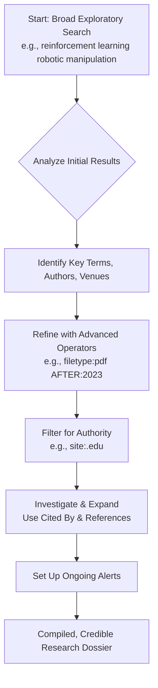

    

<h3 align="center">WELCOME TO</h3>
<h1 align="center">BLACXQUAD FREEMIUM REPOSITORY!</h1>
<h3 align="center">A HUB FOR FREE TECH LEARNING & RESOURCES.</h3>

  

    

    

  

    
 

> [!IMPORTANT]

This work is licensed under the **Creative Commons Attribution-ShareAlike 4.0 International License** (CC BY-SA 4.0).

When using, redistributing, adapting, or building upon this material, you **must** provide proper attribution by:

- 1. **Clearly stating the original source** as the **BLACXQUAD GitHub repository**.
- 2. **Including the exact URL(s)** to the relevant repository or file(s).

**Example Attribution Format:**  
- This work is based on content from the BLACXQUAD GitHub repository, available at:  
- https://github.com/blacxquad/freemium

Under the CC BY-SA license, you **must also**:
- Indicate if changes were made.
- License any adapted material under **identical terms** (CC BY-SA 4.0).

Failure to provide accurate source attribution violates the license terms.

    

# The Modern Search Engineer's Guide: Mastering Search Engine Techniques

## Introduction: The Superpower of Precision Search

In the digital age, we are surrounded by an overwhelming volume of information. The ability to navigate this vast landscape effectively—to find precise, relevant, and authoritative information quickly—is a critical skill that functions as a modern superpower. This guide is designed for everyone: researchers, developers, students, and professionals. It moves beyond basic keyword entry to teach you a systematic, engineering approach to information retrieval. By mastering the techniques outlined here, you will transform from a casual search user into a proficient "search engineer," capable of consistently locating high-quality information, solving complex problems, and dramatically boosting your productivity.

 

## Part 1: Foundational Core Search Techniques

Modern search engines are sophisticated tools designed to deliver immediate answers. Understanding and utilizing these built-in capabilities is the essential first step toward efficient searching.

### Instant Answers & Quick Lookups

Search engines can function as powerful, immediate answer engines for factual queries, eliminating the need to click through to a website.

*   **Calculations and Unit Conversions:** You can use the search bar as an advanced calculator. Enter mathematical equations like `(5*22)/7` or `sqrt(144)` for instant results. For unit conversions, use natural language syntax such as `km to miles`, `gallons to liters`, or `USD to EUR` for live currency exchange rates. This eliminates the need for separate calculator or conversion tools.
*   **Real-Time and Factual Information:** Obtain live data directly from the results page. Enter stock ticker symbols (`AAPL`) for current prices, search `time in Tokyo` for world clocks, or type a city name followed by "weather" for forecasts. You can also find practical information like sunrise/sunset times, your public IP address, or customer support numbers for businesses.
*   **Definitions, Translations, and Tools:** Use the `define [word]` command to get a word's definition, pronunciation, and etymology. For translation, try `[word] in [language]` or `translate "phrase" to French`. Search engines also integrate with various tools; you can track flights by number, find a lost device, or start a timer or stopwatch with simple voice or text commands.

### Intent-Based Discovery

For exploratory needs, framing your search around your specific goal yields significantly better and more useful results.

*   **Planning, Comparison, and Commerce:** Structure your query around an action. Search for `holidays 2024` for dates, `flights NYC to London` for travel options, or `hotels in Paris` with dates for accommodation comparisons. You can compare products, check local event schedules (`Austin events this weekend`), or estimate travel distances and times.
*   **Media and Package Tracking:** Enter the name of a movie or TV show to see ratings, summaries, and, crucially, which streaming platforms currently offer it. Similarly, paste a shipping tracking number directly into the search bar to get the latest delivery status from the carrier without visiting their site.

 

## Part 2: Advanced Filtering & Search Operators

To cut through irrelevant results and target exact information, you must master search operators—special symbols and commands that give precise instructions to the engine.

### Precision Filtering Operators

These operators restrict results to specific technical attributes of web pages and files, making them indispensable for academic, professional, and technical research.

| Operator | Syntax Example | Primary Use Case |
| :--- | :--- | :--- |
| **`site:`** | `site:github.com docker` | Confines results to pages from a specific website or domain. |
| **`filetype:`** | `filetype:pdf "climate report"` | Finds files of a specific type (PDF, PPTX, DOC, XLS). |
| **`intitle:` / `allintitle:`** | `intitle:quantum computing` | Requires the term(s) to appear in the HTML title of the page. |
| **`inurl:` / `allinurl:`** | `inurl:blog startup` | Requires the term(s) to appear in the URL of the page. |
| **`intext:` / `allintext:`** | `intext:"machine learning"` | Requires the term(s) to appear in the visible body text of the page. |

*   **Domain and Site Restriction (`site:`):** This is one of the most powerful operators. Use `site:example.com` to search only within that website. Combine it with a top-level domain (TLD) like `site:.gov` or `site:.ac.uk` to target authoritative government or academic sources, ensuring higher credibility for your research【1†L24-L26】.
*   **File Type Targeting (`filetype:`):** Directly locate presentations, research papers, datasets, or reports. Searching for `"neural networks" filetype:pptx` will return PowerPoint presentations, while `filetype:csv population data` helps find raw datasets【1†L34-L35】.
*   **Content Location Filters (`intitle:`, `inurl:`, `intext:`):** These operators force terms to appear in specific parts of a web document. `intitle:` targets page titles (often indicating primary topic), `inurl:` looks within the address (good for finding specific sections or resource types like `/blog/`), and `intext:` scours the main content【1†L35-L36】.

### Boolean & Contextual Logic Operators

These operators define the logical relationships between your search terms, allowing you to broaden, narrow, and refine your conceptual search.

*   **Exact Phrase (`" "`) and Exclusion (`-`):** Enclose terms in double quotation marks for a literal, word-for-word match: `"supply chain management"`. Use the minus sign immediately before a word to exclude results containing it: `jaguar -car` or `python -snake`【2†L1-L3】.
*   **Boolean Logic (`OR`, `AND`):** Use the capitalized `OR` to search for either of two terms: `TensorFlow OR PyTorch`. The `AND` operator is typically implicit when you put words next to each other, but can be used for emphasis. Parentheses can group complex logic: `(cat OR dog) AND adoption`【2†LL3-L4】.
*   **Proximity (`AROUND(n)`) and Wildcards (`*`):** The `AROUND(n)` operator (supported in some engines) finds two terms within *n* words of each other, perfect for finding connected concepts: `"quantum" AROUND(5) "computing"`. The asterisk `*` acts as a wildcard placeholder for any word: `"the * of the story"` finds "the end of the story," "the heart of the story," etc.【1†L31-L32】.
*   **Synonym (`~`) and Numeric Range (`..`):** Prefix a word with tilde `~` to include its synonyms: `~affordable housing` may also return results for "low-cost housing" or "inexpensive housing." Use the double-dot `..` to specify a range for numbers, dates, prices, or versions: `laptop $500..$800` or `Python 3.8..3.11`【1†L32-L33】.

### Advanced Utility Operators

These operators serve specialized, investigative purposes for understanding connections and accessing historical data.

*   **Finding Related and Linked Pages:** Use `related:[url]` to discover websites similar to one you already know. The `link:[url]` operator shows you which other pages link *to* the specified URL, useful for understanding influence or popularity.
*   **Accessing Cached Content:** The `cache:[url]` operator retrieves the search engine's last saved snapshot of a page. This is invaluable if the live site is down, has changed, or if you need to view content that has since been removed.
*   **Temporal Filtering (`BEFORE:`, `AFTER:`):** Filter results by date to find the most recent information or historical content. Use formats like `AFTER:2023-01-01` or `BEFORE:2020` to narrow your results to a specific timeframe.

 

## Part 3: Strategic Search Methodology

Techniques are tools, but strategy is the blueprint. A methodological approach transforms random searching into systematic, reliable discovery.

### Query Crafting and Iterative Refinement

*   **Adopt a "Broad to Narrow" Mindset:** Never expect perfection on the first try. Start with a general query to survey the information landscape. Review the results to identify common terminology, key authors, or relevant sub-topics, then iteratively refine your search using more specific keywords and the operators discussed above【1†L57-L58】.
*   **Incorporate Professional and Technical Jargon:** To bypass introductory or generic content, use the precise terminology of the field you are researching. Searching for "ML model overfitting mitigation" will yield more expert-level material than "how to stop a model from learning the training data too well"【1†L58-L59】.
*   **Deconstruct Sentences into Core Concepts:** When translating a question into a query, strip away superfluous words like "the," "how," "what is," or "of." Focus on the essential nouns, proper names, and action verbs. The question "What are the effects of climate change on coastal erosion?" becomes the more effective query: `"climate change" effects "coastal erosion"`【1†L59-L60】.

### Source Evaluation and Verification

*   **Proactively Filter for Authority:** When credibility is non-negotiable, begin your search with domain filters. Intentionally using `site:.edu`, `site:.gov`, or `site:who.int` ensures your foundational sources come from academic, governmental, or respected international institutions【2†L15-L16】.
*   **Cross-Reference Across Multiple Search Engines:** No single engine indexes the entire web, and each uses different ranking algorithms. Conducting the same search on Google, Bing, DuckDuckGo, and a specialized engine like Semantic Scholar (for academics) will surface different perspectives and unique sources【3†L1-L3】.
*   **Leverage Academic Citation Networks:** In scholarly databases like Google Scholar, the "Cited by" link is a primary research tool. It allows you to perform "forward chaining"—finding newer works that build upon a key paper. Conversely, the paper's references list enables "backward chaining" to discover its foundational sources【3†L13-L15】.

## Part 4: Integrated Workflow and Practical Application

The following workflow synthesizes all techniques into a actionable process for tackling a complex research task.

**Scenario:** Conducting research on recent advancements in applying reinforcement learning to robotic manipulation.

**Step-by-Step Execution:**

1.  **Exploratory Phase:** Initiate with a broad query: `reinforcement learning robotic manipulation`. Do not aim for perfect sources yet. Scan the results to identify recurrent key terms (e.g., "sim2real," "policy gradient"), leading research labs, and relevant conference names (e.g., CoRL, RSS).
2.  **Refinement Phase:** Apply advanced operators to narrow the scope. To find recent conference papers, a strong query would be: `"reinforcement learning" "robotic manipulation" filetype:pdf AFTER:2023`. This combines phrase searching, file type targeting, and a date filter.
3.  **Authority Filtering:** To prioritize academic credibility, layer in a domain restriction: `site:.edu "deep reinforcement learning" "robot gripper" filetype:pdf`. This ensures results originate from university domains.
4.  **Investigation and Expansion:** Open 3-5 of the most promising PDFs. Skim their introductions and reference lists (**backward chaining**). Then, take one seminal paper and search for it in Google Scholar to use the **"Cited by"** link (**forward chaining**). This builds a network of related research.
5.  **Ongoing Monitoring:** For long-term projects, set up automated alerts. Use a refined query like `"reinforcement learning" "robot" ("grasping" OR "manipulation")` in Google Alerts to receive email notifications when new content matching your criteria is indexed.

 

## Conclusion: Cultivating the Search Engineer Mindset

Mastery of modern search is not merely about memorizing a list of operators; it is about cultivating a specific mindset—a hybrid of a librarian's understanding of information organization, a detective's skill in following clues, and an engineer's methodical approach to problem-solving. It involves forming a hypothesis about where the information might exist, crafting a query to test that hypothesis, and using technical syntax to refine the results with precision.

The techniques detailed in this guide, from foundational quick lookups to advanced Boolean logic and strategic source evaluation, constitute a comprehensive toolkit for navigating the digital age. Begin your journey to mastery by integrating one or two new operators into your daily searches. Consciously analyze the structure of high-quality results you encounter and consider what query could have led to them. Through this deliberate and consistent practice, sophisticated searching will evolve from a conscious effort into a subconscious skill, effectively transforming the boundless internet into a precise, powerful, and queryable extension of your own cognitive capabilities.

 
    

<h2 align="center">STAY TUNED FOR THE LATEST UPDATES!</h2>

  

    

