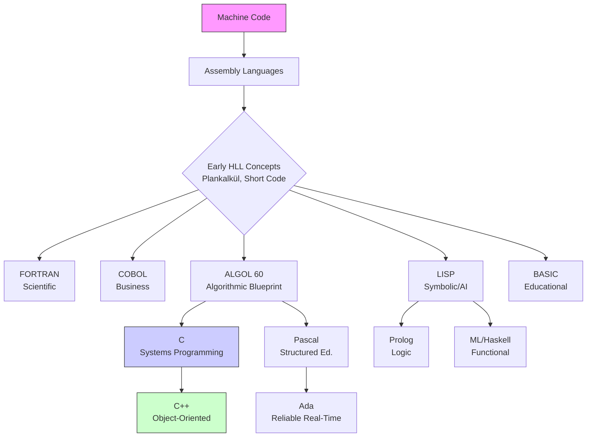

    

<h3 align="center">WELCOME TO</h3>
<h1 align="center">BLACXQUAD FREEMIUM REPOSITORY!</h1>
<h3 align="center">A HUB FOR FREE TECH LEARNING & RESOURCES.</h3>

  

    

    

  

    
 

> [!IMPORTANT]

This work is licensed under the **Creative Commons Attribution-ShareAlike 4.0 International License** (CC BY-SA 4.0).

When using, redistributing, adapting, or building upon this material, you **must** provide proper attribution by:

- 1. **Clearly stating the original source** as the **BLACXQUAD GitHub repository**.
- 2. **Including the exact URL(s)** to the relevant repository or file(s).

**Example Attribution Format:**  
- This work is based on content from the BLACXQUAD GitHub repository, available at:  
- https://github.com/blacxquad/freemium

Under the CC BY-SA license, you **must also**:
- Indicate if changes were made.
- License any adapted material under **identical terms** (CC BY-SA 4.0).

Failure to provide accurate source attribution violates the license terms.

    

<h1 align="center">A Comprehensive History and Taxonomy of Programming Languages: From Machine Code to Modern Paradigms.</h1>

  
 
## Executive Summary

Programming languages form the essential bridge between human thought and machine execution. Their evolution directly reflects the journey of computing itself—from room-sized calculators to the invisible, global infrastructure that powers modern society. This document provides a structured historical overview and a technical taxonomy of programming languages. It traces their development from raw binary instructions to the high-level, paradigm-rich tools we use today, serving as a definitive guide for developers, students, and technology leaders.

 

## 1. The Foundational Era: Speaking to Hardware (1940s-1950s)

In the beginning, programming was an exercise in deep hardware intimacy. There were no compilers, no interpreters, and no abstraction.

### 1.1 Machine Code and Assembly: The Hardware Interface
- The first "programs" were sequences of **machine code**—binary numbers (1s and 0s) that corresponded directly to the CPU's instruction set. Programmers needed to know the exact memory layout and hardware registers, making the process incredibly tedious, error-prone, and completely non-portable between different machines.
- **Assembly Language** emerged as the first major abstraction. It replaced numeric codes with human-readable mnemonics like `LOAD`, `ADD`, and `JUMP`. A program called an **assembler** would translate these symbols into machine code. While still tied to a specific processor architecture, assembly gave programmers a crucial layer of manageability and is still used today for ultra-optimized code in drivers, firmware, and performance-critical routines.

### 1.2 The First High-Level Concepts
- **Plankalkül** (1942-1945), designed by Konrad Zuse, is historically recognized as the first conceived high-level programming language. It featured remarkable foresight with concepts like assignments, subroutines, loops, and conditional execution. However, it remained unimplemented and largely unknown for decades, making it a theoretical rather than practical milestone.
- **Short Code** (1949) and **Autocode** (1954) represented the first practical steps. Short Code was an early interpreter that allowed mathematical expressions to be written in a somewhat readable form. Autocode, for the Manchester Mark 1, is considered the first compiled language, proving that automatic translation from a higher-level notation to machine code was feasible.

 

## 2. The First Wave: Birth of the Giants (Late 1950s-1960s)

This era saw the creation of languages that established enduring programming paradigms and communities.

### 2.1 FORTRAN: Power for Science
- **FORTRAN** (1957) was a breakthrough engineered by John Backus at IBM. Its primary goal was performance: to produce code as efficient as hand-written assembly for scientific and engineering calculations. Its success proved that high-level languages could be practical for serious work. FORTRAN introduced key concepts like variables, loops, and subroutines in a form familiar to scientists. Its legacy is immense, with modern Fortran (e.g., Fortran 2018) still powering critical applications in weather forecasting, computational fluid dynamics, and physics simulations due to its unparalleled numerical computing capabilities.

### 2.2 LISP: The Language of Ideas
- **LISP** (1958), created by John McCarthy, took a radically different path. Designed for **symbolic computation** and artificial intelligence research, its core data structure was the list. LISP pioneered foundational concepts that became mainstream decades later: **automatic garbage collection**, **dynamic typing**, **recursion** as a primary control structure, and the powerful idea of **homoiconicity**—where code is data and data is code, enabling incredible metaprogramming. Dialects like Common Lisp and Scheme continue to be used in AI, computer algebra systems, and rapid prototyping.

### 2.3 COBOL: Business Logic Standardized
- **COBOL** (1959) was designed by a committee (CODASYL) with Grace Hopper's strong influence to solve business data processing problems. It prioritized readability with an English-like syntax (e.g., `ADD TOTAL TO GRAND-TOTAL`) and accurate decimal arithmetic for financial calculations. Its design goal of portability across different manufacturers' machines was revolutionary. Despite being declared "dead" for years, an estimated 200-250 billion lines of COBOL code still run core banking, government, and insurance systems worldwide, processing trillions of dollars daily.

### 2.4 ALGOL: The Academic Blueprint
- **ALGOL 60** is often called the most influential language you never used. It introduced a rigorous, formal definition using **Backus-Naur Form (BNF)** and concepts that became the bedrock of modern language design: **block structure**, **lexical scoping**, and **recursive procedures**. While it saw limited commercial use, it directly inspired Pascal, C, and virtually all subsequent imperative languages. It was the language in which algorithms were published for a generation.

### 2.5 BASIC: Democratizing Programming
- **BASIC** (1964) was created at Dartmouth College by John Kemeny and Thomas Kurtz with an explicit goal: to make programming accessible to all students, not just scientists. Its simple syntax and interactive, interpreted environment lowered the barrier to entry dramatically. When microcomputers like the Apple II and TRS-80 arrived in the late 1970s, BASIC was often built-in, introducing millions to programming. Its direct lineage leads to modern visual tools like Visual Basic and its spirit lives on in beginner-friendly environments like Scratch.

 

## 3. Systems Software and Paradigm Proliferation (1970s-1980s)

As computing moved from batch processing to interactive systems and personal computers, new languages emerged to build the software infrastructure and explore new ways of thinking.

### 3.1 C: The Portable Assembler
- **C** (1972), developed by Dennis Ritchie at Bell Labs, was created to rewrite the UNIX operating system. It struck a perfect balance: it provided high-level control structures (if/else, loops, functions) while allowing low-level manipulation of memory via pointers. This "high-level assembly" philosophy, combined with its simplicity and a powerful standard library, made it uniquely portable and efficient. C became the lingua franca of system programming, application software, and embedded systems, forming the foundation for nearly all modern operating systems and countless applications.

### 3.2 C++: Object-Oriented Power Without Sacrifice
- **C++** (1983) began as "C with Classes," created by Bjarne Stroustrup. It extended C with the **object-oriented programming (OOP)** paradigm—encapsulation, inheritance, and polymorphism—while maintaining full compatibility and the "you only pay for what you use" performance principle. Later additions like **templates** (enabling generic programming) and the Standard Template Library (STL) made it a multi-paradigm powerhouse. C++ dominates fields requiring complex abstractions and raw performance: game engines, financial trading systems, browsers (Chrome, Firefox), and database software.

### 3.3 The Paradigm Explosion
This period was marked by exploration beyond imperative and object-oriented thinking.

| Language | Paradigm Introduced/Exemplified | Primary Influence |
| :--- | :--- | :--- |
| **Pascal** (1970) | Structured, Procedural | Education, strong typing, clear syntax. |
| **Smalltalk** (1970s) | Pure Object-Oriented | "Everything is an object," integrated GUI environments. |
| **Prolog** (1972) | Logic Programming | Declarative rule-based programming (AI, theorem proving). |
| **SQL** (1974) | Declarative, Domain-Specific | Managing and querying relational databases. |
| **Ada** (1980) | Structured, Concurrent | Reliability, maintainability, real-time systems (avionics, defense). |
| **ML/Haskell** (1973/1990) | Functional | Strong static typing, type inference, immutability, formal foundations. |

 

## 4. The Internet Age and Managed Code (1990s-2000s)

The rise of the World Wide Web and complex, networked applications demanded languages that boosted productivity, managed complexity, and embraced platform independence.

### 4.1 Java: Write Once, Run Anywhere
- **Java** (1995), from Sun Microsystems, promised platform independence through the **Java Virtual Machine (JVM)**. Code is compiled to bytecode, which runs identically on any device with a JVM. This, combined with its robust **object-oriented design**, automatic garbage collection, and a rich standard library, made it ideal for enterprise, network, and later, Android mobile development. Its "managed runtime" environment handles memory and security, allowing developers to focus on business logic. The massive, mature JVM ecosystem remains a cornerstone of backend systems worldwide.

### 4.2 JavaScript: The Language of the Web
- **JavaScript** (1995) was created in 10 days by Brendan Eich to add interactivity to web pages in Netscape Navigator. Its initial design was rushed, but its monopoly in the browser led to ubiquity. The 2000s saw the **Ajax** revolution and libraries like jQuery. The **ES6 (2015)** standard modernized it with classes, modules, and arrow functions. The launch of **Node.js (2009)** broke it free from the browser, enabling full-stack JavaScript development. Today, **TypeScript**—a typed superset of JavaScript—is addressing its scalability challenges for large applications.

### 4.3 Python: Clarity and Ecosystem
- **Python** (1991), guided by Guido van Rossum, prioritized **code readability** and developer productivity above all else. Its clean, indentation-based syntax, dynamic typing, and "batteries included" philosophy (comprehensive standard library) made it exceptionally approachable. Its multi-paradigm nature and powerful third-party ecosystems (e.g., NumPy for science, Django for web, TensorFlow for AI) have propelled it to the top of popularity indexes, making it the go-to language for scripting, automation, data science, machine learning, and web development.

### 4.4 PHP & Ruby: Web-First Productivity
- **PHP** evolved from a set of CGI scripts to a dominant server-side language for the web. Its simplicity in embedding dynamic content within HTML and the **LAMP stack** made it the engine of the early interactive web (WordPress, Wikipedia). Modern PHP (7+) has dramatically improved performance and added robust type systems.
- **Ruby**, designed for "programmer happiness," found its killer application in **Ruby on Rails** (2004). Rails' "convention over configuration" and agile development principles massively accelerated web application creation and influenced a generation of web frameworks across all languages.

### 4.5 C#: The Managed Microsoft Ecosystem
- **C#** (2000), led by Anders Hejlsberg, was Microsoft's answer to Java within the **.NET Framework**. It combined C-style syntax with Java-like managed execution and added innovative features like **properties**, **delegates**, and later **LINQ** and **async/await**. With the open-source, cross-platform **.NET Core** (now .NET 5+), C# has broken free from Windows, becoming a powerful choice for cloud, web, gaming (Unity), and enterprise applications on any operating system.

 

## 5. The Modern Landscape: Safety, Concurrency, and Specialization (2010s-Present)

Contemporary language design focuses on solving specific modern challenges: safe systems programming, effortless concurrency, and domain-specific performance.

### 5.1 Go: Simplicity at Scale
- **Go** (2009), from Google, was a reaction to the complexity of C++ and Java for building large-scale, networked systems. It emphasizes **simplicity** (minimalist syntax), **fast compilation**, and built-in **concurrency primitives** (goroutines and channels). Its opinionated tooling and ability to produce statically linked binaries make it ideal for cloud-native software, microservices, DevOps tooling (Docker, Kubernetes), and command-line utilities.

### 5.2 Rust: Safety Without Compromise
- **Rust** (2010) aims to provide the performance and control of C++ with guaranteed **memory and thread safety**. It achieves this through a revolutionary **ownership model** and **borrow checker** that enforces rules at compile time, eliminating entire classes of bugs (null pointer dereferencing, data races) without a garbage collector. This makes Rust uniquely suited for systems programming where safety is critical: operating systems, browser components, game engines, and blockchain infrastructure.

### 5.3 Focused Modern Languages
The trend continues toward languages optimized for specific domains or modern workflows.

| Language | Primary Domain & Key Feature |
| :--- | :--- |
| **Swift** (2014) | iOS/macOS development. Safety, modern syntax, performance. |
| **Kotlin** (2011) | Android & JVM development. Interoperability with Java, conciseness. |
| **TypeScript** (2012) | Large-scale Web Development. Static typing for JavaScript. |
| **Julia** (2012) | High-Performance Scientific Computing. JIT compilation, multiple dispatch. |
| **Elixir** (2011) | Distributed, Fault-Tolerant Systems. Runs on the Erlang BEAM VM. |
| **Dart** (2011) | Cross-Platform Mobile/Web Apps. Primary language for the Flutter framework. |

 

## 6. Key Evolutionary Patterns and Trade-offs

### 6.1 The March of Abstraction
- There is a clear historical trajectory from manipulating hardware bits directly to declaring high-level intentions. This shift has massively increased developer productivity and allowed for more complex, reliable software. However, each layer of abstraction can introduce overhead, reduce transparency, and create debugging challenges. Modern language design, as seen in Rust's "zero-cost abstractions," strives to provide safety and expressiveness without sacrificing performance.

### 6.2 The Multi-Paradigm Imperative
- Few modern languages are pure in their paradigm. **Python**, **C#**, and **Scala** deliberately incorporate object-oriented, functional, and imperative features. This recognizes that different problems within a single project are best solved with different mental models. A developer might use functional constructs for data transformations and object-oriented design for modeling business entities.

### 6.3 The Safety vs. Control Spectrum
- Languages exist on a spectrum. On one end, **C** and **Assembly** offer maximum control and performance but place the burden of safety (memory management, type errors) entirely on the programmer. On the other end, **Java** and **Python** use managed runtimes to provide safety automatically, at the cost of some control and overhead. **Rust** represents a pioneering middle ground, using a sophisticated compiler to provide safety guarantees at compile time, eliminating the runtime cost.

### 6.4 Specialization vs. Generalization
- While specialized languages (like **R** for statistics or **SQL** for databases) will always exist, the power of a **general-purpose language with a rich ecosystem** (like Python's scientific stack) is a dominant trend. This allows developers to work within one language and toolchain while leveraging domain-specific libraries, reducing the cognitive load of context-switching between languages.

 

## 7. Practical Guidance: Choosing and Learning Languages

### 7.1 How to Select a Language for a Project
Consider these factors as a checklist:

| Factor | Questions to Ask | Example Languages |
| :--- | :--- | :--- |
| **Project Requirements** | Is it a web app, mobile app, system utility, data analysis? | Web: JS/TS; Mobile: Swift/Kotlin; Systems: Go/Rust |
| **Team Expertise** | What does the team already know? Is there time for training? | Leverage existing skills for velocity. |
| **Performance Needs** | Is it CPU-bound, I/O-bound, or requiring real-time response? | CPU: C++/Rust; I/O: Go/Java; Client: JS. |
| **Ecosystem & Libraries** | Are there mature libraries/frameworks for the task? | Python for ML, JS for web, Java for enterprise. |
| **Longevity & Maintenance** | Will the codebase need to be maintained for 10+ years? | Strong typing (TS, Java) aids long-term maintenance. |
| **Interoperability** | Does it need to integrate with existing systems/APIs? | JVM langs integrate with Java; C can interface with anything. |

### 7.2 A Strategic Learning Path
- **Start with Fundamentals:** Begin with a **statically-typed, general-purpose language** like **Python** (for immediate gratification and broad relevance) or **Java/C#** (to deeply understand OOP and types). This builds a solid mental model of how code is structured and executed.
- **Understand the Machine:** Learn basic **C** and concepts of **memory management, pointers, and stack vs. heap**. You don't need to be an expert, but this knowledge demystifies how higher-level languages work and is invaluable for debugging and optimization.
- **Embrace the Web:** **JavaScript/TypeScript** is non-negotiable for full-stack or front-end development. Understanding the browser's runtime and asynchronous programming is crucial for modern development.
- **Explore a Paradigm:** Deliberately learn a **functional language** like **Elm** (beginner-friendly) or **Haskell**. This will fundamentally change how you approach problems, emphasizing immutability and pure functions, making you a better programmer in any language.
- **Specialize:** Based on your career goals, dive deep into a domain-specific language: **Rust/Go** for systems/cloud, **R/Julia** for data science, **Swift/Kotlin** for mobile.

### 7.3 Dealing with Legacy Systems
- **Assessment First:** Never default to a full rewrite. Analyze the business criticality, cost of bugs, and availability of talent (e.g., COBOL developers). Often, **strangler fig** patterns—gradually replacing parts of a system—are safer.
- **Modernization Strategies:** For **C/C++**, introduce modern static analyzers and CI/CD. For **Java/C#**, update frameworks and containerize for the cloud. For **COBOL/FORTRAN**, consider wrapping core logic in APIs served by modern runtimes rather than risky direct rewrites.

 

## 8. The Horizon: Future Trends and Directions

### 8.1 Language Design Frontiers
- **Formal Verification Integration:** Languages like **F***, **Lean**, and **Idris** are exploring **dependent types**, where types can express logical propositions, allowing the compiler to prove correctness properties about your code, moving towards bug-free software.
- **AI-Native Tooling:** As AI pair programmers like GitHub Copilot become standard, future languages might evolve syntax and semantics that are easier for both humans and AIs to reason about and generate correctly.
- **Hardware Specialization:** Languages like **Mojo** (building on Python) aim to seamlessly unify high-level programming with low-level control over accelerators (GPUs, TPUs), crucial for AI and high-performance computing.

### 8.2 Ecosystem Evolution
- **WebAssembly (WASM):** WASM is emerging as a universal, secure, fast compilation target for the web and beyond. It allows languages like Rust, Go, and C++ to run safely in the browser and is expanding to server-side ("WASI"), enabling true language interoperability.
- **Polyglot Runtimes:** Projects like **GraalVM** allow multiple languages (Java, JS, Python, R) to run in a shared runtime with high-performance interoperability, reducing the cost of using the right tool for the job.
- **Supply Chain Security:** Language ecosystems are focusing on secure package management, vulnerability scanning, and signed artifacts to prevent attacks via dependencies.

 

## 9. Conclusion

The history of programming languages is a story of constant tension and balance—between human understanding and machine efficiency, between creative freedom and enforced safety, between specialized power and general-purpose utility. Each new language is a hypothesis about how to better manage the growing complexity of the software we aspire to build.

For the professional developer or researcher, cultivating **paradigm literacy** is more important than mastering every syntax. Understanding the core ideas behind object-oriented, functional, logical, and concurrent programming provides a toolkit that can be applied across languages. The "best" language is always contextual, defined by the problem, the team, and the ecosystem.

As we look forward, the evolution will continue to be driven by the demands of new hardware architectures, the imperative for secure and reliable systems, and the never-ending quest to make the expression of human logic in code more intuitive and powerful. The journey from machine code to modern paradigms is far from over.

 

## Appendices

### Appendix A: Paradigm Characteristics Summary

| Paradigm | Core Principle | Key Languages | Best For |
| :--- | :--- | :--- | :--- |
| **Imperative** | Programs as sequences of commands that change state. | C, FORTRAN, Pascal | Low-level control, algorithms. |
| **Object-Oriented** | Programs as collections of interacting objects containing data and behavior. | Java, C++, Python | Modeling complex systems, GUI, business apps. |
| **Functional** | Programs as evaluations of mathematical functions, avoiding state change. | Haskell, Lisp, Elm | Data transformations, concurrent systems, ML. |
| **Logical** | Programs as sets of logical rules and facts. | Prolog | Expert systems, symbolic AI, parsing. |
| **Declarative** | Programmer specifies *what* is needed, not *how* to do it. | SQL, HTML | Querying data, describing structure. |

### Appendix B: Modern Language Selection Quick Reference

| Use Case | Primary Recommendation | Strong Alternatives |
| :--- | :--- | :--- |
| **Enterprise Backend / Web Services** | Java, C# | Go, Python (with FastAPI/Django) |
| **Modern Web Frontend** | TypeScript | JavaScript |
| **Systems Programming / OS** | Rust, C | C++, Zig |
| **Cloud / Microservices / DevOps** | Go | Java, C#, Python |
| **Data Science / Machine Learning** | Python | R, Julia |
| **Mobile Development (Native)** | Swift (iOS), Kotlin (Android) | Dart (Flutter for cross-platform) |
| **Scripting / Automation / Glue Code** | Python | Bash, Ruby |
| **High-Performance Scientific Computing** | Fortran, C++ | Julia, Python (with NumPy) |

*This document synthesizes information from authoritative sources including ACM SIGPLAN History of Programming Languages (HOPL) conferences, official language specifications, and peer-reviewed technical literature. Details have been verified against the latest stable releases as of 2024.*

    

<h1 align="center">Comprehensive Programming Language Taxonomy with Pronunciation.</h1>

 

| Programming Language | Year | Timeline & Generation | Primary Purpose & Paradigm/Domain | Pronunciation (IPA) |
| :--- | :--- | :--- | :--- | :--- |
| **Machine Code** | 1940s | Foundational Era | Direct binary hardware control (Low-Level) | /məˈʃiːn ˌkoʊd/ |
| **Assembly** | 1940s | Foundational Era | Symbolic hardware-specific programming (Low-Level) | /əˈsɛmbli/ |
| **Plankalkül** | 1945 | Foundational Era | Early conceptual high-level language (Historical) | /ˈplɑːnˌkɑːlkuːl/ |
| **Short Code** | 1949 | Foundational Era | Early mathematical expression interpreter (Historical) | /ʃɔːrt ˌkoʊd/ |
| **A-0 System** | 1950s | Foundational Era | Early compiler for mathematical notation (Compiler Tech) | /ˌeɪ ˈzɪəroʊ ˌsɪstəm/ |
| **A-1, A-2, A-3** | 1950s | Foundational Era | Evolutionary versions of A-0 compiler (Compiler Tech) | /ˌeɪ ˈwʌn, ˌeɪ ˈtuː, ˌeɪ ˈθriː/ |
| **Autocode** | 1954 | Foundational Era | First compiled programming language (Historical) | /ˈɔːtoʊˌkoʊd/ |
| **FORTRAN** | 1957 | 1st Gen High-Level | High-performance scientific computing (Scientific) | /ˈfɔːrtræn/ |
| **LISP** | 1958 | 1st Gen High-Level | Symbolic computation & AI (AI/Functional) | /lɪsp/ |
| **ALGOL 58** | 1958 | 1st Gen High-Level | Algorithmic foundation (Theoretical) | /ˈælɡɒl ˌfɪftiˈeɪt/ |
| **COBOL** | 1959 | 1st Gen High-Level | Business data processing (Business/Enterprise) | /ˈkoʊbɒl/ |
| **ALGOL 60** | 1960 | 1st Gen High-Level | Structured programming formalization (Theoretical) | /ˈælɡɒl ˌsɪksti/ |
| **APL** | 1962 | 1st Gen High-Level | Concise array/mathematical notation (Mathematical) | /ˌeɪ ˌpiː ˈel/ |
| **SIMULA** | 1964 | 1st Gen High-Level | First object-oriented language for simulations (OOP) | /ˈsɪmjələ/ |
| **BASIC** | 1964 | 1st Gen High-Level | Beginner-friendly education (Educational) | /ˈbeɪsɪk/ |
| **PL/I** | 1964 | 1st Gen High-Level | General-purpose for scientific/business (Multi-Paradigm) | /ˌpiː ˌel ˈaɪ/ |
| **ISWIM** | 1966 | 1st Gen High-Level | Influential abstract functional language (Functional/Research) | /ˈɪzwɪm/ |
| **COMIT** | 1960s | 1st Gen High-Level | String/text processing for linguistics (Text Processing) | /ˈkɒmɪt/ |
| **Logo** | 1967 | 1st Gen High-Level | Educational programming with turtle graphics (Educational) | /ˈloʊɡoʊ/ |
| **ALGOL 68** | 1968 | 1st Gen High-Level | Complex successor to ALGOL 60 (Theoretical) | /ˈælɡɒl ˌsɪkstiˈeɪt/ |
| **Pascal** | 1970 | Systems Programming Era | Teaching structured programming (Educational) | /pæˈskæl/ |
| **C** | 1972 | Systems Programming Era | Portable systems programming (Systems) | /siː/ |
| **Smalltalk** | 1972 | Systems Programming Era | Pure object-oriented programming with GUI (OOP) | /ˈsmɔːltɔːk/ |
| **Prolog** | 1972 | Systems Programming Era | Logic/rule-based programming (AI/Logic) | /ˈproʊlɒɡ/ |
| **SASL** | 1972 | Systems Programming Era | Non-strict functional teaching language (Educational/Functional) | /ˈsæzəl/ or /ˌes ˌeɪ ˌes ˈel/ |
| **ML** | 1973 | Systems Programming Era | Functional programming with strong typing (Functional) | /ˌem ˈel/ |
| **SQL** | 1974 | Systems Programming Era | Declarative relational database querying (Database) | /ˌes ˌkjuː ˈel/ or /ˈsiːkwəl/ |
| **Scheme** | 1975 | Systems Programming Era | Minimalist Lisp dialect (Functional) | /skiːm/ |
| **Cangjie** | 1976 | Systems Programming Era | Chinese character input method (Not a PL) | /tsɑːŋˈdʒjeɪ/ |
| **Modula-2** | 1978 | Systems Programming Era | Modular programming for systems (Systems) | /ˈmɒdjʊlə ˌtuː/ |
| **Ada** | 1980 | Systems Programming Era | Reliable real-time safety-critical systems (Safety-Critical) | /ˈeɪdə/ |
| **Forth** | 1970s | Systems Programming Era | Stack-based embedded programming (Embedded) | /fɔːrθ/ |
| **Miranda** | 1980s | Systems Programming Era | Lazy functional programming (Functional) | /mɪˈrændə/ |
| **C++** | 1983 | Systems Programming Era | Object-oriented systems/application programming (OOP/Systems) | /ˌsiː ˌplʌs ˈplʌs/ |
| **Objective-C** | 1984 | Systems Programming Era | OOP for Apple platforms (OOP/Mobile) | /əbˈdʒektɪv ˌsiː/ |
| **MATLAB** | 1984 | Systems Programming Era | Numerical computing for engineering/science (Scientific) | /ˈmætlæb/ |
| **Common Lisp** | 1984 | Systems Programming Era | Standardized industrial Lisp dialect (AI/Functional) | /ˈkɒmən ˌlɪsp/ |
| **Erlang** | 1986 | Systems Programming Era | Concurrent fault-tolerant distributed systems (Distributed) | /ˈɜːrlæŋ/ |
| **Perl** | 1987 | Systems Programming Era | Versatile text processing & scripting (Scripting) | /pɜːrl/ |
| **Bash** | 1989 | Systems Programming Era | Unix/Linux command-line scripting (Scripting/Shell) | /bæʃ/ |
| **Haskell** | 1990 | Systems Programming Era | Advanced pure functional programming (Functional) | /ˈhæskəl/ |
| **Python** | 1991 | Internet/Managed Era | General-purpose high-productivity programming (Multi-Paradigm) | /ˈpaɪθɑːn/ |
| **Visual Basic** | 1991 | Internet/Managed Era | Rapid Windows application development (Desktop) | /ˈvɪʒuəl ˈbeɪsɪk/ |
| **R** | 1993 | Internet/Managed Era | Statistical computing & data analysis (Data Science) | /ɑːr/ |
| **Lua** | 1993 | Internet/Managed Era | Lightweight embeddable scripting (Embedded Scripting) | /ˈluːə/ |
| **Java** | 1995 | Internet/Managed Era | Platform-independent enterprise programming (OOP/Enterprise) | /ˈdʒɑːvə/ |
| **JavaScript** | 1995 | Internet/Managed Era | Client/server-side web scripting (Web) | /ˈdʒɑːvəskrɪpt/ |
| **PHP** | 1995 | Internet/Managed Era | Server-side web development (Web) | /ˌpiː ˌeɪtʃ ˈpiː/ |
| **Ruby** | 1995 | Internet/Managed Era | Programmer-friendly general-purpose programming (OOP/Web) | /ˈruːbi/ |
| **Racket** | 1995 | Internet/Managed Era | Language creation platform (Language-Oriented) | /ˈrækɪt/ |
| **OCaml** | 1996 | Internet/Managed Era | Functional language with OO features (Functional/OOP) | /oʊˈkæməl/ |
| **C#** | 2000 | Internet/Managed Era | Microsoft .NET ecosystem programming (OOP/Enterprise) | /ˌsiː ˈʃɑːrp/ |
| **D** | 2001 | Internet/Managed Era | Systems programming with modern features (Systems) | /diː/ |
| **Scratch** | 2002 | Internet/Managed Era | Visual block-based educational programming (Educational) | /skrætʃ/ |
| **Groovy** | 2003 | Internet/Managed Era | Dynamic JVM language for scripting (JVM/Scripting) | /ˈɡruːvi/ |
| **Scala** | 2004 | Internet/Managed Era | Object-oriented/functional JVM programming (Multi-Paradigm/JVM) | /ˈskɑːlə/ |
| **F#** | 2005 | Internet/Managed Era | Functional-first .NET programming (Functional/.NET) | /ˌef ˈʃɑːrp/ |
| **PowerShell** | 2006 | Internet/Managed Era | Windows task automation & configuration (Scripting/Shell) | /ˈpaʊərʃɛl/ |
| **Clojure** | 2007 | Modern Systems Era | Modern Lisp for JVM concurrency (Functional/JVM) | /ˈkloʊʒər/ |
| **Idris** | 2007 | Research/Future Directions | General-purpose with dependent types (Formal Verification) | /ˈɪdrɪs/ |
| **Nim** | 2008 | Modern Systems Era | Performance-focused compiled language (Systems) | /nɪm/ |
| **Go** | 2009 | Modern Systems Era | Simple concurrent systems programming (Systems/Cloud) | /ɡoʊ/ |
| **Rust** | 2010 | Modern Systems Era | Memory-safe systems programming (Systems/Safe) | /rʌst/ |
| **Elixir** | 2011 | Modern Systems Era | Distributed systems on BEAM VM (Distributed) | /ɪˈlɪksər/ |
| **Dart** | 2011 | Modern Systems Era | Client-optimized cross-platform development (Mobile/Web) | /dɑːrt/ |
| **Kotlin** | 2011 | Modern Systems Era | Concise JVM/Android development (Mobile/JVM) | /ˈkɒtlɪn/ |
| **Crystal** | 2011 | Modern Systems Era | Ruby-like performance language (Web/Systems) | /ˈkrɪstəl/ |
| **F*** | 2011 | Research/Future Directions | Program verification with dependent types (Formal Verification) | /ˌef ˈstɑːr/ |
| **Julia** | 2012 | Modern Systems Era | High-performance technical computing (Scientific) | /ˈdʒuːliə/ |
| **TypeScript** | 2012 | Modern Systems Era | Typed superset of JavaScript (Web/Typed) | /ˈtaɪpskript/ |
| **Elm** | 2012 | Modern Systems Era | Reliable web front-end development (Web/Functional) | /ɛlm/ |
| **Quipper** | 2012 | Research/Future Directions | Domain-specific quantum programming (Quantum Computing) | /ˈkwɪpər/ |
| **Lean** | 2013 | Research/Future Directions | Functional language & theorem prover (Formal Verification) | /liːn/ |
| **Swift** | 2014 | Modern Systems Era | Modern iOS/macOS app development (Mobile) | /swɪft/ |
| **Raku** | 2015 | Modern Systems Era | Modern Perl successor (Scripting) | /ˈrɑːkuː/ |
| **Gleam** | 2016 | Modern Systems Era | Type-safe functional language for BEAM VM (Functional) | /ɡliːm/ |
| **Zig** | 2016 | Modern Systems Era | Robust optimal-performance systems language (Systems) | /zɪɡ/ |
| **Q#** | 2017 | Research/Future Directions | Quantum algorithm development (Quantum Computing) | /ˌkjuː ˈʃɑːrp/ |
| **V (Vlang)** | 2019 | Modern Systems Era | Maintainable efficient software building (Systems) | /viː/ |
| **VHDL** | 1980s | Hardware Description | Modeling/simulating digital circuits (Hardware) | /ˌviː ˌeɪtʃ ˌdiː ˈel/ |
| **Verilog** | 1984 | Hardware Description | Modeling electronic systems (Hardware) | /ˈverɪlɒɡ/ |

    

<h2 align="center">STAY TUNED FOR THE LATEST UPDATES!</h2>

  

    

