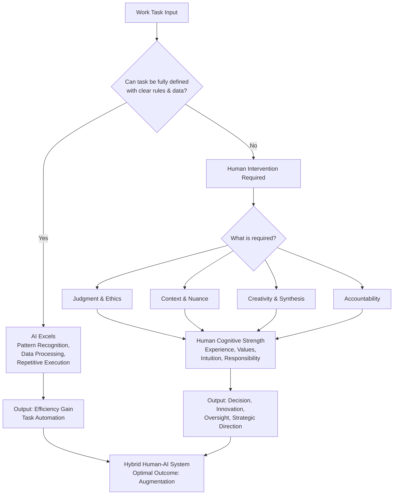

    

<h3 align="center">WELCOME TO</h3>
<h1 align="center">BLACXQUAD FREEMIUM REPOSITORY!</h1>
<h3 align="center">A HUB FOR FREE TECH LEARNING & RESOURCES.</h3>

  

    

    

  

    
 

> [!IMPORTANT]

This work is licensed under the **Creative Commons Attribution-ShareAlike 4.0 International License** (CC BY-SA 4.0).

When using, redistributing, adapting, or building upon this material, you **must** provide proper attribution by:

- 1. **Clearly stating the original source** as the **BLACXQUAD GitHub repository**.
- 2. **Including the exact URL(s)** to the relevant repository or file(s).

**Example Attribution Format:**  
- This work is based on content from the BLACXQUAD GitHub repository, available at:  
- https://github.com/blacxquad/freemium

Under the CC BY-SA license, you **must also**:
- Indicate if changes were made.
- License any adapted material under **identical terms** (CC BY-SA 4.0).

Failure to provide accurate source attribution violates the license terms.

    

<h1 align="center">The Irreplaceable Human: Why AI Complements Rather Than Replaces the Workforce.</h1>

  

## Executive Summary
Despite rapid advancements, Artificial Intelligence (AI) remains a tool for augmenting human capability, not replacing it. Current systems lack the core cognitive faculties—judgment, contextual understanding, ethical reasoning, and accountability—required to perform complete jobs autonomously. Empirical evidence from deployments, architectural limits, and economic studies consistently shows that while AI excels at automating specific tasks, the future of work is defined by **human-AI collaboration**. This document outlines the technical, practical, and philosophical reasons why the human workforce remains indispensable.

 

## 1. Core Cognitive and Functional Limits of AI

Current AI, including Large Language Models (LLMs), is fundamentally constrained by its architecture and design principles. These are not temporary bugs but inherent features that create a ceiling for autonomous operation.

*   **Lacks True Judgment and Ethical Reasoning:** AI operates on statistical pattern recognition. Human judgment requires integrating knowledge, experience, cultural context, ethics, and intangible values to form opinions or make decisions under uncertainty. AI cannot be held morally or legally accountable for its outputs; ultimate responsibility always resides with a human. This makes AI unsuitable for high-stakes decisions in law, healthcare, governance, and strategic business.
*   **No Genuine Understanding of Context or Meaning:** Models like GPT-4, Claude, Gemini, Grok and Deepseek are sophisticated pattern predictors, often described as "stochastic parrots." They generate plausible text based on training data probabilities but do not comprehend meaning, causality, or real-world semantics. This leads to a fragile grasp of context, causing failures in ambiguous, novel, or poorly specified situations common in professional work.
*   **Hallucinations are an Inherent Feature:** The propensity for AI to generate confident but incorrect or fabricated information is a core property of transformer-based LLMs, not a solvable bug. Because they optimize for plausibility over truth, rigorous human verification is mandatory in any critical application, making full autonomy risky and impractical.
*   **Architectural Constraints on Reasoning:** AI models have finite context windows, limiting their ability to reason across large codebases, lengthy documents, or multi-step workflows that exceed their token memory. They cannot perform long-term strategic planning, anticipate downstream consequences, or reliably handle edge cases—the very situations that define expert human work.

 

## 2. Empirical Evidence: Automation of Tasks, Not Jobs

Real-world data from research and deployment underscores that AI's role is one of a power tool, not a replacement.

*   **The Productivity Paradox:** Studies on AI-assisted software development show a complex picture. While AI can boost speed on routine tasks by 20-35%, it can make developers **19% slower on complex tasks** due to the time spent debugging, verifying, and correcting AI-generated code. This highlights AI's role as an accelerator for known tasks, not a solver of novel problems.
*   **Significant Security and Quality Risks:** Research from Stanford and NYU found that **32.8% of AI-generated Python code contained security vulnerabilities**, as models replicate flawed patterns from their training data. This degradation of quality without expert human oversight makes autonomous AI deployment dangerous in critical systems.
*   **Staggering Implementation Failure Rates:** An MIT Sloan study indicates that approximately **95% of enterprise generative AI pilots fail** to deliver measurable profit and loss impact. The core issue is not model capability but a fundamental mismatch with human workflows and the over-automation of tasks requiring human judgment.
*   **Historical Precedent of Reversal:** High-profile attempts to replace human roles with AI—such as autonomous AI engineers, customer service bots, and fast-food ordering systems—have frequently backfired, leading to degraded service quality and subsequent rehiring of human staff. Organizations are risk-averse and will not cede final authority in areas with legal, reputational, or safety consequences.

 

## 3. The Changing Value of Human Skills

As AI handles more routine information processing, the economic value of uniquely human skills rises sharply. The labor market is polarizing upward, not disappearing.

| Skill Dimension | Why AI Struggles | Why Humans Excel |
| :--- | :--- | :--- |
| **Judgment & Decision-Making** | Cannot weigh ethical trade-offs, long-term consequences, or values. Operates on statistical correlation, not causation. | Integrates experience, ethics, social context, and strategic foresight. Bears ultimate responsibility for outcomes. |
| **Creativity & Innovation** | Recombines existing patterns. Cannot engage in true conceptual breakthrough or design for novel, ambiguous human needs. | Synthesizes disparate ideas, frames new problems, and creates meaning. Essential for R&D, art, and strategic design. |
| **Contextual & Emotional Intelligence** | Has no lived experience, empathy, or ability to read nuanced social or cultural situations. | Builds trust, demonstrates empathy, navigates politics, and provides care. Critical in leadership, healthcare, education, and sales. |
| **Physical & Unstructured Interaction** | Poor at adapting to variable physical environments requiring dexterity, real-time adaptation, and sensory feedback. | Excels in unpredictable settings (e.g., surgery, repair, hospitality). Human presence is often the service itself. |

*   **Critical Thinking as a "Job-Proof" Skill:** The ability to evaluate information purposefully, reason through complex problems, and self-correct is perhaps the most automation-resistant competency. It is foundational to roles in management, science, law, and engineering.
*   **Orchestration and Oversight:** The emerging high-value role is that of a **human conductor**—defining problems, setting goals, evaluating AI outputs, integrating systems, and making the final call. This requires a holistic understanding that AI cannot achieve.
*   **Expertise in Ambiguity:** AI fails at the "last 10% of problems"—those involving messy, undocumented legacy systems, conflicting requirements, or novel scenarios. Human experts thrive here, using intuition and analogical reasoning.

 

## 4. The Augmentation Imperative: A Symbiotic Future

The consensus among researchers and successful enterprises is clear: the winning model is augmentation, not substitution.

*   **Hybrid Systems Outperform:** Human-AI teams consistently outperform either alone. AI scales data analysis and pattern recognition; humans provide interpretation, strategy, and ethical governance. This synergy leverages the strengths of both.
*   **Job Redesign Over Elimination:** Forward-thinking organizations use AI to eliminate mundane, repetitive tasks, thereby **elevating human roles** to focus on more meaningful, creative, and strategic work. This redesign increases job satisfaction and organizational resilience.
*   **Economic and Social Sustainability:** Full automation driven by current AI would concentrate economic power and risk massive instability. A collaborative model promotes inclusive growth, maintains social trust, and ensures that technological progress aligns with human values.

 

## Conclusion: The Indispensable Human in the AI Age

AI is a transformative general-purpose technology, perhaps the most significant of our era. However, its architecture and inherent limitations mean it automates **tasks**, not **roles**. It lacks the consciousness, empathy, moral agency, and holistic understanding that define human work at its most valuable.

The narrative of human replacement is a profound misunderstanding of both the technology and the nature of work itself. The future belongs not to automated systems, but to **augmented professionals**—humans equipped with powerful AI tools, whose judgment, creativity, and responsibility guide those tools to create a more productive and humane world. Our focus must shift from fear of replacement to the strategic challenge of effective collaboration, ensuring that AI serves to amplify the best of human potential.
 

    

<h2 align="center">STAY TUNED FOR THE LATEST UPDATES!</h2>

  

    

