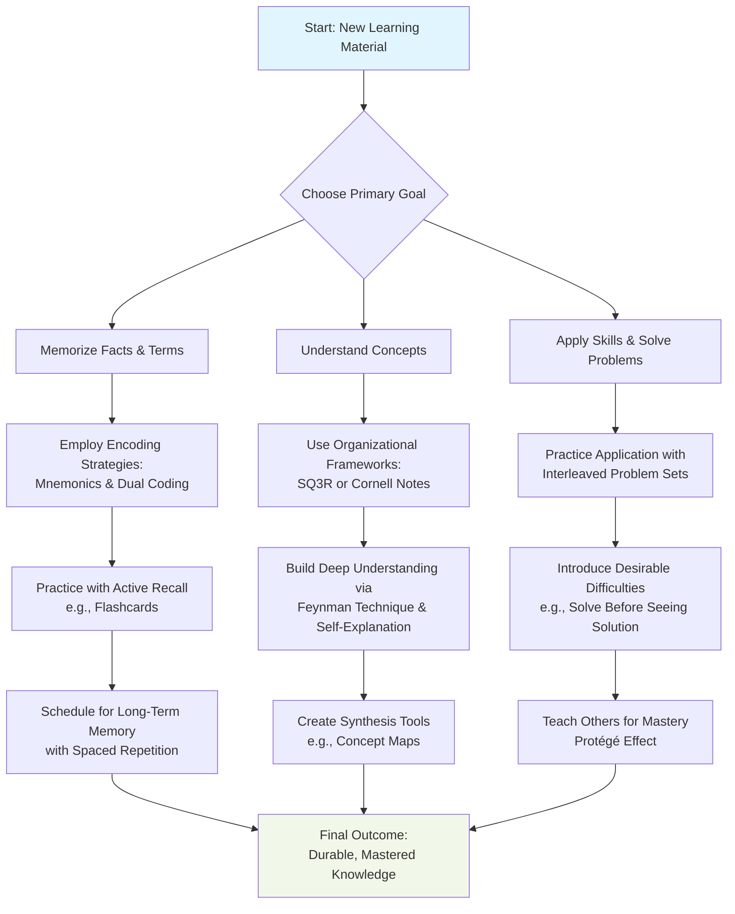

    

<h3 align="center">WELCOME TO</h3>
<h1 align="center">BLACXQUAD FREEMIUM REPOSITORY!</h1>
<h3 align="center">A HUB FOR FREE TECH LEARNING & RESOURCES.</h3>

  

    

    

  

    
 

> [!IMPORTANT]

This work is licensed under the **Creative Commons Attribution-ShareAlike 4.0 International License** (CC BY-SA 4.0).

When using, redistributing, adapting, or building upon this material, you **must** provide proper attribution by:

- 1. **Clearly stating the original source** as the **BLACXQUAD GitHub repository**.
- 2. **Including the exact URL(s)** to the relevant repository or file(s).

**Example Attribution Format:**  
- This work is based on content from the BLACXQUAD GitHub repository, available at:  
- https://github.com/blacxquad/freemium

Under the CC BY-SA license, you **must also**:
- Indicate if changes were made.
- License any adapted material under **identical terms** (CC BY-SA 4.0).

Failure to provide accurate source attribution violates the license terms.

    

# The Master Learner's Guide: Evidence-Based Strategies for Deep Understanding and Lasting Retention.

**An Integration of Cognitive Psychology, Educational Science, and Practical Application.**

  

## **Introduction: The Science of How We Learn**

Effective learning is not about luck or innate talent. It is a skill—a systematic process grounded in decades of research from cognitive psychology and educational neuroscience. This guide moves beyond common study tips to present a unified framework of proven methodologies. Our goal is to translate complex scientific principles into clear, actionable strategies for students, professionals, and lifelong learners.

The human brain is not designed for passive absorption. True mastery comes from active engagement, strategic repetition, and the meaningful organization of knowledge. Techniques that align with the brain's natural architecture—such as actively retrieving information, spacing out practice, and constructing explanations—consistently yield deeper understanding and longer-lasting memory than passive re-reading or highlighting.

This document is structured to guide you from understanding the core cognitive principles of learning to implementing a personalized, synergistic system for mastery.

 

## **Section I: The Core Principle—Active Cognitive Engagement**

Learning is not a spectator sport. The following techniques replace passive review with active mental construction, forcing your brain to engage with material in ways that build durable knowledge.

### **Active Recall (Retrieval Practice)**
*   **What It Is:** The practice of actively bringing information to mind *without* looking at your notes or textbook. It is the act of generating an answer from memory rather than simply recognizing it from a list.
*   **Why It Works:** This leverages the **"testing effect,"** a robust psychological phenomenon. The act of retrieval itself strengthens the memory pathway, making future recall easier and faster. The effort involved in recalling information signals to your brain that this knowledge is important and should be stored in long-term memory.
*   **How to Implement:** After reading a chapter or attending a lecture, close all materials. Write down, sketch, or verbally explain everything you can remember. Use tools like flashcards (digital apps like Anki are excellent) where you must produce the answer before flipping the card. Always attempt practice problems from memory before checking the solution.

### **The Feynman Technique (Teaching for Understanding)**
*   **What It Is:** A process for mastering any concept by explaining it in simple, plain language as if teaching it to a complete beginner or a child.
*   **Why It Works:** Teaching forces you to identify the core principles, strip away jargon, and confront gaps in your own logic. If you cannot explain a concept simply, you do not truly understand it. This technique transforms superficial familiarity into deep, conceptual clarity.
*   **How to Implement:** Follow a four-step cycle. First, choose a concept you wish to learn. Second, explain it out loud or in writing using plain language. Third, identify the points where your explanation was vague, complex, or relied on technical terms—these are your knowledge gaps. Fourth, return to your source material to study those gaps, then simplify and refine your explanation. Repeat until your explanation is clear and complete.

### **Self-Explanation and Elaborative Interrogation**
*   **What It Is:** A family of techniques focused on asking "how" and "why."
    *   **Self-Explanation:** Verbally narrating your thought process as you solve a problem or read a text (e.g., "I'm using this formula because the variable represents a rate of change...").
    *   **Elaborative Interrogation:** Proactively questioning the material by asking, "Why is this fact true?" or "How does this principle connect to what I already know?"
*   **Why It Works:** These strategies promote **relational and causal encoding**. By connecting new information to your existing web of knowledge and explaining the underlying reasons, you embed facts within a rich network of meaning. This makes information far more memorable and usable than isolated facts.
*   **How to Implement:** While reading, pause at the end of each paragraph or section to ask and answer a "why" question about the key idea. When working through a math or science problem, talk through the purpose of each step. Create chains of "why" questions to drill down to the fundamental logic of a system.

 

## **Section II: Working With Your Memory System**

Human memory follows predictable patterns: we encode, store, and forget information. These strategies are designed to work *with* your brain's architecture to combat natural forgetting and build robust, long-term knowledge.

### **Spaced Repetition and the Leitner System**
*   **What It Is:** The practice of reviewing information at systematically increasing intervals over time, rather than cramming all at once.
*   **Why It Works:** This directly counteracts **Ebbinghaus's Forgetting Curve**, which shows we forget information rapidly soon after learning. By reviewing information just as we are about to forget it, we powerfully reinforce the memory, signaling to the brain that this knowledge is valuable for long-term storage.
*   **How to Implement:** Use software with built-in algorithms like **Anki** or **SuperMemo**, which schedule reviews for you. For a manual approach, use the **Leitner System** with physical flashcards and boxes: review Box 1 (new/difficult cards) daily, Box 2 every three days, and Box 3 weekly. Move cards forward for correct answers and back to Box 1 for incorrect answers.

### **Interleaved Practice**
*   **What It Is:** Mixing different topics or types of problems within a single study session (e.g., ABCABCABC) instead of focusing on one topic at a time until mastery (e.g., AAABBBCCC).
*   **Why It Works:** Practicing similar problems in a blocked sequence can create an "illusion of mastery," where you learn the procedure for that specific block without deeply understanding the underlying concept. Interleaving forces your brain to constantly retrieve the appropriate strategy and discriminate between problem types, leading to better skill generalization and real-world problem-solving ability.
*   **How to Implement:** In a single math study session, mix problems from different chapters (e.g., algebra, geometry, calculus). When learning a language, alternate between vocabulary drills, grammar exercises, and reading comprehension within the same hour.

### **Dual Coding**
*   **What It Is:** Combining verbal information (words, explanations) with visual information (diagrams, charts, sketches, icons) to create two linked representations of the same knowledge.
*   **Why It Works:** The brain processes visual and verbal information in partially separate channels. By creating **dual memory traces**, you provide two potential pathways for retrieving the information, significantly increasing the chance of successful recall. A picture paired with an explanation is remembered better than either alone.
*   **How to Implement:** Always supplement your written notes with a simple diagram, flowchart, or timeline. When learning a process, draw it step-by-step. Actively annotate textbook images with your own written summaries and labels.

### **Mnemonics and the Method of Loci (Memory Palace)**
*   **What It Is:** Using associative frameworks—like acronyms, stories, rhymes, or spatial layouts—to make abstract or list-based information memorable and easier to recall.
*   **Why It Works:** Mnemonics impose **meaningful structure** on otherwise arbitrary information, leveraging the brain's superior ability to remember patterns, narratives, and familiar spaces.
*   **How to Implement:**
    *   **Acronyms & Rhymes:** "PEMDAS" for order of operations.
    *   **Method of Loci:** A powerful ancient technique where you visualize placing items along a familiar journey.
        1.  Choose a location you know well (your home, your route to work).
        2.  Identify specific, sequential "loci" or spots (the front door, the coat rack, the kitchen table).
        3.  Create a vivid, exaggerated mental image for each piece of information and "place" it at a locus.
        4.  To recall, mentally walk through the location and "see" the images.
*   **Evidence:** A 2014 study with medical students found that those trained to use the Method of Loci to learn about insulin and diabetes showed **significantly better performance on assessments** compared to a control group using standard study methods.

### **Chunking**
*   **What It Is:** Grouping individual pieces of related information into a single, meaningful unit or "chunk."
*   **Why It Works:** Our working memory, where we hold conscious thought, is severely limited (about 4-7 items). Chunking allows you to overcome this limit by treating a cluster of information as one item. For example, you remember "USA" as one chunk, not the letters U, S, and A as three separate items.
*   **How to Implement:** Memorize a phone number as "555-0198" (two chunks) instead of "5,5,5,0,1,9,8" (seven chunks). Learn vocabulary words grouped by theme (e.g., all medical terminology related to the cardiovascular system). Break down complex procedures into a series of 3-4 step chunks.

 

## **Section III: Frameworks for Organizing Knowledge**

To build understanding, you must organize information as you receive it. These frameworks provide structured processes for capturing, connecting, and reviewing knowledge.

### **The Cornell Note-Taking System**
*   **What It Is:** A structured note-taking format that divides a page into three functional sections, transforming note-taking from passive transcription to an active learning tool.
*   **Why It Works:** It integrates the initial **encoding** of information with the powerful **retrieval practice** of self-quizzing and the **consolidation** benefit of summarization, all on one page.
*   **How to Implement:** Divide your page into three areas:
    *   **Notes Column (Right Side):** Record key points from the lecture or text here during the initial learning.
    *   **Cues Column (Left Side):** Afterward, write questions, keywords, or main ideas that correspond to the notes. These act as prompts.
    *   **Summary Area (Bottom):** Write a brief, 2-3 sentence synthesis of the entire page's content. For review, cover the Notes column and use the Cues to quiz yourself.

### **Mind Mapping and Concept Mapping**
*   **What It Is:** A visual, non-linear method of organizing ideas around a central concept using branches, keywords, colors, and images.
*   **Why It Works:** This technique mirrors the brain's natural, associative thought process. By externalizing the relationships between ideas, it fosters **holistic understanding** and taps into **visual-spatial memory**, making recall more intuitive.
*   **How to Implement:** Start with a central topic in the middle of a blank page. Draw a main branch outward for each major subtopic, labeled with a single keyword. From these, draw sub-branches for supporting details. Use images, symbols, and different colors to make connections clear and memorable.

### **The SQ3R Reading Method**
*   **What It Is:** A five-step method for strategic, engaged reading of textbooks and dense academic material.
*   **Why It Works:** It transforms passive reading into an **active, goal-directed search for answers**. By setting a purpose (questions) before reading, you dramatically improve focus, comprehension, and retention.
*   **How to Implement:**
    1.  **Survey:** Spend 5 minutes skimming the chapter: read headings, subheadings, captions, graphs, and the introduction/conclusion.
    2.  **Question:** Turn each heading into a question (e.g., "How does the circulatory system work?").
    3.  **Read:** Actively read the section to answer your question.
    4.  **Recite/Recall:** After a section, look away and recite the answer in your own words from memory.
    5.  **Review:** After finishing, go back over all your questions and answers to solidify the material.

 

## **Section IV: Managing Focus, Time, and Habits**

Sustaining deep learning requires managing your attention, time, and behavior. These techniques provide the scaffolding for consistent, focused effort.

### **The Pomodoro Technique**
*   **What It Is:** Working in focused, timed intervals (traditionally 25 minutes) separated by short breaks (5 minutes), with a longer break after completing a set of intervals (usually four).
*   **Why It Works:** It aligns with the brain's natural attention span, reduces mental fatigue, and makes large tasks less daunting by breaking them into manageable units. It creates a rhythm that balances **focused mode** (deep concentration) and **diffuse mode** (restful background processing) thinking.
*   **How to Implement:** Use a timer. Work with total focus for 25 minutes. When the timer rings, take a strict 5-minute break to stand up and move. After four "Pomodoros," take a longer 15-30 minute break.

### **Parkinson's Law and Timeboxing**
*   **What It Is:** The observation that "work expands to fill the time available for its completion." Timeboxing is the practice of assigning a fixed, limited period to a task.
*   **Why It Works:** Creating **temporal urgency** focuses your attention, combats procrastination, and prevents perfectionism by imposing a firm stopping point. It forces you to prioritize the most important aspects of a task.
*   **How to Implement:** Instead of a vague goal like "study biology," set a specific, time-bound goal: "Complete 30 active recall questions on cellular respiration in 40 minutes." Use a timer to enforce the limit.

### **Habit Stacking for Sustainable Learning**
*   **What It Is:** The practice of attaching a new, desired study habit to an existing, well-established daily habit by using the existing habit as a reliable cue.
*   **Why It Works:** It leverages the strength of your current neural pathways and routines. The established habit acts as an automatic trigger, reducing the need for willpower and decision-making to start the new behavior.
*   **How to Implement:**
    1.  Identify a solid current habit: "I brew a cup of tea every evening."
    2.  Define your new desired habit: "I want to review my Anki flashcards."
    3.  Stack them: "After I brew my evening tea, I will immediately sit down and review my Anki deck for 15 minutes."
*   **Expert Insight:** Research psychologist Dr. Lauren Alexander notes that habit stacking is highly effective for simple habits but may need support for complex ones. Pairing the new habit with an immediate reward or using **"shaping"**—rewarding yourself for smaller approximations of the target behavior—can increase success rates for more challenging routines.

### **Desirable Difficulties**
*   **What It Is:** The counterintuitive principle that introducing certain obstacles during learning creates more effortful mental processing, which leads to **superior long-term retention and application** of knowledge.
*   **Why It Works:** When learning feels easy and fluent (like re-reading highlighted text), it often creates an **"illusion of mastery."** Effortful strategies like recall, generation, and spacing feel harder in the moment but strengthen memory encoding and problem-solving ability.
*   **How to Implement:** Handwrite notes to force paraphrasing instead of typing verbatim. Try to solve a problem from scratch before being shown the method. Space your practice sessions over days instead of cramming in one long session.

 

## **Section V: The Power of Learning with Others**

Social interaction provides accountability, exposes blind spots, and creates opportunities for the powerful cognitive restructuring that occurs through teaching.

### **The Protégé Effect: Learning by Teaching**
*   **What It Is:** The well-documented phenomenon where individuals who teach a topic to others achieve a deeper and more durable understanding of the material themselves.
*   **Why It Works:** Preparing to teach triggers high-level **metacognitive processes**. You must organize knowledge logically, identify core principles, anticipate questions, and clarify your own understanding. The social accountability of teaching also increases motivation and depth of engagement.
*   **How to Implement:** Form a study group where members take turns teaching concepts to the rest. Use the **"Rubber Duck" method:** explain a complex problem aloud to an inanimate object as if it were a student. Create a study guide or video lesson for a peer, even if it's never used—the act of creation is what matters.
*   **Key Research Insight:** A 2019 meta-analysis suggests the benefits are greatest when preparing for **interactive, live teaching**. The anticipation of real-time questions and feedback creates a richer, more demanding, and more effective learning environment for the "teacher" than creating a passive resource like a recorded video.

### **Structured Group Discussion and Peer Tutoring**
*   **What It Is:** Moving beyond informal social studying to implement purposeful, role-driven collaborative sessions with clear objectives.
*   **Why It Works:** It exposes you to multiple perspectives and alternative explanations. Defending your reasoning and constructively critiquing others' ideas fosters critical thinking, reveals assumptions, and consolidates knowledge through verbalization.
*   **How to Implement:** In a study group, assign specific roles for each session: a **Discussion Leader** (guides the agenda), a **Skeptic** (challenges assumptions), a **Synthesizer** (summarizes key points), and a **Connector** (links topics to other concepts). Use protocols like "think-pair-share" to ensure everyone participates.

 

## **Section VI: Optimizing Your Physical and Mental State**

Your cognitive performance is deeply influenced by your physical environment, physiological state, and daily rhythms. Optimizing these factors can dramatically improve learning efficiency.

### **Environmental Design**
*   **What It Is:** Intentionally shaping your physical study space to minimize distractions and create strong mental associations with focused work.
*   **Why It Works:** A dedicated, consistent environment cues your brain to enter "focus mode." Reducing visual and auditory clutter lowers cognitive load, freeing mental resources for the task at hand.
*   **How to Implement:** Designate a specific area (a desk, a library carrel) for deep work only. Keep it clean, well-lit, and stocked with necessary supplies. Use noise-cancelling headphones or white noise if needed. Utilize website blockers on your devices during scheduled study times.

### **The "Sleep Sandwich" and Sleep-Based Consolidation**
*   **What It Is:** Strategically scheduling learning and sleep to leverage the brain's natural overnight memory processing.
*   **Why It Works:** During deep **slow-wave sleep** and **REM sleep**, the brain actively rehearses, strengthens, and integrates the day's new memories, connecting them to existing knowledge networks in a process called **synaptic consolidation**.
*   **How to Implement:** Review your most challenging material **within 1-2 hours before going to sleep**. Follow this with a full, high-quality night of sleep. Then, do a **brief active recall review of that same material the next morning**. This "sandwiches" the critical sleep-based consolidation process.

### **Physiological Supports: Hydration, Nutrition, and Movement**
*   **What It Is:** Supporting optimal brain function through fundamental physical care.
*   **Why It Works:** The brain is metabolically demanding. Even mild dehydration can impair concentration and short-term memory. The brain requires a steady supply of glucose and nutrients to produce neurotransmitters and maintain energy. Brief physical activity increases blood flow, oxygen, and neurotrophic factors that support learning.
*   **How to Implement:** Keep a water bottle at your desk and sip regularly. Choose brain-supporting snacks like nuts, berries, yogurt, or dark chocolate over sugary, processed foods. Incorporate short (5-minute) movement breaks every 30-60 minutes of study to stretch or walk, which can boost creativity and focus.

 

## **Section VII: Building Your Personal Learning System**

The true power of this guide lies in integrating techniques into a personalized, synergistic system. Do not try to use everything at once.

*   **Step 1: Diagnose and Select.** Match techniques to your immediate learning goal. Use the Quick-Reference Guide below to start.
*   **Step 2: Personalize.** Adapt the frameworks to your learning style. A visual learner may start with Dual Coding and Mind Maps, while a verbal learner may prefer the Feynman Technique and Cornell Notes.
*   **Step 3: Integrate Synergistically.** Chain techniques together into powerful workflows.
    *   **For Lecture-Based Courses:** Take **Cornell Notes** in class. Within 24 hours, use the Cue column for **Active Recall**. At week's end, create a **Mind Map** to synthesize the topic, then transfer key facts to a **Spaced Repetition** system like Anki.
    *   **For Textbook Mastery:** Use the **SQ3R** method. During the "Recite" phase, practice **Self-Explanation**. For complex topics, apply the **Feynman Technique**.
*   **Step 4: Iterate and Reflect.** Keep a simple learning journal. After a major study block or exam, ask: *Which techniques felt most effective? Where did I struggle?* Use this feedback to refine your system every few weeks.

 

## **Conclusion: The Journey to Mastery**

This compendium distills key insights from cognitive science and educational research into a practical framework for intellectual growth. Effective learning is a learnable skill, built on principles like active retrieval, spaced reinforcement, and explanatory depth.

Begin your journey by selecting one or two techniques that address your biggest challenge. Implement them consistently, reflect on the results, and gradually build your integrated system. In doing so, you will not only master your subject matter more effectively but also cultivate the ultimate meta-skill: **learning how to learn.** This capability will serve as your foundation for lifelong achievement and adaptability in an ever-changing world.

 

## **Appendix: Quick-Reference Technique Selection Guide**

| **Primary Learning Goal** | **Core Recommended Techniques** | **Sample Implementation Plan** |
| :--- | :--- | :--- |
| **Memorizing Facts, Terms, Dates** | Spaced Repetition, Mnemonics, Active Recall, Chunking | 1. Create mnemonic images or stories for items. 2. Input them into a Spaced Repetition app (e.g., Anki). 3. Review daily using Active Recall (answer before flipping). |
| **Understanding Complex Concepts & Theories** | Feynman Technique, Self-Explanation, Concept Mapping, Dual Coding | 1. After initial reading, try to explain the concept simply (Feynman). 2. Where you stumble, use Self-Explanation on the source material. 3. Synthesize your understanding into a Concept Map with visuals (Dual Coding). |
| **Building Problem-Solving Skills (Math, Science, Coding)** | Interleaved Practice, Active Recall on Problems, Desirable Difficulties, Protégé Effect | 1. Practice with mixed problem sets (Interleaving). 2. Attempt problems from memory before checking solutions (Desirable Difficulty). 3. Teach the solution process to a peer to solidify mastery (Protégé Effect). |
| **Mastering Dense Textbooks & Academic Papers** | SQ3R Method, Cornell Note-Taking, Elaborative Interrogation | 1. **Survey & Question** before reading a chapter. 2. **Read** actively, taking Cornell Notes. 3. **Recite** answers to your questions from memory. 4. **Review** notes using the Cue column. |
| **Managing Time & Building Consistent Habits** | Pomodoro Technique, Timeboxing, Habit Stacking | 1. Use Habit Stacking to trigger your study session (e.g., "After coffee, I study"). 2. Timebox the session: "Outline Chapter 7 in 45 minutes." 3. Work within that time using Pomodoros (25-min focused bursts). |
| **Preparing for Comprehensive Exams** | Protégé Effect (Study Groups), Practice Testing (Active Recall), Spaced Review Schedule | 1. Create a study schedule with spaced reviews of old material. 2. Generate and take practice exams under timed conditions (Active Recall). 3. Form a study group to teach topics to each other (Protégé Effect). |

 
    

<h2 align="center">STAY TUNED FOR THE LATEST UPDATES!</h2>

  

    

